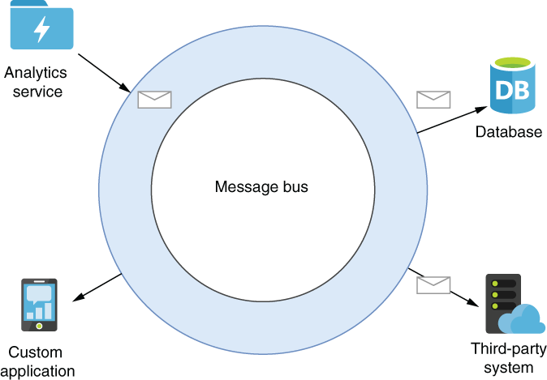
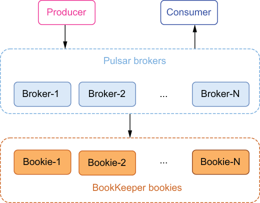

# Apache Pulsar 简介
本章涵盖

- 企业消息系统的演变
- Apache Pulsar 与现有企业消息系统的比较
- Pulsar 的以段为中心的存储与 Apache Kafka 中使用的以分区为中心的存储模型有何不同
- Pulsar 用于流处理的实际用例，以及为什么应该考虑使用 Apache Pulsar

由雅虎开发！ 2013 年，Pulsar 于 2016 年首次开源，在加入 Apache 软件基金会的孵化计划仅 15 个月后，它就升级为顶级项目状态。 Apache Pulsar 是从头开始设计的，旨在解决当前开源消息传递系统中的不足，例如多租户、异地复制和强持久性保证。

Apache Pulsar 站点将其描述为分布式发布-订阅消息传递系统，可提供极低的发布和端到端延迟、有保证的消息传递、零数据丢失以及用于流数据处理的无服务器、轻量级计算框架。 Apache Pulsar 为处理大型数据集提供了三个关键功能：

- 实时消息传递——使地理上分布的应用程序和系统能够通过交换消息以异步方式相互通信。 Pulsar 的目标是通过对多种编程语言和二进制消息传递协议的支持，为最广泛的客户提供此功能。
- 实时计算——提供在 Pulsar 内部对这些消息执行用户定义的计算的能力，而无需外部计算系统来执行基本的转换操作，例如数据丰富、过滤和聚合。
- 可扩展的存储——Pulsar 的独立存储层和对分层存储的支持，让你可以根据需要保留消息数据。 Pulsar 可以保留和访问的数据量没有物理限制。

## 1.1 企业消息系统
消息传递是一个广义的术语，用于描述生产者和消费者之间的数据路由。因此，多年来发展起来的几种不同的技术和协议提供了这种能力。大多数人都熟悉消息系统，例如电子邮件、文本消息和即时消息应用程序，包括 WhatsApp 和 Facebook Messenger。此类别中的消息传递系统旨在通过互联网在两方或多方之间传输文本数据和图像。更先进的即时消息系统也支持 IP 语音 (VoIP) 和视频聊天功能。所有这些系统都旨在支持通过临时渠道进行人与人之间的通信。

人们已经熟悉的另一类消息传递系统是视频点播流媒体服务，例如 Netflix 或 Hulu，可同时向多个订阅者流式传输视频内容。这些视频流服务是向订阅现有频道以接收内容的消费者的单向广播（一条消息给许多消费者）传输数据的示例。虽然在使用消息系统或流等术语时可能会想到这些类型的应用程序，但就本书而言，我们将重点关注企业消息系统。

企业消息系统 (EMS) 是提供各种消息协议实现的软件，例如数据分发服务 (DDS)、高级消息队列协议 (AMQP)、Microsoft 消息队列 (MSMQ) 等。这些协议支持以异步方式在分布式系统和应用程序之间发送和接收消息。然而，异步通信并不总是一种选择，特别是在分布式计算的早期，当时客户端/服务器和远程过程调用 (RPC) 架构都是主要方法。 RPC 的主要示例是基于简单对象访问协议 (SOAP) 和表示状态传输 (REST) 的 Web 服务，它们通过固定端点相互交互。在这两种风格中，当一个进程想要与远程服务交互时，它需要首先通过发现服务确定服务的远程位置，然后使用适当的参数和类型远程调用所需的方法，如图 1.1 所示.

图 1.1 在 RPC 体系结构中，应用程序调用运行在不同主机上的服务上的过程，并且必须等待该过程调用返回才能继续处理。

然后，调用应用程序必须等待被调用过程返回，然后才能继续处理。这些架构的同步特性使得基于它们的应用程序天生就很慢。此外，远程服务可能会在一段时间内不可用，这将需要应用程序开发人员使用防御性编程技术来识别这种情况并做出相应的反应。

不同于在 RPC 编程中使用的点对点通信通道，你必须等待过程调用提供响应，EMS 允许远程应用程序和服务通过中间服务相互通信，而不是直接相互通信.无需在交换参数的呼叫/接收应用程序之间建立直接的网络通信通道，EMS 可用于以消息形式保留这些参数，并保证将它们传递给预期的接收者进行处理。这允许调用者异步发送其请求并等待他们试图调用的服务的响应。它还允许服务通过将其结果发布到 EMS 以最终交付给原始调用者，以异步方式将其响应传回。这种解耦通过提供标准化、可靠的组件内通信通道来促进异步应用程序开发，该通道用作处理数据的持久缓冲区，即使某些组件处于离线状态，如图 1.2 所示。

图 1.2 EMS 允许分布式应用程序和服务以异步方式交换信息。

EMS 通过允许分布在不同系统上的独立开发的软件组件通过结构化消息相互通信来促进松散耦合的体系结构。这些消息模式通常以与语言无关的格式定义，例如 XML、JSON 或 Avro IDL，这允许使用支持这些格式的任何编程语言开发组件。

### 1.1.1 关键能力
既然我们已经介绍了企业消息系统的概念，并为它们用来解决的问题类型提供了一些上下文，让我们根据它提供的功能进一步细化对 EMS 的定义。

#### 异步通信

消息系统允许服务和应用程序以非阻塞方式相互通信，这意味着消息发送方和接收方不需要同时与消息系统（或彼此）交互。消息传递系统将保留消息，直到所有预期的收件人都使用它。

#### 消息保留

与消息仅存在于网络上的基于网络的消息传递（例如 RPC）不同，发布到消息传递系统的消息将保留在磁盘上，直到它们被传递。未送达的邮件可以保留数小时、数天甚至数周，并且大多数邮件系统允许你指定保留策略。

#### 确认

消息系统需要保留消息，直到所有预期的收件人都收到它；因此，需要一种机制，通过该机制消息消费者可以确认消息的成功传递和处理。这允许消息传递系统清除所有成功传递的消息，并重试将消息传递给尚未收到的消费者。

#### 消息消费

显然，如果消息传递系统不提供预期接收者可以使用消息的机制，那么它就不是特别有用。首先也是最重要的，EMS 必须保证它收到的所有消息都得到传递。通常，一条消息可能要发送给多个消费者，并且 EMS 必须维护该信息以及已将哪些消息传递给谁。

## 1.2 消息消费模式
使用 EMS，你可以选择将消息发布到主题或队列，两者之间存在根本区别。一个主题支持同一消息的多个并发消费者。发布到某个主题的任何消息都会自动广播给订阅该主题的所有消费者。任意数量的消费者都可以订阅一个主题以接收发送的信息——就像任意数量的用户可以订阅 Netflix 并接收他们的流媒体内容一样。

### 1.2.1 发布订阅消息

在发布和订阅消息传递中，生产者将消息发布到命名通道，称为主题。然后消费者可以订阅这些主题以接收传入的消息。发布-订阅 (pub-sub) 消息通道接收来自多个生产者的传入消息，并按照它们到达的确切顺序存储它们。但是，它不同于消费端的消息队列，因为它支持多个消费者通过订阅机制接收一个主题中的每条消息，如下图1.3所示。

图 1.3 使用 pub-sub 消息消费，每条消息都被传递到每个在主题上建立的订阅。在这种情况下，消息 M0 通过 N 传递给订阅。

发布-订阅消息系统非常适合需要多个消费者接收每条消息的用例，或者消息接收和处理的顺序对于维护正确的系统状态至关重要的用例。考虑可供大量系统使用的股票价格服务的情况。不仅这些服务接收所有消息很重要，而且价格变化以正确的顺序到达也同样重要。

### 1.2.2 消息队列

另一方面，队列为一个或多个竞争消费者提供先进先出 (FIFO) 消息传递语义，如图 1.4 所示。使用队列时，消息按接收顺序传递，只有一个消息消费者接收和处理单个消息，而不是所有消息。这些非常适合将代表触发某些工作的事件的消息排队，例如将订单发送到履行中心进行调度。在这种情况下，你希望每个订单只处理一次。

消息队列可以通过在大量积压消息的情况下扩大消费者数量来轻松支持更高的消费率。为了确保一条消息只被处理一次，每条消息都必须在成功处理并被消费者确认后从队列中删除。由于其一次性处理保证，消息队列是工作队列用例的理想选择。

图 1.4 使用基于队列的消息消费，每条消息都准确地传递给一个消费者。在这种情况下，消息 M0 被消费者 1 消费，M1 被消费者 2 消费，依此类推。

如果消费者失败（意味着在指定的时间范围内没有收到确认），消息将重新发送给另一个消费者。在这种情况下，消息很可能会被乱序处理。因此，消息队列非常适合每条消息只处理一次至关重要但处理消息的顺序并不重要的用例。

## 1.3 消息系统的演变

既然我们已经清楚地定义了 EMS 的构成及其提供的核心功能，我想简要介绍一下消息传递系统的历史回顾以及它们多年来的演变情况。消息系统已经存在了几十年，并在许多组织中得到了有效的使用，因此 Apache Pulsar 不是一些出现在现场的全新技术，而是消息系统发展的又一步。通过提供一些历史背景，我希望你能够了解 Pulsar 与现有消息传递系统的比较。

### 1.3.1 通用消息系统

在我进入特定的消息传递系统之前，我想展示一个消息传递系统的简化表示，以突出所有消息传递系统都具有的底层组件。确定这些核心功能将为随着时间的推移在消息传递系统之间进行比较提供基础。

正如你在图 1.5 中看到的，每个消息传递系统都由两个主要层组成，每个层都有自己的特定职责，我们将在接下来进行探讨。我们将研究跨这些层的消息传递系统的演变，以便正确分类和比较不同的消息传递系统，包括 Apache Pulsar。

图 1.5 每个消息系统都可以分为两个不同的架构层。

#### 服务层

服务层是 EMS 中的一个概念层，它直接与消息生产者和消费者进行交互。它的主要目的是接受传入的消息并将它们路由到一个或多个目的地。因此，它通过一种或多种受支持的消息传递协议进行通信，例如 DDS、AMQP 或 MSMQ。因此，该层在很大程度上依赖于通信的网络带宽和消息协议转换的 CPU。

#### 存储层

存储层是 EMS 中的概念层，负责消息的持久化和检索。它直接与服务层交互以提供请求的消息，并负责保持消息的正确顺序。因此，该层在很大程度上依赖于磁盘来存储消息。

### 1.3.2 面向消息的中间件

第一类消息系统通常被称为面向消息的中间件 (MOM)，它旨在提供运行在不同网络和操作系统上的分布式系统之间的进程间通信和应用程序集成。最著名的 MOM 实现之一是 IBM WebSphere MQ，它于 1993 年首次亮相。

最早的实施旨在部署在通常位于公司数据中心深处的单台机器上。这不仅是单点故障，还意味着系统的可扩展性受限于主机的物理硬件容量，因为这台服务器负责处理所有客户端请求并存储所有消息，如图1.6.这些单服务器MOM系统可以服务的并发生产者和消费者的数量受到网卡带宽的限制，存储容量受到机器上物理磁盘的限制。

图 1.6 面向消息的中间件设计为托管在单个服务器上，因此托管所有消息主题并处理来自所有客户端的请求。

公平地说，这些限制不仅限于 IBM，而是所有旨在托管在单个机器上的消息传递系统的限制，包括 RabbitMQ 和 RocketMQ 等。事实上，这种限制不仅限于这个时代的消息传递系统，而是普遍存在于旨在在一台物理主机上运行的所有类型的企业软件。

#### 聚类

最终，通过向这些单服务器 MOM 系统添加集群功能解决了这些可扩展性问题。这允许多个单服务实例共享消息的处理并提供一些负载平衡，如图 1.7 所示。尽管 MOM 是集群的，但实际上它只是意味着每个单服务实例负责为所有主题的一个子集提供消息和存储消息。在此期间，关系数据库采用了一种称为分片的类似方法来解决此可扩展性问题。

图 1.7 集群允许负载分布在多台服务器上，而不仅仅是一台。集群中的每个服务器只负责处理一部分主题。

在主题“热点”的情况下，分配该特定主题的不幸服务器仍可能成为瓶颈或可能耗尽存储容量。如果集群中的这些服务器中的任何一个发生故障，它会带走它所服务的所有主题。虽然这确实最大限度地减少了故障对整个集群的影响（即，它继续运行），但它是它所服务的特定主题/队列的单点故障。

这种限制要求组织仔细监控他们的消息分布，以便调整他们的主题分布以匹配他们的底层物理硬件，并确保负载在集群中均匀分布。即便如此，单个主题仍然存在问题的可能性。考虑你在一家大型金融机构工作的场景，你需要一个主题来存储特定股票的所有交易信息，并将此信息提供给你组织内的所有交易台应用程序。这个主题的庞大消费者数量和数据量很容易让专门为该主题提供服务的单个服务器不堪重负。在这种情况下需要的是能够在多台机器上分配单个主题的负载，正如我们将看到的，这正是分布式消息传递系统所做的。

### 1.3.3 企业服务总线

企业服务总线 (ESB) 出现在本世纪早期，当时 XML 是使用基于 SOAP 的 Web 服务实现面向服务架构 (SOA) 应用程序的首选消息格式。 ESB 的核心概念是消息总线，如图 1.8 所示，它充当所有应用程序和服务之间的通信通道。这种集中式架构与之前其他面向消息的中间件使用的点对点集成形成了直接对比。

图 1.8 ESB 的核心概念是使用消息总线来消除点对点通信的需要。服务 A 仅将其消息发布到总线，然后它会自动路由到应用程序 B 和 C。

使用 ESB，每个应用程序或服务将通过单个通信通道发送和接收其所有消息，而不必指定它们想要发布和使用的特定主题名称。每个应用程序都会向 ESB 注册自己，并指定一组规则来识别它对哪些消息感兴趣，并且 ESB 将处理从与这些规则匹配的总线动态路由消息所需的所有逻辑。类似地，每个服务不再需要事先知道其消息的预期目标，并且可以简单地将其消息发布到总线并允许它路由消息。

考虑这样一个场景，你有一个大型 XML 文档，其中包含单个客户订单中的数百个单独的行项目，并且你只想根据消息本身中的某些条件（例如，按产品）将这些项目的一个子集路由到服务类别或部门）。 ESB 提供了提取这些单独消息（基于 XQuery 的结果）并根据消息本身的内容将它们路由到不同使用者的能力。

除了这些动态路由功能之外，ESB 还通过强调在消息传递系统本身内部处理消息的能力，而不是让消费应用程序执行此任务，在流处理的道路上迈出了进化的第一步。大多数 ESB 提供消息转换服务，通常通过 XSLT 或 XQuery，它们处理发送和接收服务之间的消息格式转换。它们还为消息系统本身提供了消息丰富和处理能力，在此之前，这些功能一直由接收消息的应用程序执行。这是对以前几乎只用作传输机制的消息传递系统的一种全新的思考方式。

有人可能会争辩说，ESB 是第一类将第三层引入消息传递系统基本架构的 EMS，如图 1.9 所示。事实上，如今大多数现代 ESB 都支持更高级的计算功能，包括用于管理业务流程的流程编排、用于事件关联和模式匹配的复杂事件处理，以及多种企业集成模式的开箱即用实现。

图 1.9 ESB 对动态路由和消息处理的重视代表了流处理功能首次被添加到消息传递系统中。这为基本消息传递系统架构引入了一个全新的架构层。

ESB 对消息传递系统发展的另一个重要贡献是它专注于与外部系统的集成，这迫使消息传递系统首次支持各种非消息传递协议。虽然 ESB 仍然完全支持 AMQP 和其他发布-订阅消息协议，但 ESB 的一个关键区别在于它能够将数据从非面向消息的系统移入和移出总线，例如电子邮件、数据库和其他第三方系统。为了做到这一点，ESB 提供了软件开发工具包 (SDK)，允许开发人员实现自己的适配器以与他们选择的系统集成。

正如你在图 1.10 中看到的那样，这允许更容易地在系统之间交换数据，从而简化了各种系统的集成。在此角色中，ESB 既充当消息传递基础设施，又充当提供协议转换的系统之间的中介。

图 1.10 ESB 支持将非基于消息的系统集成到消息总线中，从而将消息传递功能扩展到应用程序以外的第三方应用程序中，例如数据库。

虽然 ESB 无疑通过这些创新和功能推动了 EMS 的发展，并且在今天仍然非常流行，但它们是旨在部署在单个主机上的集中式系统。因此，它们面临与其 MOM 前辈相同的可扩展性问题。

1.3.4 分布式消息系统
分布式系统可以被描述为一组协同工作以提供服务或功能的计算机，例如文件系统、键值存储或数据库，就像它们在单个计算机上运行给最终用户一样。也就是说，最终用户不知道服务是由一组协同工作的机器提供的。分布式系统具有共享状态，并发运行，能够容忍硬件故障而不影响整个系统的可用性。

当分布式计算范式开始被广泛采用时，随着 Hadoop 计算框架的普及，单机约束被解除。这开启了一个新系统开发的时代，该系统将处理和存储分布在多台机器上。分布式计算的最大好处之一是能够水平扩展系统，只需向系统添加新机器即可。与受限于单个机器的物理硬件容量的非分布式前辈不同，这些新开发的系统现在可以轻松且经济高效地利用数百台机器的资源。

正如你在图 1.11 中看到的，消息系统，就像数据库和计算框架一样，也已经向分布式计算范式过渡。较新的消息传递系统，首先是 Apache Kafka，最近还有 Apache Pulsar，已经采用分布式计算模型，以提供现代企业所需的可扩展性和性能。

图 1.11 在分布式消息传递系统中，从最终用户的角度来看，多个节点共同作用以充当单个逻辑系统。在内部，数据存储和消息处理分布在所有节点上。

在分布式消息系统中，单个主题的内容分布在多台机器上，以便在消息层提供水平可扩展的存储，这在以前的消息系统中是不可能的。将数据分布在集群中的多个节点上还提供了几个优点，包括数据的冗余和高可用性、消息的存储容量增加、由于消息代理数量增加而增加的消息吞吐量以及消除单点故障系统内。

分布式消息传递系统和集群单节点系统之间的主要架构差异在于存储层的设计方式。在以前的单节点系统中，任何给定主题的消息数据都存储在同一台机器上，这允许从本地磁盘快速提供数据。但是，正如我们前面提到的，这将主题的大小限制为该机器上本地磁盘的容量。在分布式消息传递系统中，数据分布在集群内的多台机器上。这种跨多台机器的数据分布使我们能够在超出单个机器存储容量的单个主题中保留消息。使这种数据分布成为可能的关键架构抽象是预写日志，它将消息队列的内容视为可以存储消息的单个仅附加数据结构。

正如你在图 1.12 中看到的，从逻辑的角度来看，当一个新消息发布到主题时，它会被附加到日志的末尾。但是，从物理角度来看，消息可以写入集群内的任何服务器。

图 1.12 分布式消息系统底层的关键架构概念是仅追加日志（也称为预写日志）。从逻辑的角度来看，一个主题内的消息都是按顺序存储的，但以分布式方式存储在多个服务器上。

这为分布式消息传递系统提供了比前几代消息传递系统更具可扩展性的存储容量层。分布式消息传递架构的另一个好处是能够有多个代理为任何给定主题提供消息，这通过将负载分散到多台机器上来增加消息生产和消费吞吐量。例如，发布到图 1.12 中显示的主题的消息将由三个独立的服务器处理，每个服务器都有自己的磁盘写入路径。这将导致更高的写入速率，因为负载分布在多个磁盘上，而不仅仅是单个磁盘，就像在上一代消息传递系统中一样。在涉及如何在集群中的节点之间分布数据时，有两种不同的方法：基于分区和基于段。

#### Kafka中以分区为中心的存储

在消息传递系统中使用基于分区的策略时，主题被分成固定数量的组，称为分区。发布到主题的数据分布在各个分区中，如图 1.13 所示，每个分区接收发布到主题的一部分消息。主题的总存储容量现在等于主题中的分区数乘以每个分区的大小。一旦达到此限制，就无法向主题添加更多数据。简单地向集群添加更多代理并不能缓解这个问题，因为你还需要增加主题中的分区数量，这必须手动执行。此外，增加分区数量还需要执行重新平衡，正如我将要讨论的，这是一个昂贵且耗时的过程。

图 1.13 基于分区的消息系统中的消息存储

在以分区为中心的基于存储的系统中，分区的数量是在创建主题时指定的，因为这允许系统确定哪些节点将负责存储哪个分区等。然而，预先确定分区的数量有一个很少有意想不到的副作用，包括以下内容：

单个分区只能存储在集群内的单个节点上，因此分区的大小受限于该节点上的可用磁盘空间量。
由于数据均匀分布在所有分区中，因此每个分区的大小限制为主题中最小分区的大小。例如，如果一个主题分布在三个节点上，分别有 4 TB、2 TB 和 1 TB 的可用磁盘空间，那么第三个节点上的分区大小只能增长到 1 TB，这反过来意味着所有分区该主题也只能增长到 1 TB。
虽然不是严格要求，但每个分区通常会多次复制到不同的节点以确保数据冗余。因此，最大分区大小进一步限制为最小副本的大小。
如果你遇到这些容量限制之一，你唯一的补救方法是增加主题中的分区数。但是，这个扩容过程需要重新平衡整个主题，如图 1.14 所示。在此重新平衡过程中，现有主题数据会在所有主题分区之间重新分配，以释放现有节点上的磁盘空间。因此，当你将第四个分区添加到现有主题时，一旦重新平衡过程完成，每个分区应该有大约 25% 的消息总数。

图 1.14 增加基于分区的主题的存储容量会产生重新平衡的成本，其中一部分来自现有分区的数据被复制到新添加的分区，以释放现有分区上的磁盘空间节点。

这种数据的重新复制成本高昂且容易出错，因为它消耗的网络带宽和磁盘 I/O 与主题的大小成正比（例如，重新平衡 10 TB 的主题将导致从磁盘读取 10 TB 的数据，通过网络，并写入目标代理上的磁盘）。只有在重新平衡过程完成后，才能删除先前存在的数据，主题才能恢复为客户端提供服务。因此，明智地选择分区大小是明智的，因为重新平衡的成本不能轻易消除。

为了为数据提供冗余和故障转移，你可以配置要跨多个节点复制的分区。这确保即使在节点发生故障的情况下，磁盘上也有多个可用数据副本。默认副本设置为三，这意味着系统将保留每条消息的三个副本。虽然在冗余空间方面这是一个很好的权衡，但在调整 Kafka 集群大小时需要考虑到这种额外的存储需求。

#### Pulsar 中以分段为中心的存储

Pulsar 依靠 Apache BookKeeper 项目来提供其消息的持久存储。 BookKeeper 的逻辑存储模型基于无限流条目存储为顺序日志的概念。正如你在图 1.15 中看到的，在 BookKeeper 中，每个日志都被分解为更小的数据块，称为段，这些数据块又由多个日志条目组成。然后将这些段写入存储层中的多个节点（称为 bookie）以实现冗余和扩展。

图 1.15 以段为中心的消息传递系统中的消息存储是通过将预定数量的消息写入“段”，然后在存储层中跨不同节点存储该段的多个副本来完成的。

从图 1.15 中可以看出，段可以放置在存储层上具有足够磁盘容量的任何位置。当存储层中没有足够的存储容量用于新段时，可以轻松添加新节点并立即用于存储数据。以段为中心的存储架构的主要优势之一是真正的水平可扩展性，因为段可以无限期地创建并存储在任何地方，这与以分区为中心的存储不同，后者基于分区数量对垂直和水平扩展施加了人为限制。

## 1.4 与 Apache Kafka 的比较

Apache Kafka 和 Apache Pulsar 都是具有相似消息概念的分布式消息系统。客户端通过在逻辑上被视为无界、仅附加数据流的主题与两个系统进行交互。但是，在可扩展性、消息消耗、数据持久性和消息保留方面，Apache Pulsar 和 Apache Kafka 之间存在一些根本区别。

### 1.4.1 多层架构

Apache Pulsar 的多层架构将消息服务层与消息存储层完全分离，允许每个层独立扩展。传统的分布式消息传递技术，如Kafka，已经采取了将数据处理和数据存储在同一集群节点或实例上的方式。由于减少了网络上的数据传输，该设计选择提供了更简单的基础架构和一些性能优势，但代价是影响可扩展性、弹性和操作的许多权衡。

图 1.16 单体分布式架构将服务层和存储层放在一起，而 Pulsar 使用多层架构将存储层和服务层彼此解耦，这使得它们可以独立扩展。

Pulsar 的架构采用了一种非常不同的方法——这种方法开始在许多云原生解决方案中获得关注，部分原因是当今普遍存在的网络带宽的显着改进：即计算和存储的分离。 Pulsar 的架构将数据服务和数据存储解耦为单独的层：数据服务由无状态代理节点处理，而数据存储由 bookie 节点处理，如图 1.16 所示。这种解耦有几个好处，包括动态可扩展性、零停机升级和无限存储容量升级，仅举几例。此外，这种设计是容器友好的，使 Pulsar 成为托管云原生流系统的理想技术。

#### 动态缩放

考虑一下我们有一个 CPU 密集型服务并且当请求超过某个阈值时其性能开始下降的情况。在这种情况下，我们需要横向扩展基础设施以提供新机器和应用程序实例，以便在当前机器上 CPU 使用率超过 90% 时分配负载。与其依靠监控工具来提醒你的 DevOps 团队注意这种情况并让他们手动执行此过程，不如让整个过程自动化。

Autoscaling 是所有公共云提供商的共同特性，例如 AWS、Microsoft Azure、Google Cloud 和 Kubernetes。它允许根据资源利用率指标（例如 CPU/内存）水平自动扩展基础架构，而无需任何人工交互。虽然这个功能并不是 Pulsar 独有的，并且可以被任何其他消息平台利用以在高流量条件下扩展，但它在 Pulsar 等多层架构中更有用，原因有两个，我们将讨论。

Pulsar 在服务层的无状态代理还支持在峰值过去后缩减基础设施的能力，这直接转化为公共云环境中的成本节约。由于节点在其连接的硬盘驱动器上包含数据，因此使用单体架构的其他消息传递系统无法缩小节点。只有在数据已完全处理或已移动到将保留在集群中的另一个节点后，才能删除多余的节点。这些都不能轻松地以自动化方式执行。

其次，在单体架构中，例如 Apache Kafka，代理只能为存储在附加磁盘上的数据请求提供服务。这限制了自动缩放集群以响应流量高峰的有用性，因为新添加到 Kafka 集群的节点将没有任何数据可提供，因此将无法处理任何传入请求以从主题读取现有数据.新添加的节点将只能处理写请求。

最后，在像 Apache Kafka 这样的单体架构中，水平扩展是通过添加具有存储和服务容量的新节点来实现的，无论你正在跟踪和响应哪个指标。因此，当你扩展服务容量以应对高 CPU 使用率时，你也在扩展存储容量，无论你是否真的需要额外的存储，反之亦然

#### 自动恢复

在将消息传递平台投入生产之前，你需要了解如何从各种故障场景中恢复，从单节点故障开始。在像 Pulsar 这样的多层架构中，这个过程非常简单。由于代理节点是无状态的，因此可以通过启动服务的新实例来替换失败的实例，而不会中断服务或任何其他数据替换考虑因素。在存储层，数据的多个副本分布在多个节点上，在发生故障时可以很容易地用新节点替换。在任一场景中，Pulsar 都可以依靠云提供商机制（例如自动缩放组）来确保始终运行最少数量的节点。像 Kafka 这样的单体架构将再次受到这样一个事实的影响，即新添加到 Kafka 集群的节点将没有任何数据可供服务，因此只能处理传入的写入请求。

### 1.4.2 消息消费

从分布式消息系统读取消息与从旧消息系统读取消息有点不同，因为分布式消息系统旨在支持大量并发消费者。数据的消费方式很大程度上取决于它在系统内部的存储方式，以分区为中心和以段为中心的系统都有自己独特的方式来支持消费者的发布-订阅语义。

#### Kafka的消息消费

在 Kafka 中，所有消费者都属于所谓的消费者组，它形成了一个主题的单个逻辑订阅者。每个组由许多消费者实例组成，以实现可扩展性和容错性，因此如果一个实例发生故障，剩余的消费者将接管。默认情况下，每当应用程序订阅 Kafka 主题时，都会创建一个新的消费者组。应用程序也可以通过提供 group.id 来利用现有的消费者组。

根据 Kafka 文档，“在 Kafka 中实现消费的方式是将日志中的分区划分到消费者实例上，以便每个实例在任何时间点都是'公平份额'分区的唯一消费者”（ https://docs.confluent.io/5.5.5/kafka/introduction.html）。通俗地说，这意味着一个主题内的每个分区一次只能有一个消费者，并且分区在组内的消费者之间均匀分布。如图1.17所示，如果一个消费者组的成员少于partitions，那么一些消费者会被分配到多个partition，但是如果你的consumer多于partitions，多余的consumer会保持空闲状态，只有在出现异常时才会接管消费者失败。

图 1.17 Kafka 的消费者群体与分区概念密切相关。这将并发主题消费者的数量限制为主题分区的数量。

创建独占消费者的一个重要副作用是，在一个消费者组内，活跃消费者的数量永远不会超过主题中的分区数量。这种限制可能是有问题的，因为从 Kafka 主题扩展数据消耗的唯一方法是向消费者组添加更多消费者。这有效地限制了分区数量的并行量，这反过来又限制了在你的消费者无法跟上主题生产者的情况下扩展数据消耗的能力。不幸的是，唯一的补救方法是增加主题分区的数量，正如我们之前讨论的，这不是一个简单、快速或廉价的操作。

你还可以在图 1.17 中看到，所有单个消费者的消息都被合并并发送回 Kafka 客户端。因此，消息排序不是由消费者组维护的。 Kafka 仅提供分区内记录的总顺序，而不提供主题中不同分区之间的总顺序。

正如我之前提到的，消费者群体充当集群以提供可扩展性和容错能力。这意味着它们会动态适应组内消费者的增加或减少。当一个新的消费者被添加到组中时，它开始消费来自另一个消费者先前消费的分区的消息。当消费者关闭或崩溃时也会发生同样的事情；它离开该组，它用于消费的分区将被剩余的消费者之一消费。这种对消费者组的分区所有权改组被称为重新平衡，可能会产生一些不良后果，包括如果在重新平衡发生之前没有保存消费者偏移量，则可能会丢失数据。

有多个应用程序需要从同一主题读取数据是很常见的。事实上，这是消息传递系统的主要功能之一。因此，主题是多个消费应用程序之间的共享资源，这些应用程序可能具有非常不同的消费需求。假设一家金融服务公司将实时股票市场报价信息传输到名为“股票报价”的主题中，并希望在整个企业范围内共享该信息。他们的一些关键业务应用程序，例如他们的内部交易平台、算法交易系统和面向客户的网站，都需要尽快处理该主题数据。这将需要大量分区才能提供必要的吞吐量来满足这些严格的 SLA。

另一方面，数据科学团队可能希望通过他们的一些机器学习模型来提供股票主题数据，以便使用真实的股票定价数据来训练或验证他们的模型。这将需要完全按照接收顺序处理记录，这需要单个分区主题来确保全局消息排序。

业务分析团队将使用 KSQL 开发报告，这些报告将股票主题数据与基于特定键（例如股票代码）的其他主题连接起来，这将受益于将主题按代码进行分区。

考虑到如何依赖消费者组与分区号相关联，这是一个无法轻易更改的固定决策，因此为这些具有如此巨大不同消费模式的应用程序有效地提供库存主题数据将是困难的，如果不是不可能的话。通常，在这种情况下，你唯一现实的选择是在不同主题中维护数据的多个副本，每个副本都为应用程序配置了正确数量的分区。

### 1.4.3 数据持久性
在消息系统的上下文中，术语数据持久性是指即使在系统出现故障的情况下，系统已确认的消息仍能继续存在的保证。在有很多节点的分布式系统中，比如 Pulsar 或 Kafka，故障可能发生在很多层面；因此，了解数据的存储方式以及系统提供的持久性保证非常重要。

当生产者发布一条消息时，消息系统会返回一条确认消息，表明已收到有关该主题的消息。该确认向生产者发出信号，表明该消息是安全的，并且生产者可以将其丢弃而不必担心它会丢失。正如我们将看到的，这些保证在 Pulsar 中的强度比 Kafka 强得多。

#### Kafka中的数据持久性

正如我们之前讨论的，Apache Kafka 采用以分区为中心的存储方法来存储消息。为了保证数据的持久性，集群内维护了每个分区的多个副本，以提供可配置级别的数据冗余。

图1.18 Kafka的分区复制机制

当 Kafka 收到传入消息时，会对该消息应用散列函数，以确定应将消息写入主题的哪个分区。一旦确定，消息内容将写入分区领导副本的页面缓存（而不是磁盘）。一旦消息被leader确认，每个follower副本负责以pull的方式从分区leader那里取回消息内容（即它们充当消费者，从leader那里读取消息），如图1.18.这种整体方法就是所谓的最终一致性策略，其中分布式系统中有一个节点具有最新的数据视图，该节点最终会与其他节点通信，直到它们都实现数据的一致视图.虽然这种方法的优点是可以减少存储传入消息所需的时间，但它也带来了两种数据丢失的机会；首先，如果领导节点发生断电或其他进程终止事件，任何写入页面缓存但尚未持久化到本地磁盘的数据都将丢失。数据丢失的第二个机会是当当前的领导进程失败并且另一个剩余的追随者被选为新的领导者时。 In the leader failover scenario, any messages that were acknowledged by the previous leader but not yet replicated to the newly elected leader replica will be lost as well.

默认情况下，一旦领导者将消息写入内存，消息就会被确认。但是，可以覆盖此行为以保留确认，直到所有副本都收到消息的副本。这不会影响追随者必须通过网络拉取信息并将响应发送回领导者的底层复制机制。显然，这种行为会导致性能损失，这通常隐藏在大多数已发布的 Kafka 性能基准测试中，因此建议你使用此配置进行自己的性能测试，以便更好地了解预期性能。

这种复制策略的另一个副作用是只有领导者副本才能为生产者和消费者提供服务，因为它是唯一保证拥有最新和正确数据副本的副本。所有跟随者副本都是被动节点，无法在流量高峰期间减轻领导者的任何负载。

#### Pulsar 中的数据持久性

当 Pulsar 收到一条传入消息时，它会在内存中保存一个副本，并将数据写入预写日志 (WAL)，在确认发送回消息发布者之前，该日志被强制写入磁盘，如图 1.19 所示。这种方法模仿了传统的数据库原子性、一致性、隔离性和持久性（ACID）事务语义，可确保即使机器出现故障并在未来重新上线，数据也不会丢失。

图 1.19 Pulsar 的复制发生在消息最初写入主题时。

可以根据你的数据复制需求在 Pulsar 中配置主题所需的副本数量，Pulsar 保证在将确认发送给生产者之前，已被仲裁服务器接收并确认的数据。这种设计确保只有在写入数据的所有 bookie 节点上同时发生致命错误的极不可能的事件中才会丢失数据。这就是为什么建议将 bookie 节点分布在多个区域并使用机架感知放置策略来确保数据副本存储在多个区域或数据中心的原因。

更重要的是，这种设计消除了对负责确保数据在副本之间保持同步的辅助复制过程的需要，并消除了由于复制过程中的任何滞后而导致的任何数据不一致问题。

### 1.4.4 消息确认

在分布式消息传递系统中，失败是可以预料的。在分布式消息系统（如 Pulsar）中，消费消息的消费者和为消息提供服务的消息代理都可能失败。当发生这种故障时，必须在一切恢复后从消费者停止的点恢复消费，以确保消息不会被跳过或重新处理。消费者应该恢复消费的这一点通常称为主题偏移量。 Kafka 和 Pulsar 在维护这些偏移量方面采取了不同的方法，这对数据的持久性有直接的影响。

#### Kafka中的消息确认

恢复点在 Apache Kafka 中称为消费者偏移量，它完全由消费者控制。通常，消费者在从主题读取记录以指示消息确认时以顺序方式增加其偏移量。然而，将这个偏移量仅保留在消费者的记忆中是危险的。因此，这些偏移量也作为消息存储在名为 __consumer_offsets 的单独主题中。每个消费者定期向该主题提交一条包含其当前位置的消息，如果你使用 Kafka 的自动提交功能，则为每五秒一次。虽然这种策略比仅将偏移量保留在内存中要好，但这种定期更新方法会产生一些后果。

考虑一个单消费者场景，其中每五秒发生一次自动提交，消费者在最近一次提交偏移主题后恰好三秒死亡。在这种情况下，从主题读取的偏移量将保留三秒，因此到达该三秒窗口的所有事件将被处理两次。虽然可以将提交间隔配置为较小的值并减少记录重复的窗口，但不可能完全消除它们。

Kafka 消费者 API 提供了一种方法，可以在对应用程序开发人员有意义的点而不是基于计时器提交当前偏移量。因此，如果你真的想消除重复的消息处理，你可以使用这个 API 在每次成功消费消息后提交偏移量。然而，这将确保准确恢复偏移的负担推给了应用程序开发人员，并给消息消费者带来了额外的延迟，他们现在必须将每个偏移提交到 Kafka 主题并等待确认。

#### Pulsar 中的消息确认
Apache Pulsar 在 Apache BookKeeper 内部为每个订阅者维护一个分类帐，称为用于跟踪消息确认的游标分类帐。当消费者阅读并处理了一条消息时，它会向 Pulsar broker 发送确认。收到此确认后，经纪人立即更新该消费者订阅的游标分类帐。由于此信息存储在 BookKeeper 的分类帐中，我们知道它已被同步到磁盘，并且多个副本存在于多个 bookie 节点中。将此信息保存在磁盘上可确保消费者不会再次收到消息，即使他们在稍后的时间点崩溃并重新启动。

在 Apache Pulsar 中，可以通过两种方式确认消息：选择性或累积。通过累积确认，消费者只需要确认它收到的最后一条消息。主题分区中直到并包括给定消息 ID 的所有消息都将被标记为已确认，并且不会再次重新传递给消费者。累积确认实际上与 Apache Kafka 中的偏移更新相同。

Apache Pulsar 与 Kafka 的不同之处在于消费者能够单独确认消息（即选择性确认）。此功能对于支持每个主题的多个消费者至关重要，因为它允许在单个消费者发生故障时重新传递消息。

让我们再次考虑单消费者故障场景，即消费者在成功处理消息后单独确认消息。在导致失败的这段时间里，消费者在成功处理其他消息的同时努力处理一些消息。图 1.20 显示了一个示例，其中只有两条消息（4 和 7）被成功处理和确认。

图 1.20 Pulsar 中的单个消息确认

鉴于 Kafka 的偏移量概念将消费者组的偏移量视为一个高水位标记，该标记标志着所有消息都被认为已确认的点，在这种情况下，偏移量将被更新为 7，因为这是最大数量的消息已确认的 ID。当 Kafka 消费者在该主题上重新启动时，它将从消息 8 开始并继续向前，跳过消息 1-3、5 和 6，使它们有效地丢失，因为它们从未被处理过。

在 Pulsar 的选择性 ack 相同的场景下，所有未确认的消息都会在消费者重新启动时重新传递，包括消息 1-3、5 和 6，从而避免由于消费者偏移限制导致的消息丢失。

### 1.4.5 消息保留

与传统消息系统（例如 ActiveMQ）相反，消息在被所有消费者确认后不会立即从分布式消息系统中删除。这些遗留系统采用这种方法作为立即回收尽可能多的本地磁盘容量的方法，因为它是一种受限资源。虽然 Kafka 和 Pulsar 等分布式消息系统通过水平可扩展的消息存储在一定程度上缓解了这种限制，但这两个系统仍然提供了一种回收磁盘空间的机制。准确了解两个系统如何处理自动消息删除非常重要，因为如果配置不当，可能会导致数据意外丢失。

#### Kafka中的消息保留

Kafka 会在可配置的保留期限内保留发布到主题的所有消息。例如，如果保留策略设置为 7 天，那么在消息发布到主题后的 7 天内，该消息可供使用。保留期过后，该消息将被丢弃以释放空间。无论消息是否已被消费和确认，都会发生这种删除。显然，如果保留期小于所有消费者消费消息所需的时间，例如消费系统的长期中断，这会带来数据丢失的机会。这种基于时间的方法的另一个缺点是，你保留消息的时间很可能比必要的时间长得多（即，在所有相关消费者使用它们之后），这是对存储容量的低效使用。

#### Pulsar 中的消息保留

在 Pulsar 中，当消费者成功处理一条消息时，它需要向代理发送确认，以便代理可以丢弃该消息。默认情况下，Pulsar 会立即删除所有主题消费者已确认的所有消息，并将所有未确认的消息保留在消息积压中。在 Pulsar 中，只有在所有订阅都已经消费完消息后才能删除消息。 Pulsar 还允许你通过配置消息保留期，即使在所有订阅都已经消费完消息后，将消息保留更长的时间，我将在第 2 章中更深入地讨论。

## 1.5 为什么我需要 Pulsar？
如果你刚刚开始使用消息传递或流数据应用程序，你绝对应该考虑将 Apache Pulsar 作为你的消息传递基础设施的核心组件。但是，值得注意的是，你可以选择多种技术选项，其中许多已经在软件社区中根深蒂固。在本节中，我将尝试揭示 Apache Pulsar 超越其他场景的一些场景，并澄清对现有系统的一些常见误解，并指出这些系统的用户面临的一些挑战。

在采用周期内，由于多种原因，在整个用户社区中对根深蒂固的技术经常存在一些误解。说服自己和其他人需要更换位于架构核心的技术，这通常是一场艰苦的战斗。直到事后诸葛亮，我们才发现我们的传统数据库系统根本无法扩展以满足不断增长的数据所带来的需求，我们需要重新思考我们使用框架存储和处理数据的方式比如Hadoop。只有在我们将业务分析平台从传统数据仓库转换为基于 Hadoop 的 SQL 引擎（例如 Hive、Tez 和 Impala）之后，我们才意识到这些工具对于习惯于亚秒级响应时间的最终用户来说响应时间不足.这促使 Apache Spark 作为大数据处理的首选技术被迅速采用。

我想强调这两项最近的技术，以提醒我们不能让我们对现状的亲和力使我们对潜伏在我们核心架构系统中的问题视而不见，并提出我们需要重新思考我们的消息传递系统方法的概念，作为现任者该领域的技术，如 RabbitMQ 和 Kafka，存在关键的架构缺陷。在雅虎开发 Apache Pulsar 的团队！本可以轻松选择采用现有解决方案之一，但经过仔细考虑后，他们决定不这样做，因为他们需要一个消息传递平台，该平台提供现有单体技术所不具备的功能，我们将在以下部分讨论。

### 1.5.1 保证消息传递

由于我们已经介绍过的平台内的数据持久性机制，Pulsar 为应用程序提供了有保证的消息传递。如果消息成功到达 Pulsar 代理，它将被传递给所有主题消费者。为了提供这样的保证，需要以持久的方式存储未确认的消息，直到它们可以传递给消费者并被消费者确认。这种消息传递模式通常称为持久消息传递。在 Pulsar 中，所有消息的可配置数量的副本都存储在磁盘上并同步。

默认情况下，Pulsar 消息代理确保传入的消息在确认收到消息之前被持久化到存储层的磁盘上。这些消息保存在 Pulsar 的无限可扩展存储层中，直到它们被确认，从而确保消息传递。

#### 1.5.2 无限可扩展性

为了更好地理解 Pulsar 的可扩展性，我们来看一个典型的 Pulsar 安装。从图 1.21 中可以看出，Pulsar 集群由两层组成：无状态服务层，由一组处理客户端请求的代理组成，以及有状态的持久层，由一组用于持久化消息的 bookies。

图 1.21 一个典型的 Pulsar 集群

这种架构模式将消息的存储与为消息提供服务的层分开，与传统的消息系统显着不同，传统消息系统历来选择共同定位这两种服务。这种解耦方法在可扩展性方面有几个优点。首先，使代理无状态允许你动态增加或减少代理的数量以满足客户端应用程序的需求。

#### 无缝集群扩展

任何添加到存储层的 bookie 都会被 broker 自动发现，然后它们将立即开始将它们用于消息存储。这与 Kafka 不同，它需要重新分区主题以将传入的消息分发给新添加的代理。

#### 无界主题分区存储

与 Kafka 不同，主题分区的容量不受任何最小节点容量的限制。相反，主题分区可以扩展到存储层的总容量，而存储层本身可以通过简单地添加额外的 bookie 来扩展。正如我们之前所讨论的，Kafka 中的分区对其大小有几个限制，而 Pulsar 则没有这些限制。

#### 无需重新平衡数据的即时扩展

由于消息服务和存储分为两层，因此将主题分区从一个代理移动到另一个代理几乎可以立即发生，并且无需任何数据重新平衡（将数据从一个节点重新复制到另一个节点）。这个特性对很多事情都至关重要，例如集群扩展和对 broker 和 bookie 故障的快速故障反应。

### 1.5.3 抗故障能力

Pulsar 的解耦架构还通过确保系统内没有单点故障来增强弹性。通过隔离服务层和存储层，Pulsar 能够限制系统内故障的影响，同时使恢复过程无缝。

#### 无缝代理故障恢复

Broker 构成了 Apache Pulsar 中的无状态服务层。服务层是无状态的，因为代理实际上并不在本地存储任何消息数据。这使得 Pulsar 能够适应代理故障。当 Pulsar 检测到某个 broker 宕机时，它可以立即将传入的生产者和消费者转移到不同的 broker。由于数据保存在单独的层中，因此无需像在 Kafka 中那样重新复制数据。由于 Pulsar 不必重新复制数据，因此恢复会立即发生，而不会牺牲任何与该主题相关的数据的可用性。

相比之下，Kafka 将所有客户端请求定向到领导副本，因此它将始终拥有最新数据。领导者还负责将传入的数据传播到副本集中的其他追随者，因此如果发生故障，这些数据最终将在这些节点上可用。但是，由于领导者和副本之间固有的滞后，数据在复制之前可能会丢失。

#### 无缝 BOOKIE 故障恢复
正如我们之前提到的，Pulsar 使用的有状态持久层由 Apache BookKeeper bookies 组成，以提供以段为中心的存储。当一条消息发布到 Pulsar 时，数据在被确认之前会被持久化到所有 N 个副本的磁盘上。这种设计可确保数据在多个节点上可用，因此在数据丢失之前可以承受 N-1 个节点故障。

Pulsar 的存储层也是自愈的，如果有节点或磁盘故障导致特定段复制不足，Apache BookKeeper 会自动检测到并安排副本修复在后台运行。 Apache BookKeeper 中的副本修复是段级别的多对多快速修复，这比重新复制整个主题分区要细得多，这是 Kafka 中需要的。

### 1.5.4 百万主题支持

考虑这样一个场景，在该场景中，你希望围绕某个实体（例如客户）对应用程序进行建模，并且对于其中的每个实体，你都希望有一个不同的主题。将为该实体发布不同的事件；创建客户、下订单、付款、退货、更改地址等。

通过将这些事件放在单个主题中，你可以保证按正确的时间顺序处理它们，并且可以快速扫描主题以确定客户帐户的正确状态等。但是，随着你的业务增长，你将需要数百万的支持主题，而传统的消息传递系统无法支持此要求。拥有许多主题会带来很高的成本，包括增加的端到端延迟、文件描述符、内存开销和故障后的恢复时间。

在 Kafka 中，根据经验，如果你关心延迟性能，你应该将主题分区的总数保持在数百个。有几个关于如何重构基于 Kafka 的应用程序以避免遇到此限制的指南。如果你不希望平台限制影响你的应用程序设计，那么你应该考虑 Pulsar。

Pulsar 能够支持多达 280 万个主题，同时继续提供一致的性能。扩展主题数量的关键在于底层数据在存储层中的组织方式。如果主题数据存储在专用文件或目录中，就像在 Kafka 等传统消息传递系统中一样，那么扩展能力将受到限制，因为随着主题数量的增加，I/O 将分散在磁盘上，这导致磁盘抖动并导致吞吐量非常低。为了防止这种行为，来自不同主题的消息被聚合、排序并存储在大文件中，然后在 Apache Pulsar 中建立索引。这种方法限制了随着主题数量的增加导致性能问题的小文件的扩散。

### 1.5.5 异地复制和主动故障转移
Apache Pulsar 是一个消息传递系统，支持单个 Pulsar 集群内的同步异地复制和跨多个集群的异步异地复制。它已在全球 Yahoo! 的 10 多个数据中心部署。自 2015 年起为关键任务服务提供完整的 10 x 10 网格复制，例如 Yahoo!邮件和金融。

异地复制是一种常见的做法，用于通过将数据副本分发到不同的地理位置来为企业系统提供灾难恢复功能。这可确保你的数据以及依赖它的系统能够抵御任何不可预见的灾难，例如自然灾害。不同数据系统中使用的异地复制机制可以分为同步或异步。 Apache Pulsar 允许你使用一些配置设置轻松启用异步异地复制。

使用异步异地复制，生产者不会等待其他数据中心确认他们已收到消息。取而代之的是，在消息已成功保存在本地 BookKeeper 集群中后，生产客户端会立即收到确认。然后数据以异步方式从源集群复制到其他数据中心，如图 1.22 所示。

图 1.22 在 Apache Pulsar 中使用异步异地复制时，消息本地存储在 BookKeeper 集群中，该集群在接收消息的同一区域中运行。消息在后台异步转发到其他区域的Pulsar集群。

异步异地复制提供了更低的延迟，因为客户端不必等待来自其他数据中心的响应。但是，由于异步复制，它也会导致较弱的一致性保证。由于异步复制中总是存在复制滞后，因此总是有一些数据尚未从源复制到目标。

使用 Apache Pulsar 实现同步异地复制比异步要复杂一些，因为它需要一些手动配置以正确确保只有在大多数数据中心发出确认消息数据已被确认时才会确认消息坚持到磁盘。虽然我将在附录 B 中详细说明如何使用 Apache Pulsar 实现同步异地复制，但我可以告诉你，由于 Pulsar 的两层架构设计以及 Apache BookKeeper 集群能够由本地节点和远程节点组成，尤其是不同地理区域的节点，如图 1.23 所示。

图 1.23 你可以利用 BookKeeper 使用远程节点的能力来实现同步异地复制，以确保消息的副本存储在远程区域中。

同步异地复制提供最高的可用性，其中所有物理可用的数据中心为你的数据系统形成一个全局逻辑实例。你的应用程序可以在任何数据中心的任何地方运行，并且仍然能够访问数据。它还保证了不同数据中心之间更强的数据一致性，当数据中心发生故障时，你的应用程序可以轻松依赖，无需任何手动操作。

与依赖外部服务的其他消息传递系统不同，Pulsar 提供地理复制作为内置功能。用户可以轻松地在不同地理区域的 Pulsar 集群之间启用消息数据的复制。一旦配置了复制，数据就会连续复制到远程集群，而无需生产者或消费者的任何交互。我在附录 B 中更详细地介绍了如何配置异地复制。

## 1.6 实际用例
如果你是一名产品经理，其产品要求对大量数据进行操作以实时向你的用户提供有意义的新体验或数据集，那么 Apache Pulsar 是释放数据实时潜力的关键。 Pulsar 的美妙之处在于它可以在几个特定场景中脱颖而出。在我们进一步深入研究技术细节之前，在高层次上讨论一些 Pulsar 已经被证明的用例可能会提供有益的信息。

### 1.6.1 统一消息系统

你可能熟悉助记符“保持简单，愚蠢”，这通常用于提醒建筑师简单的设计和解决方案具有巨大的价值。包含较少技术的系统更易于部署、维护和监控。如前所述，有两种常见的消息传递模式，直到现在，如果你想在基础架构中支持这两种消息传递方式，则需要部署和维护两个完全不同的系统。

作为双语招聘平台，智联招聘拥有中国最大的职位空缺选择之一，包括著名的本地和外国公司。该公司拥有超过 220 万客户，平均每日页面浏览量超过 6800 万。随着公司的发展，维护两个独立的消息系统（用于排队的 RabbitMQ 和用于发布-订阅的 Apache Kafka）的挑战变得越来越困难。通过使用基于 Apache Pulsar 的单一统一消息传递平台替换它们，他们能够将运营开销、基础设施占用空间和持续支持成本减少一半，同时满足他们对高持久性、高吞吐量和低延迟的要求。

### 1.6.2 微服务平台
Narvar 为全球电子商务客户提供供应链管理和客户服务平台，包括订单跟踪和通知以及无缝退货和客户服务。 Narvar 的平台通过处理数据和事件来帮助零售商和品牌，以确保与全球 4 亿消费者及时准确地沟通。

在 Apache Pulsar 出现之前，Narvar 的平台是随着时间的推移使用各种消息传递和处理技术构建的——从 Kafka 到 Amazon SQS，从 Kinesis Streams 到 Kinesis Firehose，从 RabbitMQ 到 AWS Lambda。随着流量的增长，很明显，维护和扩展这些系统所需的 DevOps 和开发人员支持数量的增长是不可持续的。其中许多没有容器化，这使得基础设施配置和管理变得繁琐，并且需要频繁的人工干预。

像 Kafka 这样的系统虽然可靠、流行且开源，但在扩展时有大量的维护开销。增加吞吐量需要增加分区、调整消费者以及开发人员和 DevOps 的大量手动干预。同样，Kinesis Streams 和 Kinesis Firehose 等云原生解决方案与云无关，因此很难将云解决方案的选择与功能分离，也很难利用其他云中的技术并支持需要在其他云上运行的客户公共云。

Narvar 决定将其基于微服务的平台转移到 Apache Pulsar，因为与 Kafka 一样，Pulsar 是可靠的、与云无关且开源的。与 Kafka 不同，Pulsar 只需要很少的维护开销，并且以最少的人工干预进行扩展。 Pulsar 从一开始就被容器化并构建在 Kubernetes 上，使其更具可扩展性和可维护性。对 Narvar 而言，最重要的是 Pulsar Functions，它允许 Narvar 开发微服务，这些微服务直接在消息传递系统本身上消费和处理传入事件，从而无需昂贵的 Lambda 函数或支持额外的服务。

在微服务架构中，每个微服务都被设计为一个原子且自给自足的软件。这些独立的软件组件作为分布在多个服务器上的多个进程运行。基于微服务的应用程序需要通过某种进程间通信来交互多个服务。两种最常用的通信协议是 HTTP 请求/响应和轻量级消息传递。 Pulsar 是提供支持 Narvar 所需异步消息传递的轻量级消息传递系统的完美候选者。

### 1.6.3 车联网
一家主要的北美汽车制造商建立了基于 Apache Pulsar 的联网汽车服务，该服务从其 1200 万辆联网汽车的计算设备中收集数据。每天收集数十亿条数据，用于在全球范围内提供实时可见性和远程诊断。然后使用这些数据更好地了解车辆的性能并在潜在问题发生之前识别它们，因此制造商可以向客户提供主动警报。

### 1.6.4 欺诈检测

作为中国最大的移动支付平台，Orange Financial 每天必须代表其 5 亿注册用户分析 5000 万笔金融欺诈交易。 Orange Financial 每天都面临来自金融欺诈的威胁，包括身份盗用、洗钱、联盟欺诈和商家欺诈。该公司针对每笔交易运行数千个欺诈检测模型，以应对其风险管理系统中的这些威胁。

该公司正在寻求一种解决方案，将统一数据存储、计算引擎和编程语言以在其风险控制系统中进行决策开发。从最终用户的角度来看，欺诈检测扫描不会影响应用程序的延迟；因此，他们需要一个能够让他们尽快处理数据的平台。 Apache Pulsar 允许在消息传递层直接访问事务数据，并使用 Pulsar Functions 并行处理，从而减少因必须将数据移动到辅助系统进行处理而引入的处理延迟。

虽然一些欺诈检测处理已卸载到 Pulsar 函数框架，但 Orange Financial 仍然能够利用其在 Spark 中开发的更复杂的欺诈检测算法，使用 Pulsar 的 Spark 计算引擎的内置连接器。这使公司可以根据具体情况为其模型选择最佳处理框架。

## 其他资源
Pulsar 拥有一个充满活力且不断发展的社区，并于 2018 年 8 月从 Apache 孵化器毕业。该项目的当前文档可以在官方项目网站 http://pulsar.apache.org 上找到。

有关 Apache Pulsar 信息的其他资源包括博客（例如 http://mng.bz/PXE9 和 https://streamnative.io/blog）和教程（例如 http://mng.bz/J600）。最后，如果我不提及 Apache Pulsar slack 频道 apache-pulsar.slack.com，我和几个项目提交者每天都会对其进行监控，那我就是失职了。频繁使用的频道为初学者和每天积极使用 Apache Pulsar 的开发人员集中社区提供了丰富的信息。

## 概括

- Apache Pulsar 是一种现代消息传递系统，可提供高性能流和传统队列消息传递。
- Apache Pulsar 提供了一个轻量级的计算引擎 Pulsar Functions，它允许开发人员实现针对每条消息执行并发布到给定主题的简单处理逻辑。
- Pulsar 解耦存储和服务层的好处包括无限可扩展性和零数据丢失。
- Pulsar 已在生产中使用的特定用例包括物联网分析、微服务间通信和统一消息传递。