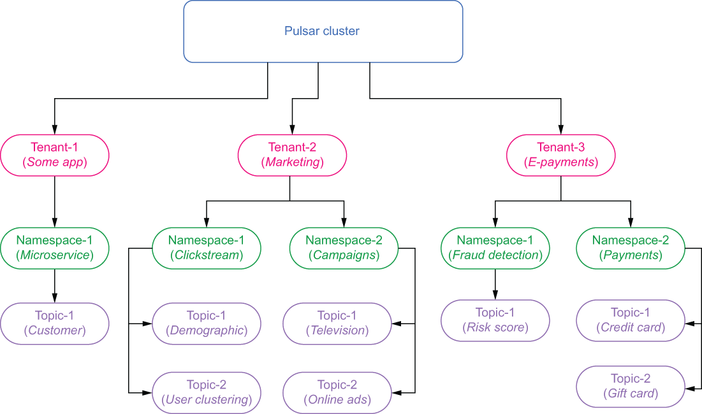
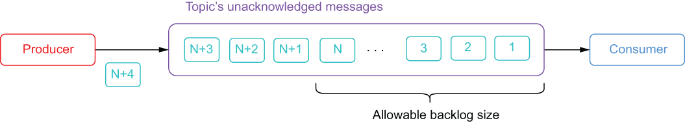

# Pulsar 概念和架构
本章涵盖

- Pulsar 的物理架构
- Pulsar 的逻辑架构
- Pulsar 提供的消息消费和订阅类型
- Pulsar 的消息保留、过期和积压策略

既然你已经了解了 Pulsar 消息传递平台以及它与其他消息传递系统的比较，我们将深入了解底层架构细节并介绍该平台使用的一些独特术语。如果你不熟悉消息传递系统和分布式系统，那么可能很难理解 Pulsar 的一些概念和术语。在深入研究 Pulsar 如何逻辑地构建消息之前，我将首先概述 Pulsar 的物理架构。

## 2.1 Pulsar 的物理架构

其他消息传递系统从管理和部署的角度将集群视为最高级别，这需要将每个集群作为独立系统进行管理和配置。幸运的是，Pulsar 提供了更高级别的抽象，称为 Pulsar 实例，它由一个或多个 Pulsar 集群组成，这些集群作为一个单元一起工作，可以从单个位置进行管理，如图 2.1 所示。


图 2.1 一个 Pulsar 实例可以由多个地理上分散的集群组成。

使用 Pulsar 实例的最大原因之一是启用异地复制。事实上，只有同一实例内的集群才能配置为在它们之间复制数据。

Pulsar 实例使用一个称为配置存储的实例范围的 ZooKeeper 集群来保留与多个集群相关的信息，例如地理复制和租户级安全策略。这允许你在一个位置定义和管理这些策略。为了为配置存储提供弹性，Pulsar 实例的 ZooKeeper 集合中的每个节点都应该跨多个区域部署，以确保在区域发生故障时其可用性。

需要注意的是，即使启用了异地复制，单个 Pulsar 集群也需要 Pulsar 实例用于配置存储的 ZooKeeper 集合的可用性才能运行。启用异地复制后，如果配置存储关闭，则发布到相应集群的消息将在本地缓存，并在集成再次运行时转发到其他区域。

### 2.1.1 Pulsar 的分层架构

如图 2.2 所示，每个 Pulsar 集群由多个 Pulsar 消息代理实例的无状态服务层、多个 BookKeeper bookie 实例的有状态存储层和多个 Pulsar 代理的可选路由层组成。当托管在 Kubernetes 环境中时，这种解耦架构使你的 DevOps 团队能够动态扩展代理、博彩公司和代理的数量以满足高峰需求，并在较慢的时期缩小规模以节省成本。消息流量尽可能均匀地分布在所有可用的代理上，以提供最大的吞吐量。


图 2.2 一个 Pulsar 集群由多个层组成：一个可选的代理层，将传入的客户端请求路由到适当的消息代理，一个由多个代理组成的无状态服务层，为客户端请求提供服务，一个有状态的存储层，由多个 bookie 组成，保留多个邮件的副本。

当客户端访问尚未使用的主题时，将触发一个过程以选择最适合获取该主题所有权的代理。一旦代理获得了某个主题的所有权，它就负责处理对该主题的所有请求，并且任何希望发布或消费来自该主题的数据的客户端都需要与拥有它的相应代理进行交互。因此，如果要将数据发布到特定主题，则需要知道哪个代理拥有该主题并连接到它。但是，代理分配信息仅在 ZooKeeper 元数据中可用，并且可能会根据负载重新平衡、代理崩溃等进行更改。因此，你无法直接连接到代理本身并希望与你想要的代理进行通信。这正是创建 Pulsar 代理的原因——充当集群中所有代理的中介。

#### 脉冲星代理

如果你在私有和/或虚拟网络环境（例如 Kubernetes）中托管 Pulsar 集群，并且你希望提供与 Pulsar 代理的入站连接，那么你需要将其私有 IP 地址转换为公共 IP 地址。虽然这可以使用传统的负载平衡技术和技术来实现，例如物理负载平衡器、虚拟 IP 地址或基于 DNS 的负载平衡将客户端请求分布到一组代理中，但这并不是提供冗余和故障转移功能的最佳方法为你的客户。

传统的负载均衡器方法效率不高，因为负载均衡器不知道哪个代理分配给给定主题，而是将请求定向到集群中的随机代理。如果代理收到对其未提供服务的主题的请求，它会自动将请求重新路由到适当的代理进行处理，但这会导致时间上的重大损失。这就是为什么建议改用 Pulsar 代理的原因，它充当 Pulsar 代理的智能负载均衡器。

使用 Pulsar 代理时，所有客户端连接将首先通过代理传输，而不是直接到达代理本身。然后代理将使用 Pulsar 的内置服务发现机制来确定哪个代理托管你尝试访问的主题，并自动将客户端请求路由到它。此外，它将将此信息缓存在内存中，以供将来的请求进一步简化查找过程。出于性能和故障转移目的，建议在传统负载均衡器后面运行多个 Pulsar 代理。与 broker 不同，Pulsar 代理可以处理任何请求，因此它们可以毫无问题地进行负载平衡。

### 2.1.2 无状态服务层
Pulsar 的多层设计确保消息数据与 Broker 分开存储，这保证了任何 Broker 都可以随时提供来自任何主题的数据。这也允许集群随时将主题的所有权分配给集群中的任何代理，这与将代理和它们所服务的主题数据共置一处的其他消息传递系统不同。因此，我们使用术语“无状态”来描述服务层，因为代理本身没有存储处理客户端请求所必需的信息。

代理的无状态特性不仅允许我们根据需要动态地扩展和缩减它们，而且还使它们具有集群弹性以应对多个代理故障。最后，Pulsar 有一个内部减载机制，可以根据不断变化的消息流量重新平衡所有活动代理之间的负载。

#### 捆绑

将主题分配给特定代理是在所谓的捆绑级别完成的。 Pulsar 集群中的所有主题都分配给一个特定的包，每个包分配给不同的代理，如图 2.3 所示。这有助于确保命名空间中的所有主题均匀分布在所有代理中。


图 2.3 从服务的角度来看，每个代理都被分配了一组包含多个主题的包。包分配是通过散列主题名称来确定的，这使我们可以确定它属于哪个包，而不必将该信息保存在 ZooKeeper 中。

创建的包数量由代理配置文件中的 defaultNumberOfNamespaceBundles 属性控制，该属性的默认值为 4。你可以在创建命名空间时在每个命名空间级别覆盖此设置，方法是在创建命名空间时提供不同的值使用 Pulsar 管理 API 的命名空间。通常，你希望捆绑包的数量是代理数量的倍数，以确保它们均匀分布。例如，如果你有三个经纪人和四个捆绑包，那么其中一个经纪人将被分配两个捆绑包，而其他经纪人每个只能获得一个。

#### 负载均衡

虽然消息流量最初可能会尽可能均匀地分布在活动代理之间，但有几个因素可能会随着时间的推移而发生变化，从而导致负载变得不平衡。消息流量模式的变化可能会导致代理服务于多个流量较大的主题，而其他主题则根本没有被使用。当现有包超过代理配置文件中以下属性定义的一些预配置阈值时，包将被拆分为两个新包，其中一个被卸载到新代理：

- loadBalancerNamespaceBundleMaxTopics
- loadBalancerNamespaceBundleMaxSessions
- loadBalancerNamespaceBundleMaxMsgRate
- loadBalancerNamespaceBundleMaxBandwidthMbytes

这种机制通过将这些过载的包一分为二来识别和纠正某些包比其他包承受更重负载的情况。然后可以将这些捆绑包之一卸载到集群中的不同代理。

#### 减载
Pulsar brokers 有另一种机制来检测特定 broker 何时过载，并自动让它卸载或卸载它的一些 bundle 到集群中的其他 broker。当代理的资源利用率超过代理配置文件中 loadBalancerBrokerOverloadedThresholdPercentage 属性定义的预配置阈值时，代理会将一个或多个包卸载到新代理。此属性定义代理可以消耗的总可用 CPU、网络容量或内存的最大百分比。如果这些资源中的任何一个超过此阈值，则会触发卸载。

所选的捆绑包保持不变并分配给不同的经纪人。这是因为减载过程解决了与负载平衡过程不同的问题。通过负载平衡，我们正在更正主题在捆绑包中的分布，因为其中一个比其他捆绑包的流量大得多，我们正试图将负载分散到所有捆绑包中。

另一方面，减载根据为它们提供服务所需的资源数量来更正跨代理的包的分布。即使可以为每个代理分配相同数量的捆绑包，但如果捆绑包之间的负载不平衡，则每个代理处理的消息流量可能会大不相同。

为了说明这一点，请考虑有 3 个代理和总共 60 个包，每个代理分别服务 20 个包的场景。此外，其中 20 个包目前处理了总消息流量的 90%。现在，如果这些捆绑包中的大多数碰巧分配给同一个代理，则很容易耗尽该代理的 CPU、网络和内存资源。因此，将这些包中的一些卸载到另一个代理将有助于缓解问题，而拆分包本身只会减少大约一半的消息流量，而将 45% 的消息流量留在原始代理上。

#### 数据访问模式

流系统中通常有三种 I/O 模式：写入，将新数据写入系统；尾读，消费者在最近发布的消息发布后立即阅读；和追赶读取，消费者从主题的开头读取大量消息以追赶，例如当新消费者想要访问比最新消息早得多的数据时。

当生产者向 Pulsar 发送消息时，它会立即写入 BookKeeper。一旦 BookKeeper 确认数据已提交，代理会在向生产者确认消息发布之前在其本地缓存中存储消息的副本。这允许代理直接从内存中为尾随读取消费者提供服务，并避免与磁盘访问相关的延迟。


图 2.4 Pulsar 中的消息消费步骤

当查看从存储层访问数据的追赶读取时，它变得更有趣。当客户端消费来自 Pulsar 的消息时，该消息将经历如图 2.4 所示的步骤。追赶读取的最常见示例是当消费者长时间离线然后再次开始消费时，尽管任何不直接从代理的内存缓存中为消费者提供服务的情况都将被视为捕获-向上读取，例如将主题重新分配给新代理。

### 2.1.3 流存储层

Pulsar 保证所有消息消费者的消息传递。如果消息成功到达 Pulsar 代理，你可以放心，它将被传送到其预定目标。为了提供这种保证，所有未被确认的消息必须被持久化，直到它们可以被传递给消费者并被消费者确认。正如我之前提到的，Pulsar 使用称为 Apache BookKeeper 的分布式预写日志 (WAL) 系统来进行持久消息存储。 BookKeeper 是一种服务，它以称为分类帐的序列提供日志条目流的持久存储。

#### 逻辑存储架构

Pulsar 主题可以被认为是无限的消息流，它们按照消息接收的顺序依次存储。传入的消息附加到流的末尾，而消费者根据我之前讨论的数据访问模式在流的更上游读取消息。虽然这种简化的视图让我们很容易推理消费者在主题中的位置，但由于存储设备的空间限制，这种抽象在现实中是不可能存在的。最终，这个抽象的无限流概念必须在存在这种限制的物理系统上实现。

在实现流存储方面，Apache Pulsar 采用了与传统消息系统（如 Kafka）截然不同的方法。在 Kafka 中，每个流都被分成多个副本，每个副本都完全存储在代理的本地磁盘上。这种方法的优点在于它简单快速，因为所有写入都是顺序的，这限制了访问数据所需的磁盘磁头移动量。 Kafka 方法的缺点是单个代理必须有足够的存储容量来保存分区数据，正如我在第 1 章中讨论的那样。

那么 Apache Pulsar 的方法有什么不同呢？对于初学者来说，每个主题都不是建模为分区的集合，而是一系列的段。这些段中的每一个都可以包含可配置数量的消息，默认值为 50,000。一旦一个段已满，就会创建一个新段来保存新消息。因此，一个 Pulsar 主题可以被认为是一个无界的段列表，每个段包含一个消息子集，如图 2.5 所示，它显示了流存储层的逻辑架构以及它如何映射到底层物理实现.


图 2.5 Pulsar 主题的数据作为账本序列存储在 BookKeeper 层内。这些分类帐 ID 的列表存储在 ZooKeeper 上称为托管分类帐的逻辑结构中。每个分类帐拥有 50,000 个条目，用于存储消息数据的副本。请注意，persistent://tenant/ns/my-topic 将在本书后面作为一个概念进行讨论。

Pulsar 主题只不过是一个可寻址端点，用于唯一标识 Pulsar 中的特定主题，并且类似于 URL，因为它仅用于唯一标识客户端尝试连接的资源。主题名称必须由 Pulsar broker 解码以确定数据的存储位置。

Pulsar 在 BookKeeper 的分类账之上添加了一个额外的抽象层，称为托管分类账，它保留了持有发布到主题的数据的分类账的 ID。正如我们在图 2.5 中看到的，当数据第一次发布到主题 A 时，它被写入了 ledger-20。在该主题发布了 50,000 条记录后，该分类帐被关闭，并创建了另一个 (ledger-245) 来取代它。此过程每 50,000 条记录重复一次以存储传入数据，并且托管分类帐在 ZooKeeper 内部保留此唯一的分类帐 ID 序列。

稍后，当消费者尝试从主题 A 读取数据时，托管分类帐用于定位 BookKeeper 内部的数据并将其返回给消费者。如果消费者从最旧的消息开始执行追赶读取，那么它将首先从 ledger-20 获取所有数据，然后是 ledger-245，依此类推。这些分类账从最老到最年轻的遍历对最终用户来说是透明的，并造成了单一顺序数据流的错觉。托管分类帐允许这种情况发生并保留 BookKeeper 分类帐的顺序，以确保消息的读取顺序与它们发布的顺序相同。

#### 簿记员物理架构

在 BookKeeper 中，账本的每个单元都被称为一个条目。这些条目包含来自传入消息的实际原始字节，以及一些用于跟踪和访问条目的重要元数据。最关键的元数据是其所属账本的 ID，它保存在本地 ZooKeeper 实例中，因此当消费者将来尝试读取消息时，可以从 BookKeeper 快速检索该消息。日志条目流存储在仅附加数据结构中，称为分类帐，如图 2.6 所示。


图 2.6 在 BookKeeper 中，传入的条目作为分类账一起存储在称为 Bookie 的服务器上。

分类帐具有仅附加语义，这意味着条目按顺序写入分类帐，一旦写入分类帐就无法修改。从实践的角度来看，这意味着

- Pulsar 经纪人首先创建一个分类帐，然后将条目附加到分类帐中，最后关闭分类帐。不允许进行其他交互。
- 在账本关闭后，无论是正常情况还是因为进程崩溃，它只能以只读模式打开。
- 最后，当不再需要分类帐中的条目时，可以从系统中删除整个分类帐。

负责存储分类帐（更具体地说，分类帐片段）的各个 BookKeeper 服务器称为 Bookie。每当条目写入分类帐时，这些条目将写入一个称为集合的 bookie 节点子组。集成的大小等于你为 Pulsar 主题指定的复制因子 (R)，并确保你将条目的 R 个副本保存到磁盘以防止数据丢失。

Bookies 以日志结构的方式管理数据，该方式使用三种类型的文件实现：日志、条目日志和索引文件。日志文件保留所有 BookKeeper 事务日志。在对分类帐进行任何更新之前，博彩公司确保将描述更新的事务写入磁盘以防止数据丢失。


图 2.7 Pulsar 中的消息持久化步骤

条目日志文件包含写入 BookKeeper 的实际数据。来自不同账本的条目按顺序聚合和写入，而它们的偏移量作为指针保存在账本缓存中以进行快速查找。为每个分类帐创建一个索引文件，其中包含多个索引，记录存储在条目日志文件中的数据的偏移量。索引文件以传统关系数据库中的索引文件为模型，并允许对分类帐消费者进行快速查找。当客户端向 Pulsar 发布消息时，该消息将通过图 2.7 所示的步骤将其持久化到 BookKeeper 账本中的磁盘。

通过将条目数据分布在不同磁盘设备上的多个文件中，博彩公司能够将读取操作的影响与正在进行的写入操作的延迟隔离开来，从而允许它们处理数千个并发读取和写入。

### 2.1.4 元数据存储

最后，每个集群还有自己的本地 ZooKeeper 集成，Pulsar 使用它来存储租户、命名空间和主题的特定于集群的配置信息，包括安全和数据保留策略。这是我们之前讨论的托管分类帐信息的补充。

#### 动物园管理员基础知识

根据Apache官方网站的说法，“ZooKeeper是一个集中式服务，用于维护配置信息、命名、提供分布式同步、提供群组服务”（https://zookeeper.apache.org），这是一种精心的说法分布式数据源。 ZooKeeper 提供了一个分散的位置来存储信息，这在分布式系统中至关重要，例如 Pulsar 或 BookKeeper。

Apache ZooKeeper 解决了几乎每个分布式系统都必须解决的达成共识（即协议）的基本问题。分布式系统中的进程需要就几个不同的信息达成一致，例如当前的配置值和主题的所有者。这对于分布式系统来说尤其是一个问题，因为同一组件的多个副本同时运行，而没有真正的方法来协调它们之间的信息。传统数据库不是一种选择，因为它们在框架内引入了一个序列化点，所有调用服务将被阻塞，等待表上的相同锁，这基本上消除了分布式计算的所有好处。

访问共识实现使分布式系统能够通过提供比较和交换 (CAS) 操作来实现分布式锁，从而以更有效的方式协调进程。 CAS 操作将从 ZooKeeper 检索到的值与预期值进行比较，并且仅当它们相同时才更新该值。这保证了系统根据最新信息进行操作。一个这样的例子是在写入任何数据之前检查 BookKeeper 分类帐的状态是否打开。如果某个其他进程关闭了账本，它将反映在 ZooKeeper 数据中，并且该进程将知道不继续进行写入操作。相反，如果一个进程要关闭分类帐，该信息将被发送到 ZooKeeper，以便它可以传播到其他服务，因此他们会在尝试写入之前知道它已关闭。

ZooKeeper 服务本身公开了一个类似文件系统的 API，以便客户端可以操作简单的数据文件 (znodes) 来存储信息。这些 znode 中的每一个都形成类似于文件系统的层次结构。在下面的部分中，我将检查 ZooKeeper 中保留的元数据以及它的使用方式和使用对象，以便你可以自己确切了解为什么需要它。最好的方法是使用与 Pulsar 一起分发的 zookeeper-shell 工具，如下面的清单所示，列出所有 znode。

清单 2.1 使用 ZooKeeper-shell 工具列出 znode

```sh
/pulsar/bin/pulsar zookeeper-shell                                    ❶
ls /                                                                  ❷
[admin, bookies, counters, ledgers, loadbalance, 
➥ managed-ledgers, namespace, pulsar, schemas, stream, zookeeper]    ❸
```

❶ 启动 ZooKeeper shell
❷ 列出根级节点下的子节点
❸ Pulsar 使用的所有 znode 的输出
正如你在清单 2.1 中看到的，在 ZooKeeper 中为 Apache Pulsar 和 BookKeeper 创建了总共 11 个不同的 znode。根据它们包含的信息以及如何使用这些信息，它们属于四类之一。

#### 配置数据

第一类信息是租户、命名空间、模式等的配置数据。所有这些信息都是缓慢变化的信息，只有在用户创建或更新新集群、租户、命名空间或模式时，才会通过 Pulsar 管理 API 进行更新包括安全策略、消息保留策略、复制策略和模式等内容。此信息存储在以下 znodes 中：/admin 和 /schemas。

#### 元数据存储

所有主题的托管分类帐信息都存储在 /managed-ledgers znode 中，而 BookKeeper 使用 /ledgers znode 来跟踪当前存储在集群内所有 bookie 中的所有分类帐。

清单 2.2 检查托管分类帐

```sh
/pulsar/bin/pulsar-managed-ledger-admin print-managed-ledger -
➥ managedLedgerPath /public/default/persistent/topicA 
➥ --zkServer localhost:2181                              ❶
 
ledgerInfo { ledgerId: 20 entries: 50000 size: 3417764 timestamp: 1589590969679}
ledgerInfo { ledgerId: 245 timestamp: 0}                  ❷
```

❶托管分类帐工具允许你按主题名称查找分类帐。
❷ 该主题有两个分类帐：一个有 50K 条目已关闭，另一个是打开的。
正如你在清单 2.2 中看到的那样，还有另一个名为 pulsar-managed-ledger-admin 的工具，它允许你轻松访问 Pulsar 用于从 BookKeeper 读取和写入数据的托管分类帐信息。在这种情况下，主题数据存储在两个不同的分类账上： ledgerID-20，它已关闭，包含 50,000 个条目，以及 ledgerID-245，它当前处于打开状态，将在何处发布传入数据。

#### 服务之间的动态协调

其余的 znode 都用于跨系统的分布式协调，包括 /bookies，它维护在 BookKeeper 集群中注册的 bookies 的列表，以及 /namespace，代理服务使用它来确定哪个代理拥有给定的主题。正如我们在下面的清单中看到的，/namespace znode 层次结构用于存储每个命名空间的包 ID。

清单 2.3 用于确定主题所有权的元数据

```sh
/pulsar/bin/pulsar zookeeper-shell                         ❶
ls /namespace
[customers, public, pulsar]                                ❷
ls /namespace/customers
[orders]                                                   ❸
ls /namespace/customers/orders
[0x40000000_0x80000000]                                    ❹
get /namespace/customers/orders/0x40000000_0x80000000
{"nativeUrl":"pulsar:            //localhost:6650",
➥ "httpUrl":"http://localhost:8080","disabled":false}     ❹
```

❶ 启动 ZooKeeper shell
❷ 每个租户有一个 znode。
❸ 每个命名空间有一个 znode。
❹ 每个 bundle_id 有一个 znode。
正如你在我们之前的讨论中所回忆的那样，代理对主题名称进行哈希处理以确定包名称，在本例中为 0x40000000_0x80000000。然后代理查询 /namespace/{tenant}/{namespace}/{bundle-id} znode 以检索“拥有”主题的代理的 URL。

希望这能让你更深入地了解 ZooKeeper 在 Pulsar 集群中扮演的角色，以及它如何提供一个服务，该服务可以被动态添加到集群中的节点轻松访问，因此他们可以快速确定集群配置并开始处理客户请求。一个这样的例子是新添加的代理能够通过引用 /managed-ledgers znode 中的数据开始从主题提供数据。

## 2.2 Pulsar 的逻辑架构

与其他消息传递系统一样，Pulsar 使用主题的概念来表示用于在生产者和消费者之间传输数据的消息通道。然而，这些主题的命名方式在 Pulsar 中与在其他消息传递系统中不同。在接下来的部分中，我将介绍 Pulsar 用于存储和管理主题的底层逻辑结构。

### 2.2.1 租户、命名空间和主题

在本节中，我们将介绍描述数据在集群内如何构建和存储的逻辑结构。 Pulsar 被设计为一个多租户系统，通过为每个部门提供自己的安全和专有的消息传递环境，允许它在组织内的多个部门之间共享。这种设计使单个 Pulsar 实例能够有效地作为整个企业的消息传递平台即服务。 Pulsar 的逻辑架构通过租户、命名空间和主题的层次结构支持多租户，如图 2.8 所示。



图 2.8 Pulsar 的逻辑架构由租户、命名空间和主题组成。

#### 租户

Pulsar 层次结构的顶部是租户，它们可以代表特定的业务部门、核心功能或产品线。租户可以分布在集群中，每个租户都可以应用自己的身份验证和授权方案，从而控制谁可以访问存储在其中的数据。它们也是可以管理存储配额、消息生存时间和隔离策略的管理单元。

#### 命名空间

每个租户可以有多个命名空间，这些命名空间是通过策略管理相关主题的逻辑分组机制。在命名空间级别，你可以设置访问权限、微调复制设置、管理跨集群的消息数据的异地复制以及控制命名空间中所有主题的消息到期。

让我们考虑如何为电子商务应用程序构建 Pulsar 的命名空间。为了隔离敏感的传入支付数据并限制只有财务团队的成员才能访问，你可以配置一个名为 E-payments 的单独租户，如图 2.8 所示，并应用访问策略，将完全访问权限限制为仅限财务团队的成员财务组，以便他们可以执行审计和处理信用卡交易。

在 E-payments 租户中，你可以创建两个命名空间：一个命名的支付将保存收款，包括信用卡支付和礼品卡兑换，另一个命名的欺诈检测将包含那些被标记为可疑以供进一步处理的交易.在这样的部署中，你会将面向用户的应用程序限制为对支付命名空间的只写访问权限，同时授予对欺诈检测应用程序的只读访问权限，以便它可以评估它们是否存在潜在的欺诈行为。

在欺诈检测命名空间上，你将为欺诈检测应用程序配置写访问权限，因此它可以将潜在的欺诈性支付放入“风险评分”主题中。你还可以授予对同一名称空间的电子商务应用程序的只读访问权限，以便它可以收到任何潜在欺诈的通知并做出相应的反应，例如阻止销售。

#### 话题

主题是 Pulsar 中唯一可用的通信渠道类型。所有消息都写入主题和从主题读取。其他消息传递系统支持不止一种通信通道类型（例如，主题和队列根据它们支持的消息消费类型进行区分）。正如我在第 1 章中讨论的，队列支持先进先出的独占消息消费，而主题支持发布-订阅、一对多的消息消费。 Pulsar 没有做这样的区分，相反，它依赖于各种订阅类型来控制消息消费模式。

在 Pulsar 中，未分区的主题由单个代理提供服务，该代理负责接收和传递该主题的所有消息。因此，单个主题的吞吐量受限于为其提供服务的代理的计算能力。

#### 分区主题
Pulsar 还支持可以由多个代理服务的分区主题的概念，当负载分布在多台机器上时，它允许更高的吞吐量。在幕后，分区主题被实现为 N 个内部主题，其中 N 是分区数。跨代理的分区分布由 Pulsar 自动处理，有效地使该过程对最终用户透明。

将分区主题实现为一系列单独的主题允许用户增加分区的数量，而无需重新平衡整个主题。相反，内部主题是为新分区创建的，并且能够立即接收传入的消息，而根本不会影响其他内部主题（例如，消费者仍然可以不间断地读取/写入现有分区的消息）。

从消费者的角度来看，分区主题和普通主题没有区别。所有消费者订阅的工作方式与它们在非分区主题上的工作方式完全一样。但是，将消息发布到分区主题时发生的情况有很大不同。消息生产者负责确定消息最终发布到哪个内部主题。如果消息在其关键元数据字段中有一个值，那么生产者将散列该值以确定要发布到哪个主题。这确保所有具有相同键的消息都存储在同一主题中，并且将按照它们发布的顺序进行。

当发布没有key的消息时，生产者应该配置一个路由模式，指定如何跨主题中的分区路由消息。默认路由模式称为 RoundRobinPartition，顾名思义，它以循环方式跨所有分区发布消息。这种方法将消息均匀地分布在各个分区上，从而最大限度地提高了发布吞吐量。或者，你可以使用 SinglePartition 路由模式，该模式随机选择单个分区将其所有消息发布到其中。当你没有键值时，此方法可用于将来自特定生产者的消息分组在一起以维护消息排序。如果你需要更多地控制跨分区主题的消息分发，你也可以提供自己的路由实现。

让我们看一下图 2.9 中描述的消息流，其中生产者被配置为使用 RoundRobinPartition 发布模式。在这种情况下，生产者连接到 Pulsar 代理并期望返回分配给它正在写入的主题的代理的 IP 地址。代理反过来引用本地元存储获取此信息并发现主题已分区，并且需要将指定的分区号转换为为该分区提供服务的内部主题的名称。


图 2.9 发布到分区主题

在图 2.9 中，生产者的循环路由策略决定消息应该发布到分区号 3，该分区实现为内部主题 p3。代理还可以确定内部主题 p3 当前正由 broker-0 提供服务。因此，消息被路由到该代理并写入 p3 主题。由于路由模式是round robin，同一生产者的后续调用将导致消息被路由到broker-1上的p4内部主题。

### 2.2.2 在 Pulsar 中处理话题

Pulsar 逻辑层的层次结构反映在用于访问 Pulsar 中主题的端点的命名约定中。如图 2.10 所示，Pulsar 中处理的每个主题都包含它所属的租户和命名空间。该地址还包含一个持久性前缀，指示消息内容是持久化到长期存储中还是仅保留在 bookie 的内存空间中。如果主题名称创建的前缀为persistent://，则所有已接收但尚未确认的消息将存储在多个 bookie 节点上，因此可以在代理失败时幸免于难。


图 2.10 Pulsar 中的主题寻址方案

Pulsar 还支持非持久性主题，它将所有未确认的消息保留在代理内存中。非持久性主题名称以非持久性:// 前缀开头以指示此行为。使用非持久性主题时，代理会立即将消息传递给所有连接的订阅者，而不会持久化它们。

使用非持久性传递时，任何形式的代理故障或订阅者与主题的断开连接都会导致（非持久性）主题上的所有传输中消息丢失。这意味着主题订阅者即使重新连接也永远无法接收这些消息。虽然非持久性消息传递通常比持久性消息传递更快，因为它避免了与将数据持久化到磁盘相关的延迟，但只有在你确定你的用例可以容忍消息丢失的情况下才建议使用它。

### 2.2.3 生产者、消费者和订阅者

Pulsar 建立在发布-订阅（pub-sub）模式之上。在这种模式中，生产者向主题发布消息。然后消费者可以订阅这些主题，处理传入的消息，并在处理完成时发送确认。

生产者是直接或通过 Pulsar 代理连接到 Pulsar 代理的任何进程，并向主题发布消息，而消费者是连接到 Pulsar 代理以接收来自主题的消息的任何进程。当消费者成功处理一条消息时，它需要向代理发送确认，以便代理知道它已被接收和处理。如果在预配置的时间范围内未收到此类确认，则代理会将其重新发送给该订阅的消费者。

当消费者连接到 Pulsar 主题时，它会建立所谓的订阅，它指定消息将如何传递给一组一个或多个消费者。 Pulsar 有四种可用的订阅模式：独占、故障转移、密钥共享和共享。无论订阅类型如何，消息都按收到的顺序传送。

有关这些订阅的信息保留在本地 Pulsar ZooKeeper 元数据中，其中包括所有消费者的 http 地址等。每个订阅还有一个与之相关联的游标，它表示为订阅消费和确认的最后一条消息的位置。为了防止消息重新传递，这些订阅游标保留在博彩公司上，以确保它们能够在任何代理级别的故障中幸免于难。

Pulsar 支持每个主题的多个订阅，这允许多个消费者从一个主题读取数据。如图 2.11 所示，该主题有两个不同的订阅：Sub-A 和 Sub-B。 Consumer-A首先连接到主题，并以独占消费者模式运行，这意味着该主题中的所有消息都将由Consumer-A消费。到目前为止，Consumer-A 只确认了前 4 条消息，因此其订阅的光标位置 Sub-A 当前设置为 5。


图 2.11 Pulsar 支持每个主题多个订阅，允许多个消费者读取相同的数据。消费者 A 使用了名为 Sub-A 的独占订阅上的前四条消息，而消息 4 到 10 已在名为 Sub-B 的共享订阅上的两个消费者之间分发。

名为 Sub-B 的订阅是在前三个消息生成后创建的；因此，这些消息都没有传递给该订阅的消费者。一个常见的误解是，在某个主题上创建的任何订阅都将从该主题的第一条消息开始，这就是为什么我选择在这里说明这一点并表明你只会在订阅后收到发布到该主题的消息到它。

我们还可以看到，由于 Sub-B 运行在共享模式下，消息已经分布在组中的所有消费者之间，每条消息仅由组中的单个消费者处理。你还可以看到 Sub-B 的游标比 Sub-A 的游标更靠前，这在你将消息分发到多个消费者时并不少见。

### 2.2.4 订阅类型

在 Pulsar 中，所有消费者都使用订阅来消费来自主题的数据。订阅只是定义如何将消息传递给给定主题的消费者的配置规则。 Pulsar 订阅可以在多个应用程序之间共享，事实上，大多数订阅类型都是专门为这种使用模式设计的。 Pulsar 支持四种不同类型的订阅：独占、故障转移、共享和密钥共享，如图 2.12 所示。


图 2.12 Pulsar 的订阅模式

一个 Pulsar 主题可以同时支持多个订阅，允许你使用单个主题来服务具有截然不同消费模式的应用程序。还需要指出的是，同一主题的不同订阅不必具有相同的订阅类型。这允许你使用单个主题同时为排队和流用例提供服务。

Pulsar 的每种订阅类型都服务于不同类型的用例，因此了解它们以正确使用它们很重要。让我们重新审视这样一个场景：一家将股票市场报价信息实时传输到名为股票报价的主题中的金融服务公司想要在整个企业中共享该信息，并了解如何将这些订阅模式中的每一种用于相同的用例。

#### 独家的

独占订阅只允许单个消费者访问该订阅的消息。如果任何其他消费者尝试使用相同的订阅订阅主题，则会抛出异常，并且无法连接。当你要确保每条消息只由已知使用者处理一次时，将使用此模式。


图 2.13 独占订阅只允许一个消费者消费消息。

在我们的金融服务组织内，数据科学团队将使用这种类型的订阅，通过他们的机器学习模型来提供股票主题数据，以训练或验证它们。这将允许他们完全按照收到的顺序处理记录，以按正确的时间顺序提供股票报价流。每个模型都需要自己的独占订阅，如图 2.13 所示，以接收自己的数据副本。

#### 故障转移订阅

故障转移订阅允许多个消费者附加到订阅，但只选择一个消费者来接收消息。此配置允许你提供故障转移使用者以在使用者发生故障时继续处理主题中的消息。如果活动消费者无法处理消息，Pulsar 会自动故障转移到列表中的下一个消费者并继续传递消息。

当你希望具有消费者高可用性的单一处理语义时，这种类型的订阅非常有用。如果你希望你的应用程序在系统出现故障时继续处理消息并在第一个使用者因任何原因失败时由另一个使用者接管，这将非常有用。通常，这些使用者分布在不同的主机和/或数据中心，以确保应用程序可以在多次中断后幸免于难。正如你在图 2.14 中看到的，消费者 A 是活动消费者，而消费者 B 是备用消费者，如果消费者 A 因任何原因断开连接，它将成为下一个接收消息的消费者。


图 2.14 故障转移订阅一次只有一个活动消费者，但它允许多个备用消费者。

一个这样的例子是，如果我们金融服务公司的数据科学团队使用来自股票报价主题的数据部署了他们的一个模型，该数据生成市场波动率分数，这些分数与其他模型的分数相结合，为交易团队提供整体建议.至关重要的是，该模型的一个实例保持运行并始终运行以帮助交易团队做出明智的交易决策。运行多个实例并生成建议可能会影响整体建议。

#### 共享订阅

共享订阅还允许多个消费者附加到订阅；每个都可以主动接收消息，这与一次仅支持一个活动使用者的故障转移订阅不同。消息以循环方式传递给所有注册的消费者，任何给定的消息都只传递给一个消费者，如图 2.15 所示。


图 2.15 消息分布在共享订阅的所有消费者之间。

这种订阅类型对于实现消息排序并不重要的工作队列很有用，因为它允许你快速扩展主题上的消费者数量以处理传入的消息。每个共享订阅的消费者数量没有上限，这使你可以通过增加消费者数量超过存储层强加的某些人为限制来扩大消费。

在我们虚构的金融服务组织中，我们的内部交易平台、算法交易系统和面向客户的网站等关键业务应用程序都将从此类订阅中受益。这些应用程序中的每一个都将使用自己的共享订阅，如图 2.15 所示，以确保它们每个都收到发布到股票主题的所有消息。

#### 密钥共享订阅

密钥共享订阅也允许多个并发消费者，但与在消费者之间以循环方式分发消息的共享订阅不同，它添加了一个二级密钥索引，以确保具有相同密钥的消息被传递到相同的消费者。此订阅充当 SQL 中的分布式 GROUP BY，其中具有相似键的数据组合在一起。这在你希望在使用之前对数据进行预排序的情况下特别有用。

考虑业务分析团队需要对股票主题中的数据执行一些分析的场景。通过使用密钥共享订阅，他们可以确保给定股票代码的所有数据都将由同一个消费者处理，如图 2.16 所示，使他们更容易将这些数据与其他数据流连接起来。


图 2.16 消息按共享密钥订阅中的指定密钥分组在一起。

总之，独占订阅和故障转移订阅只允许每个订阅的每个主题分区有一个消费者，这确保消息按照收到的顺序被消费。它们最适用于需要严格排序的流媒体用例。

另一方面，共享订阅允许每个主题分区有多个消费者。订阅中的每个消费者仅接收发布到主题的消息的一部分。共享订阅最适合排队用例，其中不需要严格的消息排序但需要高吞吐量。

## 2.3 消息保留和过期
作为一个消息传递系统，Pulsar 的主要功能是将数据从 A 点移动到 B 点。一旦数据已经交付给所有预定的接收者，假设不需要保留它。因此，Pulsar 中的默认消息保留策略正是这样做的：当一条消息发布到 Pulsar 主题时，它将被存储，直到它被所有主题的消费者确认，此时它将被删除。此行为由代理配置文件中的 defaultRetentionTimeInMinutes 和 defaultRetentionSizeInMB 配置属性控制，默认情况下这两个属性都设置为零以指示不应保留已确认的消息。

### 2.3.1 数据保留

但是，Pulsar 还支持命名空间级别的保留策略，允许你在希望将主题数据保留更长时间的情况下覆盖此默认行为，例如，如果你想在以后的某个时间点通过以下方式访问主题数据读取器接口或 SQL。

这些保留策略规定了在消息被所有已知消费者确认使用后，你将消息保留在持久存储中的时间。保留策略未涵盖的已确认消息将被删除。保留策略由大小和时间限制的组合定义，并在每个主题的基础上应用于该命名空间中的每个主题。例如，如果你指定 100 GB 的大小限制，则该命名空间内的每个主题中将保留多达 100 GB 的数据，一旦超过此大小限制，消息将从主题中清除（从最旧到最新），直到总数据量再次低于指定限制。同样，如果你指定 24 小时的时间限制，那么命名空间中所有主题的已确认消息将根据代理收到的时间最多保留 24 小时。

保留策略要求你指定大小和时间限制，它们彼此独立应用。因此，如果消息违反了这些限制中的任何一个，它将从主题中删除，无论它是否符合其他政策。

如果你为 E-payments/refunds 命名空间指定了时间限制为 24 小时和大小限制为 10 GB 的保留策略，如清单 2.4 所示，那么当达到指定的策略限制之一时，数据将被删除。因此，如果总容量超过 10 GB，则可能会删除 24 小时以内的消息。

清单 2.4 设置各种 Pulsar 保留策略

```sh
./bin/pulsar-admin namespaces set-retention E-payments/payments \
 --time 24h \
 --size -1                  ❶
 
./bin/pulsar-admin namespaces set-retention E-payments/fraud-detection \
 --time -1 \
 --size 20G                 ❷
 
./bin/pulsar-admin namespaces set-retention E-payments/refunds \
 --time 24h \
 --size 10G                 ❸
 
./bin/pulsar-admin namespaces set-retention E-payments/gift-cards \
 --time -1 \
 --size -1                  ❹
```

❶ 保留所有小于 24 小时的消息，没有大小限制
❷ 最多可保留 20 GB 的消息，不受时间限制
❸ 最多保留 10 GB 不到 24 小时的消息
❹ 保留无限数量的消息
还可以通过在创建保留策略时为这两个设置中的任何一个指定值 -1 并为这两个设置提供它来设置无限大小或时间，从而有效地为命名空间创建无限保留策略。因此，在使用该策略时要小心，因为数据永远不会从存储层中删除；确保你有足够的存储容量和/或配置定期将数据卸载到分层存储。

### 2.3.2 积压配额

Backlog 是用于描述主题中所有未确认消息的术语，这些消息必须存储在 bookie 中，直到它们被传递给所有预期的收件人。默认情况下，Pulsar 会无限期地保留所有未确认的消息。但是，Pulsar 支持命名空间级别的积压配额策略，允许你覆盖此行为，以在一个或多个消费者因系统崩溃而长时间离线的情况下减少这些未确认消息占用的空间。

这些积压配额旨在解决一种非常特殊的情况，在这种情况下，主题生产者发送的消息多于消费者可能处理的消息，而不会进一步落后。在这种情况下，你会希望防止消费者落后太多以至于永远赶不上。发生这种情况时，你需要考虑消费者正在处理的数据的及时性，并确保消费者放弃较旧的、较新的数据，转而使用仍可在商定的 SLA 内处理的较新的消息。如果你的主题中的数据因长时间放置而变得“陈旧”，那么实施积压配额将通过限制积压的大小帮助你将处理工作集中在最近的数据上。



图 2.17 Pulsar 的 backlog 配额允许你指定当未确认的消息量超过一定大小时代理应该采取什么行动。这可以防止积压变得如此之大，以至于消费者正在处理价值很小或没有价值的数据。

与我在上一节中讨论的消息保留策略不同，这些策略旨在延长 Pulsar 主题内已确认消息的生命周期，这些积压配额策略旨在缩短未确认消息的生命周期。

你可以通过配置 backlog 策略来限制这些消息 backlog 的允许大小，该策略指定主题 backlog 的最大允许大小以及超过此阈值时要采取的操作，如图 2.17 所示。积压保留策略有三个不同的选项，它们决定了代理应该采取的行为来缓解这种情况：

- 代理可以通过向生产者发送异常来拒绝入站消息，以指示他们应该通过指定 producer_request_hold 保留策略来推迟发送新消息。
- 当指定了 producer_exception 策略时，代理将强制断开任何现有的生产者，而不是要求生产者推迟。
- 如果你希望代理丢弃来自主题的现有的、未确认的消息，那么你应该指定 consumer_backlog_eviction 策略。

每一种都为你提供了三种截然不同的方法来处理图 2.17 中所示的情况。第一个，producer_request_hold，会让生产者保持连接，但抛出一个异常来减慢它的速度。此策略适用于你希望客户端应用程序捕获抛出的异常并在稍后重新发送消息的场景。因此，当你不想拒绝消费者发送的任何消息时最好使用此策略，并且客户端将在重新发送之前将被拒绝的消息缓冲一段时间。

第二个策略 producer_exception 将强制完全断开生产者的连接，这将阻止消息发布并要求生产者代码检测这种情况并重新连接。使用此策略，很可能会丢失客户端生产者在断开连接期间发送的消息。当你知道生产者无法缓冲消息（例如，它们在资源受限的环境中运行，例如物联网设备），并且你不希望 Pulsar 无法接收消息导致客户端应用程序崩溃。

最后一个策略，consumer_backlog_eviction，不会影响生产者的任何功能，它将继续以当前速率生成消息。但是，未消费的旧消息将被丢弃，从而导致消息丢失。

### 2.3.3 消息过期
正如我们已经讨论过的，Pulsar 会无限期地保留所有未确认的消息，而我们必须使用的一种工具来防止这些消息备份，那就是 backlog 配额。但是，backlog 配额的缺点之一是它们仅允许你根据主题未确认消息消耗的总空间来决定是否保留消息。你可能还记得，积压配额的主要原因之一是确保消费者忽略陈旧数据而选择更新的数据。因此，如果有一种方法可以根据消息本身的时间准确地强制执行该操作，那将更有意义。这就是消息过期策略发挥作用的地方。

Pulsar 支持命名空间级别的生存时间 (TTL) 策略，如果消息在一段时间后仍未得到确认，则允许你自动删除它们。消息过期在使用数据的应用程序更重要的是处理最近的数据而不是完整的历史记录的情况下很有用。一个这样的例子是当他们的司机在路上时为拼车应用程序的用户显示司机位置数据。与五分钟前驾驶员所在的位置相比，客户对驾驶员的最近位置更感兴趣。因此，超过五分钟的驱动程序位置信息将不再相关，应该清除以允许消费者仅处理最近的数据，而不是尝试处理不再有用的消息。

清单 2.5 设置 backlog 配额和消息过期策略

```sh
./bin/pulsar-admin namespaces set-backlog-quota E-payments/payments \
--limit 2G
--policy producer_request-hold        ❶
 
./bin/pulsar-admin namespaces set-message-ttl E-payments/payments \
--messageTTL 120                      ❷
```

❶ 定义一个 backlog 配额，大小限制为 2 GB 和 producer_request_hold 策略
❷ 将消息 TTL 设置为 120 秒
命名空间可以同时具有积压配额和与之关联的 TTL 策略，以更好地控制存储在 Pulsar 主题中的未确认消息的保留，如清单 2.5 所示。

2.3.4 消息积压 vs. 消息过期
消息保留和消息过期解决了两个根本不同的问题。如图 2.18 所示，消息保留策略仅适用于已确认的消息，保留策略范围内的消息将被保留。消息过期仅适用于未确认的消息并由 TTL 设置控制，这意味着在该时间范围内未处理和确认的任何消息都将被丢弃和不处理。

消息保留策略可与分层存储结合使用，以支持你希望无限期保留用于备份/恢复、事件溯源或 SQL 探索的关键数据集的无限消息保留。


图 2.18 backlog 配额适用于尚未被所有订阅确认的消息，基于 TTL 设置，而保留策略适用于已确认的消息，并基于要保留的数据量。

## 2.4 分层存储
Pulsar 的分层存储功能允许将较旧的主题数据卸载到更具成本效益的长期存储中，从而释放博彩公司内部的磁盘空间。对于最终用户而言，使用其数据存储在 Apache BookKeeper 中的主题或使用其数据存储在分层存储中的主题没有区别。客户端仍然以相同的方式生产和消费消息，整个过程在幕后透明处理。

正如我们之前所讨论的，Apache Pulsar 将主题存储为一个有序的分类帐列表，这些分类帐分布在存储层的 bookie 中。因为这些分类帐是仅追加的，所以新消息只会写入列表中的最终分类帐。之前的所有分类账都是密封的，因此段内的数据是不可变的。由于数据是不可变的，因此可以很容易地将其复制到另一个存储系统，例如云存储。

复制完成后，可以更新托管分类帐信息以反映数据的新存储位置，如图 2.19 所示，并且可以删除存储在 Apache BookKeeper 中的数据的原始副本。当分类帐被卸载到外部存储系统时，分类帐会从最旧到最新一个一个地复制到该存储系统中。


图 2.19 使用分层存储时，可以将已关闭的分类账复制到云存储并从博彩公司中删除以释放空间。更新托管分类帐条目以反映分类帐的新位置，主题消费者仍可读取该位置。

Apache Pulsar 目前支持多个云存储系统进行分层存储，但在本节中我将重点介绍使用 AWS。有关如何使用其他云供应商的存储系统的更多详细信息，请参阅文档。

#### AWS 卸载配置

你需要执行的第一步是创建你将用于存储卸载的分类帐的 S3 存储桶，并确保你将使用的 AWS 账户具有足够的权限来读取和写入存储桶中的数据。完成这些后，你将需要再次修改代理配置设置，如下面的清单所示。

清单 2.6 在 Pulsar 中配置 AWS 分层存储

```sh
managedLedgerOffloadDriver=aws-s3                          ❶
s3ManagedLedgerOffloadBucket=offload-test-aws              ❷
s3ManagedLedgerOffloadRegion=us-east-1                     ❸
s3ManagedLedgerOffloadRole=<aws role arn>                  ❹
s3ManagedLedgerOffloadRoleSessionName=pulsar-s3-offload    ❺
```

❶ 指定卸载驱动程序类型为 AWS S3
❷ 用于账本存储的 S3 存储桶名称
❸ 存储桶所在的AWS Region
❹ 如果你希望卸载程序承担 IAM 角色以执行其工作，请使用此属性。
❺ 指定在担任 IAM 角色时要使用的会话名称。
你需要添加特定于 AWS 的设置，以告诉 Pulsar 在 S3 中存储分类帐的位置。添加这些设置后，你可以保存文件并重新启动 Pulsar 代理以使更改生效。

#### AWS 身份验证

为了让 Pulsar 将数据卸载到 S3，它必须使用一组有效的凭证向 AWS 进行身份验证。你可能已经注意到，Pulsar 不提供任何配置 AWS 身份验证的方法。相反，它依赖于 DefaultAWSCredentialsProviderChain 支持的标准机制，该机制在各种预定义位置搜索 AWS 凭证。

如果你在具有提供凭证的实例配置文件的 AWS 实例上运行你的代理，如果没有提供其他机制，Pulsar 将使用这些凭证。或者，你可以通过环境变量提供你的凭据。执行此操作的最简单方法是编辑 conf/pulsar_env.sh 文件并通过添加以下清单中显示的语句导出环境变量 AWS_ACCESS_KEY_ID 和 AWS_SECRET_ACCESS_KEY。

清单 2.7 通过环境变量提供 AWS 凭证

```sh
# Add these at the beginning of the pulsar_env.sh
export AWS_ACCESS_KEY_ID=ABC123456789
export AWS_SECRET_ACCESS_KEY=ded7db27a4558e2ea8bbf0bf37ae0e8521618f366c
 
# or you can set them here instead.
PULSAR_EXTRA_OPTS="${PULSAR_EXTRA_OPTS} ${PULSAR_MEM} ${PULSAR_GC} 
-Daws.accessKeyId=ABC123456789 
-Daws.secretKey=ded7db27a4558e2ea8bbf0bf37ae0e8521618f366c 
-Dio.netty.leakDetectionLevel=disabled 
-Dio.netty.recycler.maxCapacity.default=1000 
-Dio.netty.recycler.linkCapacity=1024"
```

你只需要使用清单 2.7 中显示的两种方法之一。这两个选项都同样有效，因此你可以自行选择。但是，这两种方法都会带来安全风险，因为如果你运行 linux ps 命令，这些 AWS 凭证将在此过程中可见。如果你希望避免这种情况，你可以将你的凭证存储在 AWS 凭证文件的传统位置 ~/.aws/credentials（如清单 2.8 所示），可以修改该位置以获得用户帐户的只读权限这将启动 Pulsar 代理（例如，root）。但是，这种方法确实需要你将未加密的凭据存储在磁盘上，这会带来一些安全风险，因此不建议用于生产用途。

清单 2.8 ~/.aws/credentials 文件的内容

```sh
[default]
aws_access_key_id=ABC123456789
aws_secret_access_key=ded7db27a4558e2ea8bbf0bf37ae0e8521618f366c
```

#### 配置卸载以自动运行
仅仅因为我们配置了托管分类帐卸载器并不意味着会发生卸载。我们仍然需要定义一个命名空间级别的策略，以便在达到某个阈值时自动卸载数据。该阈值基于 Pulsar 主题在 BookKeeper 存储层中存储的数据总量。

清单 2.9 配置自动卸载到分层存储

```sh
/pulsar/bin/pulsar-admin namespaces set-offload-threshold \
-size 10GB \
E-payments/payments
```

你可以定义一个策略，例如清单 2.9 中所示的策略，它为命名空间中的所有主题设置了 10 GB 的阈值。一旦主题达到 10 GB 的存储空间，就会触发所有关闭段的卸载。将阈值设置为零将导致代理尽可能积极地卸载分类帐，并可用于最小化存储在 BookKeeper 上的主题数据量。为阈值指定一个负值可以有效地完全禁用自动卸载，并且可用于具有严格 SLA 响应时间的主题，这些主题无法容忍从分层存储读取数据所需的额外延迟。

当你有一个主题想要长期保留数据时，应该使用分层存储。一个例子是面向客户的网站的点击流数据。如果你想对客户的交互进行用户行为分析以检测行为模式，则应长期保留此信息。

虽然分层存储通常与具有包含大量数据的保留策略的主题结合使用，但没有这样的要求。事实上，它可以用于任何主题。

## 概括

- 我们讨论了 Pulsar 地址空间的逻辑结构以支持多租户。
- 我们讨论了 Pulsar 中消息保留和消息过期之间的区别。
- 我们讨论了 Pulsar 如何存储和提供消息的底层细节。