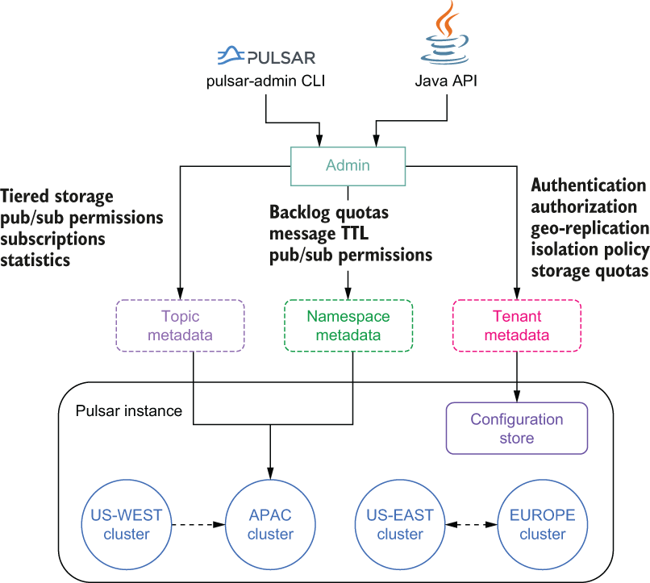
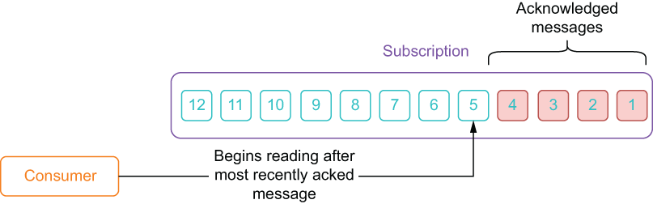
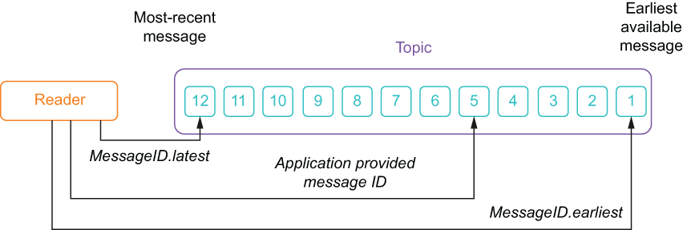

# 与 Pulsar 交互
本章涵盖

- 在你的开发机器上运行 Pulsar 的本地实例
- 使用命令行工具管理 Pulsar 集群
- 使用 Java、Python 和 Go 客户端库与 Pulsar 交互
- 使用命令行工具对 Pulsar 进行故障排除

现在我们已经涵盖了 Apache Pulsar 的整体架构和术语，让我们开始使用它。对于本地开发和测试，我建议在你自己的机器上的 Docker 容器中运行 Pulsar，这提供了一种以最少的时间、精力和金钱开始使用 Pulsar 的简单方法。对于那些更喜欢使用全尺寸 Pulsar 集群的人，你可以参考附录 A，了解有关如何在容器化环境（例如 Kubernetes）中安装和运行集群的更多详细信息。在本章中，我将引导你完成使用 Java API 以编程方式发送和接收消息的过程，首先是使用 Pulsar 的管理工具创建 Pulsar 命名空间和主题的过程。

## 3.1 Pulsar 入门

出于本地开发和测试的目的，你可以在 Docker 容器内的开发机器上运行 Pulsar。如果你还没有安装 Docker，你应该下载社区版 (https://www.docker.com/community-edition) 并按照你的操作系统的说明进行操作。对于那些不熟悉 Docker 的人，它是一个开源项目，用于自动将应用程序部署为可从单个命令运行的可移植、自包含映像。每个 Docker 映像都将运行整个应用程序所需的所有独立软件组件捆绑到一个部署中。例如，一个简单的 Web 应用程序的 Docker 映像将包括 Web 服务器、数据库和应用程序代码——简而言之，就是应用程序运行所需的一切。同样，现有的 Docker 镜像包含一个 Pulsar 代理以及必要的 ZooKeeper 和 BookKeeper 组件。

软件开发人员可以创建 Docker 映像并将它们发布到称为 Docker Hub 的中央存储库。你可以在上传唯一标识它的图像时指定一个标签。这使人们可以快速找到所需版本的映像并将其下载到他们的开发机器上。

要启动 Pulsar Docker 容器，只需执行清单 3.1 中所示的命令，这将下载容器镜像并启动所有必要的组件。请注意，我们指定了一对将在本地计算机上公开的端口（6650 和 8080）。你将在本章后面使用这些端口与 Pulsar 集群交互。

清单 3.1 在桌面上运行 Pulsar

```sh
docker pull apachePulsar/Pulsar-standalone     ❶
 
docker run -d \
  -p 6650:6650 -p 8080:8080 \                  ❷
  -v $PWD/data:/Pulsar/data \                  ❸
  --name Pulsar \                              ❹
 apachePulsar/Pulsar-standalone                ❺
```

❶ 从 DockerHub 下载最新版本。
❷ 为这些端口配置端口转发。
❸ 将数据保留在本地驱动器上。
❹ 指定容器的名称。
❺ 独立图像的标签
如果 Pulsar 已成功启动，你应该能够在 Pulsar 容器的日志文件中找到 INFO 级别的消息，表明消息服务已准备就绪，如下面的清单所示。你可以通过 docker log 命令访问 Docker 日志文件，如果你的容器无法启动，你可以通过该命令找到任何问题。

清单 3.2 验证 Pulsar 集群是否正在运行

```sh
$docker logs Pulsar | grep "messaging service is ready"
 
20:11:45.834 [main] INFO  org.apache.Pulsar.broker.PulsarService - 
➥ messaging service is ready
20:11:45.855 [main] INFO  org.apache.Pulsar.broker.PulsarService - 

➥ messaging service is ready, bootstrap service port = 8080, 
➥ broker url= Pulsar://localhost:6650, cluster=standalone
```

这些日志消息表明 Pulsar 代理已启动并正在运行并接受本地开发机器的端口 6650 上的连接。因此，本章中的所有代码示例都将使用 Pulsar://localhost:6650 URL 从 Pulsar broker 发送和接收数据。

## 3.2 管理 Pulsar

Pulsar 提供了一个单一的管理层，允许你从单个端点管理整个 Pulsar 实例，包括所有子集群。 Pulsar 的管理层控制所有租户的身份验证和授权、资源隔离策略、存储配额等，如图 3.1 所示。



图 3.1 Pulsar 的管理视图

这个管理界面允许你创建和管理 Pulsar 集群中的所有各种实体，例如租户、命名空间和主题，并配置它们的各种安全和数据保留策略。用户可以通过 Pulsar-admin 命令行界面工具或通过 Java API 以编程方式与该管理界面交互，如图 3.1 所示

当你启动本地独立集群时，Pulsar 会自动创建一个名为 default 的命名空间的公共租户，可用于开发目的。但是，这不是一个现实的生产场景，因此我将演示如何创建租户和命名空间。

### 3.2.1 创建租户、命名空间和主题

Pulsar 在 Pulsar 安装的 bin 文件夹中提供了一个名为 Pulsar-admin 的命令行界面 (CLI) 工具，在我们的例子中是在 Docker 容器中。因此，要使用此命令行工具，你必须在正在运行的 Docker 容器内执行该命令。幸运的是，Docker 通过它的 docker exec 命令提供了一种方法来做到这一点。顾名思义，该命令在容器本身内执行给定的语句，而不是在你的本地机器上。你可以通过发出以下清单中显示的命令序列来开始使用 Pulsar-admin CLI，以创建一个名为 persistent://manning/chapter03/example-topic 的主题，我们将在整个章节中使用该主题。

清单 3.3 Pulsar-admin 命令

```sh
docker exec -it Pulsar /Pulsar/bin/Pulsar-admin clusters list                ❶
"standalone"
 
docker exec -it Pulsar /Pulsar/bin/Pulsar-admin tenants list                 ❷
"public"
"sample"
 
docker exec -it Pulsar /Pulsar/bin/Pulsar-admin tenants create manning       ❸
 
docker exec -it Pulsar /Pulsar/bin/Pulsar-admin tenants list                 ❹
"manning"
"public"
"sample"
 
docker exec -it Pulsar /Pulsar/bin/Pulsar-admin namespaces                   ❺
➥ create manning/chapter03  
 
docker exec -it Pulsar /Pulsar/bin/Pulsar-admin namespaces list manning    
"manning/chapter03"                                                          ❻
 
docker exec -it Pulsar /Pulsar/bin/Pulsar-admin topics create 
➥ persistent://manning/chapter03/example-topic                              ❼
 
docker exec -it Pulsar /Pulsar/bin/Pulsar-admin topics list manning/chapter03❽
"persistent://manning/chapter03/example-topic"
```

❶ 列出 Pulsar 实例中的所有集群。
❷ 列出 Pulsar 实例中的所有租户。
❸ 创建一个名为 manning 的新租户。
❹ 确认新租户已创建。
❺ 在 manning 租户下新建一个名为 Chapter03 的命名空间
❻ 列出 manning 租户下的命名空间。
❼ 创建一个新主题。
❽ 列出 manning/chapter03 命名空间内的主题。
这些命令几乎没有触及你可以使用 Pulsar-admin 工具执行的操作，我强烈建议你参考在线文档 (https://Pulsar.apache.org/docs/en/Pulsar-admin) 以获取更多信息CLI 工具及其所有功能的详细信息。在我们发布一些消息后，我们将在本章稍后重新访问 Pulsar-admin CLI 工具，以从集群中检索一些性能指标。

### 3.2.2 Java 管理 API

你可以管理 Pulsar 实例的另一种方式是通过 Java Admin API，它提供了一个用于执行管理任务的可编程接口。清单 3.4 展示了如何使用 Java API 创建 persistent://manning/chapter03/example-topic 主题。此 API 提供了 CLI 工具的替代方案，当你想以编程方式创建和拆除必要的 Pulsar 主题而不是依赖外部工具时，它在单元测试中特别有用。

清单 3.4 使用 Java 管理 API

```java
import org.apache.Pulsar.client.admin.PulsarAdmin;
import org.apache.Pulsar.common.policies.data.TenantInfo;
 
public class CreateTopic {
    public static void main(String[] args) throws Exception {
        PulsarAdmin admin = PulsarAdmin.builder()
          .serviceHttpUrl("http://localhost:8080")                   ❶
          .build();
 
        TenantInfo config = new TenantInfo(
          Stream.of("admin").collect(
         Collectors.toCollection(HashSet::new)),                     ❷
          Stream.of("standalone").collect(
         Collectors.toCollection(HashSet::new)));                    ❸
 
        admin.tenants().createTenant("manning", config);             ❹
        admin.namespaces().createNamespace("manning/chapter03");     ❺
        admin.topics().createNonPartitionedTopic(
        "persistent://manning/chapter03/example-topic");             ❻
    }
}
```

❶ 为在 Docker 中运行的 Pulsar 集群创建一个管理客户端。
❷ 指定租户的管理员角色。
❸ 指定租户可以操作的集群。
❹ 创建租户。
❺ 创建命名空间。
❻ 创建主题。

## 3.3 Pulsar 客户端

Pulsar 提供了一个名为 Pulsar-client 的 CLI 工具，允许你从正在运行的 Pulsar 集群中的主题发送和接收消息。该工具也位于 Pulsar 安装的 bin 文件夹中，因此，我们需要再次使用 docker exec 命令来与该工具交互。

由于主题已经创建，我们可以首先将消费者附加到它，这将建立订阅并确保没有消息丢失。这可以通过运行以下清单中显示的命令来完成。消费者是一个阻塞脚本，这意味着它将继续消费来自主题的消息，直到脚本被你停止（使用 Ctrl+C）。

清单 3.5 启动一个命令行消费者

```sh
$ docker exec -it Pulsar /Pulsar/bin/Pulsar-client consume \
persistent://manning/chapter03/example-topic \             ❶
--num-messages 0 \                                         ❷
--subscription-name example-sub \                          ❸
--subscription-type Exclusive                              ❹
 
INFO  org.apache.Pulsar.client.impl.ConnectionPool - [[id: 0xe410f77d,
➥ L:/127.0.0.1:39276 - R:localhost/127.0.0.1:6650]] Connected to server
18:08:15.819 [Pulsar-client-io-1-1] INFO  
➥ org.apache.Pulsar.client.impl.ConsumerStatsRecorderImpl - Starting Pulsar 
➥ consumer perf with config: {                            ❺
  "topicNames" : [ ],
  "topicsPattern" : null,
  "subscriptionName" : "example-sub",                      ❻
  "subscriptionType" : "Exclusive",                        ❼
  "receiverQueueSize" : 1000,
  "acknowledgementsGroupTimeMicros" : 100000,
  "negativeAckRedeliveryDelayMicros" : 60000000,
  "maxTotalReceiverQueueSizeAcrossPartitions" : 50000,
  "consumerName" : "3d7ce",
  "ackTimeoutMillis" : 0,
  "tickDurationMillis" : 1000,
  "priorityLevel" : 0,
  "cryptoFailureAction" : "FAIL",
  "properties" : { },
  "readCompacted" : false,
  "subscriptionInitialPosition" : "Latest",                ❽
  "patternAutoDiscoveryPeriod" : 1,
  "regexSubscriptionMode" : "PersistentOnly",
  "deadLetterPolicy" : null,
  "autoUpdatePartitions" : true,
  "replicateSubscriptionState" : false,
  "resetIncludeHead" : false
}
...
 
18:08:15.980 [Pulsar-client-io-1-1] INFO  
➥ org.apache.Pulsar.client.impl.MultiTopicsConsumerImpl - 
➥ [persistent://manning/chapter02/example] [example-sub] Success 
➥ subscribe new topic persistent://manning/chapter02/example in topics 
➥ consumer, partitions: 2, allTopicPartitionsNumber: 2
18:08:47.644 [Pulsar-client-io-1-1] INFO  
➥ com.scurrilous.circe.checksum.Crc32cIntChecksum - SSE4.2 CRC32C 
➥ provider initialized
```

❶我们正在消费的主题的名称
❷ 要消费的消息数量； 0 表示永远消耗。
❸ 订阅的唯一名称
❹ 订阅类型
❺ 消费者配置详情
❻ 可以在命令行中看到我们指定的订阅名称。
❼ 可以在命令行看到我们指定的订阅类型。
❽ 从最新的可用消息开始消费。
在不同的 shell 中，我们将通过发出以下清单中显示的命令来启动生产者，将包含文本“Hello Pulsar”的两条消息发送到我们刚刚启动消费者的同一主题。

清单 3.6 使用 Pulsar 命令行生产者发送消息

```sh
$ docker exec -it Pulsar /Pulsar/bin/Pulsar-client produce \
persistent://manning/chapter03/example-topic \               ❶
--num-produce 2 \                                            ❷
--messages "Hello Pulsar"                                    ❸
18:08:47.106 [Pulsar-client-io-1-1] INFO  
➥ org.apache.Pulsar.client.impl.ConnectionPool - [[id: 0xd47ac4ea, 
➥ L:/127.0.0.1:39342 - R:localhost/127.0.0.1:6650]] Connected to server
18:08:47.367 [Pulsar-client-io-1-1] INFO  
➥ org.apache.Pulsar.client.impl.ProducerStatsRecorderImpl - Starting 
➥ Pulsar producer perf with config: {                       ❹
  "topicName" : "persistent://manning/chapter02/example",
  "producerName" : null,
  "sendTimeoutMs" : 30000,
  "blockIfQueueFull" : false,
  "maxPendingMessages" : 1000,
  "maxPendingMessagesAcrossPartitions" : 50000,
  "messageRoutingMode" : "RoundRobinPartition",
  "hashingScheme" : "JavaStringHash",
  "cryptoFailureAction" : "FAIL",
  "batchingMaxPublishDelayMicros" : 1000,
  "batchingMaxMessages" : 1000,
  "batchingEnabled" : true,
  "compressionType" : "NONE",
  "initialSequenceId" : null,
  "autoUpdatePartitions" : true,
  "properties" : { }
}
...
18:08:47.689 [main] INFO  org.apache.Pulsar.client.cli.PulsarClientTool - 2 
➥ messages successfully produced                            ❺
```

❶我们要发布到的主题的名称
❷ 发送消息的次数
❸ 留言内容
❹ 生产者配置详情
❺ 消息的发布
执行清单 3.6 中的生产者命令后，你应该在启动消费者的 shell 中看到类似于以下清单中的代码。这表明消息已由生产者成功发布并被消费者接收。

清单 3.7 在消费者 shell 中接收消息

```sh
----- got message -----
key:[null], properties:[], content:Hello Pulsar
----- got message -----
   key:[null], properties:[], content:Hello Pulsar
```

恭喜，你刚刚使用 Pulsar 成功发送了第一条消息！现在我们已经确认我们的本地 Pulsar 集群正在工作并且能够发送和接收消息，让我们看一些更现实的例子，使用各种编程语言。 Pulsar 提供了一个简单直观的客户端 API，它封装了来自用户的所有代理-客户端通信细节。由于 Pulsar 的流行，该客户端有多种语言特定的实现，包括 Java、Go、Python 和 C++，仅举几例。这允许你组织中的每个团队使用他们喜欢的任何语言来实现他们的服务。

虽然根据你选择的编程语言，官方 Pulsar 客户端库支持的功能存在显着差异（请参阅官方客户端文档了解详细信息），但在幕后，它们都支持透明的重新连接和/或连接故障转移到代理，消息排队直到被代理确认，以及试探法，例如带退避的连接重试。这允许开发人员专注于消息传递逻辑，而不必在他们的应用程序代码中处理连接异常。

### 3.3.1 Pulsar Java 客户端

除了我们在本章前面看到的 Java Admin API，Pulsar 还提供了一个 Java 客户端，可用于创建生产者、消费者和消息阅读器。 Maven 中央存储库中提供了最新版本的 Pulsar Java 客户端库。要使用最新版本，只需将 Pulsar 客户端库添加到你的构建配置中，如下面的清单所示。一旦你将 Pulsar 客户端库添加到你的项目中，你就可以通过在 Java 代码中创建客户端、生产者和消费者来开始使用它与 Pulsar 交互，我们将在下一节中看到。

清单 3.8 将 Pulsar 客户端库添加到你的 Maven 项目中

```java
<!--- Inside your pom.xml -->
<properties>
   <Pulsar.version>2.7.2</Pulsar.version>
</properties>
 
<dependency>
  <groupId>org.apache.Pulsar</groupId>
  <artifactId>Pulsar-client</artifactId>
  <version>${Pulsar.version}</version>
</dependency>
```

JAVA 中的 Pulsar 客户端配置
当应用程序想要创建生产者或消费者时，你首先需要实例化 PulsarClient 对象，使用如下清单所示的代码。在此对象中，你将提供 Pulsar 代理的 URL 以及可能需要的任何其他连接配置信息，例如安全凭证。

清单 3.9 在 Java 中创建一个 PulsarClient

```java
PulsarClient client = PulsarClient.builder()
        .serviceUrl("Pulsar://localhost:6650")      ❶
        .build();
```

❶ Pulsar broker 的连接 URL
PulsarClient 对象处理创建到 Pulsar broker 的连接所涉及的所有低级细节，包括自动重试和连接安全（如果 Pulsar broker 配置了 TLS）。客户端实例是线程安全的，可以重用于创建和管理多个生产者和消费者。

#### Pulsar中的生产者

在 Pulsar 中，生产者用于向主题写入消息。清单 3.10 展示了如何通过指定要向其发送消息的主题的名称在 Java 中创建生产者。虽然在创建生产者时可以使用多种配置设置，但所需的只是主题名称本身。

清单 3.10 用 Java 创建一个 Pulsar 生产者

```java
Producer<byte[]> producer = client.newProducer()
        .topic("persistent://manning/chapter03/example-topic")
        .create();
```

也可以将元数据附加到给定的消息，如清单 3.11 所示，它显示了如何指定用于通过密钥共享订阅进行路由的消息密钥，以及一些消息属性。此功能可用于用有用的信息标记消息，例如消息的发送时间、消息发送者、设备 ID（如果消息来自嵌入式传感器）以及其他信息。

清单 3.11 在 Pulsar 消息中指定元数据

```java
Producer<byte[]> producer = client.newProducer()
        .topic("persistent://manning/chapter03/example-topic")
        .create();
 
producer.newMessage()
    .key("tempurture-readings")                      ❶
    .value("98.0".getBytes())                        ❷
    .property("deviceID", "1234")                    ❸
    .property("timestamp", "08/03/2021 14:48:24.1")
    .send();
```

❶ 你可以指定消息键。
❷ 将消息内容作为字节数组发送。
❸ 你可以附加任意数量的属性。
你附加到消息的元数据值将可供消息使用者使用，然后他们可以在执行其处理逻辑时使用该信息。例如，包含表示消息发送时间的时间戳值的属性可用于将传入消息按发生的时间顺序排序或将其与来自另一个主题的消息相关联。

#### Pulsar中消费者

在 Pulsar 中，消费者接口用于侦听特定主题并处理传入的消息。成功处理消息后，应将确认发送回代理以指示我们已完成订阅中的消息处理。这允许代理知道主题中的哪条消息需要传递给订阅的下一个消费者。在 Java 中，你可以通过指定主题和订阅来创建使用者，如下面的清单所示。

清单 3.12 用 Java 创建一个 Pulsar 消费者

```java
Consumer consumer = client.newConsumer()
    .topic("persistent://manning/chapter03/example-topic")    ❶
    .subscriptionName("my-subscription")                      ❷
    .subscribe();
```

❶ 指定你要从中消费的主题。
❷ 你必须指定订阅的唯一名称。
subscribe 方法将尝试使用指定的订阅将消费者连接到主题，如果订阅已经存在并且不是共享订阅类型之一（例如，你尝试连接到已经有订阅的独占订阅），这可能会失败活跃的消费者）。如果你是第一次使用指定的订阅名称连接到主题，则会自动为你创建一个订阅。每当创建新订阅时，它最初默认位于主题的末尾，该订阅上的消费者将开始读取订阅创建后创建的第一条消息。如果你连接到预先存在的订阅，它将从订阅中最早的未确认消息开始读取，如图 3.2 所示。这可确保在你的消费者意外与主题断开连接的情况下，你可以从上次中断的地方继续。



图 3.2 消费者在订阅中最近确认的消息后立即开始阅读消息。如果订阅是新订阅，则它开始读取订阅创建后添加到主题的消息。

一种常见的消费模式是让消费者在 while 循环内收听主题。在清单 3.13 中，消费者不断地监听消息，打印接收到的任何消息的内容，然后确认消息已被处理。如果处理逻辑失败，我们使用否定确认在稍后的时间点重新传递消息。

清单 3.13 在 Java 中使用 Pulsar 消息

```java
while (true) {
  // Wait for a message
  Message msg = consumer.receive();                   ❶
 
  try {
      System.out.println("Message received: " + 
                         new String(msg.getData()));  ❷
      consumer.acknowledge(msg);                      ❸
  } catch (Exception e) {
      consumer.negativeAcknowledge(msg);              ❹
  }
}
```

❶ 等待消息。
❷ 处理消息。
❸ 确认消息，以便代理可以将其删除。
❹ 标记要重新发送的邮件。
清单 3.13 中显示的消息使用者以同步方式处理消息，因为它用来检索消息的 receive() 方法是一种阻塞方法（即，它无限期地等待新消息的到达）。虽然这对于消息量较低的某些用例可能没问题，或者我们不关心消息发布和处理之间的延迟，但通常同步处理不是最好的方法。更好的方法是以异步方式处理这些消息，这依赖于 Java API 提供的 MessageListener 接口，如下面的清单所示。

清单 3.14 Java 中的异步消息处理

```java
package com.manning.Pulsar.chapter3.consumers;
  
import java.util.stream.IntStream;
        
import org.apache.Pulsar.client.api.ConsumerBuilder;
import org.apache.Pulsar.client.api.PulsarClient;
import org.apache.Pulsar.client.api.PulsarClientException;
import org.apache.Pulsar.client.api.SubscriptionType;
  
public class MessageListenerExample {
  
public static void main() throws PulsarClientException {
 
  PulsarClient client = PulsarClient.builder()              ❶
        .serviceUrl(Pulsar_SERVICE_URL)
        .build();
  
  ConsumerBuilder<byte[]> consumerBuilder =                 ❷
     client.newConsumer()
        .topic(MY_TOPIC)
        .subscriptionName(SUBSCRIPTION)
        .subscriptionType(SubscriptionType.Shared)
        .messageListener((consumer, msg) -> {               ❸
           try {
            System.out.println("Message received: " +  
                 new String(msg.getData()));
             consumer.acknowledge(msg);
          } catch (PulsarClientException e) {
            
          }
    })
 
  IntStream.range(0, 4).forEach(i -> {                      ❹
    String name = String.format("mq-consumer-%d", i);
    try {
       consumerBuilder
        .consumerName(name)
        .subscribe();                                       ❺
   } catch (PulsarClientException e) {
     e.printStackTrace();
   }
 });
  
  ...
  }
}
```

❶ 用于连接 Pulsar 的 Pulsar 客户端
❷ 消费者工厂，稍后将用于创建消费者实例
❸ 收到消息时执行的业务逻辑
❹ 在该主题上创建五个消费者，每个消费者都具有相同的 MessageListener 实现。
❺ 将消费者连接到主题开始接收消息
当使用 MessageListener 接口时，如清单 3.14 所示，你传入想要在收到消息时执行的代码。在本例中，我使用 Java Lambda 提供内联代码，你可以看到我仍然可以访问消费者，我可以使用它来确认消息。使用侦听器模式允许你将业务逻辑与线程管理分开，因为 Pulsar 使用者会自动创建一个线程池来运行 MessageListeners 实例并为你处理所有线程逻辑。综上所述，我们在下面的清单中有一个 Java 程序，它实例化了一个 Pulsar 客户端，并使用它来创建一个生产者和一个消费者，通过 my-topic 主题交换消息。

清单 3.15 Endless Pulsar 生产者和消费者对

```java
import org.apache.Pulsar.client.api.Consumer;
import org.apache.Pulsar.client.api.Message;
import org.apache.Pulsar.client.api.Producer;
import org.apache.Pulsar.client.api.PulsarClient;
import org.apache.Pulsar.client.api.PulsarClientException;
 
public class BackAndForth {
 
  public static void main(String[] args) throws Exception {
    BackAndForth sl = new BackAndForth();
    sl.startConsumer();
    sl.startProducer();
  }
  private String serviceUrl = "Pulsar://localhost:6650";
  String topic = "persistent://manning/chapter03/example-topic";;
  String subscriptionName = "my-sub";
 
  protected void startProducer() {
      Runnable run = () -> {
        int counter = 0;
        while (true) {
          try {
           getProducer().newMessage()
              .value(String.format("{id: %d, time: %tc}", 
               ++counter, new Date()).getBytes())     
              .send();
            Thread.sleep(1000);
          } catch (final Exception ex) { }
        }};
      new Thread(run).start();
  }
 
  protected void startConsumer() {
    Runnable run = () -> {
      while (true) {
        Message<byte[]> msg = null;  
        try {
          msg = getConsumer().receive();    
          System.out.printf("Message received: %s \n",
          new String(msg.getData()));
       getConsumer().acknowledge(msg);    
    } catch (Exception e) {
      System.err.printf(
        "Unable to consume message: %s \n", e.getMessage()); 
      consumer.negativeAcknowledge(msg);
    }
   }};
   new Thread(run).start();
 }
 
 protected Consumer<byte[]> getConsumer() throws PulsarClientException {
   if (consumer == null) {
      consumer = getClient().newConsumer()
          .topic(topic)
          .subscriptionName(subscriptionName) 
          .subscriptionType(SubscriptionType.Shared)
          .subscribe();
   }
   return consumer;
 }
 
 protected Producer<byte[]> getProducer() throws PulsarClientException {
    if (producer == null) {
      producer = getClient().newProducer()
        .topic(topic).create();
    }
    return producer;
 }
 
 protected PulsarClient getClient() throws PulsarClientException {
    if (client == null) {
      client = PulsarClient.builder()
       .serviceUrl(serviceUrl)   
       .build();
    }
    return client;
  }
}
```

如你所见，此代码在同一主题上创建了生产者和消费者，并在不同的线程中同时运行它们。如果你运行此代码，你应该会看到类似于以下清单的输出。

清单 3.16 Endless Pulsar 生产者和消费者对输出

```java
Message received: {id: 1, time: Sun Sep 06 16:24:04 PDT 2020} 
Message received: {id: 2, time: Sun Sep 06 16:24:05 PDT 2020} 
Message received: {id: 3, time: Sun Sep 06 16:24:06 PDT 2020} 
...
```

请注意我们之前发送的前两条消息如何没有包含在输出中，因为订阅是在这些消息发布后创建的。这与 Reader 界面形成了直接对比，我们将很快对其进行研究。

#### 死信政策

虽然在线文档 (https://Pulsar.apache.org/docs/en/client-libraries-java/#configure-consumer) 中描述了 Pulsar 消费者的几个配置选项，但我想强调死者-letter-policy 配置，当你遇到无法成功处理的消息时很有用，例如当你解析来自主题的非结构化消息时。在正常处理条件下，这些消息会导致抛出异常。

在这一点上，你有几个选择；第一个是捕获任何异常，并简单地确认这些消息已成功处理，从而有效地忽略它们。另一种选择是通过否定承认它们来重新交付它们。但是，如果无法解决消息的潜在问题（例如，无论处理多少次，都无法解析的消息将始终引发异常），则此方法可能会导致这些消息的无限重新传递循环。第三种选择是将这些有问题的消息路由到一个单独的主题，称为死信主题。这使你可以避免无限的重新传递循环，同时保留消息以供以后进一步处理和/或检查。

清单 3.17 在消费者上配置死信主题策略

```java
Consumer consumer = client.newConsumer()
    .topic("persistent://manning/chapter03/example-topic")
    .subscriptionName("my-subscription")
    .deadLetterPolicy(DeadLetterPolicy.builder()
       .maxRedeliverCount(10)                                       ❶
       .deadLetterTopic("persistent://manning/chapter03/my-dlq”))   ❷
    .subscribe();
```


❶ 设置最大再投递次数。
❷ 设置死信主题名称。
要为特定消费者配置死信策略，Pulsar 要求你在第一次构建时指定一些属性，例如最大重新交付计数，如清单 3.17 所示。当消息超过用户指定的最大重新传递计数时，它将被发送到死信主题并自动确认。然后可以在稍后的时间点检查这些消息。

#### Java 中的Pulsar读取器
阅读器接口允许应用程序管理它们将消费消息的位置。当你使用阅读器连接到主题时，你必须指定阅读器在连接到主题时将开始使用哪条消息。简而言之，阅读器接口为 Pulsar 客户端提供了一个低级抽象，允许他们在主题中手动定位自己，如图 3.3 所示。



图 3.3 连接到主题时，阅读器界面使你可以从最早的可用消息、最新的可用消息或应用程序提供的消息 ID 开始。

阅读器接口对于使用 Pulsar 为流处理系统提供有效的一次性处理语义等用例很有帮助。对于这个用例，流处理系统必须能够将主题倒回到特定消息并开始阅读。如果你选择显式提供消息 ID，你的应用程序将负责提前知道此消息 ID，可能是从持久数据存储或缓存中获取它。一旦你实例化了一个 PulsarClient 对象，你就可以创建一个 Reader，如下面的清单所示。

清单 3.18 创建一个 Pulsar 阅读器

```java
Reader<byte[]> reader = client.newReader()
    .topic("persistent://manning/chapter03/example-topic")     ❶
    .readerName("my-reader")
    .startMessageId(MessageId.earliest)                        ❷
    .create();
 
while (true) {
  Message msg = reader.readNext();
  System.out.printf("Message received: %s \n", new String(msg.getData()));
}
```

❶ 指定要阅读的主题。
❷ 指定我们要从最早的消息中读取。
如果你运行此代码，你应该会看到类似于以下清单的输出。你将从发布到主题的第一条消息开始阅读，即我们从 CLI 工具发送的两条“Hello Pulsar”消息。

清单 3.19 最早的消息阅读器输出

```java
Message read: Hello Pulsar 
Message read: Hello Pulsar 
Message read: {id: 1, time: Sun Sep 06 18:11:59 PDT 2020} 
Message read: {id: 2, time: Sun Sep 06 18:12:00 PDT 2020} 
Message read: {id: 3, time: Sun Sep 06 18:12:01 PDT 2020} 
Message read: {id: 4, time: Sun Sep 06 18:12:02 PDT 2020} 
Message read: {id: 5, time: Sun Sep 06 18:12:04 PDT 2020} 
Message read: {id: 6, time: Sun Sep 06 18:12:05 PDT 2020} 
Message read: {id: 7, time: Sun Sep 06 18:12:06 PDT 2020}
```

在清单 3.18 所示的示例中，在指定的主题上创建了一个阅读器，并从主题中最旧的消息开始迭代主题中的每条消息。在线文档 (https://Pulsar.apache.org/docs/en/client-libraries-java/#reader) 中描述了 Pulsar 阅读器的几个配置选项，但在大多数情况下，默认选项就足够了.

### 3.3.2 Pulsar Python 客户端

还有一个官方支持的 Python 编程语言的 Pulsar 客户端。最新版本的 Pulsar 客户端库可以使用 pip 包管理器和以下清单中显示的命令轻松安装。

清单 3.20 用 Python 创建一个 Pulsar 生产者

```python
pip3 install Pulsar-client==2.6.3 -user    ❶
 
pip3 list                                  ❷
 
Package       Version
------------- ---------
...
Pulsar-client 2.6.3                        ❸
```

❶ 安装 Pulsar 客户端。
❷ 列出所有包。
❸ 确认已安装正确版本的 Pulsar 客户端。
由于 Python 2.7 已经过了它的正式生命周期，我决定在本章的所有示例中使用 Python 3。安装 Pulsar 客户端库后，你可以通过在 Python 代码中创建生产者和消费者来开始使用它们与 Pulsar 交互。

#### Python 中的Pulsar生产者
当 Python 应用程序想要创建生产者或消费者时，你首先需要实例化一个客户端对象，使用类似于清单 3.21 所示的代码，其中提供 Pulsar 代理的 URL。与基于 Java 的客户端一样，Python 客户端对象处理创建到 Pulsar 代理的连接所涉及的所有低级细节，包括自动重试和连接安全（如果 Pulsar 代理配置了 TLS）。客户端实例是线程安全的，可以重用于管理多个生产者和消费者。

清单 3.21 用 Python 创建一个 Pulsar 生产者

```python
import Pulsar
 
client = Pulsar.Client('Pulsar://localhost:6650')      ❶
 
producer = client.create_producer(
   'persistent://public/default/my-topic',
   block_if_queue_full=True,
   batching_enabled=True,
   batching_max_publish_delay_ms=10)                   ❷
 
for i in range(10):
    producer.send(('Hello-%d' % i).encode('utf-8'),    ❸
       properties=None)                                ❹
 
client.close()                                         ❺
```

❶ 通过提供 Pulsar 代理的连接 URL 来创建 Pulsar 客户端。
❷ 使用 Pulsar 客户端创建生产者。
❸ 发送消息内容。
❹ 如果需要，你可以将属性附加到消息中。
❺ 关闭客户端。
从清单 3.21 中可以看出，Python 库在你创建客户端、生产者和消费者时提供了几种不同的配置选项，因此你应该查看可用的在线文档 (https://Pulsar.apache.org/api/python/2.8.0-SNAPSHOT/) 用于 Python 客户端以了解有关这些选项的更多信息。在我们的例子中，我们在客户端启用了消息批处理，这意味着，不是向代理发送/从代理接收每个单独的消息，而是在传输之前将消息分批组合在一起。这使我们能够以增加每个单独消息的延迟为代价来增加消息的整体吞吐量。

#### Python 中的 Pulsar 消费者

在 Pulsar 中，消费者接口用于侦听特定主题并处理传入的消息。成功处理消息后，应将确认发送回代理以指示我们已完成订阅中的消息处理。这允许代理知道主题中的哪条消息需要传递给订阅的下一个消费者。在 Python 中，你可以通过指定主题和订阅来创建使用者，如下面的清单所示。

清单 3.22 在 Python 中创建一个 Pulsar 消费者

```python
import Pulsar
 
def my_listener(consumer, msg):                         ❶
    # process message
    print("my_listener read message '%s' id='%s'", 
      msg.data().decode('utf-8'), msg.message_id())     ❷
    consumer.acknowledge(msg)                           ❸
    
client = Pulsar.Client('Pulsar://localhost:6650')   
 
consumer = client.subscribe(
    'persistent://public/default/my-topic', 
    'my-subscription',
    consumer_type=Pulsar.ConsumerType.Exclusive,
    initial_position=Pulsar.InitialPosition.Latest,
    message_listener=my_listener,                       ❹
    negative_ack_redelivery_delay_ms=60000)
 
  client.close()
```

❶ 通过提供 Pulsar 代理的连接 URL 来创建 Pulsar 客户端。
❷ 使用 Pulsar 客户端创建消费者。
❸ 你必须指定要从中消费的主题。
❹ 你必须指定订阅的唯一名称。
❺ 等待新消息到达。
❻ 一旦我们成功处理了消息，就确认它。
❼ 如果我们遇到错误，请发送否定确认以重新发送消息。
❽ 关闭客户端。
subscribe 方法将尝试使用指定的订阅将消费者连接到主题，如果订阅已经存在并且它不是共享订阅类型之一（例如，你尝试连接到已经有的独占订阅），则可能会失败一个活跃的消费者）。如果你是第一次使用指定的订阅名称连接到主题，则会自动为你创建一个订阅。每当创建新订阅时，它最初默认位于主题的末尾，该订阅上的消费者将开始读取订阅创建后创建的第一条消息。如果你连接到预先存在的订阅，它将从订阅中最早的未确认消息开始读取，正如我们在前面的图 3.2 中看到的那样。

如清单 3.22 所示，Python 库在指定订阅时提供了几个不同的配置选项，包括订阅类型、起始位置等。我强烈建议你查看 Python 客户端的可用在线文档 (https://Pulsar.apache.org/api/python/2.8.0-SNAPSHOT/)，以查看这些选项的最新列表。

清单 3.22 中显示的消息使用者以同步方式处理消息，因为它用来检索消息的 receive() 方法是一种阻塞方法（例如，它无限期地等待新消息的到达）。更好的方法是以异步方式处理这些消息，如清单 3.23 所示。使用侦听器模式可以让你将业务逻辑与线程管理分开，因为 Pulsar 消费者会自动创建一个线程池来运行消息侦听器实例并为你处理所有线程逻辑。

清单 3.23 Python 中的异步消息处理

```python
import Pulsar
 
def my_listener(consumer, msg):                         ❶
    # process message
    print("my_listener read message '%s' id='%s'", 
      msg.data().decode('utf-8'), msg.message_id())     ❷
    consumer.acknowledge(msg)                           ❸
    
client = Pulsar.Client('Pulsar://localhost:6650')   
 
consumer = client.subscribe(
    'persistent://public/default/my-topic', 
    'my-subscription',
    consumer_type=Pulsar.ConsumerType.Exclusive,
    initial_position=Pulsar.InitialPosition.Latest,
    message_listener=my_listener,                       ❹
    negative_ack_redelivery_delay_ms=60000)
 
  client.close()
```

❶ 监听器函数需要接受消费者和消息。
❷ 我们可以访问消息内容。
❸ 我们可以使用消费者来确认消息。
❹ 为消费者设置一个消息监听器
Python 中的Pulsar读取器
Python 客户端还提供了一个阅读器接口，使消费者能够管理他们将消费消息的位置。当你使用阅读器连接到主题时，你必须指定阅读器在连接到主题时将开始使用哪条消息。如果你选择显式提供消息 ID，那么你的应用程序将负责提前知道此消息 ID，并将该信息存储在持久数据存储中的某个位置，例如数据库或缓存。以下清单中显示的代码连接到主题，从最早的可用消息开始读取消息，并输出它们的内容。

清单 3.24 用 Python 创建一个 Pulsar 阅读器

```python
import Pulsar
 
client = Pulsar.Client('Pulsar://localhost:6650')    ❶
 
reader = client.create_reader(
   'persistent://public/default/my-topic',           ❷
    Pulsar.MessageId.earliest)                       ❸
 
while True:
    msg = reader.read_next()                         ❹
    print("Read message '%s' id='%s'", 
      msg.data().decode('utf-8'), msg.message_id())
        
 
client.close()                                       ❺
```

❶ 通过提供 Pulsar 代理的连接 URL 来创建 Pulsar 客户端。
❷ 使用 Pulsar 客户端创建指定主题的阅读器。
❸ 指定我们要从最早的消息中读取。
❹ 阅读留言。
❺ 关闭客户端。

### 3.3.3 Pulsar Go 客户端
Golang编程语言也有官方支持的Pulsar客户端，可以使用以下命令安装最新版本的Pulsar客户端库：go get -u "github.com/apache/Pulsar-client-go/Pulsar" .安装 Pulsar 客户端库后，你可以通过在 Go 代码中创建生产者和消费者来开始使用它们与 Pulsar 交互。

#### 使用 GO 创建 Pulsar 客户端

当 Go 应用程序想要创建生产者或消费者时，你首先需要实例化一个客户端对象，使用类似于以下清单的代码。在此代码中，你将提供 Pulsar 代理的 URL 以及可能需要的任何其他连接配置信息，例如安全凭证。

清单 3.25 在 Go 中创建一个 Pulsar 客户端

```go
import (
    "log"
    "time"
    "github.com/apache/Pulsar-client-go/Pulsar"      ❶
)
 
func main() {
    client, err := Pulsar.NewClient(                 ❷
    Pulsar.ClientOptions{                            ❸
        URL:               "Pulsar://localhost:6650",
        OperationTimeout:  30 * time.Second,
        ConnectionTimeout: 30 * time.Second,
    })
 
    if err != nil {                                  ❹
        log.Fatalf("Could not instantiate Pulsar client: %v", err)
    }
 
    defer client.Close()
}
```

❶ 导入 Pulsar 客户端库。
❷ 使用指定的客户端选项创建一个新客户端。
❸ 客户端选项，包括代理 URL、连接超时等。
❹ 检查客户端是否能够连接。
客户端对象处理创建到 Pulsar 代理的连接所涉及的所有低级细节，包括自动重试和连接安全（如果 Pulsar 代理配置了 TLS）。客户端实例是线程安全的，可以重用于创建和管理多个生产者和消费者。创建客户端后，你可以使用它来创建生产者、消费者和读者。

#### GO中的Pulsar生产者

从清单 3.26 中可以看出，在创建了客户端对象之后，你可以使用它为你选择的任何主题创建生产者。虽然在线文档 (https://pkg.go.dev/github.com/apache/Pulsar-client-go/Pulsar#ConsumerOptions) 中描述了 Pulsar 生产者的几个配置选项，但我想突出显示延迟消息我们在这个例子中使用的交付配置，它允许我们将消息交付给主题消费者指定的时间量。

清单 3.26 在 Go 中创建一个 Pulsar producer

```go
import (
    "context"
    "fmt"
    "log"
    "time"
 
    "github.com/apache/Pulsar-client-go/Pulsar"       ❶
)
 
func main() {
  ...                                                 ❷
  producer, err := client.CreateProducer(Pulsar.ProducerOptions{
    Topic: topicName,                                 ❸
  })
 
  ctx := context.Background()
  deliveryTime := (time.Minute * time.Duration(1)) + 
       (time.Second * time.Duration(30))              ❹
 
  for i := 0; i < 3; i++ {
    msg := Pulsar.ProducerMessage{                    ❺
            Payload: []byte(fmt.Sprintf("Delayed-messageId-%d", i)),
            Key: "message-key",
            Properties: map[string]string{            ❻
             "delayed": "90sec",
            },
               EventTime: time.Now(),                 ❼
            DeliverAfter: deliveryTime,               ❽
           }
 
    messageID, err := producer.Send(ctx, &msg)        ❾
    ... 
  }
}
```

❶ 导入 Pulsar 客户端库。
❷ 创建 Pulsar 客户端的代码
❸ 为指定的主题创建一个新的生产者。
❹ 计算你想要的消息传递时间。
❺ 创建要发送的消息。
❻ Go 客户端支持提供键和属性元数据。
❼ 提供事件时间戳元数据。
❽ 指定消息的传送时间。
❾ 发送消息。
如果你不希望立即处理消息，而是希望在将来的某个时间点进行处理，则延迟消息传递非常有用。假设你收到多条消息，其中包含对贵公司时事通讯的新订阅，其中包含每日特价和促销活动。你不想立即向这些客户发送前一天的传单，而是要等到新版本可用。因此，如果你的营销团队承诺每天早上 9 点提供最新版本的时事通讯，你可以将消息传递延迟到上午 9 点之后，以确保客户获得最新版本的时事通讯。

#### Pulsar消费者

正如我们所见，消费者接口用于侦听特定主题并处理传入的消息。成功处理消息后，应将确认发送回代理以指示我们已完成订阅中的消息处理。这允许代理知道主题中的哪条消息需要传递给订阅的下一个消费者。在 Go 中，你可以通过指定主题和订阅来创建消费者，如清单 3.27 所示。

清单 3.27 中显示的消息使用者以同步方式处理消息，因为它用来检索消息的 receive() 方法是一种阻塞方法（例如，它无限期地等待新消息的到达）。与我讨论的前两个客户端库不同，Go 客户端当前不支持使用消息侦听器模式的异步消息消费。因此，如果要执行异步处理，则需要自己编写所有线程逻辑。

清单 3.27 在 Go 中创建一个 Pulsar 消费者

```go
import (
    "context"
    "fmt"
    "log"
    "time"
 
    "github.com/apache/Pulsar-client-go/Pulsar"               ❶
)
 
func main() {
  ...                                                         ❷
 
  consumer, err := client.Subscribe(Pulsar.ConsumerOptions{   ❸
    Topic:            topicName,
    SubscriptionName: subscriptionName,
  })
 
  if err != nil {
    log.Fatal(err)
  }
 
  for {
    msg, err := consumer.Receive(ontext.Background())         ❹
    if err != nil {
        log.Fatal(err)
       consumer.Nack(msg)                                     ❺
    } else {
      fmt.Printf("Received message : %v\n", string(msg.Payload()))
    }
 
    consumer.Ack(msg)                                         ❻
  }
}
```

❶ 导入 Pulsar 客户端库。
❷ 创建 Pulsar 客户端的代码
❸ 为指定的主题创建一个新的消费者。
❹ 阻止呼叫接收传入消息
❺ 发送否定确认以重新发送消息。
❻ 确认消息，以便将其标记为已处理。
subscribe 方法将尝试使用指定的订阅将消费者连接到主题，如果订阅已经存在，这可能会失败，并且它不是共享订阅类型之一（例如，你尝试连接到已经存在的独占订阅）有一个活跃的消费者）。如果你是第一次使用指定的订阅名称连接到主题，则会自动为你创建一个订阅。每当创建新订阅时，它最初默认位于主题的末尾，该订阅上的消费者将开始读取订阅创建后创建的第一条消息。如果你连接到预先存在的订阅，它将从订阅中最早的未确认消息开始读取，正如我们在前面的图 3.2 中看到的那样。

从清单 3.27 中可以看出，Go 库在指定订阅时提供了几个不同的配置选项，包括订阅类型、起始位置等。我强烈建议你查看 Go 客户端可用的在线文档 (https://pkg.go.dev/github.com/apache/Pulsar-client-go/Pulsar) 以查看这些文档的最新列表选项。

#### Pulsar阅读器

Go 客户端还提供了一个阅读器接口，使消费者能够管理他们将消费消息的位置。当你使用阅读器连接到主题时，你必须指定阅读器在连接到主题时将开始使用哪条消息。如果你选择显式提供消息 ID，那么你的应用程序将负责提前知道此消息 ID，并将该信息存储在某个地方的持久数据存储中，例如在数据库或缓存中。以下清单中显示的代码连接到主题，从最早的可用消息开始读取消息，并输出它们的内容。

清单 3.28 在 Go 中创建一个 Pulsar 阅读器

```go
import (
    "context"
    "fmt"
    "log"
    "time"
 
    "github.com/apache/Pulsar-client-go/Pulsar"              ❶
)
 
func main() {
  ...                                                        ❷
 
  reader, err := client.CreateReader(Pulsar.ReaderOptions{   ❸
    Topic:          topicName,
    StartMessageID: Pulsar.EarliestMessageID(),              ❹
  })
 
  for {
    msg, err := reader.Next(context.Background())            ❺
    if err != nil {
      log.Fatal(err)
    } else {
      fmt.Printf("Received message : %v\n", string(msg.Payload()))
    }
  }
}
```

❶ 导入 Pulsar 客户端库。
❷ 创建 Pulsar 客户端的代码
❸ 为指定的主题创建一个新的阅读器。
❹ 从可用的最早消息开始。
❺ 阅读下一条信息。

## 3.4 高级管理

从生产者或消费者的角度来看，Pulsar 就像一个黑匣子（即，你只需连接到集群即可发送和接收消息）。虽然对最终用户隐藏实现细节是件好事，但当你需要解决消息传递本身的问题时，这可能会出现问题。例如，如果你的消费者没有收到任何消息，你将如何诊断问题？幸运的是，Pulsar-admin CLI 工具提供了一些工具，可以让你更深入地了解 Pulsar 集群的内部工作原理。

### 3.4.1 持久话题指标

在内部，Pulsar 收集了很多主题级别的指标，可以帮助你诊断和解决生产者和消费者之间的问题，例如你的消费者没有收到任何消息，或者消费者无法跟上你的生产者的步伐时的背压，这些都会反映在未确认的消息数量不断增加。你可以从我们之前使用的 Pulsar-admin CLI 工具访问这些主题统计信息，通过发出以下清单中显示的命令来创建租户、命名空间和主题。

清单 3.29 从命令行检索 Pulsar 主题统计信息

```sh
$docker exec -it Pulsar /Pulsar/bin/Pulsar-admin topics stats  
➥ persistent://manning/chapter03/example-topic                   ❶
{
  "msgRateIn" : 137.49506548471038,                               ❷
  "msgThroughputIn" : 13741.401370605108,                         ❸
  "msgRateOut" : 97.63210798236112,                               ❹
  "msgThroughputOut" : 9716.05449008063,                          ❺
  "bytesInCounter" : 1162174,
  "msgInCounter" : 11538,                                         ❻
  "bytesOutCounter" : 150009,
  "msgOutCounter" : 1500,                                         ❼
  "averageMsgSize" : 99.94105113636364,
  "msgChunkPublished" : false,
  "storageSize" : 1161944,                                        ❽
  "backlogSize" : 1161279,
  "publishers" : [ {
    "msgRateIn" : 137.49506548471038,                             ❾
    "msgThroughputIn" : 13741.401370605108,
    "averageMsgSize" : 99.0,
    "chunkedMessageRate" : 0.0,
    "producerId" : 0,
    "metadata" : { },
    "producerName" : "standalone-12-6",
    "connectedSince" : "2020-09-07T20:44:45.514Z",                ❿
    "clientVersion" : "2.6.1",
    "address" : "/172.17.0.1:40158"                               ⓫
  } ],
  "subscriptions" : {                                             ⓬
    "my-sub" : {
      "msgRateOut" : 97.63210798236112,                           ⓭
      "msgThroughputOut" : 9716.05449008063,
      "bytesOutCounter" : 150009,
      "msgOutCounter" : 1500,                                     ⓮
      "msgRateRedeliver" : 0.0,
      "chuckedMessageRate" : 0,
      "msgBacklog" : 9458,                                        ⓯
      "msgBacklogNoDelayed" : 9458,
      "blockedSubscriptionOnUnackedMsgs" : false,
      "msgDelayed" : 0,
      "unackedMessages" : 923,                                    ⓰
      "type" : "Shared",
      "msgRateExpired" : 0.0,
      "lastExpireTimestamp" : 0,
      "lastConsumedFlowTimestamp" : 1599511537220,
      "lastConsumedTimestamp" : 1599511537452,                    ⓱
      "lastAckedTimestamp" : 1599511545269,                       ⓲
      "consumers" : [ {
        "msgRateOut" : 97.63210798236112,
        "msgThroughputOut" : 9716.05449008063,
        "bytesOutCounter" : 150009,
        "msgOutCounter" : 1500,
        "msgRateRedeliver" : 0.0,
        "chuckedMessageRate" : 0.0,
        "consumerName" : "5bf2b",
        "availablePermits" : 0,
        "unackedMessages" : 923,
        "avgMessagesPerEntry" : 6,
        "blockedConsumerOnUnackedMsgs" : false,                   ⓲
        "lastAckedTimestamp" : 1599511545269,
        "lastConsumedTimestamp" : 1599511537452,
        "metadata" : { },
        "connectedSince" : "2020-09-07T20:44:45.512Z",
        "clientVersion" : "2.6.1",
        "address" : "/172.17.0.1:40160"                           ⓴
      } ],
      "isDurable" : true,
      "isReplicated" : false
    },
    "example-sub" : {
      "msgRateOut" : 0.0,                                         ⓵
      "msgThroughputOut" : 0.0,
      "bytesOutCounter" : 0,
      "msgOutCounter" : 0,
      "msgRateRedeliver" : 0.0,
      "chuckedMessageRate" : 0,
      "msgBacklog" : 11528,                                       ⓶
      "msgBacklogNoDelayed" : 11528,
      "blockedSubscriptionOnUnackedMsgs" : false,
      "msgDelayed" : 0,
      "unackedMessages" : 0,
      "type" : "Exclusive",
      "msgRateExpired" : 0.0,
      "lastExpireTimestamp" : 0,
      "lastConsumedFlowTimestamp" : 1599509925751,
      "lastConsumedTimestamp" : 0,
      "lastAckedTimestamp" : 0,
      "consumers" : [ ],
      "isDurable" : true,
      "isReplicated" : false
    }
  },
  "replication" : { },
  "deduplicationStatus" : "Disabled"
}
```

❶我们想要统计的主题的名称
❷ 所有本地和复制发布者的每秒消息速率之和
❸ 所有本地和复制发布者的速率之和，以每秒字节数为单位
❹ 所有本地和复制消费者的每秒消息调度率之和
❺ 所有本地和复制消费者的分派率之和，以每秒字节数为单位
❻ 发布到该主题的消息总数
❼ 从主题消费的消息总数
❽ 用于存储主题消息的磁盘空间总量（以字节为单位）
❾ 发布者每秒发布消息的总速率
❿ 发布者第一次连接到主题的时间戳
⓫ 生产者的IP地址
⓬ 该主题的所有订阅列表
⓭ 在此订阅上传递的消息总速率（以每秒字节数为单位）
⓮ 在此订阅上传递的消息总数
⓯ 订阅 backlog 中尚未发送的消息数
⓰ 已投递但尚未确认的消息数
⓱ 在此订阅上消费最后一条消息的时间戳
⓲ 在此订阅上收到最后一条消息确认的时间戳
⓲ 消费者是否因未确认消息过多而被阻塞
⓴ 消费者的IP地址
⓵ 表示没有任何活跃消费者的订阅
⓶ 订阅积压中的消息数
如你所见，Pulsar 为每个持久主题收集了一组广泛的指标，这在尝试诊断问题时非常有用。返回的指标包括连接的生产者和消费者以及所有消息生产和消费率、消息积压和订阅。因此，如果你正在尝试确定特定消费者未接收消息的原因，你可以验证消费者是否已连接并查看其相应订阅的消息消费率。

默认情况下，所有这些指标都发布到 Prometheus，并且可以通过 Grafana 仪表板轻松查看，该仪表板与开源项目内的 Helm 图表中定义的 Pulsar Kubernetes 部署捆绑在一起。你也可以配置任何适用于 Prometheus 的可观察性工具。

### 3.4.2 报文检查

有时你可能想要查看 Pulsar 主题中特定消息或消息组的内容。考虑这样一种情况，其中一个消息生产者通过加密消息内容来更改其消息的输出格式。当前订阅该主题的消费者在尝试处理这些加密内容时会突然开始遇到异常，这将导致消息没有得到确认。最终，这些消息会在该主题上累积，因为它们永远不会得到确认。如果对生产者代码的更改没有与你协调，那么你将不会意识到潜在的问题。幸运的是，你可以使用 Pulsar-admin CLI 工具的 peek-messages 命令查看给定订阅内消息的原始字节，如下面的清单所示，其中显示了查看订阅的最后 10 条消息的语法在persistent://manning/chapter03/example-topic 上订阅example-sub。

清单 3.30 查看 Pulsar 中的消息

```sh
$ docker exec -it Pulsar /Pulsar/bin/Pulsar-admin \ 
  Topic peek-messages \
  --count 10 \                                                               ❶
  --subscription example-sub \
  persistent://manning/chapter03/example-topic
 
 
Batch Message ID: 19460:9:0                                                  ❷
Tenants:
{
  "X-Pulsar-num-batch-message" : "1",
  "publish-time" : "2020-09-07T20:20:13.136Z"                                ❸
}
         +-------------------------------------------------+
         |  0  1  2  3  4  5  6  7  8  9  a  b  c  d  e  f |
+--------+-------------------------------------------------+----------------+
|00000000| 7b 69 64 3a 20 31 30 2c 20 74 69 6d 65 3a 20 4d |{id: 10, time: M|
|00000010| 6f 6e 20 53 65 70 20 30 37 20 31 33 3a 32 30 3a |on Sep 07 13:20:|
|00000020| 31 33 20 50 44 54 20 32 30 32 30 7d             |13 PDT 2020}    |
+--------+-------------------------------------------------+----------------+❹
```

❶ 请求最后 10 条消息。
❷ 消息ID
❸ 生产者发布消息的时间
❹ 以原始字节为单位的消息内容
如你所见，peek-messages 命令提供了有关消息的许多详细信息，包括消息 ID、发布时间和作为原始字节（和字符串）的消息内容。此信息应该可以更轻松地确定消息内容的问题。

## 概括

Docker 是一个开源容器框架，允许你将整个应用程序捆绑到单个映像中并发布它们以供重用。
有一个完全独立的 Pulsar Docker 镜像，你可以使用它在你的机器上运行 Pulsar 进行开发。
Pulsar 提供了命令行工具，可用于管理租户、命名空间和主题，包括创建、列出和删除它们。
Pulsar 为多种流行的编程语言提供了客户端库，包括 Java、Python 和 Go，允许你创建 Pulsar 生产者、消费者和读者。
你可以使用 Pulsar 的命令行工具来检索对监控和故障排除有用的主题统计信息。