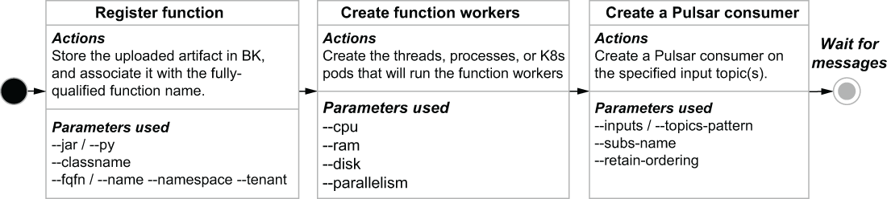

# Pulsar函数

本章涵盖

- Pulsar Functions 框架简介
- Pulsar Functions 编程模型和 API
- 用 Java 编写你的第一个 Pulsar 函数
- 配置、提交和监控 Pulsar 函数

在我们的前一章中，我们研究了如何使用一些不同的客户端库来使用 Pulsar。在本章中，我们将介绍一种称为 Pulsar Functions 的原生流处理引擎，它使基于 Pulsar 的应用程序的开发变得更加简单。这个轻量级的处理框架会自动处理设置 Pulsar 消费者和生产者所需的大量样板代码，让你可以专注于处理逻辑本身，而不是消息的消费和处理。

## 4.1 流处理

虽然没有官方定义，但术语流处理通常是指对从某个源系统连续流入的无界数据集的处理。有几个数据集以连续流的形式自然出现，例如传感器事件、网站上的用户活动和金融交易，可以通过这种方式进行处理。

在进行流处理之前，这些数据集必须首先存储在数据库、文件系统或其他持久存储中，然后才能进行分析。通常，需要一个额外的数据处理阶段来提取信息，将其转换为正确的格式，并将数据加载到这些系统中。只有在 ETL 过程完成后，数据才可以使用基于 SQL 的传统工具或其他工具进行分析。可以想象，在事件发生和可用于分析之间存在显着的延迟。流处理的目标是最大限度地减少延迟，以便可以针对最新数据做出关键业务决策。处理这些数据集的基本方法有三种——批处理、微批处理和流式原生处理——每种方法都采用不同的方法来处理这些无穷无尽的数据集的方式和时间。

### 4.1.1 传统批处理

从历史上看，绝大多数数据处理框架都是为批处理而设计的。传统数据仓库、Hadoop 和 Spark 只是批量处理大型数据集的系统的几个常见示例。数据通常通过长期运行且复杂的 ETL 管道输入这些系统，这些管道清洗、准备和格式化传入的数据以供使用。消息系统通常仅充当中间缓冲区，在管道的各个处理阶段之间存储和路由数据。

这些长时间运行的数据摄取管道通常使用流处理引擎（例如 Apache Spark 或 Flink）来实现，这些引擎旨在通过并行执行处理来有效地处理大型数据集。新到达的数据元素被收集起来，然后在未来的某个时间点作为一个批次一起处理。为了最大限度地提高这些框架的吞吐量，累积将在非常长的时间间隔（小时）内进行，或者直到收集到一定数量的数据（10 秒 GB），这会在数据处理管道中引入人为延迟。

### 4.1.2 微批处理

为解决困扰这些传统批处理引擎的处理延迟问题而引入的一项技术是显着减少批处理大小或处理间隔。在微批处理中，新到达的数据元素仍然被收集成批，如图 4.1 所示，但通过将时间间隔调整为几秒，批的大小显着减小。尽管处理可能会更频繁地发生，但数据仍然是一次处理一批，因此通常称为微批处理，并被 Spark Streaming 等处理框架使用。


图 4.1 使用批处理，消息处理以预定的时间间隔发生并遵循一致的节奏。

虽然这种方法确实减少了数据元素到达和处理之间的处理延迟，但它仍然在过程中引入了人为延迟，随着数据管道复杂性的增加而加剧。因此，即使是微批处理应用程序也不能依赖一致的响应时间，并且需要考虑数据到达和处理之间的延迟。这使得微批处理更适合不需要最新数据并且可以容忍较慢响应时间的用例，而流原生处理更适合需要近实时响应的用例，例如欺诈检测，实时定价和系统监控。

### 4.1.3 流原生处理

使用流原生处理，每条新数据一到达就会被处理，如图 4.2 所示。与批处理不同，没有任意的处理间隔，每个单独的数据元素都是单独处理的。


图 4.2 流处理中，处理是由每条消息的到达触发的，因此处理节奏是不规则且不可预测的。

尽管流处理和微批处理之间的差异似乎只是时间问题，但对数据处理系统和依赖它们的应用程序都有影响。数据在创建后的业务价值会迅速下降，尤其是在欺诈预防或异常检测等用例中。用于提供这些用例的大容量、高速数据集通常包含必须立即采取行动的有价值但易腐烂的见解。必须在交易完成前识别出欺诈性商业交易，例如转账或下载许可软件并采取行动；否则，要防止小偷非法获取资金就来不及了。为了在这些用例中最大化他们的数据价值，开发人员必须从根本上改变他们处理实时数据的方法，重点是减少从传统批处理框架引入的处理延迟，并利用更具反应性的方法，例如流原生处理.

## 4.2 什么是Pulsar函数？

Apache Pulsar 包含一个名为 Pulsar Functions 的轻量级计算引擎，它允许开发人员在 Java、Python 或 Golang 中部署简单的函数实现。此功能允许用户享受无服务器计算的好处，类似于 AWS Lambda 在开源消息传递平台中提供的好处，而不是绑定到云提供商的专有 API。

Pulsar Functions 允许你将处理逻辑应用于通过消息传递系统本身路由的数据。这些轻量级计算进程在 Pulsar 消息传递系统本身内本地执行，尽可能接近消息，不需要其他处理框架，如 Spark、Flink 或 Kafka Streams。与其他消息传递系统不同，它们充当将数据从系统移动到系统的“哑管道”，Pulsar Functions 提供了在消息路由到消费者之前对消息执行简单计算的能力。 Pulsar Functions 消费来自一个或多个 Pulsar 主题的消息，将用户提供的函数（处理逻辑）应用于每条传入消息，并将结果发布到一个或多个 Pulsar 主题，如图 4.3 所示。


图 4.3 Pulsar Functions 对发布到 Pulsar 主题的数据执行用户定义的代码。

Pulsar 函数可以最好地描述为 Lambda 风格的函数，专门设计用于使用 Pulsar 作为底层消息总线。这是因为它们从流行的 AWS Lambda 框架中汲取了一些设计线索，该框架允许你运行代码而无需预置或管理服务器来托管代码。因此，这种编程模型的通用术语是无服务器。

Pulsar 函数框架允许用户开发自包含的代码段，然后通过简单的 REST 调用部署它们。 Pulsar 负责运行代码所需的底层细节，包括为函数的输入和输出主题创建 Pulsar 消费者和生产者。开发人员可以专注于业务逻辑本身，而不必担心使用 Pulsar 发送消息所需的样板代码。简而言之，Pulsar Functions 框架在你现有的 Pulsar 集群上提供了一个现成的计算基础设施。

### 4.2.1.编程模型

Pulsar Functions 背后的编程模型非常简单。 Pulsar 函数接收来自一个或多个输入主题的消息，每次向主题发布消息时，都会执行函数代码。被触发后，功能代码对传入的消息执行其处理逻辑，并将其（可选）输出写入输出主题。尽管所有函数都需要有一个输入主题，但并不严格要求它们为输出主题产生任何输出。

可以让一个 Pulsar 函数的输出主题成为另一个的输入主题，这使我们能够有效地创建 Pulsar 函数的直接无环图（DAG），如图 4.4 所示。在这样的图中，每条边代表一个数据流，每个顶点代表一个 Pulsar 函数，该函数应用用户定义的逻辑来处理数据。 Pulsar 函数在这些 DAG 中的组合是无穷无尽的，如果你愿意，可以编写一个完全由 Pulsar 函数组成并结构化为 DAG 的应用程序。


图 4.4 Pulsar 功能可以在逻辑上构建为一个处理网络。

## 4.3 开发 Pulsar 函数

Pulsar 函数目前可以用 Java、Python 和 Go 编写。因此，如果你已经熟悉这些流行语言中的任何一种，你将能够相对较快地开发 Pulsar 功能。

### 4.3.1 语言原生函数

Pulsar 支持通常所说的语言原生函数，这意味着不需要 Pulsar 特定的库或特殊的依赖项。语言原生函数的好处是它们没有任何依赖于编程语言本身已经可用的东西，这使得它们非常轻巧且易于开发。目前，语言原生函数只能使用 Java 或 Python 开发。 Golang 对此功能的支持尚不可用。

#### JAVA 语言本机函数

为了将一段 Java 代码用作语言本机函数，它必须实现 java.util.Function 接口，该接口只有一个 apply 方法，如清单 4.1 所示。虽然这个简单的函数只是回显它接收到的任何字符串值，但它确实展示了仅使用 Java 语言本身的特性来开发函数是多么容易。任何类型的复杂逻辑都可以包含在 apply 方法中，以提供更强大的流处理功能。

清单 4.1 Java 原生函数

```java
import java.util.Function;
 
public class EchoFunction implements Function
    <String, String> {                         ❶

        public String apply(String input) {        ❷
        return input;
	}
}
```

❶ 指定输入的主题内容将是一个字符串，我们将返回一个字符串
❷ 函数接口中定义的唯一方法，在收到消息时执行
Python 语言原生函数
对于要用作语言本机函数的一段 Python 代码，它必须有一个名为 process 的方法，如以下清单中所示的函数，它只是在它接收到的任何字符串值后附加一个感叹号。

清单 4.2 Python 原生函数

```python
def process(input):                ❶
    return "{}!".format(input)     ❷
```

❶ 消息到达时调用的方法
❷ 返回提供的输入，并在末尾附加一个感叹号
如你所见，语言原生方法提供了一种干净的、无 API 的方式来编写 Pulsar 函数。它非常适合开发简单的无状态函数。

### 4.3.2 Pulsar SDK

另一种选择是使用 Pulsar Functions SDK 开发你的函数，它利用 Pulsar 特定的库，提供本机界面中不可用的一系列功能，例如状态管理和用户配置。可以通过 SDK 内部定义的 Context 对象访问其他功能和信息，包括

- Pulsar 函数的名称、版本和 ID
- 每条消息的消息ID
- 发送消息的主题名称
- 所有输入主题的名称以及与函数关联的输出主题
- 与函数关联的租户和命名空间
- 函数使用的logger对象，可以用来写日志消息
- 访问通过 CLI 提供的任意用户配置值
- 记录指标的界面

Pulsar SDK 的一个实现可用于 Java、Python 和 Golang，每个实现都指定了一个函数接口，其中包含 Context 对象作为由 Pulsar Functions 运行时环境填充和提供的参数。

#### Java SDK 功能

要开始使用 Java SDK 开发 Pulsar 函数，你需要向项目添加对 pulsar-functions-api 工件的依赖，如下面的清单所示。

清单 4.3 向 pom.xml 文件添加 Pulsar SDK 依赖项

```xml
<properties>
    <pulsar.version>2.7.2</pulsar.version>
</properties>
 
...
<dependency>
    <groupId>org.apache.pulsar</groupId>
    <artifactId>pulsar-functions-api</artifactId>
    <version>${pulsar.version}</version>
</dependency>
```

在开发基于 SDK 的 Pulsar 函数时，该函数应实现 org.apache.pulsar.functions.api.Function 接口。从下面的清单中可以看出，该接口仅指定了一种你需要实现的方法，称为 process。

清单 4.4 Pulsar SDK 函数接口定义

```java
@FunctionalInterface
public interface Function<I, O> {
  O process(I input, Context context) throws Exception;
}
```

process 方法至少被调用一次，具体取决于你为函数指定的处理保证，为每个发布到函数的配置输入主题的消息。对于基于 JSON 的消息以及简单的 Java 类型（例如 String、Integer 和 Float），传入的输入字节被序列化为输入类型 I。如果这些类型不能满足你的需求，你也可以使用你自己的类型，只要你为该类型提供自己的org.apache.pulsar.functions.api .SerDe接口实现，也可以注册传入的消息类型在 Pulsar 模式注册表中，我将在第 7 章中更详细地介绍它。下面的清单显示了一个 echo 函数的实现，它演示了 SDK 的几个不同功能，例如日志记录和记录指标。

清单 4.5 Java 中的 Pulsar SDK 函数

```java
import java.util.stream.Collectors;
import org.apache.pulsar.functions.api.Context;
import org.apache.pulsar.functions.api.Function;             ❶
import org.slf4j.Logger;
 
public class EchoFunction implements Function<String, String> {
   
    public String process(String input, Context ctx) {       ❷
       Logger LOG = ctx.getLogger();                         ❸
       String inputTopics = 
         ctx.getInputTopics().stream()
            .collect(Collectors.joining(", "));              ❹
 
       String functionName = ctx.getFunctionName();          ❺
 
       String logMessage = 
           String.format("A message with a value of \"%s\"" +
                “has arrived on one of the following topics: %s\n",
                input, inputTopics);
 
        LOG.info(logMessage);                                ❻
        String metricName = 
           String.format("function-%s-messages-received", functionName);
        
        ctx.recordMetric(metricName, 1);                     ❼
        return input;
    }
}
```

❶ 该类必须实现 Pulsar Functions 接口。
❷ 接口定义了一个带有两个参数的方法，包括一个上下文对象。
❸ 我们使用上下文对象来访问 LOGGER 对象。
❹ 我们使用上下文对象来获取输入主题列表
❺ 我们使用上下文对象来获取函数名。
❻ 我们生成一条日志消息。
❼ 我们记录一个用户定义的指标。
Java SDK 的上下文对象使你能够访问通过命令行（作为 JSON）提供给 Pulsar 函数的键/值对。此功能允许你编写可多次使用但配置略有不同的通用函数。例如，假设你想编写一个基于用户定义的正则表达式过滤事件的函数。当事件到达时，将内容与配置的正则表达式进行比较，并返回与提供的模式匹配的条目，而忽略所有其他条目。如果你想在开始处理之前验证传入数据的格式，则此类函数可能很有用。下面的清单显示了从上下文对象中的键/值对访问正则表达式的此类函数的示例。

清单 4.6 Java 中用户配置的 Pulsar 函数

```java
import java.util.regex.Pattern;
import org.apache.pulsar.functions.api.Context;
import org.apache.pulsar.functions.api.Function;
 
public class RegexMatcherFunction implements Function<String, String> {
 
    public static final String REGEX_CONFIG = "regex-pattern";
 
    @Override
    public String process(String input, Context ctx) throws Exception {
        Optional<Object> config = 
          ctx.getUserConfigValue(REGEX_CONFIG);                ❶
        
        if (config.isPresent() && config.get().getClass()
             .getName().equals(String.class.getName())) {      ❷
 
           Pattern pattern = Pattern.compile(config.get().toString());
           if (pattern.matcher(input).matches()) {             ❸
               String metricName = 
                 String.format("%s-regex-matches",ctx.getFunctionName());
                    
               ctx.recordMetric(metricName, 1);    
               return input;
           }
        }
       return null;                                            ❹
    }
}
```

❶ 从用户提供的配置中检索正则表达式模式。
❷ 如果提供了正则表达式字符串，则编译正则表达式。
❸ 如果输入与正则表达式匹配，则允许它通过。
❹ 否则，返回空值。
Pulsar Functions 可以将结果发布到输出主题，但这不是必需的。你也可以有不总是返回值的函数，比如清单 4.5 中的函数，它过滤掉不匹配的输入。在这种情况下，你可以简单地从函数返回 null 值。

#### Python SDK 功能

要开始使用 Python SDK 开发 Pulsar 函数，你需要将 Pulsar 客户端依赖项添加到你的 Python 安装中。可以使用 pip 包管理器和以下清单中显示的命令轻松安装最新版本的 Pulsar 客户端库。一旦将其安装在你的本地开发环境中，你将能够开始使用 Python 开发利用 SDK 的 Pulsar 函数。

清单 4.7 将 Pulsar SDK 依赖项添加到你的 Python 环境中

```sh
pip3 install pulsar-client==2.6.3 -user    ❶
 
pip3 list                                  ❷
 
Package       Version 
------------- --------- 
... 
pulsar-client 2.6.3                        ❸
```

❶ 安装 Pulsar 客户端。
❷ 列出所有包。
❸ 确认已安装正确版本的 Pulsar 客户端。
让我们看一个基于 Python 的 Echo 函数实现，以演示以下清单中的一些 SDK 功能。

清单 4.8 Python 中的 Pulsar SDK 函数

```python
from pulsar import Function


class EchoFunction(Function):
    def __init__(self):
        pass
  
    def process(self, input, context):              ❶
        logger = context.get_logger()               ❷
        evtTime = context.get_message_eventtime()
        msgKey = context.get_message_key();         ❸
        
        logger.info("""A message with a value of {0}, a key of {1}, 
          and an event time of {2} was received"""
          .format(input, msgKey, evtTime))
        
        metricName = """function-%s-
          messages-received""".format(context.get_function_name())
        context.record_metric(metricName, 1)        ❹
 
        return input                                ❺
```

❶ Pulsar SDK 需要的函数定义
❷ Python SDK 提供对记录器的访问。
❸ Python SDK 提供对消息元数据的访问。
❹ Python SDK 支持指标。
❺ 回显原始输入值。
Python SDK 的上下文对象提供几乎所有与 Java SDK 相同的功能，但有两个明显的例外。首先是，从 2.6.0 版本开始，基于 Python 的 Pulsar 函数不支持模式，我将在第 7 章详细讨论；本质上，这意味着 Python 函数负责将消息字节序列化和反序列化为预期格式。第二个在基于 Python 的 Pulsar Functions 中不存在的功能是访问 Pulsar Admin API，正如我在第 3 章中讨论的那样，它仅在 Java 中可用。

#### Golang SDK 功能

要开始使用 Golang SDK 开发 Pulsar 函数，你需要将 Pulsar 客户端依赖项添加到你的 Golang 安装中。可以使用以下命令安装最新版本的 pulsar 客户端库：go get -u "github.com/apache/pulsar-client-go/pulsar"。让我们看一下我们之前使用的基于 Golang 的 Echo 函数实现，以演示以下清单中的一些 SDK 功能。

清单 4.9 Go 中的 Pulsar SDK 函数

```go
package main
 
import (
    "context"
    "fmt"
 
    "github.com/apache/pulsar/pulsar-function-go/pf"                    ❶
 
    log "github.com/apache/pulsar/pulsar-function-go/logutil"           ❷
)
 
func echoFunc(ctx context.Context, in []byte) []byte {                  ❸
    if fc, ok := pf.FromContext(ctx); ok {
        log.Infof("This input has a length of: %d", len(in))            ❹
 
        fmt.Printf("Fully-qualified function name is:%s\\%s\\%s\n",     ❺
          fc.GetFuncTenant(), fc.GetFuncNamespace(), fc. GetFuncName())
    }
    return in                                                           ❻
}
 
func main() {
    pf.Start(echoFunc)                                                  ❼
}
```

❶ 导入SDK库。
❷ 导入函数记录器库。
❸ 具有正确方法签名的函数代码
❹ Golang SDK 提供对记录器的访问。
❺ Golang SDK 提供对函数元数据的访问。
❻ 回显原始输入值。
❼ 向 Pulsar Functions 框架注册 echofunc。
在编写基于 Golang 的函数时，请记住，你需要在 main() 方法调用中向 pf.Start() 方法提供要执行实际逻辑的函数的名称，如清单 4.8 所示。这会将函数注册到 Pulsar Functions 框架，并确保指定的函数是新消息到达时调用的函数。在这种情况下，我们命名使用了 echoFunc 函数，但它可以命名为任何名称，前提是方法签名与以下清单中显示的任何受支持的方法签名相匹配。不会接受任何其他函数签名，因此，不会在你的 Golang 函数内部执行任何处理逻辑。

清单 4.10 Go 中支持的方法签名

```go
func ()
func () error
func (input) error
func () (output, error)
func (input) (output, error)
func (context.Context) error
func (context.Context, input) error
func (context.Context) (output, error)
func (context.Context, input) (output, error)
```

目前在使用 SDK 开发基于 Golang 的 Pulsar 函数时存在一些限制，但随着项目的成熟，这可能会发生变化，因此我强烈建议查看最新版本的在线文档以获取最新功能。但是，在本书撰写时，Golang 函数不支持函数级指标的记录（例如，在 Golang SDK 的上下文对象中没有定义 recordMetric 方法）。此外，你目前无法使用 Golang 实现有状态功能。

### 4.3.3 有状态的函数
有状态函数利用从它们处理过的先前消息中收集的信息来生成它们的输出。一个这样的应用程序是从物联网传感器接收温度读取事件并计算传感器平均温度的函数。提供此值需要我们计算并存储先前温度读数的运行平均值。

在使用 Pulsar SDK 开发你的函数时，无论你使用三种支持的语言中的哪一种，process 方法中的第二个参数都是 Pulsar Functions 框架自动提供的 Context 对象。如果你使用的是 Java 或 Python，那么 Context 对象的 API 还提供了两种独立的机制，用于在对 Pulsar 函数的连续调用之间保留信息。 Context API 提供的第一个机制是一个映射接口，用于通过其 putState 和 getState 方法存储和检索键/值对。这些方法就像你熟悉的任何其他地图接口一样，允许你使用字符串值作为键来存储和检索任何类型的值。

Context 对象提供的其他状态机制是计数器，它只允许你使用字符串作为键来保留数值。这些计数器是键/值映射的专用版本，在功能上专为存储数值而设计。在内部，计数器存储为 64 位大端二进制值，并且只能通过 incrCounter 和 incrCounterAsync 方法进行更改。

让我们以一个从 IoT 传感器接收温度读取事件并计算传感器平均温度的函数为例，展示如何利用 Pulsar 函数内部的状态。清单 4.11 中显示的函数接收传感器读数并将其与它根据前一个读数计算的平均温度读数进行比较，以确定它是否应该触发某种警报。

清单 4.11 平均传感器读数函数

```java
public class AvgSensorReadingFunction implements 
  Function<Double, Void> {                                              ❶
  
  private static final String VALUES_KEY = "VALUES";
 
  @Override
  public Void process(Double input, Context ctx) throws Exception {    
    CircularFifoQueue<Double> values = getValues(ctx);                  ❷
 
    if (Math.abs(input - getAverage(values)) > 10.0) {
      // trigger an alarm.                                              ❸
    }
 
    values.add(input);                                                  ❹
    ctx.putState(VALUES_KEY, serialize(values));                        ❺
    return null;
  }
 
  private Double getAverage(CircularFifoQueue<Double> values) {
    return StreamSupport.stream(values.spliterator(), false)
      .collect(Collectors.summingDouble(Double::doubleValue))
      / values.size();                                                  ❻
  }
 
  private CircularFifoQueue<Double> getValues(Context ctx) {
    if (ctx.getState(VALUES_KEY) == null) {
      return new CircularFifoQueue<Double>(100);                        ❼
    } else {
      return deserialize(ctx.getState(VALUES_KEY));                     ❽
    }
 }
  
. . .   
}
```

❶ 该函数接受一个双精度值并且不产生输出消息。
❷ 我们反序列化用于存储先前传感器读数的 Java 对象。
❸ 如果当前读数明显不同，那么我们会生成警报。
❹ 我们将当前值添加到观察值列表中。
❺ 我们将更新后的 Java 对象存储在状态存储中。
❻ 我们使用 Streams API 来计算平均值。
❼ 如果状态存储中不存在 Java 对象，则实例化 Java 对象。
❽ 将状态存储中的字节转换为我们需要的Java对象。
我想从清单 4.11 中的函数中强调几点。你可能会注意到的第一件事是函数的返回类型定义为 Void。这意味着该函数不会产生输出值。我想强调的另一点是，该函数依赖 Java 序列化来存储和检索它收到的最后 100 个值（传感器读数）的列表。它依赖于 FIFO 队列的第三方库实现来保留 100 个最新值，以便在将其与最近的传感器读数进行比较之前计算平均值。如果该值明显偏离平均值，则会发出警报。最后，最近的读取被添加到 FIFO 队列，然后被序列化并写入状态存储。

在后续调用中，AvgSensorReadingFunction 将检索 FIFO 队列的字节，将它们反序列化回 Java 对象，并使用它再次计算平均值。这个过程无限重复，只保留最近的值以与趋势进行比较（例如，传感器读数的移动平均值）。这种方法与第 12 章讨论的 Pulsar Functions 提供的窗口能力有很大不同。简而言之，Pulsar Functions 框架提供的窗口能力允许在执行基于时间或固定的函数方法之前收集多个输入数数。一旦窗口被填满，函数就会一次提供整个输入列表，而清单 4.6 中所示的函数一次只提供一个值，并且必须在其状态内保持先前的值。

因此，你可能会问自己，为什么不将 Pulsar 的内置窗口用于我们的用例。在我们的例子中，我们希望在每个读数可用时做出反应，而不是等待积累足够数量的读数。这使我们能够更快地检测到任何问题。

现在，让我们通过查看 Context API 提供的计数器接口来结束对有状态函数的讨论。如何以及何时使用此功能的一个很好的示例是 WordCount 函数，它使用上下文对象 API 提供的计数器方法存储每个单词的数量，如下面的清单所示。

清单 4.12 使用有状态计数器的 WordCount 函数

```java
package com.manning.pulsar.chapter4.functions.sdk;
 
import java.util.Arrays;
import java.util.List;
 
import org.apache.pulsar.functions.api.Context;
import org.apache.pulsar.functions.api.Function;
 
public class WordCountFunction implements Function<String, Integer> {
  @Override
  public Integer process(String input, Context context) throws Exception {
    List<String> words = Arrays.asList(input.split("\\."));
      words.forEach(word -> context.incrCounter(word, 1));
        return Integer.valueOf(words.size());
  }  
}
```

该函数的逻辑很简单；它首先使用正则表达式模式将传入的字符串对象拆分为多个单词；然后对于从拆分中生成的每个单词，它将相应的计数器加一。此函数是有效处理语义以确保准确结果的良好候选者。如果你改为使用至少一次处理语义，则可能最终在失败场景中多次处理相同的消息，这将导致多个单词的重复计算。

## 4.4 测试 Pulsar 函数

在本节中，我将引导你完成开发和测试你的第一个 Pulsar 函数的过程。让我们使用清单 4.13 中所示的 KeywordFilterFunction 来演示 Pulsar 函数的软件开发生命周期。此函数接受用户提供的关键字并过滤掉任何不包含该关键字的输入字符串。此功能的一个示例应用是扫描 Twitter 提要以查找与特定主题相关或包含特定短语的推文。

清单 4.13 KeywordFilterFunction

```java
package com.manning.pulsar.chapter4.functions.sdk;
 
import java.util.Arrays;
import java.util.List;
import java.util.Optional;
import org.apache.pulsar.functions.api.Context;
import org.apache.pulsar.functions.api.Function;
 
public class KeywordFilterFunction 
  implements Function<String, String> {                            ❶
    
public static final String KEYWORD_CONFIG = "keyword";
public static final String IGNORE_CONFIG = "ignore-case";
    
@Override
public String process(String input, Context ctx) {
  Optional<Object> keyword = 
    ctx.getUserConfigValue(KEYWORD_CONFIG);                        ❷
  Optional<Object> ignoreCfg = 
    ctx.getUserConfigValue(IGNORE_CONFIG);                         ❸
  
  boolean ignoreCase = ignoreCfg.isPresent() ? 
           (boolean) ignoreConfig.get(): false;
        
        List<String> words = Arrays.asList(input.split("\\s"));    ❹
        
        if (!keyword.isPresent()) {
            return null;                                           ❺
        } else if (ignoreCase && words.stream().anyMatch(          ❻
            s -> s.equalsIgnoreCase((String) keyword.get()))) {
            return input;
        } else if (words.contains(keyword.get())) {                ❼
            return input;
        }
        return null;
    }
}
```

❶ 该函数接受一个字符串并返回一个字符串。
❸ 从上下文对象中获取关键字。
❸ 从上下文对象中获取忽略大小写设置。
❹ 将输入字符串拆分为单个单词。
❺ 没有关键字，什么都匹配不到。
❻ 评估每个单词，忽略大小写。
❼ 检查是否完全匹配。
虽然此代码很简单，但我将介绍你在开发用于生产用途的功能时通常会使用的测试过程。由于这只是普通的 Java 代码，我们可以利用任何现有的单元测试框架（例如 JUnit 或 TestNG）来测试函数逻辑。

### 4.4.1 单元测试

第一步是编写一套单元测试来测试一些更常见的场景，以验证逻辑是否正确，并为我们发送的各种句子生成准确的结果。由于此代码使用 Pulsar SDK API，因此我们需要使用模拟库（例如 Mockito）来模拟 Context 对象，如下面的清单所示。

清单 4.14 KeywordFilterFunction 单元测试

```java
package com.manning.pulsar.chapter4.functions.sdk;
 
import static org.mockito.Mockito.*;
import static org.junit.Assert.*;
 
public class KeywordFilterFunctionTests {    
private KeywordFilterFunction function = new KeywordFilterFunction();
    
@Mock
private Context mockedCtx;
    
@Before
public final void setUp() {
  MockitoAnnotations.initMocks(this);
}
 
  @Test
  public final void containsKeywordTest() throws Exception {
    when(mockedCtx.getUserConfigValue(
       KeywordFilterFunction.KEYWORD_CONFIG))
       .thenReturn(Optional.of("dog"));                      ❶
    
 String sentence = "The brown fox jumped over the lazy dog";
 String result = function.process(sentence, mockedCtx);
 assertNotNull(result);                                      ❷
 assertEquals(sentence, result);
  }
    
  @Test
  public final void doesNotContainKeywordTest() throws Exception {
    when(mockedCtx.getUserConfigValue(
    KeywordFilterFunction.KEYWORD_CONFIG))
    .thenReturn(Optional.of("cat"));                         ❸
    
    String sentence = "It was the best of times, it was the worst of times";
 String result = function.process(sentence, mockedCtx);
 assertNull(result);                                         ❹
  }
    
  @Test
  public final void ignoreCaseTest() {
    when(mockedCtx.getUserConfigValue(
       KeywordFilterFunction.KEYWORD_CONFIG))
       .thenReturn(Optional.of("RED"));                      ❺
 
    when(mockedCtx.getUserConfigValue(
       KeywordFilterFunction.IGNORE_CONFIG))
       .thenReturn(Optional.of(Boolean.TRUE));               ❻
        
  String sentence = "Everyone watched the red sports car drive off.";
  String result = function.process(sentence, mockedCtx);
  assertNotNull(result);                                     ❼
  assertEquals(sentence, result);
  }
}
```

❶ 配置关键字为dog。
❷ 我们期望返回这个句子，因为它包含关键字。
❸ 配置关键字为cat。
❹ 我们不期望返回这个句子，因为它不包含关键字。
❺ 设置关键字为RED。
❻ 设置过滤关键字时忽略大小写的功能。
❼ 我们期望返回该句子，因为它包含关键字的小写版本。
如你所见，这些单元测试涵盖了函数的非常基本的功能，并依赖于 Pulsar 上下文对象的模拟对象的使用。这种类型的测试套件就像你编写的用于测试任何不是 Pulsar 函数的 Java 类的测试套件一样。

### 4.4.2 集成测试

在我们对单元测试结果感到满意后，我们将想看看 Pulsar 函数在 Pulsar 集群上的表现如何。测试 Pulsar 函数的最简单方法是使用 LocalRunner 帮助器类启动 Pulsar 服务器并在本地运行 Pulsar 函数。在这种模式下，该函数在提交它的机器上作为独立进程运行。这个选项在你开发和测试你的函数时是最好的，因为它允许你将调试器附加到本地机器上的函数进程，如图 4.5 所示。


图 4.5 当你使用 LocalRunner 运行 Pulsar 函数时，该函数在本地机器上运行，允许你附加调试器并单步执行代码。

要使用 LocalRunner，你必须首先向 Maven 项目添加一些依赖项，如下面的清单所示。这引入了 LocalRunner 类，用于针对正在运行的 Pulsar 集群测试该函数。

清单 4.15 包含 LocalRunner 依赖项

```xml
<dependencies>
  . . .
  <dependency>
        <groupId>com.fasterxml.jackson.core</groupId>
        <artifactId>jackson-core</artifactId>
        <version>${jackson.version}</version>
    </dependency>
  <dependency>
    <groupId>org.apache.pulsar</groupId>
    <artifactId>pulsar-functions-local-runner-original</artifactId>
    <version>${pulsar.version}</version>
  </dependency>
</dependencies>
```

接下来，我们需要编写一个类来配置和启动 LocalRunner，如下面的清单所示。如你所见，此代码必须首先配置 Pulsar 函数以在 LocalRunner 上执行，并指定将用于测试的实际 Pulsar 集群实例的地址。

清单 4.16 使用 LocalRunner 测试 KeywordFilterFunction

```java
public class KeywordFilterFunctionLocalRunnerTest {
  final static String BROKER_URL = "pulsar://localhost:6650";
  final static String IN = "persistent://public/default/raw-feed"; 
  final static String OUT = "persistent://public/default/filtered-feed";
    
  private static ExecutorService executor;
  private static LocalRunner localRunner;
  private static PulsarClient client;
  private static Producer<String> producer;
  private static Consumer<String> consumer;
  private static String keyword = "";
    
  public static void main(String[] args) throws Exception {
    if (args.length > 0) {
    keyword = args[0];                                               ❶
   }
   startLocalRunner();
   init();
   startConsumer();
   sendData();
   shutdown();
  }
 
  private static void startLocalRunner() throws Exception {
    localRunner = LocalRunner.builder()
            .brokerServiceUrl(BROKER_URL)                            ❷
            .functionConfig(getFunctionConfig())                     ❸
            .build();
   localRunner.start(false);                                         ❹
  }
 
  private static FunctionConfig getFunctionConfig() {
    Map<String, ConsumerConfig> inputSpecs = 
       new HashMap<String, ConsumerConfig> ();
  
    inputSpecs.put(IN, ConsumerConfig.builder()                      ❺
           .schemaType(Schema.STRING.getSchemaInfo().getName())
           .build());
 
    Map<String, Object> userConfig = new HashMap<String, Object>();
    userConfig.put(KeywordFilterFunction.KEYWORD_CONFIG, keyword);
    userConfig.put(KeywordFilterFunction.IGNORE_CONFIG, true);       ❻
        
    return FunctionConfig.builder()
          .className(KeywordFilterFunction.class.getName())          ❼
          .inputs(Collections.singleton(IN))                         ❽
          .inputSpecs(inputSpecs)                                    ❾
          .output(OUT)                                               ❿
          .name("keyword-filter")
          .tenant("public")
          .namespace("default")
          .runtime(FunctionConfig.Runtime.JAVA)                      ⓫
          .subName("keyword-filter-sub")
          .userConfig(userConfig)                                    ⓬
          .build();
  }
 
  private static void init() throws PulsarClientException {          ⓭
    executor = Executors.newFixedThreadPool(2);
    client = PulsarClient.builder()
              .serviceUrl(BROKER_URL)
              .build();
    producer = client.newProducer(Schema.STRING).topic(IN).create();    
    consumer = client.newConsumer(Schema.STRING).topic(OUT)
                .subscriptionName("validation-sub").subscribe();
  }
    
  private static void startConsumer() {                              ⓮
    Runnable runnableTask = () -> {
      while (true) {
        Message<String> msg = null;
        try {
           msg = consumer.receive();
           System.out.printf("Message received: %s \n", msg.getValue());
           consumer.acknowledge(msg);
        } catch (Exception e) {
           consumer.negativeAcknowledge(msg);
        }
       }};
    executor.execute(runnableTask);
  }
    
  private static void sendData() throws IOException {                ⓯
    InputStream inputStream = Thread.currentThread().getContextClassLoader()
       .getResourceAsStream("test-data.txt");
 
   InputStreamReader streamReader = new InputStreamReader(inputStream,
      StandardCharsets.UTF_8);
 
    BufferedReader reader = new BufferedReader(streamReader);
    for (String line; (line = reader.readLine()) != null;) {
      producer.send(line);
    }
  }
        
  private static void shutdown() throws Exception {                  ⓰
    executor.shutdown();
    localRunner.stop();
   . . .
  }   
}
```

❶ 获取用户提供的关键字。
❷ 函数将在其上运行的 Pulsar 集群的服务 URL
❸ 将功能配置传入LocalRunner。
❹ 启动LocalRunner 并运行。
❺ 指定输入主题内的数据为字符串
❻ 使用用户提供的关键字初始化用户配置属性。
❼ 指定本地运行的函数的类名
❽ 指定输入主题
❾ 传入输入主题配置属性。
❿ 指定输出主题
⓫ 指定我们要为函数使用 Java 运行时环境
⓬ 传入用户配置属性。
⓭ 初始化生产者和消费者以用于测试。
⓮ 在后台线程中启动消费者以从函数输出主题中读取消息。
⓯ 向函数输入主题发送数据。
⓰ 停止LocalRunner、consumer等。
访问 Pulsar 集群的最简单方法是像我们在第 3 章中所做的那样，通过在 bash 窗口中运行以下命令来启动 Pulsar Docker 容器，这将在容器内以独立模式启动 Pulsar 集群。请注意，我们还将你克隆与本书关联的 GitHub 项目所在的目录安装到本地机器上：

```sh
$ export GIT_PROJECT=<CLONE_DIR>/pulsar-in-action/chapter4
$ docker run --name pulsar -id \
  -p 6650:6650 -p 8080:8080 \
  -v $GIT_PROJECT:/pulsar/dropbox
  apachepulsar/pulsar:latest bin/pulsar standalone
```

通常，你会从 IDE 内部运行 LocalRunner 测试以附加调试器并逐步执行函数代码以识别和解决你遇到的任何错误。但是，在这种情况下，我想使用命令行运行 LocalRunner 测试。因此，我必须首先通过运行 Maven 将位于与本书相关的 GitHub 存储库的 Chapter4/src/main/test 文件夹下的测试类以及所有必需的依赖项（包括 LocalRunner 类）捆绑到一个 JAR 文件中组装命令。完成后，我们可以启动 LocalRunner 命令，如下面的清单所示。

清单 4.17 启动 LocalRunner 并输入一些数据

```java
mvn clean compile test-compile assembly:single                        ❶
...
[INFO] ----------------------------------------------------------
[INFO] BUILD SUCCESS
[INFO] ----------------------------------------------------------
[INFO] Total time:  29.279 s
[INFO] Finished at: 2020-08-15T15:43:58-07:00
 
java -cp ./target/chapter4-0.0.1-fat-tests.jar  com.manning.pulsar.chapter4.functions.sdk.KeywordFilter
        ➥ FunctionLocalRunnerTest Director                              ❷
 
org.apache.pulsar.functions.runtime.thread.ThreadRuntime - ThreadContainer 
➥ starting function with instance config InstanceConfig(instanceId=0, 
➥ functionId=0bc39b7d-fb08-4549-a6cf-ab641d583edd,
➥ functionVersion=7786da28-
0bb6-4c11-97d9-3d6140cc4261, functionDetails=tenant: "public"
namespace: "default"
name: "keyword-filter"
className: "com.manning.pulsar.chapter4.functions.
➥ sdk.KeywordFilterFunction"                                         ❸
userConfig: "{\"keyword\":\"Director\",\"ignore-case\":true}"
autoAck: true
parallelism: 1
source {                                                              ❹
  typeClassName: "java.lang.String"
  subscriptionName: "keyword-filter-sub"
  inputSpecs {
    key: "persistent://public/default/raw-feed"
    value {
      schemaType: "String"
    }
  }
  cleanupSubscription: true
}
sink {                                                                ❺
  topic: "persistent://public/default/filtered-feed"
  typeClassName: "java.lang.String"
  forwardSourceMessageProperty: true
}
. . .
 
Message received: At the end of the room a loud speaker projected from the 
➥ wall. The Director walked up to it and pressed a switch.           ❻
Message received: The Director pushed back the switch. The voice was 
➥ silent. Only its thin ghost continued to mutter from beneath the 
➥ eighty pillows.
Message received: Once more the Director touched the switch.
```

❶ 构建包含 LocalRunner 测试及其所有依赖项的胖 jar
❷ 运行LocalRunner 测试，并指定Director 关键字进行过滤。
❸ 输出应表明该功能已按预期部署。
❹ 输出应该显示函数的输入主题。
❺ 输出应该显示函数的输出主题。
❻ 输出应该只包含关键字 Director 的句子。
让我们回顾一下刚刚发生的步骤。 KeywordFilterFunction 的一个实例在我笔记本电脑的 JVM 中本地启动，并连接到我们之前启动的 Docker 容器内运行的 Pulsar 实例。接下来，在该 Pulsar 实例中自动创建了在函数配置中指定的输入和输出主题。然后，在 KeywordFilterFunctionLocalRunnerTest 的 sendData 方法中运行的生产者发布的所有数据都发布到 Docker 容器内的 Pulsar 主题中。

KeywordFilterFunction 正在侦听同一主题，并将处理逻辑应用于发布到该主题的每一行。只有包含关键字的消息（在本例中为 Director）才会写入函数的配置输出主题。在 KeywordFilterFunctionLocalRunnerTest 的 startConsumer 方法中运行的使用者也从这个输出主题读取消息并将它们写入标准输出，以便我们可以验证结果。

## 4.5 部署 Pulsar 函数
在你编译并测试了 Pulsar 函数之后，你最终会想要将它们部署到生产集群中。 pulsar-admin 函数命令行工具专为此目的而设计，它允许你为函数提供多个配置属性，包括租户、命名空间、输入和输出主题。在本节中，我将介绍使用此工具配置和部署 Pulsar 功能的过程。

### 4.5.1 生成部署工件

当你部署 Pulsar 函数时，第一步是生成一个部署工件，其中包含函数代码及其所有依赖项。工件的类型因用于开发功能的编程语言而异。

#### Java SDK 功能

对于基于 Java 的函数，首选的工件类型是 NAR（NiFi 存档）文件，尽管 JAR 文件如果包含所有必要的依赖项也是可以接受的。无论你是要部署简单的 Java 原生语言函数还是使用 Pulsar SDK 开发的函数，这都是正确的。在任何一种情况下，存档文件都是部署工件。要将 Pulsar 函数打包为 NAR 文件，你需要在 pom.xml 文件中包含一个特殊插件，如下面的清单所示，它将为你捆绑函数类及其所有依赖项。

清单 4.18 将 NAR Maven 插件添加到你的 pom.xml 文件中

```xml
<build>
  <plugins>
      <plugin>
        <groupId>org.apache.nifi</groupId>
        <artifactId>nifi-nar-maven-plugin</artifactId>
        <version>1.2.0</version>
        <extensions>true</extensions>
        <executions>
            <execution>
                <phase>package</phase>
                <goals>
                    <goal>nar</goal>
                </goals>
            </execution>
        </executions>
      </plugin>
   . . .
  </plugins>
</build>
```

将此插件添加到项目的 pom.xml 文件后，你需要做的就是运行 mvn clean install 命令以在项目的目标文件夹中生成 NAR 文件。这个 NAR 文件是基于 Java 的 Pulsar 函数的部署工件。

#### Python SDK 功能

对于基于 Python 的 Pulsar 函数，有两种部署选项，具体取决于你是否使用了 Pulsar SDK。如果你没有使用SDK，只想部署一个Python原生语言函数，那么Python源文件（例如my-function.py）就是部署神器，不需要进一步打包。

但是，如果你希望部署依赖于 Python 标准库之外的包的基于 Python 的 Pulsar 函数，那么你必须先将所有必需的依赖项打包到一个工件（ZIP 文件）中，然后才能部署它。 Python 项目文件夹中需要一个名为 requirements.txt 的文件，用于维护所有项目依赖项的列表。由开发人员手动更新此文件。请注意， pulsar-client 不需要作为依赖项，因为它是由 Pulsar 提供的。当你准备好创建 Python 部署工件时，首先需要运行以下清单中显示的命令，将 requirements.txt 文件中指定的所有 Python 依赖项下载到 Python 项目的 deps 文件夹中。

清单 4.19 下载 Python 依赖项

```sh
pip download \                    ❶
--only-binary :all: \             ❷
--platform manylinux1_x86_64 \    ❸
--python-version 37 \             ❹
-r requirements.txt \             ❺
-d deps                           ❻
```

❶ 使用 Python 的 pip 包管理器。
❷ 我们需要所有依赖项的二进制版本。
❸ 指定目标执行平台操作系统。
❹ 指定 Python 版本。
❺ requirements.txt 文件的相对路径
❻ 目标下载目录。
下载完成后，你需要使用所需的包名称（例如，echo-function）创建一个目标文件夹。接下来，你必须将 src 和 deps 文件夹都复制到其中并将该文件夹压缩为 ZIP 存档。从以下清单中的命令生成的 ZIP 文件是基于 Python 的 Pulsar 函数的部署工件。

清单 4.20 打包一个基于 Python 的 Pulsar 函数进行部署

```sh
mkdir -p /tmp/echo-function                          ❶
 
cp -R deps /tmp/echo-function/
cp -R src /tmp/echo-function/                        ❷
 
zip -r /tmp/echo-function.zip /tmp/echo-function     ❸
```

❶ 为函数依赖项和源创建一个新的目标目录。
❷ 从 Python 项目文件夹中，复制依赖项和源。
❸ 使用 zip 命令创建一个包含目标目录内容的 ZIP 文件。

#### Golang SDK 功能

对于基于 Golang 的 Pulsar 函数，首选的工件类型是单个二进制可执行文件，其中包含函数的机器字节代码以及在任何计算机上执行代码所需的所有支持代码，无论该系统是否具有 . go 源文件甚至是 Go 安装。你可以使用 Go 工具链来生成这个二进制可执行文件，如下面的清单所示。

清单 4.21 打包一个基于 Go 的 Pulsar 函数进行部署

```go
cd chapter4                                         ❶
 
go build echoFunction.go                            ❷
 
go: downloading github.com/apache/pulsar/pulsar-function-go 
➥ v0.0.0-20210723210639-251113330b08
go: downloading github.com/sirupsen/logrus v1.4.2
go: downloading github.com/golang/protobuf v1.4.3
go: downloading github.com/apache/pulsar-client-go v0.5.0   
...                                                 ❸
 
ls -l                                               ❹
 
-rwxr-xr-x  1 david  staff  23344912 Jul 25 15:23 
➥ echoFunction                                     ❺
-rw-r--r--  1 david  staff       538 Jul 25 15:20 
➥ echoFunction.go                                  ❻
```

❶ 确保你在项目目录中。
❷ 使用 Go build 命令生成二进制可执行文件。
❸ Go 将自动下载你需要的任何包并将它们包含在二进制文件中。
❹ 包含 Pulsar 函数的 Go 源文件
❺ 构建命令完成后，检查目录内容。
❻ 生成的可执行二进制文件
如果你运行的是 macOS 或 Linux，则会在你运行命令的目录中生成二进制可执行文件，并以源文件命名。这是在 Pulsar 中运行基于 Golang 的函数必须部署的工件。

### 4.5.2 功能配置

现在我们知道如何生成部署工件，下一步是配置和部署我们的 Pulsar 功能。所有函数在部署到 Pulsar 时都需要提供一些基本的配置细节，比如输入输出主题等细节。可以通过两种方式指定此配置信息。第一个是使用创建 (https://pulsar.apache.org/docs/en/functions-cli/#create) 和更新 (https://pulsar.apache.org/docs/en/functions-cli/#create) 作为命令行参数传递给 pulsar-admin 函数 CLI 工具.apache.org/docs/en/functions-cli/#update) 函数命令（例如 bin/pulsar-admin 函数创建），第二个是通过单个配置文件。

你选择哪种方法是一个偏好问题，但我强烈建议使用后者，因为它不仅简化了部署过程，而且还允许你将配置详细信息与源代码一起存储在源代码管理中。这允许你随时参考属性并确保你始终使用正确的配置运行你的功能。如果选择这种方法，则在部署函数时只需要提供两个配置值：包含可执行函数代码的函数工件文件的名称和包含所有配置设置的文件的名称。名为 function-config.yaml 的配置文件的内容显示在以下清单中。我们将使用这个文件将 KeywordFilterFunction 部署到我们在本章前面开始的 Docker 容器内运行的 Pulsar 集群。

清单 4.22 KeywordFilterFunction 的函数配置文件

```go
className: com.manning.pulsar.chapter4.functions.sdk.KeywordFilterFunction
tenant: public                                                  ❶
namespace: default                                              ❷
name: keyword-filter
inputs:                                                         ❸
- persistent://public/default/raw-feed
output: persistent://public/default/filtered-feed
userConfig:                                                     ❹
  keyword : Director
  ignore-case: false
 
##################################
# Processing 
##################################
autoAck: true                                                   ❺
logTopic: persistent://public/default/keyword-filter-log
processingGuarantees: ATLEAST_ONCE                              ❻
retainOrdering: false                                           ❼
timeoutMs: 30000
subName: keyword-filter-sub                                     ❽
cleanupSubscription: true
```

❶ 每个功能都必须有一个关联的租户。
❷ 每个函数都必须有一个关联的命名空间。
❸ 每个功能可以有多个输入主题。
❹ 用户配置key，value map
❺ 函数在处理完消息后是否应该确认消息
❻ 应用于函数的传递语义
❼ 函数是否应该按照消息发布的顺序处理输入消息
❽ 输入主题的订阅名称
如你所见，该文件提供了运行 Pulsar 函数所需的所有属性，包括类名、输入/输出目录等等。它还包含以下配置设置，用于控制函数如何使用消息：

- auto_ack——从输入主题消费的消息是否被函数框架自动确认。当设置为默认值 true 时，每条不会导致异常的消息都会在函数执行完成后自动确认。如果设置为false，则功能码负责消息确认。
- retain-ordering——消息是否完全按照它们在输入主题上出现的顺序被消费。当设置为 true 时，否定确认的消息将在任何未处理的消息之前重新传送。
- processing-guarantees——处理保证（传递语义）应用于函数使用的消息。可能的值为 [ATLEAST_ONCE、ATMOST_ONCE、EFFECTIVELY_ONCE]。

在执行流处理应用程序时，你可能希望为 Pulsar 函数中的数据处理指定交付语义。这些保证是有意义的，因为你必须始终假设网络或机器中存在可能导致数据丢失的故障。
在 Pulsar Functions 的上下文中，这些处理保证决定了消息的处理频率以及在发生故障时如何处理。 Pulsar Functions 支持三种不同的消息传递语义，你可以将它们应用于任何函数。默认情况下，Pulsar Functions 提供最多一次交付保证，但你可以配置 Pulsar 函数以提供以下任何消息处理语义。

#### 最多一次交货保证

最多一次处理不保证数据得到处理，如果数据在 Pulsar 函数处理之前丢失，则不会进行额外的尝试来重新处理数据。 发送到该函数的每条消息要么最多处理一次，要么根本不处理。

如图 4.6 所示，当 Pulsar 函数被配置为使用最多一次处理时，消息在被消费后立即被确认，无论消息是否成功处理。 在这种情况下，即使消息 M1 导致处理异常，该函数也将接下来处理消息 M2。


图 4.6 通过最多一次处理，无论处理成功还是失败，传入的消息都会得到确认。这使每条消息只有一次被处理的机会。

如果你的应用程序可以在不影响数据正确性的情况下处理周期性数据丢失，则你只想使用此处理保证。一个这样的例子是计算传感器读数平均值的函数，例如温度。在函数的整个生命周期中，它将处理数千万个单独的温度读数，而这些读数中的少数丢失对计算平均值的准确性无关紧要。

#### 至少一次交货保证

至少一次处理保证发布到函数的输入主题之一的任何数据至少会被函数成功处理一次。如果处理失败，消息将自动重新发送。因此，任何给定的消息都有可能被多次处理。

通过这种处理语义，Pulsar 函数从输入主题中读取消息，执行其逻辑，并确认消息。如果该函数未能确认该消息，则会对其进行重新处理。重复此过程，直到函数确认消息。图 4.7 描述了函数使用消息但遇到处理错误导致它无法发送确认的场景。在这种情况下，该函数处理的下一条消息将是 M1，并将继续为 M1，直到该函数成功。


图 4.7 通过至少一次处理，如果函数遇到错误并且未能确认消息，则将再次处理相同的消息。

如果你的应用程序可以多次处理相同的数据而不影响数据的正确性，你将只希望使用此处理保证。一种这样的场景是传入的消息表示将在数据库中更新的记录。在这种情况下，具有相同值的多次更新不会对底层数据库产生影响。

#### 有效的一次交付保证

使用一次有效保证，可以多次接收和处理消息，这在出现故障时很常见。关键在于，函数处理结果状态的实际结果就像重新处理的事件只被观察到一次一样。这通常是你想要实现的目标。


图 4.8 使用一次有效处理，重复消息将被忽略。

图 4.8 描述了一个场景，其中函数输入主题的上游生产者重新发送了相同的消息 M1。当配置为提供一次有效处理时，该函数将检查它之前是否处理过该消息（基于用户定义的属性），如果是，它将忽略该消息并发送确认，以便它不会被再加工。

### 4.5.3 功能部署

现在我们已经定义了要用于该函数的配置，下一步是将该函数部署到正在运行的 Pulsar 集群上。正如我们之前提到的，我们在本章前面启动的在 Docker 容器内运行的 Pulsar 集群会做得很好。从 bash shell 内部，你可以执行以下清单中显示的命令，以在该 Pulsar 集群上部署 KeywordFilterFunction。

清单 4.23 部署 KeywordFilterFunction

```sh
$ docker exec -it pulsar bin/pulsar-admin functions create \ 
  --jar /pulsar/dropbox/target/chapter4-0.0.1.nar \           ❶❷
  --function-config-file 
  /pulsar/dropbox/src/main/resources/function-config.yaml  ❸
```

❶ 指定部署工件，它必须是本地可访问的文件或 URL 地址。
❷ 在 Docker 容器中使用 pulsar-admin 工具
❸ 指定功能配置文件，必须是本地可访问的文件或URL地址。
如果一切按预期进行，你应该在命令的输出中看到 Created successfully，这表明该函数已创建并部署在 Pulsar 集群上。让我们花点时间回顾一下发生了什么以及为什么命令能够工作。首先，我们使用了 pulsar-admin CLI 工具，它只存在于 Docker 容器中。因此，我们需要使用 Docker exec 命令在 Docker 容器内运行 pulsar-admin CLI 工具。在命令中，我们提供了两个开关：一个用于指定部署工件（例如 NAR 文件）的位置，另一个用于指定功能配置文件的位置。由于我们正在部署基于 Java 的 Pulsar 函数，因此我们使用了 —jar 开关来指定工件的位置。如果这是一个基于 Python 的函数，我们将不得不使用 --py 开关，类似地，对于基于 Golang 的函数，我们将不得不使用 --go 开关。使用正确的开关至关重要，因为 Pulsar 使用这些开关值来确定运行函数需要哪个运行时执行环境（即，是否启动 JVM、Python 解释器或 Go 运行时来运行函数）。

配置文件和函数工件文件必须与 pulsar-admin CLI 工具在同一台机器上，或者可以通过 URL 下载。因此，我们将 $GIT_PROJECT 目录挂载到 Docker 容器内的 /pulsar/dropbox 文件夹。这使得 pulsar-admin CLI 工具可以在本地访问这两个文件。虽然这对于本地开发来说是一个很好的技巧，但请记住，在实际生产场景中，这些文件应该物理移动到 Pulsar 集群，最好作为 CI/CD 发布过程的一部分。我们还可以使用 function getstatus 命令检查我们部署的函数的状态，如清单 4.24 所示，这将为我们提供有关该函数的有用信息，包括该函数的状态、它处理了多少消息、平均处理延迟函数，以及函数可能抛出的任何异常。

清单 4.24 检查 KeywordFilterFunction 的状态

```java
# docker exec -it pulsar /pulsar/bin/pulsar-admin functions getstatus -
➥ name keyword-filter
{
  "numInstances" : 1,                    ❶
  "numRunning" : 1,                      ❷
  "instances" : [ {
    "instanceId" : 0,
    "status" : {
      "running" : true,                  ❸
      "error" : "",                      ❹
      "numRestarts" : 0,
      "numReceived" : 0,                 ❺
      "numSuccessfullyProcessed" : 0,    ❻
      "numUserExceptions" : 0,
      "latestUserExceptions" : [ ],
      "numSystemExceptions" : 0,
      "latestSystemExceptions" : [ ],
      "averageLatency" : 0.0,            ❼
      "lastInvocationTime" : 0,          ❽
      "workerId" : "c-standalone-fw-localhost-8080"
    }
  } ]
}
```

❶ 请求的函数实例数
❷ 函数的实际运行实例数
❸ 状态指示灯
❹ 如果有任何错误被抛出，它们会显示在这里。
❺ 函数接收到的消息数
❻ 函数已成功处理的消息数
❼ 每条消息的平均处理延迟
❽ 函数最后一次处理消息的时间
如果你需要调试正在运行的 Pulsar 函数，函数 getstatus 命令是一个很好的起点。 pulsar-admin functions 命令提供了另一个命令，它也将显示 Pulsar 函数的配置设置。你可以使用 function get 命令检查 Pulsar 函数的配置，如下面的清单所示。

清单 4.25 检查 KeywordFilterFunction 的配置

```sh
# docker exec -it pulsar /pulsar/bin/pulsar-admin functions get --name 
➥ keyword-filter
{
  "tenant": "public",
  "namespace": "default",
  "name": "keyword-filter",
  "className": 
   ➥ "com.manning.pulsar.chapter4.functions.sdk.KeywordFilterFunction",
  "inputSpecs": {
    "persistent://public/default/raw-feed": {                    ❶
      "isRegexPattern": false,
      "schemaProperties": {}
    }
  },
  "output": "persistent://public/default/filtered-feed",         ❷
  "logTopic": "persistent://public/default/keyword-filter-log",
  "processingGuarantees": "ATLEAST_ONCE",                        ❸
  "retainOrdering": false,                                       ❹
  "forwardSourceMessageProperty": true,
  "userConfig": {                                                ❺
    "keyword": "Director",
    "ignore-case": false
  },
  "runtime": "JAVA",                                             ❻
  "autoAck": true,                                               ❼
  "subName": "keyword-filter-sub",
  "parallelism": 1,                                              ❽
  "resources": {                                                 ❾
    "cpu": 1.0,
    "ram": 1073741824,
    "disk": 10737418240
  },
  "timeoutMs": 30000,
  "cleanupSubscription": true
}
```

❶ 输入主题
❷ 输出主题
❸ 函数的加工保证
❹ 消息是否按照它们发布到主题的顺序进行处理
❺ 任何用户配置值
❻ 函数的运行环境（例如，Java、Python 等）
❼ 是否自动确认消息
❽ 请求的函数的并行实例数
❾ 分配给函数的计算资源

### 4.5.4 功能部署生命周期

正如我们在上一节中看到的，在创建和更新函数时有相当多的配置参数可用。在本节中，我们将介绍如何在 Pulsar 函数部署生命周期中使用其中一些参数。首次创建函数时，关联的库包存储在 Apache BookKeeper 中，因此集群中的任何 Pulsar 代理节点都可以访问它。 bundle 与完全限定的函数名称相关联，它是租户、命名空间和函数名称的组合，以确保它在 Pulsar 集群中是全局唯一的。



图 4.9 Pulsar 功能部署生命周期

首次创建 Pulsar 函数时，将依次执行图 4.9 所示的步骤。注册函数并将其所有详细信息持久化到 BookKeeper 后，将根据提供的配置参数和 Pulsar 集群的部署模式创建函数工作线程（我们将在下一节讨论）。函数 worker 是 Pulsar 函数代码的运行时实例，可以是线程、进程或 Kubernetes pod。最后，在每个函数工作线程中，在配置的输入主题上创建一个 Pulsar 消费者和订阅。函数工作者然后等待传入消息的到达并对传入消息执行它们的处理逻辑。

### 4.5.5 部署方式

正如我们所见，要部署和管理 Pulsar Functions，你需要运行一个 Pulsar 集群；但是，你的 Pulsar 函数实例将在何处运行，有几个选项。你可以在本地开发机器上运行 Pulsar 函数（localrun 模式），在这种情况下，它会通过网络与代理交互。这就是我们对 LocalRunner 测试用例所做的。对于生产，你需要在集群模式下部署你的功能。

#### 集群模式

在这种模式下，用户将他们的函数提交给正在运行的 Pulsar 集群，Pulsar 将负责将它们分发到函数工作线程中以供执行。 Pulsar Functions 框架在集群模式下运行时支持以下运行时选项：线程、进程和Kubernetes，如图4.10所示，这些是指函数代码本身是如何在函数worker内部执行的，也就是使用的运行时环境托管 Pulsar Functions。


图 4.10 Pulsar 函数可以在 Pulsar 函数工作线程中作为线程、进程或 Kubernetes StatefulSet 运行。

在 Pulsar 中，函数 worker 可以运行的位置有两种选择。一种选择是在 Pulsar 代理内部运行，这简化了部署。另一种选择是在它们自己的单独节点上启动函数工作进程，以在它们和你的代理之间提供更好的资源隔离。

在代理节点本身上运行函数工作者的好处，无论是作为一个线程还是一个单独的进程，包括它的硬件占用空间更小，因为你的环境中不需要那么多的节点，以及减少网络延迟在函数进程和为消息提供服务的代理之间。然而，在不同的节点上运行函数工作者可以提供更好的资源隔离，并使脉冲星代理进程不会被函数工作者崩溃并导致代理宕机而被无意中杀死。

### 4.5.6 Pulsar 函数数据流

在结束本章之前，我想花一点时间记录单个消息通过 Pulsar 函数的流程，并将各个阶段与你第一次创建或更新函数时提供的配置参数联系起来，以便你更好地理解如何配置你的功能。 Pulsar 函数内部的数据流在图 4.11 所示的状态机中描述，以及控制函数行为的配置属性。


图 4.11 在 Pulsar worker 内部运行的 Pulsar 函数的基本消息流

当消息到达函数的任何配置的输入主题时，函数的 process 方法将被调用，并将消息内容作为输入参数。如果函数可以成功处理消息而没有遇到任何运行时异常，则将方法调用返回的值发布到配置的输出主题，除非它是 void 函数，在这种情况下不会发布任何内容。

但是，如果该函数遇到运行时异常，则会重试消息，直至达到 max-message-retries 参数中配置的值。如果所有这些尝试都失败，则消息将路由到配置的死信队列主题（如果有），因此可以保留以备将来检查。在任一情况下，如果 auto-ack 标志被配置为 true，则消息被确认为 Pulsar 函数消耗，允许处理下一条消息。

## 概括

- Pulsar Functions 是一个无服务器计算框架，运行在 Apache Pulsar 之上，允许你定义在新消息到达主题时执行的处理逻辑。
- Pulsar 函数可以用多种流行的语言编写，包括 Python、Go 和 Java，但在本书的其余部分，我们将重点关注 Java。
- 可以从 Pulsar 命令行界面配置、提交和监控 Pulsar 功能。
- Pulsar 函数可以部署为作为线程、进程或 Kubernetes pod 运行。