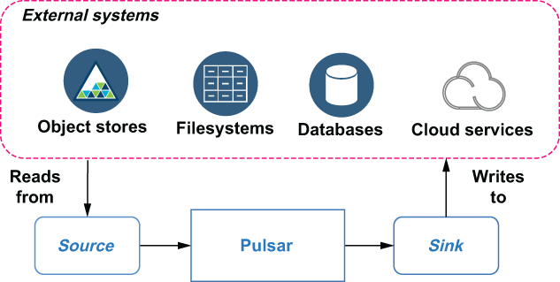
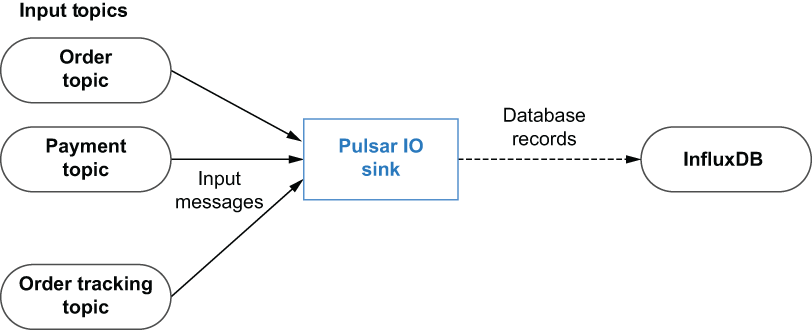
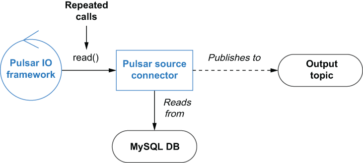
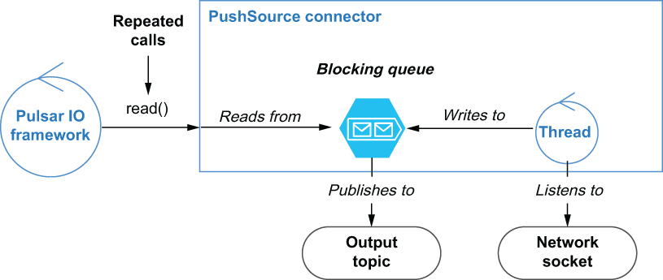
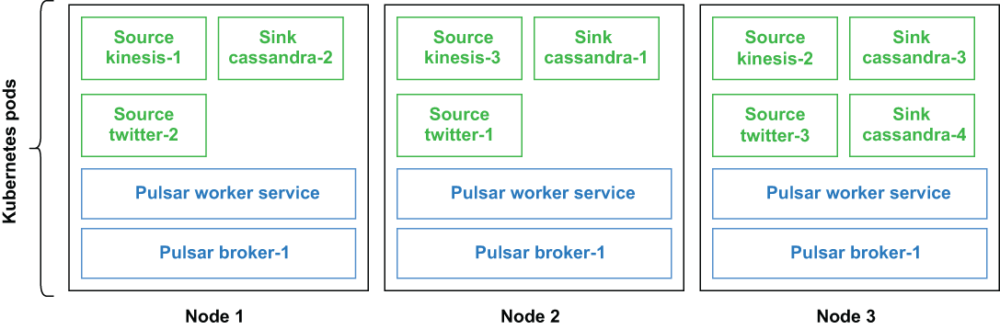

# Pulsar IO 连接器
本章涵盖

- Pulsar IO 框架介绍
- 配置、部署和监控 Pulsar IO 连接器
- 用 Java 编写你自己的 Pulsar IO 连接器

当你可以轻松地使用消息系统将数据移入和移出其他外部系统（例如数据库、本地和分布式文件系统或其他消息系统）时，消息系统会更加有用。考虑你希望从外部来源（例如应用程序、平台和基于云的服务）摄取日志数据并将其发布到搜索引擎进行分析的场景。这可以通过一对 Pulsar IO 连接器轻松实现；第一个是收集应用程序日志的 Pulsar 源，第二个是将格式化记录写入 Elasticsearch 的 Pulsar sink。

Pulsar 提供了一组预构建的连接器，可用于与外部系统交互，例如 Apache Cassandra、Elasticsearch 和 HDFS，仅举几例。 Pulsar IO 框架也是可扩展的，它允许你开发自己的连接器以根据需要支持新系统或旧系统。

## 5.1 什么是 Pulsar IO 连接器？

Pulsar IO 连接器框架为开发人员、数据工程师和操作员提供了一种将数据移入和移出 Pulsar 消息传递平台的简单方法，而无需编写任何代码或成为 Pulsar 和外部系统的专家。从实现的角度来看，Pulsar IO 连接器只是专门构建的 Pulsar 函数，旨在通过可扩展的 API 接口与外部系统进行交互。

将此与必须在使用 Pulsar Java 客户端的 Java 类中实现与外部系统（例如 MongoDB）交互的逻辑的场景进行比较。你不仅需要熟悉 MongoDB 和 Pulsar 的客户端界面，而且还要承担部署和监控现在是应用程序堆栈关键部分的单独进程的操作负担。 Pulsar IO 力求使进出 Pulsar 的数据移动不那么麻烦。



图 5.1 Sources 消费来自外部系统的数据，而 sinks 将数据写入外部系统。

Pulsar IO 连接器有两种类型：源，将数据从外部系统摄取到 Pulsar，以及汇，将数据从 Pulsar 输入到外部系统。图 5.1 说明了 Source、Sink 和 Pulsar 之间的关系。

5.1.1 接收器连接器
虽然 Pulsar IO 框架已经为一些最流行的数据系统提供了一组内置连接器，但它的设计考虑了可扩展性，允许用户在开发新系统和 API 时添加新连接器。 Pulsar IO Connectors 背后的编程模型非常简单，大大简化了开发过程。 Pulsar IO sink 连接器可以接收来自一个或多个输入主题的消息。每次将消息发布到任何输入主题时，都会调用 Pulsar sink 的 write 方法。

write 方法的实现负责确定如何处理传入的消息内容和属性，以便将数据写入源系统。图 5.2 所示的 Pulsar sink 可以使用消息内容来确定将记录插入到哪个数据库表中，然后构造并执行相应的 SQL 命令来执行此操作。



图 5.2 Pulsar IO sink 连接器编程模型概述

创建自定义接收器连接器的最简单方法是编写一个实现 org.apache.pulsar.io.core.Sink 接口的 Java 类，如清单 5.1 所示。接口中定义的第一个方法是 open 方法，它在创建接收器连接器时只调用一次，可用于初始化所有必要的资源（例如，对于数据库连接器，你可以创建 JDBC 客户端）。 open 方法还提供了一个名为 config 的输入参数，你可以从中检索所有特定于连接器的设置（例如，数据库连接 URL、用户名和密码）。除了传入的配置对象之外，Pulsar 运行时还为连接器提供了一个 SinkContext，用于提供对运行时资源的访问，就像 Pulsar Functions API 中的 Context 对象一样。

清单 5.1 Pulsar sink 接口

```java
package org.apache.pulsar.io.core;
 
public interface Sink<T> extends AutoCloseable {
    /**
     * Open connector with configuration
     *
     * @param config initialization config
     * @param sinkContext
     * @throws Exception IO type exceptions when opening a connector
     */
    void open(final Map<String, Object> config, 
              SinkContext sinkContext) throws Exception;
 
    /**
     * Write a message to Sink
     * @param record record to write to sink
     * @throws Exception
     */
    void write(Record<T> record) throws Exception;
}
```

接口中定义的另一个方法是 write 方法，它负责从接收器配置的源 Pulsar 主题中消费消息并将数据写入外部源系统。 write 方法接收一个实现 org.apache.pulsar.functions.api.Record 接口的对象，该对象提供处理传入消息时可以使用的信息。值得指出的是，sink 接口扩展了 AutoCloseable 接口，其中包括一个 close 方法定义，可用于在连接器停止之前释放任何资源，例如数据库连接或打开的文件写入器。

清单 5.2 记录接口

```java
package org.apache.pulsar.functions.api
 
public interface Record<T> {
 
    default Optional<String> getTopicName() {           ❶
        return Optional.empty();
    }
 
    default Optional<String> getKey() {                 ❷
        return Optional.empty();
    }
 
    T getValue();                                       ❸
 
    default Optional<Long> getEventTime() {             ❹
        return Optional.empty();
    }
 
    default Optional<String> getPartitionId() {         ❺
        return Optional.empty();
    }
 
    default Optional<Long> getRecordSequence() {        ❻
        return Optional.empty();
    }
 
    default Map<String, String> getProperties() {       ❼
        return Collections.emptyMap();
    }
 
    default void ack() {                                ❽
    }
 
    default void fail() {                               ❾
    }
 
    default Optional<String> getDestinationTopic() {    ❿
        return Optional.empty();
    }
}
```

❶ 如果记录源自某个主题，请报告主题名称。
❷ 如果键有关联，则返回一个键。
❸ 检索记录的实际数据
❹ 从源中检索记录的事件时间
❺ 如果记录来自分区源，则返回其分区 ID。分区 ID 将被 Pulsar IO 运行时用作唯一标识符的一部分，以进行消息重复数据删除并实现一次处理保证。
❻ 如果记录来自顺序源，则返回其记录序列。记录序列将被 Pulsar IO 运行时用作唯一标识符的一部分，以进行消息重复数据删除并实现一次处理保证。
❼ 检索附加到记录的用户定义的属性
❽ 确认记录已被处理。
❾ 向源系统表明该记录处理失败。
❿ 支持基于每条消息的消息路由
记录的执行还应该提供两种方法：ack 和fail。 Pulsar IO 连接器将使用这两种方法来确认已处理的记录和失败的记录。在源连接器中未能确认或失败消息将导致消息被保留，这最终将导致连接器因背压而停止处理。

### 5.1.2 源连接器

Pulsar IO 源连接器负责从外部系统消费数据并将数据发布到配置的输出主题。 Pulsar IO 框架支持两种不同类型的源；第一种是在基于拉的模型上运行的那些。如图 5.3 所示，Pulsar IO 框架重复调用 Source 连接器的 read() 方法将数据从外部源拉入 Pulsar。



图 5.3 Source 连接器的 read() 方法被重复调用，然后从数据库中拉取信息并发布到 Pulsar。

在这种特殊情况下，连接器的 read() 方法内部的逻辑将负责查询数据库，将结果集转换为 Pulsar 消息，并将它们发布到输出主题。当你有一个仅将传入订单写入 MySQL 数据库的旧订单输入应用程序，并且你希望将这些新订单公开给其他系统以进行实时处理和分析时，这种类型的连接器将特别有用。

创建基于拉的源连接器的最简单方法是编写一个实现 org.apache.pulsar.io.core.Source 接口的 Java 类，如清单 5.3 所示。此接口中定义的第一个方法是 open 方法，它在创建源连接器时只调用一次，应该用于初始化所有必要的资源，例如数据库客户端。

open 方法指定了一个名为 config 类型 Map 的输入参数，你可以从中检索所有特定于连接器的设置，例如数据库连接 URL、用户名和密码。此输入参数包含由 —source-config-file 参数指定的文件中指定的所有值，以及用于创建或更新函数的各种开关提供的所有默认配置设置和值。

清单 5.3 Pulsar 源码接口

```java
package org.apache.pulsar.io.core;
 
public interface Source<T> extends AutoCloseable {
   /**
    * Open source with configuration
    *
    * @param config initialization config
    * @param sourceContext
    * @throws Exception IO type exceptions when opening a connector
    */
    void open(final Map<String, Object> config,
           SourceContext sourceContext) throws Exception;
 
    /**
     * Reads the next message from source.
     * If source does not have any new messages, this call should block.
     * @return next message from source. The result should never be null
     * @throws Exception
    */
    Record<T> read() throws Exception;
 
}
```

除了 config 参数，Pulsar 运行时还为连接器提供了 SourceContext。与 Pulsar Function API 中定义的上下文对象非常相似，SourceContext 对象为收集指标、检索有状态属性值等任务提供对运行时资源的访问。

接口中定义的另一个方法是 read 方法，它负责从外部源系统中检索数据并将其发布到目标 Pulsar topic。如果没有要返回的数据，则此方法的实现应阻塞此方法，并且永远不应返回 null。 read() 方法返回一个对象，该对象实现了我们之前在清单 5.2 中看到的 org.apache.pulsar.functions.api.Record 接口。值得指出的是，source 接口还扩展了 AutoCloseable 接口，其中包括一个 close 方法定义，它应该用于在连接器停止之前释放任何资源，例如数据库连接

### 5.1.3 PushSource 连接器

第二种类型的源连接器是那些在基于推送的模型上运行的连接器。这些连接器不断收集数据并将其缓冲在内部阻塞队列中，以最终交付给 Pulsar。从图 5.4 中可以看出，PushSource 连接器通常有一个持续运行的后台线程，它从源系统收集信息并将其缓存在内部队列中。当 Pulsar IO 框架重复调用 Source 连接器的 read() 方法时，该内部队列中的数据就会发布到 Pulsar 中。



图 5.4 PushSource 连接器的后台线程正在运行，该线程正在侦听网络套接字并将其接收到的所有流量推送到阻塞队列。当调用 read() 方法时，数据从阻塞队列中拉出。

在这种特殊情况下，连接器有一个后台线程，它侦听网络套接字上的所有传入流量并将其发布到内部队列。当你从不保留任何信息并且可以在未来的任何时间点定期查询的外部源使用数据时，这种类型的连接器特别有用。网络套接字就是这样一个例子，如果线程没有连接并一直监听，通过该网络连接发送的数据将永远丢失。将此与先前查询数据库的连接器进行对比。在这种情况下，连接器可以在将订单输入数据库后查询数据库，并且仍然检索数据，因为数据库已经保留了它。

创建基于推送的源连接器的最简单方法是编写一个扩展抽象 org.apache.pulsar.io.core.PushSource 类的 Java 类，如下面的清单所示。由于此类实现了 Source 接口，因此你的类必须提供我们在上一节中讨论的所有方法的实现。

清单 5.4 PushSource 类

```java
package org.apache.pulsar.io.core;
/**
 * Pulsar's Push Source interface. PushSource read data from
 * external sources (database changes, twitter firehose, etc)
 * and publish to a Pulsar topic. The reason its called Push is
 * because PushSources get passed a consumer that they
 * invoke whenever they have data to be published to Pulsar.
 */
public abstract class PushSource<T> implements Source<T> {
 
  private LinkedBlockingQueue<Record<T>> queue;
  private static final int DEFAULT_QUEUE_LENGTH = 1000;
 
  public PushSource() {
   this.queue = new LinkedBlockingQueue<>(this.getQueueLength());    ❶
  }
 
  @Override
  public Record<T> read() throws Exception {
   return queue.take();                                              ❷
  }
 
  /**
* Attach a consumer function to this Source. This is invoked by the 
* implementation to pass messages whenever there is data to be 
* pushed to Pulsar.
*
* @param record next message from source which should be sent to 
*  a Pulsar topic
*/
  public void consume(Record<T> record) {
    try {
   queue.put(record);                                                ❸
   } catch (InterruptedException e) {
     throw new RuntimeException(e);
   }
  }
 
  /**
* Get length of the queue that records are push onto
* Users can override this method to customize the queue length
* @return queue length
*/
  public int getQueueLength() {
   return DEFAULT_QUEUE_LENGTH;                                      ❹
  }
}
```

❶ BatchPushSource 使用内部阻塞队列来缓冲消息。
❷ 消息从内部队列中读取，如果没有数据可用，该队列就会阻塞。
❸ 传入的消息存储在内部队列中，如果队列已满则阻塞。
❹ 如果你想增加内部队列的大小，你必须重写这个方法。
PushSource 的关键架构特性是 LinkedBlockingQueue，用于在消息发布到 Pulsar 之前缓冲消息。这个队列允许你有一个持续运行的进程来监听传入的数据并将其发布到 Pulsar。还值得注意的是，内部队列可以限制为所需的大小，这允许你限制 PushSource 连接器的内存消耗。当阻塞队列达到配置的大小限制时，不再有记录可以发布到队列中。这将导致后台线程被阻塞，当队列已满时可能会导致数据丢失。因此，正确调整队列大小很重要。

## 5.2 开发 Pulsar IO 连接器

在上一节中，我介绍了 Pulsar IO 连接器框架提供的 source 和 sink 接口，并对每种方法的作用进行了高层次的讨论。在本节中，我将在此基础上为你介绍开发新连接器的过程。

### 5.2.1 开发接收器连接器

我将从一个非常基本的接收器连接器开始，它接收无尽的字符串值流并将它们写入本地临时文件，如清单 5.5 所示。虽然这个接收器连接器确实有一些限制，特别是你不能将无限的数据流写入单个文件，但它确实是一个很好的例子，可以用来演示开发接收器连接器的过程。

清单 5.5 本地文件 Pulsar IO sink

```java
import org.apache.pulsar.io.core.Sink;                            ❶
 
public class LocalFileSink implements Sink<String> {
   
   private String prefix, suffix;
   private BufferedWriter bw = null;
   private FileWriter fw = null;
 
   public void open(Map<String, Object> config, 
                    SinkContext sinkContext) throws Exception {
 
     prefix = (String) config.getOrDefault("filenamePrefix", "test-out");
     suffix = (String) config.getOrDefault
        ➥ ("filenameSuffix", ".tmp");                               ❷
 
     File file = File.createTempFile(prefix, suffix);             ❸
     fw = new FileWriter(file.getAbsoluteFile(), true);           ❹
     bw = new BufferedWriter(fw);
   }
 
   public void write(Record<String> record) throws Exception {
     try {
        bw.write(record.getValue());                              ❺
        bw.flush();
        record.ack();                                             ❻
     } catch (IOException e) {
        record.fail();                                            ❼
        throw new RuntimeException(e);
     }
   }
 
   public void close() throws Exception {                         ❽
      try {
         if (bw != null)
            bw.close();
         if (fw != null)
           fw.close();
     } catch (IOException ex) {
        ex.printStackTrace();
     }
   }
}
```

❶ 导入源接口。
❷ 从提供的配置属性中检索目标文件名前缀和后缀。
❸ 在临时目录中创建新文件。
❹ 初始化文件和缓冲写入器。
❺ 从传入的记录中检索值，并将其写入打开的文件中。
❻ 确认我们成功处理了消息，因此可以将其清除。
❼ 表示我们无法处理该消息，因此可以保留并稍后重试。
❽ 关闭两个打开的文件流以确保数据刷新到磁盘。
连接器的 open 方法检索用户提供的配置属性，并在主机的临时目录中创建空的目标文件。接下来，实例级 FileWriter 和 BufferedWriter 变量被初始化为指向新创建的目标文件，而 close 方法将在连接器停止时尝试关闭这两个编写器。

每当有新消息到达任何接收器配置的输入主题时，都会调用接收器的 write 方法。该方法在确认消息已成功处理之前，通过 BufferedWriter 的 write 方法将记录值附加到目标文件。万一我们无法将记录的内容写入临时文件，将抛出 IOException ，并且接收器将在传播异常之前使消息失败。

### 5.2.2 开发 PushSource 连接器
接下来，让我们编写一个自定义的基于推送的源连接器，它扫描目录中的新文件并将这些文件的内容逐行发布到 Pulsar，如清单 5.6 所示。我们希望此连接器定期扫描新文件并在文件写入我们正在扫描的目录后立即发布其内容。我们可以通过扩展 PushSource 类来做到这一点，它是源接口的专门实现，旨在使用后台进程连续生成记录。

清单 5.6 一个 PushSource 连接器

```java
import org.apache.pulsar.io.core.PushSource;
  import org.apache.pulsar.io.core.SourceContext;
 
  public class DirectorySource extends PushSource<String> {
    private final ScheduledExecutorService scheduler =
    Executors.newScheduledThreadPool(1);                            ❶
        
    private DirectoryConsumerThread scanner;
 
    private Logger log;
        
@Override
public void open(Map<String, Object> config, SourceContext context) 
  throws Exception {
  String in = (String) config.getOrDefault("inputDir", ".");        ❷
  String out = (String) config.getOrDefault("processedDir", ".");
  String freq = (String) config.getOrDefault("frequency", "10");
 
  scanner = new DirectoryConsumerThread(this, in, out, log);        ❸
  scheduler.scheduleAtFixedRate(scanner, 0, Long.parseLong(freq), TimeUnit.MINUTES);                                             ❹
  log.info(String.format("Scheduled to run every %s minutes", freq));
  }
 
@Override
public void close() throws Exception {
  log.info("Closing connector");
  scheduler.shutdownNow();
}
}
```

❶ 用于运行后台线程的内部线程池
❷ 从传入的配置属性中获取运行时设置。
❸ 创建后台线程，传入对源连接器和配置的引用。
❹ 开始底线。
源连接器的 open 方法检索用户提供的配置属性，指定要从中读取文件的本地目录，然后启动类型为 DirectoryConsumerThread 的后台线程，负责扫描目录并读取每个文件的内容行按行。以下清单中显示的后台线程类将源连接器实例作为其构造方法的参数，然后使用该类将文件内容传递到线程处理方法内的内部阻塞队列。

清单 5.7 DirectoryConsumerThread 进程

```java
import org.apache.pulsar.io.core.PushSource;
 
  public class DirectoryConsumerThread extends Thread {
   private final PushSource<String> source;                           ❶
   private final String baseDir;
   private final String processedDir;
 
public DirectoryConsumerThread(PushSource<String> source, String base, String processed, Logger log) {
  this.source = source;
  this.baseDir = base;
  this.processedDir = processed;
  this.log = log;
}
 
public void run() {
  log.info("Scanning for files.....");
  File[] files = new File(baseDir).listFiles();
  for (int idx = 0; idx < files.length; idx++) {
   consumeFile(files[idx]);                                           ❷
  }
}

private void consumeFile(File file) {
  log.info(String.format("Consuming file %s", file.getName()));
  try (Stream<String> lines = getLines(file)) {                       ❸
    AtomicInteger counter = new AtomicInteger(0);
     lines.forEach(line -> 
        process(line, file.getPath(), counter.incrementAndGet()));    ❹
             
      log.info(String.format("Processed %d lines from %s", 
        counter.get(), file.getName()));
      Files.move(file.toPath(),Paths.get(processedDir)
        .resolve(file.toPath().getFileName()), REPLACE_EXISTING);     ❺
      log.info(String.format("Moved file %s to %s",
        file.toPath().toString(), processedDir));
 
  } catch (IOException e) {
    e.printStackTrace();
  } 
}
 
private Stream<String> getLines(File file) throws IOException {       ❻
  if (file == null) {
     return null;
  } else {
    return Files.lines(Paths.get(file.getAbsolutePath()),
      Charset.defaultCharset());
  }
}
 
private void process(String line, String src, int lineNum) {
  source.consume(new FileRecord(line, src, lineNum));                 ❼
}
}
```

❶ 对 PushSource 连接器的引用
❷ 处理配置的基本目录中的所有文件。
❸ 将每个文件拆分为单独的行。
❹ 单独处理文件中的每一行。
❺ 当我们处理完一个文件后，将它移动到处理过的目录中。
❻ 将给定的文件拆分为单个行的流
❼ 为文件中的每一行文本创建一个新的Record
我还为这个 PushSource 连接器创建了一个新的记录类型 FileRecord，如清单 5.8 所示。这允许我保留一些关于文件内容的额外元数据，包括源文件的名称和行号。这种类型的元数据可用于其他 Pulsar 函数对这些记录的下游处理，因为它允许你按文件名或类型对记录进行排序，或确保你按顺序处理给定文件的行（基于电话号码）。

清单 5.8 FileRecord 类

```java
import org.apache.pulsar.functions.api.Record;
 
public class FileRecord implements Record<String> {
 
  private static final String SOURCE = "Source";
  private static final String LINE = "Line-no";
  private String content;                              ❶
  private Map<String, String> props;                   ❷
 
  public FileRecord(String content, String src, int lineNumber) {
    this.content = content;
    this.props = new HashMap<String, String>();
    this.props.put(SOURCE, srcFileName);
    this.props.put(LINE, lineNumber + "");
  }
 
  @Override
  public Optional<String> getKey() {
    return Optional.ofNullable(props.get(SOURCE));     ❸
  }
 
  @Override
  public Map<String, String> getProperties() {
    return props;                                      ❹
  }
 
  @Override
  public String getValue() {
     return content;                                   ❺
  }
}
```

❶ 此特定行的文件的实际内容
❷ 消息属性
❸ 使用源文件作为基于密钥的订阅等的密钥。
❹ 消息属性公开元数据。
❺ 消息值是原始文件内容本身。
线程的process方法调用PushSource的consume()方法，传入文件内容。正如我们在清单 5.4 中看到的，PushSource 中的 consumer() 方法只是将传入的数据直接写入内部阻塞队列。这将文件内容的读取与 Pulsar 框架对 PushSource 连接器的 read() 方法的调用分离开来。后台线程的使用是 PushSource 连接器的常见设计模式，它从外部系统检索数据，然后调用源的消耗方法将数据推送到输出主题。

## 5.3 测试 Pulsar IO 连接器

在本节中，我将引导你完成开发和测试 Pulsar 连接器的过程。让我们使用清单 5.6 中所示的 DirectorySource 连接器来演示 Pulsar 连接器的软件开发生命周期。此连接器接收用户提供的目录并逐行发布给定目录中所有文件的内容。

虽然此代码相当简单，但我将介绍你在开发用于生产用途的连接器时通常会使用的测试过程。由于这只是普通的 Java 代码，我们可以利用任何现有的单元测试框架（例如 JUnit 或 TestNG）来测试功能逻辑。

### 5.3.1 单元测试

第一步是编写一套单元测试来测试一些更常见的场景，以验证逻辑是否正确并为我们发送的各种句子生成准确的结果。由于此代码使用 Pulsar SDK API，因此我们需要使用 Mocking 库（例如 Mockito）来模拟 SourceContext 对象，如下面的清单所示。

清单 5.9 DirectorySource 单元测试

```java
public class DirectorySourceTest {
    final static Path SOURCE_DIR =
      Paths.get(System.getProperty("java.io.tmpdir"), "source");
   final static Path PROCESSED_DIR = 
     Paths.get(System.getProperty("java.io.tmpdir"),"processed");      ❶
    
   private Path srcPath, processedPath;
   private DirectorySource spySource;                                  ❷
    
   @Mock
   private SourceContext mockedContext;
 
   @Mock
   private Logger mockedLogger;
    
   @Captor
   private ArgumentCaptor<FileRecord> captor;                          ❸
 
   @Before
   public final void init() throws IOException {
      MockitoAnnotations.initMocks(this);
      when(mockedContext.getLogger()).thenReturn(mockedLogger);
      FileUtils.deleteDirectory(SOURCE_DIR.toFile());
      FileUtils.deleteDirectory(PROCESSED_DIR.toFile());               ❹
      srcPath = Files.createDirectory(SOURCE_DIR, 
        PosixFilePermissions.asFileAttribute(
          PosixFilePermissions.fromString("rwxrwxrwx")));
      processedPath = Files.createDirectory(PROCESSED_DIR,
        PosixFilePermissions.asFileAttribute(
          PosixFilePermissions.fromString("rwxrwxrwx")));              ❺
      spySource = spy(new DirectorySource());                          ❻
   }
 
    
      @Test
      public final void oneLineTest() throws Exception {
        Files.copy(getFile("single-line.txt"),Paths.get(srcPath.toString(),
          "single-line.txt"), COPY_ATTRIBUTES);                        ❼
       Map<String, Object> configs = new HashMap<String, Object>();
       configs.put("inputDir", srcPath.toFile().getAbsolutePath());
       configs.put("processedDir", processedPath.toFile().getAbsolutePath());
        
       spySource.open(configs, mockedContext);                         ❽
       Thread.sleep(3000);
        
       Mockito.verify(spySource).consume(captor.capture());            ❾
       FileRecord captured = captor.getValue();                        ❿
       assertNotNull(captured);
       assertEquals("It was the best of times", 
        ➥ captured.getValue());                                        ⓫
       assertEquals("1", captured.getProperties().get(FileRecord.LINE));
       assertTrue(captured.getProperties().get(FileRecord.SOURCE)
         .contains("single-line.txt"));                                ⓬
     }
    
     @Test
     public final void multiLineTest() throws Exception {
       Files.copy(getFile("example-1.txt"),Paths.get(srcPath.toString(),
         "example-1.txt"), COPY_ATTRIBUTES);
       Map<String, Object> configs = new HashMap<String, Object>();
       configs.put("inputDir", srcPath.toFile().getAbsolutePath());
       configs.put("processedDir", processedPath.toFile().getAbsolutePath());
        
       spySource.open(configs, mockedContext);                         ⓭
       Thread.sleep(3000);
        
    Mockito.verify(spySource, times(113)).consume(captor.capture());   ⓮
        
    final AtomicInteger counter = new AtomicInteger(0);
    captor.getAllValues().forEach(rec -> {
      assertNotNull(rec.getValue());
      assertEquals(counter.incrementAndGet() + "", 
        rec.getProperties().get(FileRecord.LINE));    
      assertTrue(rec.getProperties().get(FileRecord.SOURCE)
        .contains("example-1.txt"));                                   ⓯
 
    });
  }
    
  private static Path getFile(String fileName) throws IOException {
     . . .     
  }
}
```

❶ 使用tmp文件夹进行测试
❷ 我们将监视 DirectorySource 连接器。
❸ 捕获 DirectorySource 连接器写入的所有记录的类
❹ 在运行每个测试之前清除 tmp 文件夹。
❺ 创建测试过程中使用的源和处理的文件夹。
❻ 实例化 DirectorySource 连接器。
❼ 将测试文件复制到源目录中。
❽ 运行 DirectorySource 连接器。
❾ 验证是否发布了单个记录。
❿ 检索已发布的记录以进行验证。
⓫ 确认记录内容。
⓬ 验证记录属性。
⓭ 运行 DirectorySource 连接器。
⓮ 验证是否已发布预期数量的记录。
⓯ 验证每个记录的值和属性。
如你所见，这些单元测试涵盖了 Functions 的非常基本的功能，并依赖于 Pulsar 上下文对象的模拟对象的使用。这种类型的测试套件与你编写的用于测试任何不是 Pulsar 函数的 Java 类的测试套件非常相似。

### 5.3.2 集成测试

在我们对单元测试结果感到满意后，我们将想看看 Pulsar 函数在 Pulsar 集群上的表现如何。测试 Pulsar 函数的最简单方法是启动 Pulsar 服务器并使用 LocalRunner 帮助器类在本地运行 Pulsar 函数。在这种模式下，该函数在提交它的机器上作为独立进程运行。当你开发和测试连接器时，此选项是最佳选择，因为它允许你将调试器附加到本地计算机上的连接器进程。为了使用 LocalRunner，你必须首先向你的 maven 项目添加一些依赖项，这会引入 LocalRunner 类，该类用于针对正在运行的 Pulsar 集群测试该功能，如下面的清单所示。

清单 5.10 包括 LocalRunner 依赖项

```xml
<dependencies>
  . . .
  <dependency>
        <groupId>com.fasterxml.jackson.core</groupId>
        <artifactId>jackson-core</artifactId>
        <version>2.11.1</version>
  </dependency>
  <dependency>
    <groupId>org.apache.pulsar</groupId>
    <artifactId>pulsar-functions-local-runner-original</artifactId>
    <version>2.6.1</version>
  </dependency>
</dependencies>
```

接下来，我们需要编写一个类来配置和启动 LocalRunner，如清单 5.11 所示。如你所见，此代码必须首先配置 Pulsar 连接器以在 LocalRunner 上执行，并指定将用于测试的实际 Pulsar 集群实例的地址。访问 Pulsar 集群的最简单方法是像我们之前所做的那样通过在 bash 窗口中运行以下命令来启动 Pulsar Docker 容器： docker run -d -p 6650:6650 -p 8080:8080 —name pulsar apachepulsar /脉冲星独立。这将在容器内以独立模式启动 Pulsar 集群。通常，你会从集成开发环境 (IDE) 内部运行 LocalRunner 测试，以便附加调试器并逐步执行功能代码以识别和解决你遇到的任何错误。

清单 5.11 使用 LocalRunner 测试 DirectorySource

```java
public class DirectorySourceLocalRunnerTest {
  final static String BROKER_URL = "pulsar://localhost:6650";
  final static String OUT = "persistent://public/default/directory-scan"; 
  final static Path SOURCE_DIR =
     Paths.get(System.getProperty("java.io.tmpdir"), "source");
  final static Path PROCESSED_DIR =
     Paths.get(System.getProperty("java.io.tmpdir"), "processed");     ❶
    
  private static LocalRunner localRunner;
  private static Path srcPath, processedPath;
    
  public static void main(String[] args) throws Exception {
    init();
    startLocalRunner();
    shutdown();
  }
    
  private static void startLocalRunner() throws Exception {
    localRunner = LocalRunner.builder()
            .brokerServiceUrl(BROKER_URL)                              ❷
            .sourceConfig(getSourceConfig())                           ❸
            .build();
    localRunner.start(false);
  }
    
  private static void init() throws IOException {
    Files.deleteIfExists(SOURCE_DIR);
    Files.deleteIfExists(PROCESSED_DIR);
    srcPath = Files.createDirectory(SOURCE_DIR,            
      PosixFilePermissions.asFileAttribute(
         PosixFilePermissions.fromString("rwxrwxrwx")));
    processedPath = Files.createDirectory(PROCESSED_DIR,
      PosixFilePermissions.asFileAttribute(
         PosixFilePermissions.fromString("rwxrwxrwx")));               ❹
      
    Files.copy(getFile("example-1.txt"), Paths.get(srcPath.toString(),
      "example-1.txt"), COPY_ATTRIBUTES);                              ❺
  }
    
  private static void shutdown() throws Exception {                    ❻
    Thread.sleep(30000);
    localRunner.stop();
    System.exit(0);
  }
 
  private static SourceConfig getSourceConfig() {           
    Map<String, Object> configs = new HashMap<String, Object>();
    configs.put("inputDir", srcPath.toFile().getAbsolutePath());
    configs.put("processedDir", processedPath.toFile().getAbsolutePath());
        
    return SourceConfig.builder()
        .className(DirectorySource.class.getName())                    ❼
        .configs(configs)                                              ❽
        .name("directory-source")
        .tenant("public")
        .namespace("default")
        .topicName(OUT)                                                ❾
        .build();
  }
    
  private static Path getFile(String fileName) throws IOException {
    . . .                                                              ❿
  }
}
```

❶ 使用tmp文件夹进行测试
❷ 将 LocalRunner 连接到 Docker 容器。
❸ 部署 DirectorySource 连接器。
❹ 创建测试过程中使用的源和处理过的文件夹。
❺ 将测试文件复制到源目录中。
❻ 30 秒后停止 LocalRunner
❼ 指定 DirectorySource 作为我们要运行的连接器。
❽ 配置 DirectorySource 连接器。
❾ 指定源连接器的输出主题
❿ 从项目资源文件夹中读取文件

### 5.3.3 包装 Pulsar IO 连接器

由于 Pulsar IO 连接器是专门的 Pulsar 功能，因此预计它们是独立的软件包。因此，你需要将连接器及其所有依赖项打包为胖 JAR 或 NAR 文件。 NAR 代表 NiFi 存档。它是 Apache NiFi 使用的自定义打包机制，提供 Java ClassLoader 隔离。为了将你的 Pulsar IO 连接器打包为 NAR 文件，所需要做的就是在你的连接器的 maven 项目中包含 nifi-nar-maven-plugin，如下面的清单所示。

清单 5.12 创建一个 NAR 包

```xml
<build>
   ...
   <plugin>
      <groupId>org.apache.nifi</groupId>
      <artifactId>nifi-nar-maven-plugin</artifactId>
      <version>1.2.0</version>
      <extensions>true</extensions>
      <executions>
         <execution>
            <phase>package</phase>
            <goals>
               <goal>nar</goal>
            </goals>
         </execution>
      </executions>
    </plugin>
</build>
```

清单 5.12 中的构建插件用于生成 NAR 文件，默认情况下，该文件包含生成的存档文件中的所有项目依赖项。这是捆绑和部署基于 Java 的 Pulsar IO 连接器的首选方法。将此插件添加到你的 pom.xml 文件后，你需要做的就是运行 mvn clean install 命令来生成一个 NAR 文件，该文件可用于将你的连接器部署到生产 Pulsar 集群上。将连接器及其所有依赖项打包到 NAR 文件中后，下一步是将连接器部署到 Pulsar 集群。

## 5.4 部署 Pulsar IO 连接器

作为专用的 Pulsar 函数，IO 连接器利用相同的运行时环境，提供 Pulsar Functions 框架的所有优点，包括容错、并行性、弹性、负载平衡、按需更新等等。关于部署选项，你可以让 Pulsar IO 连接器在你的本地开发机器上、在本地运行模式下、在 Pulsar 集群中的函数工作器内或在集群模式下运行。在上一节中，我们使用 LocalRunner 在 localrun 模式下运行我们的连接器。在本节中，我将引导你完成运行我们在集群模式下开发的 DirectorySource 连接器的过程。



图 5.5 Pulsar IO 连接器在 Kubernetes 上的部署

图 5.5 显示了 Kubernetes 环境中的集群模式部署，其中每个连接器与其他非连接器功能实例一起在自己的容器中运行。在集群模式下，Pulsar IO 连接器利用 Pulsar Functions 运行时调度程序提供的容错能力来处理故障。如果连接器在一台出现故障的机器上运行，Pulsar 将自动尝试在集群中剩余的运行节点之一上重新启动任务。

#### 5.4.1 创建和删除连接器

如果你还没有这样做，请运行 mvn clean install 命令为 DirectorySource 连接器创建 NAR 文件。此外，你将需要停止任何正在运行的 Docker Pulsar 容器，因为你需要使用一些额外的参数启动一个新实例，以便你从 Pulsar Docker 容器内部访问 NAR 文件，如下面的清单所示。

清单 5.13 启动带有挂载卷的 Pulsar Docker 容器

```sh
$ export GIT_PROJECT=<CLONE_DIR>/pulsar-in-action/chapter5   ❶
$ docker run --name pulsar -id \
  -p 6650:6650 -p 8080:8080 \
  -v $GIT_PROJECT:/pulsar/dropbox                            ❷
  apachepulsar/pulsar-standalone
```

❶ 将其设置为你克隆图书相关存储库的目录。
❷ 使项目目录在 Docker 容器内可访问
从清单 5.13 中可以看出，我们在用于启动 Pulsar Docker 容器的常用命令中添加了 -v 开关。该开关将你将本章的源代码克隆到你的机器上的本地目录安装到 Docker 容器本身内名为 /pulsar/dropbox 的文件夹中。这是部署连接器所必需的，因为 NAR 文件必须能够被 Pulsar 集群物理访问才能部署。我们还将使用这个挂载目录来访问创建连接器时必须提供的配置文件。

你可能已经注意到，我们一直在单元和集成测试中为配置属性提供硬编码值，但是在部署到生产时，我们希望以更动态的方式指定这些值。这是配置文件的用武之地，因为它允许我们指定特定于连接器的配置以及其他标准连接器属性，例如并行性。

清单 5.14 DirectorySource 连接器配置文件的内容

```ini
tenant: public
namespace: default
name: directory-source
 
className: com.manning.pulsar.chapter5.source.DirectorySource
topicName: "persistent://public/default/directory-scan"
parallelism: 1
processingGuarantees: ATLEAST_ONCE
 
# Connector specific config
configs:
    inputDir: "/tmp/input"
    processedDir: "/tmp/processed"
    frequency: 10
```

如清单 5.14 所示，我们将用于部署连接器的配置文件包含源目录和已处理目录的值，以及 Pulsar IO 框架用于创建 Pulsar IO 连接器的几个属性。当你想要创建新的源连接器时，配置文件将提供给 bin/pulsar-admin source create 命令，如下面的清单所示。

清单 5.15 create 命令的输出

```sh
docker exec -it pulsar mkdir -p /tmp/input
docker exec -it pulsar chmod a+w /tmp/input
docker exec -it pulsar mkdir -p /tmp/processed   
docker exec -it pulsar chmod a+w /tmp/processed 
docker exec -it pulsar cp /pulsar/dropbox/src/test/resources/example-1.txt 
➥ /tmp/input                                                          ❶
 
docker exec -it pulsar /pulsar/bin/pulsar-admin source create \        ❷
 --archive /pulsar/dropbox/target/chapter5-0.0.1.nar \                 ❸
 --source-config-file /pulsar/dropbox/src/main/resources/config.yml    ❹
 
"Created successfully"                                                 ❺
 
docker exec -it pulsar /pulsar/bin/pulsar-admin source list            ❻
[
  "directory-source"
]
```

❶ 在容器内创建输入和输出文件夹，并复制一个测试文件。
❷ 使用源，创建一个命令来创建连接器。
❸ 指定包含源连接器类的 NAR 文件
❹ 指定要使用的配置文件
❺ 一条响应消息，指示源已创建
❻ 列出活动源连接器以确认它已创建。
当你创建连接器时，你应该会收到一条令人放心的“已成功创建”消息，表明连接器已成功启动。如果你没有收到成功消息，你将需要调试错误，如下一节所述。

### 5.4.2 调试已部署的连接器

如果你在已部署的 Pulsar IO 连接器中遇到任何错误或意外行为，开始调试的最佳位置是运行连接器的 Pulsar 工作节点上的日志文件。默认情况下，连接器的所有启动信息和捕获的 stderr 输出都会写入日志文件。该文件的名称基于连接器名称并在生产环境中匹配以下模式：logs/functions/tenant/namespace/function-name/function-name-instance-id .log。在我们目前使用的独立模式下，基本目录是 /tmp 而不是 /logs，其余路径保持不变。让我们检查一下我们在上一节中创建的 DirectorySource 连接器的日志文件，如下面的清单所示，并查看一些可用于调试的信息。

清单 5.16 DirectorySource 日志文件的第一部分

```sh
cat /tmp/functions/public/default/directory-source/
➥ directory-source-0.log                                            ❶
 
20:53:30.671 [main] INFO
➥ org.apache.pulsar.functions.runtime.JavaInstanceStarter - JavaInstance 
➥ Server started, listening on 36857
20:53:30.676 [main] INFO  
➥ org.apache.pulsar.functions.runtime.JavaInstanceStarter - 
➥ Starting runtimeSpawner
20:53:30.678 [main] INFO  
➥ org.apache.pulsar.functions.runtime.RuntimeSpawner - 
➥ public/default/directory-source-0 RuntimeSpawner starting function
20:53:30.689 [main] INFO  
➥ org.apache.pulsar.functions.runtime.thread.ThreadRuntime - 
➥ ThreadContainer starting function with instance config 
➥ InstanceConfig(instanceId=0, functionId=c368b93f-34e9-4bcf-801f-
➥ d097b1c0d173, functionVersion=247cbde2
-b8b4-45bb-a3cb-8926c3b33217, functionDetails=tenant: "public"       ❷
namespace: "default"
name: "directory-source"
className: "org.apache.pulsar.functions.api.utils.IdentityFunction"
autoAck: true
parallelism: 1
source {
  className: "com.manning.pulsar.chapter5.source.DirectorySource"    ❸
  configs:                                                           ❹
  ➥ "{\"processedDir\":\"/tmp/processed\",\"inputDir\":\"/tmp/input\",
  ➥ \"frequency\":\"2\"}"
  typeClassName: "java.lang.String"
}
sink {
  topic: "persistent://public/default/directory-scan"                ❺
  typeClassName: "java.lang.String"
}
resources {
  cpu: 1.0
  ram: 1073741824
  disk: 10737418240
}
componentType: SOURCE
, maxBufferedTuples=1024, functionAuthenticationSpec=null, port=36857, 
➥ clusterName=standalone, maxPendingAsyncRequests=10
00)
 
...
20:53:31.223 [public/default/directory-source-0] INFO  
➥ org.apache.pulsar.functions.instance.JavaInstanceRunnable - Initialize 
➥ function class loader for function directory-source at function cache 
➥ manager, functionClassLoader: 
➥ org.apache.pulsar.common.nar.NarClassLoader[/tmp/pulsar-nar/chapter5-
➥ 0.0.1.nar-unpacked]                                               ❻
```

❶ 检查连接器的日志文件
❷ 连接器配置详情部分
❸ 连接器类名
❹ 配置图
❺ 输出主题
❻ 我们用于部署连接器的 NAR 文件和版本
日志文件的第一部分包含连接器的基本信息，如租户、命名空间、名称、并行度、资源等，可用于检查连接器是否已正确配置。在日志文件的更下方，你应该会看到一条消息，指示连接器是从哪个工件文件创建的，这使你可以确认你使用的是正确的工件文件。

清单 5.17 DirectorySource 日志文件的最后一部分

```java
org.apache.pulsar.client.impl.ProducerStatsRecorderImpl - Starting
 Pulsar producer perf with config: {                                      ❶
  "topicName" : "persistent://public/default/directory-scan",
  "producerName" : null,
  "sendTimeoutMs" : 0,
  ...                                                                     ❷
  "multiSchema" : true,
  "properties" : {
    "application" : "pulsar-source",
    "id" : "public/default/directory-source",
    "instance_id" : "0"
  }
}
20:53:33.704 [public/default/directory-source-0] INFO 
➥ org.apache.pulsar.client.impl.ProducerStatsRecorderImpl 
➥ - Pulsar client config: {                                              ❸
  "serviceUrl" : "pulsar://localhost:6650",
  "authPluginClassName" : null,
  "authParams" : null,
  ...                                                                     ❹
  "proxyProtocol" : null
}
20:53:33.726 [public/default/directory-source-0] INFO  
➥ org.apache.pulsar.client.impl.ProducerImpl - [persistent://public/
default/directory-scan] [null] Creating producer on cnx [id: 0xbcd9978b, 
➥ L:/127.0.0.1:44010 - R:localhost/127.0.0.1:6650]
20:53:33.886 [pulsar-client-io-1-1] INFO  
➥ org.apache.pulsar.client.impl.ProducerImpl - 
➥ [persistent://public/default/direc
tory-scan] [standalone-0-0] Created producer on cnx [id: 0xbcd9978b, 
➥ L:/127.0.0.1:44010 - R:localhost/127.0.0.1:6650]
20:53:33.983 [public/default/directory-source-0] INFO  function-directory-
➥ source - Scheduled to run every 2 minutes                              ❺
20:53:33.985 [pool-6-thread-1] INFO  function-directory-source - Scanning 
➥ for files.....
20:53:33.987 [pool-6-thread-1] INFO  function-directory-source - Processing 
➥ file example-1.txt
20:53:33.987 [pool-6-thread-1] INFO  function-directory-source - Consuming 
➥ file example-1.txt
20:53:34.385 [pool-6-thread-1] INFO  function-directory-source - Processed 
➥ 113 lines from example-1.txt
20:53:34.385 [pool-6-thread-1] INFO  function-directory-source - Moved file 
➥ /tmp/input/example-2.txt to /tmp/processed
```

❶ 源连接器的 Pulsar 生产者
❷ 额外的源连接器属性
❸ Pulsar 客户端配置，包括安全设置
❹ 额外的 Pulsar 客户端配置属性
❺ 记录来自 DirectorySource 连接器的消息
日志文件的下一部分，如清单 5.18 所示，包含一些关于代表连接器创建的 Pulsar 生产者和消费者的信息，将用于发布和消费来自配置的输入和输出主题的数据。此时，任何与其中任何一个有关的连接问题都将导致错误。添加到代码中的所有日志语句都将遵循此部分，并允许你监视连接器的进度或查看引发的任何异常。

当你完成了连接器并且不想让它再运行时，你可以使用 bin/pulsar-admin source delete 命令来停止连接器的所有正在运行的实例。你需要提供的唯一参数是连接器的租户、命名空间和名称，以唯一标识你希望删除的连接器（例如，为了删除我们刚刚创建的源，你只需执行以下命令：bin/pulsar-admin source delete —tenant public —namespace default —name directory-source）。

## 5.5 Pulsar 的内置连接器
Pulsar 提供了各种各样的现有源和接收器，统称为内置连接器，你可以使用它们开始使用 Pulsar IO 连接器框架，而无需编写任何代码。 Pulsar 将所有内置连接器作为单独的档案发布。使用这些连接器所需的只是 Pulsar 集群上的内置连接器存档 (NAR) 文件的副本和一个简单的 YAML 或 JSON 配置文件，该文件指定用于连接到外部系统的运行时参数。如果你在独立模式下运行 Pulsar，就像我们使用 Pulsar 独立 Docker 镜像一样，那么这些内置连接器的单独档案已经作为发行版的一部分包含在内。

让我们来看看一个简单的场景，它使用这些内置连接器将数据从 Pulsar 移动到 MongoDB。虽然这个例子本质上有点简单，但它将展示使用连接器框架是多么容易，并帮助展示部署和使用 Pulsar IO 连接器所需的一些高级步骤。此过程的第一步是创建一个我们可以与之交互的 MongoDB 实例。

### 5.5.1 启动MongoDB集群

以下命令将为我们以分离模式运行最新的 MongoDB 容器。我们还将容器端口与主机端口进行映射，因此我们可以根据需要从本地机器访问数据库。容器启动后，我们将有一个功能强大的 MongoDB 部署可供我们使用：

```sh
$ docker run -d \
  -p 27017-27019:27017-27019 \
  --name mongodb \
  mongo
```

此时，我们将有一个当前以分离模式运行的 MongoDB Docker 容器。接下来，你需要执行 mongo 命令来启动 MongoDB shell 客户端。一旦进入外壳，我们将需要创建一个新的数据库和集合来存储数据。接下来，我们需要创建一个名为 pulsar_in_action 的新数据库，并使用以下清单中显示的命令在数据库中定义一个用于存储数据的集合。

清单 5.18 创建一个 Mongo 数据库表

```sh
docker exec -it mongodb mongo                                    ❶
MongoDB shell version v4.4.1                                     ❷
...
> 
 
 
>use pulsar_in_action;                                           ❸
switched to db pulsar_in_action
 
> db.example.save({ firstname: "John", lastname: "Smith"})       ❹
WriteResult({ "nInserted" : 1 })
 
> db.example.find({firstname: "John"})                           ❺
{ "_id" : ObjectId("5f7a53aedccb229a78960d2c"), "firstname" : "John", 
➥ "lastname" : "Smith" }
```

❶ 启动 MongoDB 交互式 shell。
❷ 在输出中，你应该看到 MongoDB shell 版本。
❸ 创建一个名为 pulsar_in_action 的数据库
❹ 在数据库内部创建一个名为example的集合并定义schema
❺ 查询数据库，确认记录添加成功。
现在我们有一个在本地运行的 MongoDB 集群并创建了一个数据库，我们可以继续配置 MongoDB 接收器连接器。然后它将从 Pulsar 主题读取消息并将消息写入我们创建的 MongoDB 表中。

### 5.5.2 链接 Pulsar 和 MongoDB 容器

由于我们将在 Pulsar Docker 容器内运行 MongoDB Pulsar 连接器，因此两个容器之间必须有网络连接。在 Docker 中完成此操作的最简单方法是在启动 Pulsar 容器时使用 —link 命令行参数。然而，由于我们已经启动了 Pulsar 容器，我们首先需要停止它并删除它，然后再使用 --link 开关重新启动它。因此，在继续之前，你需要执行以下清单中显示的所有命令。

清单 5.19 链接 Pulsar 和 MongoDB 容器的命令

```sh
$ docker stop pulsar                                   ❶
 
$ docker rm pulsar                                     ❷
 
$ docker run -d \
  -p 6650:6650 -p 8080:8080 \
  -v $PWD/data:/pulsar/data \
  --name pulsar \
  --link mongodb \                                     ❸
  apachepulsar/pulsar-standalone
 
$ docker exec -it pulsar bash                          ❹
 
apt-get update && apt-get install vim --fix-missing -y ❺
vim /pulsar/examples/mongodb-sink.yml                  ❻
```

❶ 停止当前运行的 Pulsar 容器
❷ 删除旧的 Pulsar 容器，所以我们可以创建一个同名的新容器
❸ 将 MongoDB 容器链接到 Pulsar 容器
❹ 执行到新的 Pulsar 容器中
❺ 我们需要在 Pulsar 容器中安装 vim 文本编辑器，以便我们可以编辑配置文件。
❻ 在 Pulsar 容器内启动文本编辑器以创建配置文件。
通过在 —link 开关中提供运行我们希望与之交互的 MongoDB 实例的容器的名称，Docker 在两个容器之间创建了一个安全的网络通道，允许 Pulsar 容器通过链接名称与 MongoDB 容器通信。我们将在配置 MongoDB 接收器连接器时看到这一点。

### 5.5.3 配置和创建MongoDB sink

配置 Pulsar IO 连接器很简单。你需要做的就是在创建连接器时提供 YAML 配置文件。为了运行 MongoDB sink 连接器，你需要准备一个 YAML 配置文件，其中包含 Pulsar IO 运行时连接到本地 MongoDB 实例所需的所有信息。首先，你需要在名为 mongodb-sink.yml 的 examples 子目录中创建一个本地文件，并对其进行编辑以使其内容显示在以下清单中。

清单 5.20 MongoDB sink 连接器配置文件

```yaml
tenant: "public"
namespace: "default"
name: "mongo-test-sink"
configs:
    mongoUri: "mongodb://mongodb:27017/admin"   ❶
    database: "pulsar_in_action"                ❷
    collection: "example"                       ❸
    batchSize: 1
    batchTimeMs: 1000
```

❶ 我们可以在这里使用通过 -link 开关指定的名称，而不是主机名或 IP 地址。
❷ 我们必须指定我们要写入的 Mongo 数据库。
❸ 我们必须指定我们要写入的 Mongo 集合。
有关 MongoDB sink 连接器配置的更多信息，请参阅文档 (http://pulsar.apache.org/docs/en/io-mongo/#sink)。 Pulsar 命令行界面提供了用于运行和管理 Pulsar IO 连接器的命令，因此你可以从 Pulsar 容器命令行运行以下清单中显示的命令来启动 MongoDB 接收器连接器。

清单 5.21 启动 MongoDB sink 连接器

```sh
/pulsar/bin/pulsar-admin sink create \                       ❶
   --sink-type mongo \                                       ❷
   --sink-config-file /pulsar/examples/mongodb-sink.yml \    ❸
   --inputs test-mongo                                       ❹
"Created successfully"                                       ❺
```

❶ 使用接收器，创建命令。
❷ 表示我们要为 MongoDB 使用内置的 sink 连接器
❸ 使用我们之前创建的配置文件。
❹ 指定输入主题
❺ 一条响应消息，指示接收器已创建
命令执行后，Pulsar 将创建一个名为 mongo-test-sink 的接收器连接器，接收器连接器将开始将 test-mongo 主题中的消息写入 pulsar_in_action 数据库中的 MongoDB 集合示例。现在，让我们向 test-mongo 主题发送一些消息，通过从 Docker 容器内部执行以下列表中的命令来确认连接器是否按预期运行。

清单 5.22 向连接器的输入主题发送消息

```sh
/pulsar/bin/pulsar-client produce \                    ❶
  -m "{firstname: \"Mary\", lastname: \"Smith\"}" \      ❷
  -s % \                                                 ❸
  -n 10 \                                                ❹
  test-mongo                                             ❺
```

❶ 我们正在生产信息。
❷ 消息内容，包括转义引号
❸ 定义一个非逗号的记录分隔符；否则消息内容将被拆分
❹ 指定我们要发送 10 次相同的消息
❺ 目标话题
你现在可以查询 MongoDB 实例以确认 MongoDB 连接器是否按预期工作。返回到我们之前打开的 MongoDB shell 以创建数据库并运行一些不同的查询以确认记录已按预期添加到 MongoDB 表中，如下面的清单所示。

清单 5.23 发送消息后查询 MongoDB 表

```sh
> db.example.find({lastname: "Smith"})                                 ❶
{ "_id" : ObjectId("5f7a53aedccb229a78960d2c"), "firstname" : "John", 
➥ "lastname" : "Smith" }                                              ❷
{ "_id" : ObjectId("5f7a68bbb94aa03489fa5ca9"), "firstname" : "Mary", 
➥ "lastname" : "Smith" }                                              ❸
{ "_id" : ObjectId("5f7a68bbb94aa03489fa5caa"), "firstname" : "Mary", 
➥ "lastname" : "Smith" }
{ "_id" : ObjectId("5f7a68bbb94aa03489fa5cab"), "firstname" : "Mary", 
➥ "lastname" : "Smith" }
{ "_id" : ObjectId("5f7a68bbb94aa03489fa5cac"), "firstname" : "Mary", 
➥ "lastname" : "Smith" }
{ "_id" : ObjectId("5f7a68bbb94aa03489fa5cad"), "firstname" : "Mary", 
➥ "lastname" : "Smith" }
{ "_id" : ObjectId("5f7a68bbb94aa03489fa5cae"), "firstname" : "Mary", 
➥ "lastname" : "Smith" }
{ "_id" : ObjectId("5f7a68bbb94aa03489fa5caf"), "firstname" : "Mary", 
➥ "lastname" : "Smith" }
{ "_id" : ObjectId("5f7a68bbb94aa03489fa5cb0"), "firstname" : "Mary", 
➥ "lastname" : "Smith" }
{ "_id" : ObjectId("5f7a68bbb94aa03489fa5cb1"), "firstname" : "Mary", 
➥ "lastname" : "Smith" }
{ "_id" : ObjectId("5f7a68bbb94aa03489fa5cb2"), "firstname" : "Mary", 
➥ "lastname" : "Smith" }
```

❶ 按姓氏字段查询。
❷ 我们发布的原始记录
❸ 从我们刚刚发送的消息中创建的新记录的 10 个实例
我们对内置 Pulsar IO 连接器的快速介绍到此结束。现在，你应该对如何配置和部署 Pulsar 连接器以及整个 IO 连接器框架的工作原理有了更好的了解。

## 5.6 管理 Pulsar IO 连接器

pulsar-admin CLI 工具提供了一组命令，使你能够管理、监控和更新 Pulsar IO 连接器。我们将讨论其中一些专门为 Pulsar IO 连接器设计的命令，包括它们的使用方式和时间以及它们提供的信息。值得注意的是，sink 和 source 命令都有完全相同的子命令，所以我们只关注 sink 命令，但这些信息也适用于 source 连接器。

### 5.6.1 列出连接器

我们将看到的第一个命令是 pulsar-admin sink list 命令，它将返回当前在 Pulsar 集群上运行的所有接收器的列表，当你想确保你刚刚创建的连接器被接受并且是跑步。如果你在部署 mongo-test-sink 连接器后运行此命令，则预期输出将类似于以下清单中所示的内容。

清单 5.24 Docker 容器中 list 命令的输出

```sh
docker exec -it pulsar /pulsar/bin/pulsar-admin sink list 
[
  "mongo-test-sink"
]
```

这表明 mongo-test-sink 确实已创建，并且是当前在 Pulsar 集群中运行的唯一接收器连接器。不要将 list 命令与 available-sources 或 available-sinks 命令混淆，后者将返回 Pulsar 集群支持的所有内置连接器的列表。默认情况下，内置连接器包含在 Pulsar 独立 Docker 容器中，因此命令的输出应如下面的清单所示。 available-sinks 命令还可以帮助你确认是否已成功手动安装自定义连接器。

清单 5.25 Pulsar Docker 容器中 available-sinks 命令的输出

```sh
docker exec -it pulsar /pulsar/bin/pulsar-admin sink available-sinks
aerospike
Aerospike database sink
----------------------------------------
cassandra
Writes data into Cassandra
----------------------------------------
data-generator
Test data generator source
----------------------------------------
elastic_search
Writes data into Elastic Search
----------------------------------------
flume
flume source and sink connector
----------------------------------------
hbase
Writes data into hbase table
----------------------------------------
hdfs2
Writes data into HDFS 2.x
----------------------------------------
hdfs3
Writes data into HDFS 3.x
----------------------------------------
influxdb
Writes data into InfluxDB database
----------------------------------------
jdbc-clickhouse
JDBC sink for ClickHouse
----------------------------------------
jdbc-mariadb
JDBC sink for MariaDB
----------------------------------------
jdbc-postgres
JDBC sink for PostgreSQL
----------------------------------------
jdbc-sqlite
JDBC sink for SQLite
----------------------------------------
kafka
Kafka source and sink connector
----------------------------------------
kinesis
Kinesis connectors
----------------------------------------
mongo
MongoDB source and sink connector
----------------------------------------
rabbitmq
RabbitMQ source and sink connector
----------------------------------------
redis
Writes data into Redis
----------------------------------------
solr
Writes data into solr collection
----------------------------------------
```

### 5.6.2 监控连接器

另一个用于监控 Pulsar IO 连接器的有用命令是 pulsar-admin sink status 命令。此命令将返回有关指定连接器的运行时信息，例如正在运行的实例数量以及是否有任何实例遇到错误。

清单 5.26 Sink status 命令的输出

```sh
docker exec -it pulsar /pulsar/bin/pulsar-admin sink status \
 --name mongo-test-sink
{
  "numInstances" : 1,                                   ❶
  "numRunning" : 1,                                     ❷
  "instances" : [ {                                     ❸
    "instanceId" : 0,
    "status" : {
      "running" : true,                                 ❹
      "error" : "",                                     ❺
      "numRestarts" : 0,                                ❻
      "numReadFromPulsar" : 0,                          ❼
      "numSystemExceptions" : 0,
      "latestSystemExceptions" : [ ],
      "numSinkExceptions" : 0,
      "latestSinkExceptions" : [ ],
      "numWrittenToSink" : 0,    
      "lastReceivedTime" : 0,                           ❽
      "workerId" : "c-standalone-fw-d513daf5b94e-8080"
    }
  } ]
}
```

❶ 请求的连接器实例总数
❷ 正在运行的连接器实例总数
❸ 每个实例的信息数组
❹ 连接器的当前状态
❺ 任何适用的错误信息
❻ 连接器尝试重新启动的次数。每当连接器无法启动时，此数字就会增加，并会重新启动。
❼ 此实例从 Pulsar 输入主题消费的消息数
❽ 此实例上次消费传入消息的时间
从清单 5.26 中可以看出，pulsar-admin sink status 命令对于在部署连接器后立即检查连接器的状态以确保它正确启动特别有用。 pulsar-admin sink get 命令可用于返回有关 Pulsar IO 连接器的配置信息，这在你想要检查连接器的配置设置以确保其配置正确时非常有用，如下一个清单所示。

清单 5.27 sink get 命令的输出

```sh
docker exec -it pulsar /pulsar/bin/pulsar-admin sink get \
--name mongo-test-sink
{
  "tenant": "public",
  "namespace": "default",
  "name": "mongo-test-sink",                               ❶
  "className": "org.apache.pulsar.io.mongodb.MongoSink",   ❷
  "inputSpecs": {
    "test-mongo": {                                        ❸
      "isRegexPattern": false                              ❹
    }
  },
  "configs": {                                             ❺
    "mongoUri": "mongodb://mongodb:27017/admin",
    "database": "pulsar_in_action",
    "collection": "example",
    "batchSize": "1.0",
    "batchTimeMs": "1000.0"
  },
  "parallelism": 1,                                        ❻
  "processingGuarantees": "ATLEAST_ONCE",
  "retainOrdering": false,
  "autoAck": true,
  "archive": "builtin://mongo"
}
```

❶ 连接器的租户、命名空间和名称
❷ 连接器实现的类名
❸ sink 连接器的输入主题
❹ 是否将接收器配置为基于某个正则表达式从多个主题中消费
❺ 我们在 sink-config-file 中提供的所有用户定义的配置属性
❻ 所有我们没有指定的属性的默认属性值
使此命令更加有用的原因在于，该命令的输出是格式正确的 JSON 连接器配置，可以将其另存为文件、修改并用于使用 update 命令更新正在运行的连接器的配置。这使你不必保留用于部署特定连接器的配置的副本，因为可以使用此命令轻松地从正在运行的连接器中检索数据。

清单 5.28 更新 Mongo DB 连接器

```sh
/pulsar/bin/pulsar-admin sink update \
   --sink-type mongo \
   --sink-config-file /pulsar/examples/mongodb-sink.yml \
   --inputs prod-mongo \
   --processing-guarantees EFFECTIVELY_ONCE
```

pulsar-admin sink update 命令允许你动态更改已提交的 sink 连接器的配置参数，而无需删除和重新创建它。 update 命令接受各种命令行选项，Apache 文档 (pulsar.apache.org/docs/en/pulsar-admin/) 中对这些选项进行了更详细的描述，这些选项允许你更改几乎所有连接器的配置，包括存档文件，如果你想部署新版本的连接器。这使得修改、测试和部署过程更加简化。代码清单 5.28 展示了如何更新我们之前部署的 Mongo sink 连接器以使用不同的 Pulsar 主题作为输入源并更改处理保证。

我们对一些可用于监控和管理 Pulsar IO 连接器的命令的快速介绍到此结束。我的目标是提供足够的框架本身提供的功能的高级概述，使你能够开始使用。我强烈建议你参考在线文档，了解有关每个命令的各种开关和参数的详细信息。

## 概括
Pulsar IO 连接器是 Pulsar Functions 框架的扩展，专门设计用于与数据库等外部系统接口。
Pulsar IO 连接器有两种基本类型：源，将数据从外部系统提取到 Pulsar，以及汇，将数据从 Pulsar 发布到外部系统。
Pulsar 提供了一组内置连接器，你可以使用它们与多个流行系统进行交互，而无需编写任何代码。
Pulsar CLI 工具允许你管理 Pulsar IO 连接器，包括创建、删除和更新连接器。