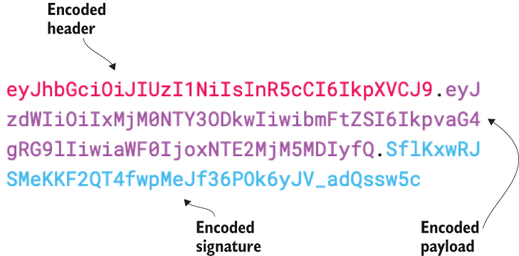
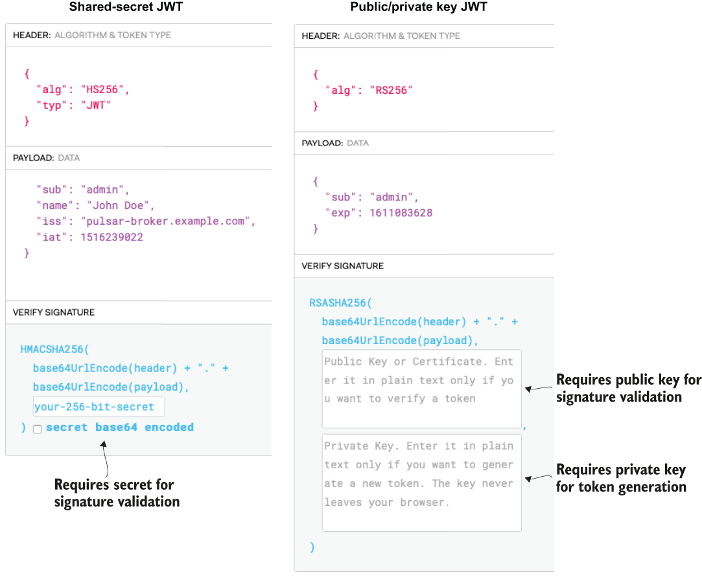
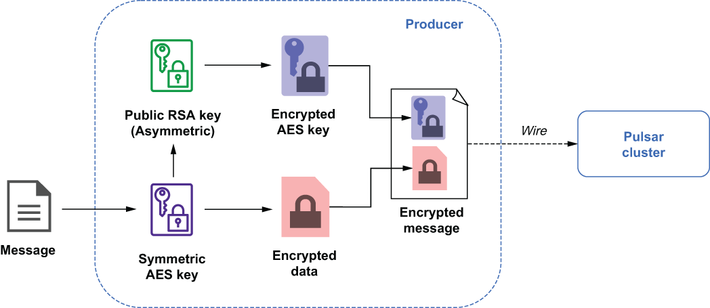
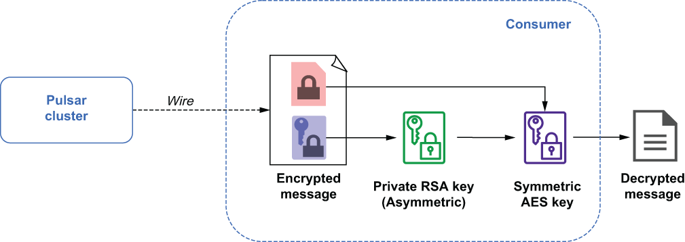

# Pulsar 安全

本章涵盖

- 加密传入和传出 Pulsar 集群的数据
- 使用 JSON Web 令牌 (JWT) 启用客户端身份验证
- 加密存储在 Apache Pulsar 中的数据

本章介绍如何保护你的集群，以防止对通过 Apache Pulsar 发送的数据进行未经授权的访问。虽然我将要介绍的任务在开发环境中并不重要，但它们对于生产部署至关重要，可以降低未经授权访问敏感信息的风险，确保防止数据丢失，并保护组织的公共声誉。现代系统和组织利用安全控制和保护措施的组合来提供多层防御，以防止访问系统内的数据。对于那些必须遵守安全法规（例如 HIPPA、PCI-DSS 或 GDPR，仅举几例）的人来说尤其如此。

Pulsar 与几个现有的安全框架很好地集成，允许你利用这些工具在多个级别保护你的 Pulsar 集群，以降低其中一种安全机制失效的风险，从而导致整体安全故障。例如，即使未经授权的用户能够使用泄露的密码访问你的系统，他们仍然需要有效的加密密钥来读取加密的消息数据。

## 6.1 传输加密

默认情况下，Pulsar 代理和 Pulsar 客户端之间传输的数据以纯文本形式发送。这意味着消息中包含的任何敏感数据（例如密码、信用卡号和社会保险号）在通过网络传输时都容易被窃听者拦截。因此，第一层防御是确保 Pulsar Broker 和 Pulsar 客户端之间传输的数据在传输之前经过加密。

Pulsar 允许你将所有通信配置为使用传输层安全性 (TLS)，这是一种常见的加密协议，仅在数据通过网络传输时提供数据加密。这就是为什么它通常被称为“动态数据”的加密——数据在接收端解密，因此一旦到达目的地就不再加密。

#### 在 Pulsar 上启用 TLS

现在我已经在相当高的层次上介绍了 TLS 有线加密的基础知识，让我们关注我们如何使用这项技术来保护我们的 Pulsar 经纪人和客户之间的通信。由于 Pulsar 文档很好地概述了在 Pulsar 上启用 TLS 所需的步骤，因此我决定，与其在此处重新发布相同的步骤，我将在单个脚本中捕获所有这些步骤，该脚本可用于自动执行在基于 Docker 的映像中进行处理。

然后我将更详细地讨论脚本中包含的命令，因为它们与我们在上一节中的讨论有关，因此你可以更好地理解为什么这些步骤很重要，以及如何修改它们以满足你的需求真正的生产环境。如果你查看与本书相关的 GitHub 存储库 (https://github.com/david-streamlio/pulsar-in-action)，你会在 docker-image/ 下找到类似于清单 6.1 中所示的 DockerfilePulsar独立文件夹。

对于那些不熟悉 Docker 的人来说，Dockerfile 是一个简单的文本文件，其中包含一系列指令，这些指令在创建镜像时由 Docker 客户端按顺序执行。它们可以被认为是构建 Docker 镜像的方法或蓝图，并提供了一种自动化镜像创建过程的简单方法。现在我们对 Docker 镜像有了更好的理解，是时候创建我们自己的镜像了。我们的目标是创建一个图像，扩展我们之前使用的Pulsar独立图像的功能，包括我将在本章中讨论的所有安全功能。

清单 6.1 Dockerfile 内容

```dockerfile
FROM apachepulsar/pulsar-standalone:latest                            ❶
ENV PULSAR_HOME=/pulsar
 
COPY conf/standalone.conf $PULSAR_HOME/conf/standalone.conf           ❷
COPY conf/client.conf $PULSAR_HOME/conf/client.conf                   ❸
 
ADD manning $PULSAR_HOME/manning                                      ❹
 
RUN chmod a+x $PULSAR_HOME/manning/security/*.sh \
           $PULSAR_HOME/manning/security/*/*.sh \
              $PULSAR_HOME/manning/security/authentication/*/*.sh     ❺
 
#####################################################################
# Transport Encryption using TLS
#####################################################################
RUN ["/bin/bash", "-c", 
     "/pulsar/manning/security/TLS-encryption/enable-tls.sh"]         ❻
```

❶ 使用现有的 pulsar-standalone 图像作为起点，有效地扩展其功能。
❷ 用包含我们更新的安全设置的配置覆盖代理配置。
❸ 用包含我们更新的客户端凭据的配置覆盖客户端配置。
❹ 将 manning 文件夹的内容复制到 /pulsar/manning 的镜像中。
❺ 为我们需要执行的所有脚本赋予执行权限。
❻ 执行指定的脚本，生成TLS所需的证书。
我将首先通过使用 FROM 关键字指定我希望使用非安全的 apachxpulsar/pulsar-standalone:latest 图像作为基本图像。对于那些熟悉面向对象语言的人来说，这实际上与从基类继承相同。基础镜像的所有服务、功能和配置都自动包含在我们的镜像中，这确保了我们的 Docker 镜像也将提供完整的 Pulsar 环境用于测试目的，而无需在我们的 Dockerfile 中复制这些命令。

设置 PULSAR_HOME 环境变量后，我使用 COPY 关键字将 Pulsar 代理和客户端配置文件替换为正确配置以保护 Pulsar 实例的文件。这是重要的一步，因为一旦基于此映像的容器启动，就不可能更改这些设置并使它们生效。接下来，我们将 manning 目录的内容添加到 Docker 镜像中，并运行一个命令来启用对上一个命令中添加的所有 bash 脚本的执行权限，以便我们可以执行它们。

Dockerfile 的末尾是一系列 bash 脚本，这些脚本被执行以生成保护 Pulsar 集群所需的必要安全凭证、证书和密钥。让我们检查第一个名为 enable-tls.sh 的脚本，它执行在 Pulsar 集群上启用 TLS 线路加密所需的所有步骤。

pulsar-standalone Docker 镜像包括 OpenSSL，它是一个开源库，提供了几个用于颁发和签署数字证书的命令行工具。由于我们是在开发环境中运行，我们将使用这些工具作为我们自己的证书颁发机构来制作自签名证书，而不是使用国际信任的第三方证书颁发机构（CA）（例如，VeriSign、DigiCert）来签名我们的证书。在生产环境中，你应该始终依赖第三方 CA。

充当 CA 意味着处理私钥和公共证书的加密对。我们将创建的第一个密码对是根对。这包括根密钥 (ca.key.pem) 和根证书 (ca.cert.pem)。这对构成了你的 CA 的身份。让我们检查 enable-tls.sh 脚本的第一部分，它生成这些。从下面的清单中可以看出，脚本中的第一个命令生成根密钥，而第二个命令使用上一步中生成的根密钥创建公共 X.509 证书。

清单 6.2 enable-tls.sh 创建 CA 的部分

```sh
#!/bin/bash
 
export CA_HOME=$(pwd)
export CA_PASSWORD=secret-password                                        ❶
 
mkdir certs crl newcerts private
chmod 700 private/
touch index.txt index.txt.attr
echo 1000 > serial
 
# Generate the certificate authority private key
openssl genrsa -aes256 \                                                  ❷
   -passout pass:${CA_PASSWORD} \                                         ❸
   -out /pulsar/manning/security/cert-authority/private/ca.key.pem \
   4096                                                                   ❹
 
# Restrict Access to the certificate authority private key   
chmod 400 /pulsar/manning/security/cert-authority/private/ca.key.pem      ❺
 
# Create the X.509 certificate.
openssl req -config openssl.cnf \
  -key /pulsar/manning/security/cert-authority/private/ca.key.pem \       ❻
  -new -x509 \                                                            ❼
  -days 7300 \                                                            ❽
  -sha256 \
  -extensions v3_ca \
  -out /pulsar/manning/security/cert-authority/certs/ca.cert.pem \
  -subj '/C=US/ST=CA/L=Palo Alto/CN=gottaeat.com' \                       ❾
  -passin pass:${CA_PASSWORD}❿
```

❶ 我们使用环境变量来设置 CA 根密钥的密码。
❷ 使用 AES 256 位加密对根密钥进行加密。
❸ 生成用强密码保护的私钥
❹ 使用 4096 位作为根密钥。
❺ 任何拥有根密钥和密码的人都可以颁发可信证书。
❻ 使用根密钥生成根证书
❼ 申请新的 X.509 证书
❽ 给根证书一个很长的有效期。
❾ 指定证书有效的组织。
❿ 允许我们在没有提示的情况下从命令行提供根密钥的密码
此时脚本已经为我们的内部 CA 生成了一个受密码保护的私钥 (ca.key.pem) 和根证书 (ca.cert.pem)。该脚本特意将根证书生成到已知位置，因此我们可以从代理的配置文件 /pulsar/conf/standalone.conf 中引用它。具体来说，我们已经预先配置了 tlsTrustCertsFilePath 属性以指向生成根证书的位置。在你使用第三方 CA 的生产环境中，你将获得一个证书，该证书可用于验证 X.509 证书并将属性更新为指向该证书。

现在我们已经创建了一个 CA 证书，下一步是为 Pulsar broker 生成一个证书并使用我们的内部 CA 对其进行签名。使用第三方 CA 时，你会向他们发出此请求并等待他们向你发送证书；但是，由于我们是自己的证书颁发机构，因此我们可以自己颁发证书，如下面的清单所示。

清单 6.3 enable-tls.sh 生成 Pulsar broker 证书的部分

```sh
export BROKER_PASSWORD=my-secret                                        ❶
 
# Generate the Server Certificate private key
openssl genrsa -passout pass:${BROKER_PASSWORD} \                       ❷
      -out /pulsar/manning/security/cert-authority/broker.key.pem \
      2048                                                              ❸
 
# Convert the key to PEM format
openssl pkcs8 -topk8 -inform PEM -outform PEM \                         ❹
      -in /pulsar/manning/security/cert-authority/broker.key.pem \
      -out /pulsar/manning/security/cert-authority/broker.key-pk8.pem \
      -nocrypt
 
# Generate the server certificate request       
openssl req -config /pulsar/manning/security/cert-authority/openssl.cnf \
      -new -sha256 \
      -key /pulsar/manning/security/cert-authority/broker.key.pem \
      -out /pulsar/manning/security/cert-authority/broker.csr.pem \
      -subj '/C=US/ST=CA/L=Palo Alto/O=IT/CN=pulsar.gottaeat.com' \     ❺
      -passin pass:${BROKER_PASSWORD}                                   ❻
      
# Sign the server certificate with the CA
openssl ca -config /pulsar/manning/security/cert-authority/openssl.cnf \
      -extensions server_cert \                                         ❼
      -days 1000 -notext -md sha256 -batch \                            ❽
      -in /pulsar/manning/security/cert-authority/broker.csr.pem \
      -out /pulsar/manning/security/cert-authority/broker.cert.pem \
      -passin pass:${CA_PASSWORD}                                       ❾
```

❶ 我们使用环境变量来设置服务器证书私钥的密码。
❷ 生成用强密码保护的私钥
❸ 使用 2048 位作为私钥。
❹ 代理希望密钥采用 PKCS 8 格式。
❺ 指定证书有效的组织和主机名。
❻ 允许我们在没有提示的情况下从命令行提供密钥的密码
❼ 指定此证书旨在供服务器使用。
❽ 给服务器证书一个很长的有效期。
❾ 我们需要提供 CA 私钥的密码，因为我们是 CA。
此时，你有一个代理证书 (broker.cert.pem) 及其关联的私钥 (broker.key-pk8.pem)，你可以将其与 ca.cert.pem 一起用于为你的代理和代理配置 TLS 传输加密节点。同样，脚本特意将代理证书生成到已知位置，因此我们可以从代理的配置文件 /pulsar/conf/standalone.conf 中引用它。让我们来看看为 Pulsar 启用 TLS 所更改的所有属性。

清单 6.4 对 standalone.conf 文件的 TLS 属性更改

```sh
#### To Enable TLS wire encryption #####
tlsEnabled=true
brokerServicePortTls=6651
webServicePortTls=8443
 
# The Broker certificate and associated private key
tlsCertificateFilePath=/pulsar/manning/security/cert-authority/broker
➥ .cert.pem
tlsKeyFilePath=//pulsar/manning/security/cert-authority/broker.key-pk8.pem
 
# The CA certificate
tlsTrustCertsFilePath=/pulsar/manning/security/cert-authority/certs/ca.cert
➥ .pem
 
# Used for TLS negotiation to specify which ciphers we consider safe.
tlsProtocols=TLSv1.2,TLSv1.1
tlsCiphers=TLS_DH_RSA_WITH_AES_256_GCM_SHA384,TLS_DH_RSA_WITH_AES_256_CBC_SHA
```

由于我已启用 TLS 传输加密，因此我还需要配置命令行工具，例如 pulsar-admin 和 pulsar-perf，通过更改 $PULSAR_HOME/conf/client 中的以下属性来与安全的 Pulsar 代理进行通信。 conf 文件，如下面的清单所示。

清单 6.5 对 client.conf 文件的 TLS 属性更改

```sh
#### To Enable TLS wire encryption ##### 
# Use the TLS protocols and ports
webServiceUrl=https://pulsar.gottaeat.com:8443/
brokerServiceUrl=pulsar+ssl://pulsar.gottaeat.com:6651/
 
useTls=true
tlsAllowInsecureConnection=false
tlsEnableHostnameVerification=false
tlsTrustCertsFilePath=pulsar/manning/security/cert-authority/certs/ca.cert.pem
```

如果你还没有这样做，请转到包含 Dockerfile 的目录，然后运行以下命令 docker build 。 -t pia/pulsar-standalone-secure: latest，用于创建 Docker 映像，并按以下清单所示对其进行标记。

清单 6.6 从 Dockerfile 构建 Docker 镜像

```sh
$ cd $REPO_HOME/pulsar-in-action/docker-images/pulsar-standalone         ❶
$ docker build . -t pia/pulsar-standalone-secure:latest                  ❷
Sending build context to Docker daemon  3.345MB
Step 1/7 : FROM apachepulsar/pulsar-standalone:latest 
 ---> 3ed9bffff717                                                       ❸
Step 2/7 : ENV PULSAR_HOME=/pulsar
 ---> Running in cf81f78f5754
Removing intermediate container cf81f78f5754
 ---> 48ea643513ff
Step 3/7 : COPY conf/standalone.conf $PULSAR_HOME/conf/standalone.conf
 ---> 6dcf0068eb40
Step 4/7 : COPY conf/client.conf $PULSAR_HOME/conf/client.conf
 ---> e0f6c81a10c4
Step 5/7 : ADD manning $PULSAR_HOME/manning                              ❹
 ---> e253e7c6ed8e
Step 6/7 : RUN chmod a+x $PULSAR_HOME/manning/security/*.sh
➥ $PULSAR_HOME/manning/security/*/*.sh
➥ $PULSAR_HOME/manning/security/authentication/*/*.sh
 ---> Running in 42d33f3e738b
Removing intermediate container 42d33f3e738b
 ---> ddccc85c75f4
Step 7/7 : RUN ["/bin/bash", "-c", 
➥ "/pulsar/manning/security/TLS-encryption/enable-tls.sh"]              ❺
 ---> Running in 5f26f9626a25
Generating RSA private key, 4096 bit long modulus
.....................++++
....................................................................................................................................................................................................................................................++++
e is 65537 (0x010001)
Generating RSA private key, 2048 bit long modulus
......................+++++
.............................................+++++
e is 65537 (0x010001)
Using configuration from /pulsar/manning/security/cert-authority/openssl.cnf
Check that the request matches the signature
Signature ok
Certificate Details:                                                     ❻
        Serial Number: 4096 (0x1000)
        Validity
            Not Before: Jan 13 00:55:03 2020 GMT
            Not After : Oct  9 00:55:03 2022 GMT                         ❼
        Subject:
            countryName               = US
            stateOrProvinceName       = CA
            organizationName          = gottaeat.com
            commonName                = pulsar.gottaeat.com
        X509v3 extensions:
            X509v3 Basic Constraints:
                CA:FALSE
            Netscape Cert Type:
                SSL Server                                               ❽
            Netscape Comment:
                OpenSSL Generated Server Certificate
            X509v3 Subject Key Identifier:
                DF:75:74:9D:34:C6:0D:F0:9B:E7:CA:07:0A:37:B8:6F:D7:DF:52:0A
            X509v3 Authority Key Identifier:
                keyid:92:F0:6D:0F:18:D4:3C:1E:88:B1:33:3A:9D:04:29:C0:FC:81:29:02
                DirName:/C=US/ST=CA/L=Palo Alto/O=gottaeat.com
                serial:93:FD:42:06:D8:E9:C3:89
 
            X509v3 Key Usage: critical
                Digital Signature, Key Encipherment
            X509v3 Extended Key Usage:
                TLS Web Server Authentication
Certificate is to be certified until Oct  9 00:55:03 2022 GMT (1000 days)
 
Write out database with 1 new entries
Data Base Updated
Removing intermediate container 5f26f9626a25
 ---> 0e7995c14208
Successfully built 0e7995c14208
Successfully tagged pia/pulsar-standalone-secure:latest                 ❾
```

❶ 切换到包含 Dockerfile 的目录。
❷ 命令从 Dockerfile 构建 Docker 镜像，并标记它。
❸ 拉下 apachepulsar/pulsar-standalone:latest image from the public repository
❹ 将 manning 目录的全部内容复制到 Docker 镜像中
❺ 执行 enable-tls.sh 脚本
❻ enable-tls.sh 脚本生成的服务器证书的详细信息
❼ 证书的有效期
❽ 表示生成的证书可以作为服务器证书使用
❾ 成功消息，包括用于引用图像的标签
一旦 enable-tls.sh 脚本被执行并且所有的属性都被配置为指向正确的值，pulsar-standalone 镜像将只接受通过安全 TLS 通道的连接。你可以通过使用清单 6.7 中显示的命令序列来启动具有新 Docker 映像的容器来验证这一点。请注意，我正在使用 -volume 开关在笔记本电脑的 \$HOME 目录和 Docker 容器本身的目录之间创建一个逻辑挂载点。这允许我将仅存在于容器内的 TLS 客户端凭据发布到我们机器上我可以访问它们的位置。接下来，我需要将 shell (ssh) 保护到容器中，并在新启动的 bash 会话中运行 publish-credentials.sh 脚本，以使我可以在本地计算机上的 \${HOME}/exchange 文件夹中使用这些凭据。

清单 6.7 发布 TLS 凭证

```sh
$ docker run -id --name pulsar -p:6651:6651 -p 8443:8443\      ❶
  -volume=${HOME}/exchange:/pulsar/manning/dropbox \           ❷❸
  -t pia/pulsar-standalone-secure:latest                       ❹
$ docker exec -it pulsar bash
$ /pulsar/manning/security/publish-credentials.sh              ❺
$ exit                                                         ❻
```

❶ 使用 SSL 端口 6651 和 8443。
❷ 使用音量开关允许我们将文件从容器复制到我们的本地机器。
❸ 指定我们刚刚构建的镜像
❹ 运行脚本，将生成的凭据复制到我们的本地机器。
❺ 创建用于测试的默认命名空间。
❻ 退出容器。
接下来，我将尝试使用以下 Java 程序通过 TLS 安全端口 (6651) 连接到它，该程序可在与本书相关的 GitHub 存储库中找到。

清单 6.8 使用 TLS 凭证连接到 Pulsar

```sh
import org.apache.pulsar.client.api.*;
public class TlsClient {
    public static void main(String[] args) throws PulsarClientException {
       final String HOME = "/Users/david/exchange";
       final String TOPIC = "persistent://public/default/test-topic";
        
       PulsarClient client = PulsarClient.builder()
          .serviceUrl("pulsar://localhost:6651/")             ❶
          .tlsTrustCertsFilePath(HOME + "/ca.cert.pem")       ❷
          .build();
 
      Producer<byte[]> producer = 
        client.newProducer().topic(TOPIC).create();
        
      for (int idx = 0; idx < 100; idx++) {
        producer.send("Hello TLS".getBytes());
      }        
        System.exit(0);
    }
}
```

❶ 指定pulsar+ssl协议。否则将导致连接失败。
❷ 包含可信 TLS 证书的文件的位置
Pulsar 代理上的 TLS 线加密配置到此结束。从现在开始，与代理的所有通信都将通过 SSL，并且所有流量都将被加密，以防止对 Pulsar 代理发布和消费的消息中包含的数据进行未经授权的访问。你可以对这个容器进行更多实验，但是一旦完成，你应该确保运行 docker stop pulsar && docker rm pulsar 来停止容器并将其删除。这两个步骤都是在下一节中重建 Docker 镜像以在 pulsar-standalone 镜像中启用对身份验证的支持所必需的。

## 6.2 认证

身份验证服务通过提供一些凭据（例如用户名和密码）来验证你声称的身份，从而为用户提供了一种确认其身份的方法。 Pulsar 支持可插拔的身份验证机制，客户端可以使用该机制对自己进行身份验证。目前，Pulsar 支持不同的身份验证提供程序。在本节中，我们将介绍配置 TLS 身份验证和 JWT 身份验证所需的步骤。

### 6.2.1 TLS 认证

在 TLS 客户端身份验证中，客户端使用证书对自己进行身份验证。获取证书需要与 CA 进行交互，CA 将颁发 Pulsar 代理可以信任的证书。要使客户端证书通过服务器的验证过程，其上的数字签名应该由服务器认可的 CA 签名。因此，我使用了上一节中颁发服务器证书的相同 CA 来生成客户端证书，以确保客户端证书是可信的。

对于 TLS 客户端身份验证，客户端会生成一个用于身份验证的密钥对，并将密钥对的私钥保存在安全位置。然后，客户端向受信任的 CA 发出证书请求并接收回 X.509 数字证书。

这些客户端证书通常包含相关信息，如数字签名、到期日期、客户端名称、CA 名称、撤销状态、SSL/TLS 版本号、序列号、通用名称等，所有这些信息都使用 X.509 标准构建. Pulsar 使用证书的通用名称字段将客户端映射到特定角色，用于确定客户端有权执行哪些操作。

当客户端尝试连接到启用了 TLS 身份验证的 Pulsar 代理时，它可以提交客户端证书进行身份验证，作为 TLS 握手的一部分。收到证书后，Pulsar 代理使用它来识别证书的来源并确定是否应授予客户端访问权限。

不要将客户端证书与我们用来启用 TLS 有线加密的服务器证书混淆。两者都是 X.509 数字证书，但它们是两个不同的东西。服务器证书在会话开始时从 Pulsar 代理发送到客户端，并由客户端用于对服务器进行身份验证。另一方面，客户端证书在会话开始时从客户端发送到代理，并由服务器用于对客户端进行身份验证。为了启用基于 TLS 的身份验证，我们将一个命令附加到上一节中的 Dockerfile，该命令执行另一个名为 gen-client-certs.sh 的脚本。此脚本生成可用于身份验证的 TLS 客户端证书，如下面的清单所示。

清单 6.9 更新的 Dockerfile 内容

```dockerfile
FROM apachepulsar/pulsar-standalone:latest    
ENV PULSAR_HOME=/pulsar
 
... 
 
RUN ["/bin/bash", "-c", 
     "/pulsar/manning/security/TLS-encryption/enable-tls.sh"]
 
RUN ["/bin/bash", "-c", 
     "/pulsar/manning/security/authentication/tls/gen-client-certs.sh"]   ❶
#A Same content as shown in figure 6.1
```

❶ 执行指定的脚本，为基于角色的身份验证生成 TLS 客户端证书。
让我们看一下以下清单中的 gen-client-certs.sh 脚本，以确切了解生成可用于与 Pulsar 代理进行身份验证的 TLS 客户端证书所需的步骤。

清单 6.10 gen-client-certs.sh 文件的内容

```sh
#!/bin/bash
 
cd /pulsar/manning/security/cert-authority
export CA_HOME=$(pwd)
export CA_PASSWORD=secret-password
 
function generate_client_cert() {
    
   local CLIENT_ID=$1                                                      ❶
   local CLIENT_ROLE=$2                                                    ❷
   local CLIENT_PASSWORD=$3                                                ❸
 
  # Generate the Client Certificate private key
  openssl genrsa -passout pass:${CLIENT_PASSWORD} \                        ❹
   -out /pulsar/manning/security/authentication/tls/${CLIENT_ID}.key.pem \
   2048
    
  # Convert the key to PEM format
  openssl pkcs8 -topk8 -inform PEM -outform PEM -nocrypt \
   -in /pulsar/manning/security/authentication/tls/${CLIENT_ID}.key.pem \
   -out /pulsar/manning/security/authentication/tls/${CLIENT_ID}-pk8.pem 
 
  # Generate the client certificate request       
  openssl req -config /pulsar/manning/security/cert-authority/openssl.cnf \
   -key /pulsar/manning/security/authentication/tls/${CLIENT_ID}.key.pem  
   -out /pulsar/manning/security/authentication/tls/${CLIENT_ID}.csr.pem \
   -subj "/C=US/ST=CA/L=Palo Alto/O=gottaeat.com/
     ➥ CN=${CLIENT_ROLE}" \                                                 ❺
   -new -sha256 \
   -passin pass:${CLIENT_PASSWORD}                                         ❻
      
  # Sign the server certificate with the CA
  openssl ca -config /pulsar/manning/security/cert-authority/openssl.cnf \
   -extensions usr_cert \                                                  ❼
   -days 100 -notext -md sha256 -batch \
   -in /pulsar/manning/security/authentication/tls/${CLIENT_ID}.csr.pem \
   -out /pulsar/manning/security/authentication/tls/${CLIENT_ID}.cert.pem \
   -passin pass:${CA_PASSWORD}                                             ❽
 
  # Remove the client key and certifcate request once we are finished
  rm -f /pulsar/manning/security/authentication/tls/${CLIENT_ID}.csr.pem
  rm -f /pulsar/manning/security/authentication/tls/${CLIENT_ID}.key.pem
}
 
# Create a certificate for Adam with admin role-level access
generate_client_cert admin admin admin-secret
 
# Create a certificate for the web app with webapp role-level access
generate_client_cert webapp-service webapp webapp-secret
 
# Create a certificate for Peggy who with payment-role level access
generate_client_cert peggy payments payment-secret
 
# Create a certificate for David who needs driver-role level access
generate_client_cert david driver davids-secret
```

❶ 将局部变量 CLIENT_ID 设置为传递给函数调用的第一个参数
❷ 将局部变量 CLIENT_ROLE 设置为传递给函数调用的第二个参数
❸ 将局部变量 CLIENT_PASSWORD 设置为传递给函数调用的第三个参数
❹ 使用 CLIENT_PASSWORD 来保护私钥。
❺ Pulsar 使用与通用名称 (CN) 关联的值来确定客户端的角色。
❻ 我们需要传入与用于生成 CSR 的客户端密钥关联的密码。
❼ 指定我们想要一个客户端证书。
❽ 我们需要提供 CA 密码来批准和签署客户的证书请求。
在生产环境中，客户端将使用自己的私钥生成证书请求，并且只发送 CSR 文件。由于我正在自动化这个过程，我冒昧地为一小群用户生成这些作为脚本的一部分，每个用户都有不同的角色。

此时，我们的 CA 生成并签署了几对私钥和客户端证书，可用于对 pulsar-standalone 实例进行身份验证。以下列表中显示的属性也已添加到 standalone.conf 文件中，以便在代理上启用基于 TLS 的身份验证。

清单 6.11 对 standalone.conf 文件的 TLS 身份验证属性更改

```ini
#### To enable TLS authentication 
authenticationEnabled=true                          ❶
authenticationProviders=org.apache.pulsar.broker.
➥ authentication.AuthenticationProviderTls         ❷
```

❶ 开启认证。
❷ 指定TLS认证提供者
还需要对 client.conf 文件进行更改，如下面的清单所示，它授予所有 Pulsar 命令行工具管理员级别的权限，包括在 Pulsar 命名空间级别定义授权规则的能力。

清单 6.12 TLS 身份验证属性对 client.conf 文件的更改

```ini
## TLS Authentication ##
authPlugin=org.apache.pulsar.client.impl.auth.AuthenticationTls           ❶
authParams=tlsCertFile:/pulsar/manning/security/authentication/tls/
➥ admin.cert.pem,tlsKeyFile:/pulsar/manning/security/authentication/tls/
➥ admin-pk8.pem                                                          ❷
```

❶ 告诉客户端在连接到 Pulsar 时使用 TLS 身份验证
❷ 指定要使用的客户端证书和关联的私钥
让我们通过执行以下清单中显示的命令来重建映像，以包含生成 TLS 客户端证书和启用本节中讨论的基于 TLS 的身份验证所需的更改。

清单 6.13 从 Dockerfile 构建 Docker 镜像

```sh
$ cd $REPO_HOME/pulsar-in-action/docker-images/pulsar-standalone          ❶
$ docker build . -t pia/pulsar-standalone-secure:latest                   ❷
Sending build context to Docker daemon  3.345MB
Step 1/8 : FROM apachepulsar/pulsar-standalone:latest                     ❸
 ---> 3ed9bffff717
...                                                                         ❹
Step 8/8 : RUN ["/bin/bash", "-c", "/pulsar/manning/security/authentication/tls/gen-client-certs.sh"]   ❺
 ---> Running in 5beaabba5865
Generating RSA private key, 2048 bit long modulus                         ❻
........+++++
...................+++++
e is 65537 (0x010001)
Using configuration from /pulsar/manning/security/cert-authority/openssl.cnf
Check that the request matches the signature
Signature ok
Certificate Details:
        Serial Number: 4097 (0x1001)                                      ❼
        Validity
            Not Before: Jan 13 02:47:54 2020 GMT
            Not After : Apr 22 02:47:54 2020 GMT
        Subject:
            countryName               = US
            stateOrProvinceName       = CA
            organizationName          = gottaeat.com
            commonName                = admin                             ❽
   ....    
 
Write out database with 1 new entries
Data Base Updated
Generating RSA private key, 2048 bit long modulus
 
...                                                                         ❾
Successfully built 6ef6eddd675e
Successfully tagged pia/pulsar-standalone-secure:latest                   ❿
```

❶ 切换到包含 Dockerfile 的目录。
❷ 命令从 Dockerfile 构建 Docker 镜像并标记它
❸ 请注意，现在有八个步骤而不是七个步骤。
❹ 执行第 2 步到第 7 步
❺ 执行 gen-client-certs.sh 脚本
❻ 以下节将重复五次——对于每个生成的客户端证书一次。
❼ 每个客户的证书序列号会有所不同。
❽ 通用名称对于每个客户端都会不同，用于将其与特定角色相关联。
❾ 应该再出现四次该节——每个生成的客户端证书都会出现一次。
❿ 成功消息，包括用于引用图像的标签
接下来，我需要再次按照清单 6.7 所示的步骤启动一个基于更新的 Docker 镜像的新容器，通过 ssh 进入容器，并在新启动的 bash 会话中运行 publish-credentials.sh 脚本来制作这些客户端证书我们可以在本地机器上的 ${HOME}/exchange 文件夹中使用。例如，证书文件 admin.cert.pem 和关联的私钥文件 admin-pk8.pem 现在可以一起用于对 pulsar-standalone 实例进行身份验证。接下来，我将尝试使用以下清单中显示的 Java 程序来使用 TLS 身份验证，该程序可在与本书相关的 GitHub 存储库中找到。

清单 6.14 使用 TLS 客户端证书进行身份验证

```java
import org.apache.pulsar.client.api.*;
 
public class TlsAuthClient {
  public static void main(String[] args) throws PulsarClientException {
    final String AUTH = "org.apache.pulsar.client.impl.auth.AuthenticationTls";
    final String HOME = "/Users/david/exchange";
    final String TOPIC = "persistent://public/default/test-topic";
        
    PulsarClient client = PulsarClient.builder()
        .serviceUrl("pulsar+ssl://localhost:6651/")                 ❶
        .tlsTrustCertsFilePath(HOME + "/ca.cert.pem")               ❷
        .authentication(AUTH,                                       ❸
            "tlsCertFile:" + HOME + "/admin.cert.pem," +            ❹
            "tlsKeyFile:" + HOME + "/admin-pk8.pem")                ❺
        .build();
 
    Producer<byte[]> producer = 
      client.newProducer().topic(TOPIC).create();
        
    for (int idx = 0; idx < 100; idx++) {
      producer.send("Hello TLS Auth".getBytes());
    }    
    System.exit(0);
  }
}
```

❶ 使用 Pulsar+ssl 协议。否则将导致连接失败。
❷ 包含可信 TLS 证书的文件的位置
❸ 使用 TLS 认证。
❹ 客户端证书位置
❺ 与客户端证书关联的私钥
TLS 客户端身份验证在服务器跟踪数十万或数百万客户端的情况下非常有用，例如在物联网中，或者在具有数百万安装交换安全信息的移动应用程序中。例如，拥有数十万台 IoT 设备的制造公司可以为每台设备颁发唯一的客户端证书，然后通过让 Pulsar 仅接受客户端提供由公司证书颁发机构签署的有效客户端证书的连接来限制连接到他们的设备.

对于移动应用程序，你希望防止客户的敏感数据（例如信用卡信息）被欺骗你的移动应用程序的人窃取，你可以为每个应用程序安装颁发唯一证书并使用它们进行验证请求来自你的移动应用程序的批准版本，而不是欺骗版本。

### 6.2.2 JSON Web Token 认证

Pulsar 支持使用基于 JWT 的安全令牌对客户端进行身份验证，JWT 是一种标准化格式，用于创建基于 JSON 的访问令牌来断言一个或多个声明。声明是事实陈述或断言。可以在所有 JWT 中找到的两个声明是 iss（颁发者），它标识发布 JWT 的一方，以及 sub，标识 JWT 携带信息的主体或一方。

在 Pulsar 中，JWT 用于对 Pulsar 客户端进行身份验证并将其与某个角色相关联，然后将用于确定它被授权执行哪些操作，例如从给定主题发布或消费。通常，Pulsar 集群的管理员会生成一个 JWT，该 JWT 具有与特定角色（例如，标识令牌所有者的管理员）相关联的 sub 声明。然后，管理员将通过安全通信通道向客户端提供 JWT，然后客户端可以使用该令牌向 Pulsar 进行身份验证并分配给管理员角色。

JWT 标准将 JWT 的结构定义为由以下三部分组成：头部，包含基本信息；有效载荷，其中包含声明；和签名，可用于验证令牌。来自每个部分的数据单独编码并连接在一起，使用句点来描述字段。生成的字符串类似于图 6.1，可以通过 HTTP 轻松传输。

由于 JWT 基于开放标准，因此拥有 JWT 的任何人都可以读取 JWT 的内容。这意味着任何人都可以尝试使用他们自己生成的 JWT 或通过更改拦截的 JWT 并修改一个或多个声明来冒充已验证用户来访问你的系统。这就是签名发挥作用的地方，因为它提供了一种建立整个 JWT 真实性的方法。



图 6.1 编码的 JSON Web 令牌及其对应部分

签名是通过对标头和有效负载进行编码、使用 Base64 URL 编码并将两者与秘密连接在一起来计算的。然后该字符串通过标头中指定的加密散列算法传递。对于 JWT，你可以使用两种加密方案；第一种称为共享秘密方案，其中生成签名的一方和验证签名的一方都必须知道该秘密。由于双方都拥有秘密，因此每一方都可以通过为自己计算签名来验证 JWT 的真实性，并验证他们计算的值是否与 JWT 签名部分中的值相匹配。任何差异都表明令牌已被篡改。当你希望或需要双方能够以安全的方式来回交换信息时，此方案很有用。第二种方案使用非对称公钥/私钥对，其中持有公钥的一方可以验证其收到的任何 JWT 的真实性，持有私钥的一方可以生成有效的 JWT。

有多种在线工具可让你对 JWT 进行编码和解码，图 6.2 显示了一种用于解码两种不同 JWT 的此类工具的并排输出。左侧的输出来自使用共享秘密方案的令牌。如你所见，该工具无需任何额外凭据即可轻松读取令牌的内容。但是，为了验证令牌的签名以确认它没有被篡改，需要使用密钥。



图 6.2 共享密钥与公钥/私钥对签名 JWT 的验证方法

图右侧的输出来自使用非对称方案的 JWT，其内容也可以轻松读取，无需任何额外凭据。但是，需要公钥来验证令牌的签名。仅当你希望使用私钥生成新的 JWT 时，该工具还需要私钥。希望这有助于澄清两者之间的差异，以及为什么需要 JWT 令牌和关联的密钥来配置 Pulsar 代理和客户端以使用 JWT 进行身份验证。

最后，值得一提的是，任何拥有有效 JWT 的人都可以使用它来对 Pulsar 进行身份验证。因此，应该采取足够的预防措施来防止已发布的 JWT 落入不受欢迎的人之手。这包括仅通过 TLS 加密连接发送 JWT 令牌并将 JWT 的内容存储在客户端计算机上的安全位置。为了启用 JWT 身份验证，我们将一个命令附加到上一节中的 Dockerfile，该命令执行另一个名为 gen-tokens.sh 的脚本，该脚本生成可用于身份验证的 JWT，如下面的清单所示。

清单 6.15 更新的 Dockerfile 内容

```dockerfile
FROM apachepulsar/pulsar-standalone:latest    
ENV PULSAR_HOME=/pulsar
 
...                                                                 ❶
 
RUN ["/bin/bash", "-c", 
     "/pulsar/manning/security/authentication/jwt/gen-tokens.sh"]   ❷
```

❶ 内容同图6.9
❷ 执行指定的脚本，生成一些 JWT 令牌，用于基于角色的身份验证。
让我们看一下下面清单中的 gen-token.sh 脚本，以确切了解生成可用于与 Pulsar 代理进行身份验证的 JWT 所需的步骤。

清单 6.16 gen-token.sh 文件的内容

```sh
#!/bin/bash
 
# Create a public/private keypair. 
/pulsar/bin/pulsar tokens create-key-pair \                        ❶
   --output-private-key \
      /pulsar/manning/security/authentication/jwt/my-private.key \
   --output-public-key \
      /pulsar/manning/security/authentication/jwt/my-public.key
   
# Create the token for the admin role
/pulsar/bin/pulsar tokens create --expiry-time 1y \
     --private-key \                                               ❷
       file:///pulsar/manning/security/authentication/jwt/my-private.key \
     --subject admin > /pulsar/manning/security/authentication/jwt/admin-
        ➥ token.txt
 
...                                                                  ❸
```

❶ 我们将使用非对称加密，因此我们需要创建一个密钥对。
❷ 创建一个token，并赋予其主题为admin。
❸ 为其他角色重复令牌创建过程
执行此脚本后，将生成多个 JWT 令牌并作为文本文件存储在 Pulsar broker 上。这些令牌以及公钥需要分发给 Pulsar 客户端，以便它们可用于对 pulsar-standalone 实例进行身份验证。以下清单中显示的属性也在 standalone.conf 文件中进行了修改，以启用基于 JWT 的身份验证。

清单 6.17 JWT 身份验证属性更改为 standalone.conf 文件

```ini
#### JWT Authentication #####
authenticationEnabled=true                              ❶
authorizationEnabled=true                               ❷
authenticationProviders=org.apache.pulsar.broker.authentication.AuthenticationProviderTls,org.apache.pulsar.broker.authentication.AuthenticationProviderToken                          ❸
tokenPublicKey=file:///pulsar/manning/security/authentication/jwt/my-public.key                     ❹
```

❶ 这对于 Pulsar 中的任何身份验证机制都是必需的。
❷ 启用授权。
❸ 将 JWT 令牌提供者附加到身份验证提供者列表中。
❹ 用于签名验证的 JWT 密钥对的公钥位置
如果要使用 JWT 身份验证，则需要对 client.conf 文件进行以下清单中显示的更改。由于我们之前为客户端启用了 TLS 身份验证，我们现在需要将这些属性注释掉，因为客户端一次只能使用一种身份验证方法。

清单 6.18 对 client.conf 文件的 JWT 身份验证属性更改

```ini
#### JWT Authentication #####
authPlugin=org.apache.pulsar.client.impl.auth.AuthenticationToken
authParams=file:///pulsar/manning/security/authentication/jwt/admin-token.txt
 
#### TLS Authentication ####
#authPlugin=org.apache.pulsar.client.impl.auth.AuthenticationTls         ❶
#authParams=tlsCertFile:/pulsar/manning/security/authentication/tls/admin.cert.pem,tlsKeyFile:/pulsar/manning/security/authentication/tls/admin-pk8.pem
```

❶ 注释掉两个 TLS 身份验证属性。
现在，让我们通过执行以下清单中显示的命令来重建映像，以包含生成 JWT 和启用基于 JWT 的身份验证所需的更改。在执行此操作之前，请确保已停止并删除 Pulsar 映像的任何先前运行实例。

清单 6.19 从 Dockerfile 构建 Docker 镜像

```sh
$ cd $REPO_HOME/pulsar-in-action/docker-images/pulsar-standalone    ❶
$ docker build . -t pia/pulsar-standalone-secure:latest             ❷
Sending build context to Docker daemon  3.345MB
Step 1/9 : FROM apachepulsar/pulsar-standalone:latest               ❸
 ---> 3ed9bffff717
....
Step 8/9 : RUN ["/bin/bash", "-c", "/pulsar/manning/security/authentication/jwt/
➥ gen-tokens.sh"]                                                  ❹
Step 9/9 : CMD ["/pulsar/bin/pulsar", "standalone"]
 ---> Using cache
 ---> a229c8eed874
Successfully built a229c8eed874
Successfully tagged pia/pulsar-standalone-secure:latest             ❺
```

❶ 切换到包含 Dockerfile 的目录。
❷ 命令从 Dockerfile 构建 Docker 镜像并标记它
❸ 请注意，现在有 9 个步骤，而不是 8 个。
❹ 执行gen-token.sh脚本
❺ 成功消息，包括用于引用图像的标签
接下来，我们需要再次按照清单 6.7 中显示的步骤基于更新的 Docker 镜像启动一个新容器，ssh 进入容器，并在新启动的 bash 会话中运行 publish-credentials.sh 脚本以使这些 JWT 可用在我们本地机器上的 ${HOME}/exchange 文件夹中发送给我们。接下来，我们将尝试使用以下清单中显示的 Java 程序来使用 JWT 身份验证，该程序可在与本书相关的 GitHub 存储库中找到。

清单 6.20 使用 JWT 进行身份验证

```java
import org.apache.pulsar.client.api.*;
 
public class JwtAuthClient {
public static void main(String[] args) throws PulsarClientException {
    final String HOME = "/Users/david/exchange";
    final String TOPIC = "persistent://public/default/test-topic";
        
    PulsarClient client = PulsarClient.builder()
       .serviceUrl("pulsar+ssl://localhost:6651/")
       .tlsTrustCertsFilePath(HOME + "/ca.cert.pem")
       .authentication(
           AuthenticationFactory.token(() -> {
        try {
          return new String(Files.readAllBytes(
            Paths.get(HOME+"/admin-token.txt")));
        } catch (IOException e) {
          return "";
        }
        })).build();
 
    Producer<byte[]> producer = 
      client.newProducer().topic(TOPIC).create();
        
    for (int idx = 0; idx < 100; idx++) {
      producer.send("Hello JWT Auth".getBytes());
    }        
     System.exit(0);
}
}
```

Pulsar 代理上的身份验证配置到此结束。从现在开始，所有 Pulsar 客户端都需要提供有效的凭据才能进行身份验证。到目前为止，我们只实现了 Pulsar、TLS 和 JWT 支持的四种身份验证机制中的两种。可以按照 Pulsar 在线文档中概述的步骤启用其他身份验证方法。

## 6.3 授权

仅在客户端通过 Pulsar 配置的身份验证提供程序成功进行身份验证后才会发生授权，这决定了你是否有足够的权限访问给定的主题。如果你只启用身份验证，则任何经过身份验证的用户都可以对集群内的任何命名空间或主题执行任何操作。

### 6.3.1 角色

在 Pulsar 中，角色用于定义一组权限，例如访问分配给用户组的特定主题集的权限。 Apache Pulsar 使用配置的身份验证提供程序来建立客户端的身份，然后为该客户端分配角色令牌。然后授权机制使用这些角色令牌来确定允许客户端进行哪些操作。


图 6.3 Pulsar 角色层次结构及其对应的管理任务

角色令牌类似于用于打开锁的物理钥匙。很多人可能都有钥匙的副本，而锁不在乎你是谁，只关心你有正确的钥匙。在 Pulsar 中，角色等级分为三类，每类都有自己的能力和预期用途。从图 6.3 中可以看出，在构建数据时，角色层次结构与 Pulsar 的集群/租户/命名空间层次结构密切相关。让我们更详细地研究这些角色中的每一个。

#### 超级用户

顾名思义，超级用户可以在 Pulsar 集群的任何级别执行任何操作；但是，将租户及其基础命名空间的管理委派给将负责管理该特定租户策略的另一个人被认为是最佳实践。因此，超级用户的主要活动是创建租户管理员，这可以通过 pulsar-admin CLI 执行类似于以下清单中所示的命令来完成。

清单 6.21 创建一个 Pulsar 租户

```sh
$PULSAR_HOME/bin/pulsar-admin tenants create tenant-name \     ❶
   --admin-roles tenant-admin-role \                           ❷
   --allowed-clusters standalone                               ❸
```

❶ 指定租户的名字
❷ 指定租户的租户管理员角色名称
❸ 指定租户所在的集群
这允许超级用户专注于集群范围的管理任务，例如集群创建、代理管理和配置租户级资源配额，以确保所有租户都能获得公平的集群资源份额。通常，租户的管理权交给负责设计租户所需主题布局的用户，例如部门主管、项目经理或应用程序团队负责人。

#### 租户管理员

租户管理员的主要关注点是其租户内命名空间的设计和实现。正如我之前所讨论的，名称空间只不过是具有相同策略要求的主题的逻辑集合。命名空间级策略适用于给定命名空间内的每个主题，并允许你配置数据保留策略、积压配额和分层存储卸载等内容。

#### 客户

最后是客户端角色，它可以是任何已被授予使用 Pulsar 集群从主题消费或生产主题的权限的应用程序或服务。这些权限由租户管理员在命名空间级别授予，这意味着它们适用于特定命名空间中的所有主题，或基于每个主题。清单 6.22 显示了这两种情况的示例。

### 6.3.2 示例场景

假设你在一家名为 GottaEat 的食品配送公司工作，该公司允许客户从各种参与的餐厅订购食品，并将其直接交付给你。贵公司决定聘请私人运送食物以降低成本，而不是雇用自己的司机车队。该公司将使用三个独立的移动应用程序来开展业务：一个面向客户的公开应用程序、一个面向所有参与餐厅的受限应用程序以及一个面向所有授权送货司机的受限应用程序。

#### 下单用例
接下来，让我们为你的公司介绍一个非常基本的用例，即客户下订单，一直到将订单分配给驱动程序以使用基于微服务的应用程序交付，该应用程序使用 Apache Pulsar 进行通信消息。我们将重点介绍如何在餐馆老板和司机租户下构建命名空间，以及你想要授予的权限。微服务租户会被多个租户使用，因此由应用团队创建和管理。图 6.4 显示了订单输入用例中的整体消息流。


图 6.4 下单用例期间的消息流

在这个用例中，客户使用公司的移动应用程序选择一些食品，输入所需的送货地址，提供他们的付款信息，然后提交请求。订单信息由移动应用发布到persistent://microservices/orders/new 主题。

支付验证微服务消费入站订单并与信用卡支付系统通信以确保商品的支付，然后在persistent://microservices/orders/paid 主题中下订单以指示商品的支付已被捕获。该服务还使用内部跟踪 ID 替换原始信用卡信息，稍后用于访问付款。

餐厅分配微服务负责通过从persistent://microservices/orders/paid 主题中消费并根据食品和交付位置确定候选餐厅的子集，从而找到可以满足订单的餐厅。然后，它通过将订单详细信息发布到只有他们可以访问的特定餐厅主题（例如，persistent://restaurateurs/offers/restaurant_4827）来向这些餐厅中的每家发送报价，以确保订单仅由一家餐厅履行。如果报价被拒绝，或者经过一定时间后，报价将被取消并发送到列表中的下一家餐厅，直到它被满足。一旦餐厅通过其移动应用程序接受订单，一条包含餐厅详细信息（包括位置）的消息将发布到persistent://microservices/orders/accepted 主题。

一旦订单被接受，驱动程序分配微服务将使用来自接受主题的消息，并尝试定位可以将订单交付给客户的驱动程序。它根据他们的位置、计划的路线等选择潜在司机的列表，并将消息发布到只有司机可以访问的主题（例如，persistent://drivers/offers/driver_5063）以确保订单仅分派给一个司机。如果报价被拒绝，或者经过一定时间后，报价将被撤销并发送给列表中的下一个驱动程序，直到它被接受。如果驱动程序接受交付，则会将包含驱动程序详细信息的消息发布到persistent://microservices/orders/dispatched 主题，以指示订单已安排交付。

存储在 Persistent://microservices/ orders 命名空间的主题中的所有消息都包含 customer_id 和 order_id 数据元素。客户通知服务订阅了所有显示的主题，当它收到这些主题中的任何一个新记录时，它会解析这些字段并使用这些信息向相应客户的移动应用程序发送通知，因此他们可以跟踪他们的订单进度。

#### 租户创建

作为 Pulsar 超级用户，你的首要任务是创建所有三个租户及其关联的租户管理员角色。因此，让我们回顾一下为此用例创建必要租户所需的步骤，如下面的清单所示。

清单 6.22 创建 Pulsar 租户

```sh
$PULSAR_HOME/bin/pulsar-admin tenants create microservices \
  --admin-roles microservices-admin-role
 
$PULSAR_HOME/bin/pulsar-admin tenants create drivers \
  --admin-roles drivers-admin-role
 
$PULSAR_HOME/bin/pulsar-admin tenants create restaurateurs \
  --admin-roles restaurateurs -admin-role
```

由于我们将这些租户的管理委托给我们组织内的其他人，我将花一点时间来概述应该在逐个租户的基础上以这种身份服务的个人的特征：

- 由于微服务租户用于跨多个服务和应用程序共享信息，因此相应租户管理员的良好候选人应该是负责跨部门架构决策的 IT 专业人员，例如企业架构师。
- 对于餐馆老板的租户来说，负责收购新餐馆老板的人是一个很好的候选人，因为他们将负责招揽、审查和管理这些合作伙伴。它们可以包括创建餐厅老板的私人话题，作为入职流程的一部分等。
- 同样，管理驱动程序主题的一个很好的候选人是负责获取新驱动程序的人员。

#### 授权政策

基于此用例的要求，我们将设计一个类似于图 6.5 所示的整体安全设计，它定义了以下安全要求：

- 需要访问的应用程序
- 它将使用的身份验证方法
- 它将访问的主题和命名空间，以及如何访问
- 我们将分配给这些权限的角色 ID


图 6.5 下订单用例的应用程序级安全要求

例如，我们知道驱动程序分配微服务将使用 JWT 与 Pulsar 进行身份验证并分配 DA_service 角色令牌，这将授予持久性://microservices/orders/accepted 主题的消费权限和所有主题的生产权限在persistent://drivers/offers 命名空间中。因此，需要执行清单 6.23 中显示的命令来启用 DA_service 角色的安全策略，其他服务也需要类似的命令。值得一提的是，即使驱动程序分配服务可能有多个实例在运行，但它们都可以使用相同的 RoleID。对于某些移动应用程序，情况并非如此，因为我们需要确切地知道哪个用户正在访问系统以执行我们的安全策略。

清单 6.23 为驱动程序分配微服务启用安全性

```sh
$PULSAR_HOME/bin/pulsar-admin namespaces create microservice/orders      ❶
 
$PULSAR_HOME/bin/pulsar tokens create \                                  ❷
   --private-key file:///path/to/private-secret.key \
   --subject DA_service > DA_service-token.txt                           ❸
 
$PULSAR_HOME/bin/pulsar-admin namespaces grant-permission \
   drivers/offers --actions produce --role DA_service                    ❹
 
$PULSAR_HOME/bin/pulsar-admin topics grant-permission \
   persistent://microservices/orders/accepted \
   --actions produce \
   --role DA_service                                                     ❺
```

❶ 创建微服务/订单命名空间；这只需要做一次。
❷ 为 DA_service 角色创建一个 JWT。
❸ 将令牌保存在文本文件中，以便与服务部署团队共享。
❹ 授予 DA_service 角色发布到drivers/offers 命名空间中的任何主题的权限。
❺ 授予 DA_service 角色从单个主题消费的权限。
JWT 应该保存到一个文件中并与将部署驱动程序分配服务的团队共享，以便他们可以在运行时通过将其与服务捆绑在一起或将其放置在安全位置使其可用于服务，例如一个 Kubernetes 秘密。相比之下，移动应用程序将使用在司机或餐馆老板成功入职并颁发唯一 ID 后生成的自定义客户端证书，因为生成的客户端证书将与该特定 ID 相关联，以便唯一识别用户连接时（例如，driver_4950 将被颁发与 driver_4950 的通用名称相关联的客户端证书，并将被授予该角色的角色令牌）。我们可以在以下清单中看到这一点，其中显示了 driver-admin-role 将新驱动程序添加到 Pulsar 集群将采取的步骤。

清单 6.24 载入新驱动程序

```sh
openssl req -config file:///path/to/openssl.cnf \
      -key file:///path/to/driver-4950.key.pem -new -sha256 \            ❶
      -out file:///path/to/driver-4950.csr.pem \
      -subj "/C=US/ST=CA/L=Palo Alto/O=gottaeat.com/CN=driver_4950" \    ❷
      -passin pass:${CLIENT_PASSWORD}
 
openssl ca -config file:///path/to/openssl.cnf \
      -extensions usr_cert \
      -days 100 -notext -md sha256 -batch \
      -in file:///path/to/driver-4950.csr.pem \                          ❸
      -out file:///path/to/driver-4950.cert.pem \                        ❹
      -passin pass:${CA_PASSWORD}
 
$PULSAR_HOME/bin/pulsar-admin topics grant-permission \
   persistent://drivers/offers/driver_4950 \                             ❺
   --actions consume \
   --role driver_4950                                                    ❻
 
$PULSAR_HOME/bin/pulsar-admin topics grant-permission \
   persistent://microservices/orders/dispatched \ 
   --actions produce \
   --role driver_4950
```

❶ 使用驱动程序提供的私钥生成证书请求。
❷ 使用 CN 字段指定此驱动程序的新角色 ID。
❸ 使用 CSR 为新驱动程序生成 TLS 客户端证书。
❹ 客户端证书文件的名称，将与手机应用程序下载捆绑在一起
❺ 授予 driver_4950 角色从专用主题消费的权限。
❻ 授予驱动程序角色生产权限给通用调度主题。
在清单 6.24 中，我们看到 TLS 客户端证书是根据新驱动程序的 ID 专门为新驱动程序生成的。然后将此证书与驱动程序移动应用程序代码捆绑在一起，以确保在连接到集群时始终使用它向 Pulsar 进行身份验证。然后将向驱动程序发送一个链接，他们可以使用该链接将其下载并安装到他们的智能手机上。

## 6.4 消息加密
新订单主题将包含敏感的信用卡信息，除支付验证服务外，任何消费者都不得访问这些信息。即使我们配置了 TLS 有线加密来保护传输到 Pulsar 集群期间的信息，我们也需要确保数据以加密格式存储。幸运的是，Pulsar 提供了一些方法，允许你在将消息发送到代理之前在生产者端加密消息的内容。这些消息内容将保持加密状态，直到拥有正确私钥的消费者使用它们为止。

为了发送和接收加密消息，你首先需要创建一个非对称密钥对。我们一直在使用的Docker镜像中包含了一个名为gen-rsa-key.sh的脚本，可以用来生成公私钥对。以下清单显示了位于 /pulsar/manning/security/message-encryption 文件夹中的脚本内容。

清单 6.25 gen-rsa-keys.sh 的内容

```sh
# Generate the private key
openssl ecparam -name secp521r1 \
   -genkey \
   -param_enc explicit \
   -out /pulsar/manning/security/encryption/ecdsa_privkey.pem
   
# Generate the public key
openssl ec -pubout \
   -outform pem \
   -in /pulsar/manning/security/encryption/ecdsa_privkey.pem \
   -out /pulsar/manning/security/encryption/ecdsa_pubkey.pem
```

你应该将公钥提供给生产者应用程序，在这种特殊情况下，它是客户端移动应用程序。私钥应该只与支付验证服务共享，因为它需要使用发布到persistent://microservices/orders/new 主题的加密消息。下面的清单显示了如何使用公钥和消息生产者在发送数据之前对数据进行加密的示例代码。

清单 6.26 加密生产者配置

```java
String pubKeyFile = “path to ecdsa_pubkey.pem”;            ❶
CryptoKeyReader cryptoReader 
    = new RawFileKeyReader(pubKeyFile, null);              ❷
 
Producer<String> producer = client
  .newProducer(Schema.STRING)
  .cryptoKeyReader(cryptoReader)                           ❸
  .cryptoFailureAction(ProducerCryptoFailureAction.FAIL)   ❹
  .addEncryptionKey(“new-order-key”)                       ❺
  .topic(“persistent://microservices/orders/new”)
  .create();
```

❶ 客户端必须有权访问公钥。
❷ 初始化密码阅读器以使用公钥。
❸ 配置生产者使用公钥通过 CryptoReader 加密消息。
❹ 如果消息无法加密，则告诉生产者抛出异常
❺ 提供加密密钥的名称
以下清单显示了如何在支付验证服务中配置消费者以使用私钥解密它从persistent://microservices/orders/new 主题消费的消息的示例代码。

清单 6.27 配置 Pulsar 客户端读取加密主题

```java
String privKeyFile = “path to ecdsa_privkey.pem”;                 ❶
CryptoKeyReader cryptoReader 
    = new RawFileKeyReader(null, privKeyFile);                    ❷
 
ConsumerBuilder<String> builder = client
    .newConsumer(Schema.STRING)
    .consumerName("payment-verification-service")
    .cryptoKeyReader(cryptoReader)                                ❸
    .cryptoFailureAction(ConsumerCryptoFailureAction.DISCARD)     ❹
    .topic("persistent://microservices/orders/new")
    .subscriptionName("my-sub");
```

❶ 客户端必须有权访问公钥。
❷ 初始化密码阅读器以使用公钥。
❸ 配置消费者使用私钥通过 CryptoReader 解密消息。
❹ 如果消息无法解密，则告诉消费者丢弃该消息
既然我已经介绍了配置消息生产者和消费者以支持消息加密所需的步骤，我想深入了解它是如何在 Pulsar 内部实现的，以及一些你应该注意的关键设计决策更好地了解如何在你的应用程序中利用它。图 6.6 显示了启用消息加密时在生产者端采取的步骤。当使用原始消息字节调用生产者的 send 方法时，生产者首先对 Pulsar 客户端库进行内部调用以获取当前的对称 AES 加密密钥。加密密钥被认为是最新的，因为这些密钥每四小时自动轮换一次，以限制有人未经授权访问密钥的影响，将数据暴露在密钥泄露的四小时内，而不是整个话题的历史。



图 6.6 Pulsar producer 上的消息加密

然后使用当前的 AES 密钥加密消息的原始消息字节，然后将这些字节放入出站消息的有效负载中。接下来，我们之前生成的 RSA 非对称密钥对的公钥用于加密 AES 密钥本身，并将生成的加密 AES 密钥放置在出站消息的标头属性中。

通过使用非对称密钥对的公钥加密 AES 密钥，我们可以放心，只有拥有密钥对相应私钥的消费者才能解密（并因此读取）用于加密消息有效负载的 AES 密钥.此时，出站消息中的所有数据都已加密：带有 AES 密钥的消息有效负载和包含 AES 密钥的消息标头，AES 密钥本身已使用公共 RSA 密钥加密。然后，该消息通过线路发送到 Pulsar 集群，以交付给其预期的消费者。

收到加密消息后，消费者执行图 6.7 中所示的步骤来解密消息并访问原始数据。首先，消费者读取消息头并查找加密密钥属性，其中包含加密的 AES 密钥。然后它使用非对称密钥对中的私有 RSA 密钥来解密加密密钥属性的内容以生成 AES 密钥。现在消费者拥有 AES 密钥，它可以用它解密消息内容，因为它是一个对称密钥，这意味着它用于加密和解密数据。



图 6.7 Pulsar 消费者上的消息解密

选择存储用于加密消息的 AES 密钥和加密消息内容本身可以减轻 Pulsar 必须在内部存储和管理这些加密密钥的责任。但是，如果你丢失或删除了用于解密 RSA 密钥的 RSA 私钥，你的消息将不可挽回地丢失，并且无法被 Pulsar 解密。因此，最佳做法是在第三方密钥管理服务（例如 AWS KMS）中存储和管理 RSA 密钥对。

既然我已经提出了丢失 RSA 密钥的可能性，你可能想知道在这种情况下到底会发生什么。显然，你永远不希望这种情况发生，但它可能会发生，因此你需要考虑你希望应用程序如何响应以及你在生产者和消费者方面有哪些选择。

首先，让我们考虑生产者方面。这里真的只有两种选择。首先，你可以选择继续发送消息而不加密它们。如果数据的价值超过以未加密格式存储有限时间的风险，这可能是一个不错的选择。例如，在我们之前讨论的下订单场景中，最好允许发送客户订单，而不是因为缺少 RSA 密钥而关闭整个业务。由于数据是通过安全的 TLS 连接发送的，因此风险很小。

另一种选择是让生产者使消息失败并抛出异常，当暴露数据的风险超过及时交付数据的潜在商业价值时，这是一个很好的选择。这通常是某种非面向客户的应用程序，例如后端支付处理系统，它没有严格的业务 SLA。你可以使用生产者配置中的 setCryptoFailureAction() 方法指定你希望生产者采取的操作，如清单 6.26 所示。

如果消费端因为解密失败导致消费失败，那么你有三种选择；首先，你可以选择将加密内容交付给消费应用程序。然而，解密消息将是消费应用程序的责任。当你的消费者的逻辑不基于消息内容时，此选项很有用，例如根据消息标头中的信息将消息路由到下游消费者。

第二种选择是使消息失败，这将使 Pulsar broker 重新传递它。如果你是共享订阅类型，则此选项很有用，因此同一订阅上有多个使用者。当消息失败时，你希望解密问题仅与当前消费者隔离，例如该消费者主机上的私钥丢失，并且如果消息重新传递给另一个消费者，它将能够解密该消息并成功消费。不要将此选项与独占订阅类型一起使用，因为这将导致消息无限期地重新传递给无法处理它的同一使用者。

最后一个选项是让消费者丢弃消息，这对于需要访问消息内容以执行其逻辑的独占订阅消费者非常有用。正如我们之前所讨论的，消息失败将导致无限数量的消息重新传递，并且消费者将被困在重新处理消息中。这样的场景将停止订阅的消息消耗，并稳步增加整个主题的消息积压。因此，丢弃消息是防止这种情况发生的唯一方法，但代价是消息丢失。

## 概括

- Pulsar 支持 TLS 有线加密，可确保客户端和 Pulsar broker 之间传输的所有数据都经过加密。
- Pulsar 支持使用客户端证书进行 TLS 身份验证，这允许你仅将这些凭据分发给受信任的用户，并将集群访问权限限制为仅拥有有效客户端证书的用户。
- Pulsar 允许你使用 JSON Web 令牌来验证用户并将他们映射到特定角色。
- 一旦通过身份验证，用户就会被授予一个角色令牌，用于确定该用户有权读取和写入 Pulsar 集群中的哪些资源。
- Pulsar 支持消息级加密，为存储在 Bookie 本地磁盘上的数据提供安全性。这可以防止未经授权访问这些消息中可能包含的任何敏感数据。