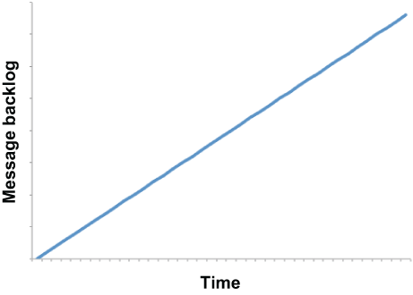

# 弹性模式
本章涵盖

- 使基于 Pulsar Functions 的应用程序对不良事件具有弹性
- 使用 Pulsar Functions 实现完善的弹性模式

作为 GottaEat 订单输入微服务的架构师，你的主要目标是开发一个系统，该系统可以每周 7 天、每天 24 小时接受来自客户的食品订单，并且在客户可接受的响应时间内。你的系统必须始终可用；否则，你的公司不仅会失去收入和客户，而且其声誉也会受到影响。因此，你必须将系统设计为具有高可用性和弹性，以提供服务的连续性。每个人都希望他们的系统具有弹性，但这实际上意味着什么？弹性是系统承受不利事件和条件造成的中断的能力，同时相对于任何数量的量化指标（例如可用性、容量、性能、可靠性、稳健性和可用性）保持可接受的性能水平。

弹性很重要，因为无论你的 Pulsar 应用程序设计得有多好，最终都会出现意外事件，例如断电或网络通信中断并破坏拓扑。本声明中隐含的想法是，不良事件和情况将会发生。这真的不是如果而是何时的问题。弹性是关于当这些破坏性事件发生时你的软件会做什么。 Pulsar 功能是否检测到这些事件和条件？一旦检测到它们，它是否会正确响应它们？之后功能是否正常恢复？

高弹性系统将利用多种反应弹性技术来主动检测这些逆境并对其做出响应，使系统自动恢复到正常运行状态，如图 9.1 所示。这在流媒体环境中特别有用，在这种环境中，任何服务中断都可能导致数据无法从源中捕获并永远丢失。


图 9.1 弹性系统将自动检测不利事件或条件，并采取主动措施使自身恢复到正常运行状态。

显然，采用任何反应技术的关键是检测不利条件的能力。在本章中，我们将介绍如何使用 Pulsar Functions 应用程序检测故障条件，以及你可以在 Pulsar 函数中使用的一些弹性技术，使它们更具弹性。

## 9.1 Pulsar 函数的弹性

正如我们在第 8 章中看到的，所有基于 Pulsar Functions 的应用程序本质上都是由几个单独的 Pulsar 函数组成的拓扑结构，这些 Pulsar 函数通过输入和输出主题相互连接。这些拓扑可以被认为是 DAG，数据根据消息的值流经不同的路径。从弹性的角度来看，将整个 DAG 视为必须免受不利条件影响的系统是有道理的。

### 9.1.1 不良事件

为了实施整体弹性策略，我们必须首先识别可能影响正在运行的 Pulsar 应用程序拓扑的所有不利事件。我们不会尝试列出 Pulsar 功能可能发生的每一种可能情况，而是将不良事件分为以下几类：功能死亡、功能滞后和功能不进展。

#### 功能死亡

让我们先从最剧烈的事件开始，函数死亡，即应用程序拓扑中的 Pulsar 函数突然终止。这种情况可能是由许多物理因素（例如服务器崩溃或断电）或非物理因素（例如函数本身的内存不足情况）引起的。无论根本原因如何，对系统的影响都将是严重的，因为流经 DAG 的数据将突然停止。

如果图 9.2 所示的函数挂掉，所有下游消费者都将停止接收消息，并且 DAG 在流程中的这一点基本上会被阻塞。从最终用户的角度来看，应用程序将停止产生输出，在我们的情况下，这意味着整个食品订单输入过程将突然停止。


图 9.2 当一个函数终止并停止使用消息时，整个应用程序在 DAG 中的那个点基本上被阻塞，所有下游处理都将停止。

幸运的是，输入主题的函数将充当缓冲区并将传入的消息保留到主题的消息保留策略施加的限制。我提到这个警告只是为了让你明白尽快解决这个问题的重要性，因为如果不重新启动该功能，最终消息可能会被删除。

如果你使用推荐的 Kubernetes 运行时来托管你的 Pulsar 函数，那么只要你的 Kubernetes 环境中有足够的计算资源，Pulsar Functions 框架就会自动检测关联的 K8s pod 的故障并为你重新启动它。你还应该有适当的监控和警报，以检测物理主机的丢失，并作为额外的弹性层做出相应的响应。

#### 滞后功能

另一个会对 Pulsar 应用程序的性能产生负面影响的条件是滞后函数，当消息持续到达函数的输入主题的速度大于函数的处理能力时，就会发生这种情况。在这些情况下，该函数在处理传入消息时会越来越落后，这将导致消息准备好处理和最终处理之间的延迟越来越大。

让我们考虑一个场景，函数 A 每秒向另一个函数的输入主题发布 150 个事件，如图 9.3 所示。不幸的是，函数 B 每秒只能处理 75 个事件，这就留下了每秒 75 个事件的不足，这在主题中被缓冲。如果这种处理不平衡仍然存在，输入主题内的消息量将继续增长。


图 9.3 函数 B 每秒只能处理 75 个事件，而函数 A 以每秒 150 个的速率产生事件。这会导致每秒 75 个事件的积压，从而导致每秒延迟一秒。

最初，这种延迟将开始影响业务 SLA，在我们的用例中，订单输入过程对我们的客户来说会很慢，因为他们必须等待他们的订单得到处理和确认。最终，延迟太大，客户无法承受，他们会因为移动应用程序的响应能力不足而放弃订单。这可能导致客户的订单被放入队列并在客户决定后处理的情况，由于缺乏响应，他们的订单从未下过，从业务角度来看，这将是一场噩梦，因为我们会退还已收取的金额并通知餐厅订单已取消。

为了在此声明后面加上一些数字，让我们想象一下这样一种情况，即在业务高峰时段（例如周五晚上 7 点左右）在我们的订单验证 DAG 内部开始出现这种情况。 10 分钟后下达的订单将放置在函数 B 的输入主题内建立的 45,000（75 eps × 60 秒 × 10 分钟）其他订单之后。以每秒 75 条的处理速度，在最终处理订单之前，需要 10 分钟来处理这些现有消息。因此，在 7:10 下的订单要到晚上 7:20 之后才会得到处理！因此，为了满足你的业务 SLA 并避免因功能滞后而放弃订单，我们需要进行性能测试以确定订单验证服务中每个功能的平均处理率，并持续监控它是否有任何处理不平衡的情况。未来。

幸运的是，如果你使用推荐的 Kubernetes 运行时来托管你的 Pulsar 函数，那么 Pulsar Functions 框架允许你使用清单 9.1 中所示的命令来扩展任何函数的并行度，这应该有助于缓解不平衡。因此，针对此不利事件的补救措施是将函数的并行计数更新到可接受的水平。由于在我们的假设示例中消息输入与消耗的比率是 2:1，因此你可能希望函数 A 与函数 B 实例的比率至少相同，甚至更多。

清单 9.1 增加函数并行度

```sh
$ bin/pulsar-admin functions update \
  --name FunctionA \
  --parallelism 5 \
  ...
```

虽然将实例的比例调整为恰好 2:1 理论上可以缓解这个问题，但我建议在消费者方面增加一两个超出该比例的实例。这不仅会提供额外的处理能力，让你的应用程序能够处理任何额外的消息激增，而且还会使你的功能在遇到任何延迟之前能够抵御一个或多个实例的丢失。

#### 非进程功能

非进步函数与滞后函数在两个方面有所不同；首先是他们成功处理消息的能力。使用滞后函数，所有消息都被成功处理，尽管速度太慢而无法跟上，而使用非进度函数，则无法成功处理部分或全部消息。

第二个方面是解决问题的方式。对于滞后函数，最常见的补救方法是增加函数实例的并行度以适应传入的消息量。不幸的是，非进程函数没有简单的修复方法，唯一的解决办法是在 Pulsar 函数内部添加处理逻辑来检测这些处理异常并做出反应。因此，让我们退后一步，回顾一下在 Pulsar 函数中处理异常时我们拥有的有限数量的选项。

你可以有效地完全忽略错误并明确确认消息，这会告诉代理你已完成对其的处理。显然，对于某些用例来说，这不是一个可行的选择，例如我们的支付服务，我们需要授权付款才能继续处理订单。另一种选择是在 Pulsar 函数代码的 catch 块中否定确认（即否定确认）消息，这会告诉代理重新传递消息最后，由于以下原因，你的函数可能根本没有发送确认调用远程服务时未捕获的异常或网络超时。从图 9.4 中可以看出，在任何一种情况下，这些消息都将被标记为重新传递。


图 9.4 当 Pulsar 函数在配置的时间内发送否定确认或未能确认消息时，消息将被安排在一分钟延迟后重新发送。

随着越来越多的这些负面确认消息在主题中建立，系统将逐渐变慢，因为它们被反复尝试、失败和再次尝试。这浪费了非生产性工作的处理周期，更糟糕的是，这些消息永远不会从主题中清除，这只会随着时间的推移而加剧它们的影响——因此，术语非进行性功能，因为它没有取得进展在新消息上。

让我们重新审视一个函数每秒可以成功处理 75 个事件的场景，并且该函数正在调用远程服务，例如信用卡授权服务。此外，该函数正在调用的端点实际上是一个负载均衡器，它将调用分布在三个不同的服务实例中，其中一个出现故障。每三个消息都会立即抛出异常，并且消息将被否定确认，导致每秒大约 25 个事件不成功。这会将函数的有效处理速率从 75 eps 降低到 50 eps。处理速率的降低是非进程函数的第一个迹象。

扩大实例也不能解决问题，因为这也会以相应的速度扩大故障数量。如果我们将函数的并行性加倍以达到 150 eps 的消耗率，我们最终会得到 50 eps 失败并被重新处理。事实上，无论我们添加多少实例，仍有三分之一的消息需要重新处理。还值得注意的是，这些重新处理的消息中的每一个都会经历一分钟的延迟损失，这将对你的应用程序的感知响应产生负面影响。

现在让我们考虑一下网络中断对同一功能的影响。每次处理消息时，都会调用负载均衡器，但由于网络关闭，我们无法访问它。不仅 100% 的消息失败，而且每条消息需要 30 秒来处理，因为它必须等待网络超时异常被抛出。对 DAG 的影响将与函数死掉一样，但不幸的是它没有。相反，该函数实际上处于僵死状态，即使重新启动该函数也无济于事，因为潜在问题是函数本身的外部问题。

虽然阻止消息被处理的潜在问题可能大不相同，但根据其自我纠正的可能性，它们可以分为两大类：瞬态故障和非瞬态故障。暂时性故障包括与组件和服务的网络连接暂时中断、服务暂时不可用或在你的 Pulsar 函数调用繁忙的远程服务时可能发生的超时。这些类型的故障通常可以自我纠正，如果在适当的延迟后重新处理消息，则很可能会成功。一种这样的情况是，如果支付服务在服务因请求而过载的期间调用外部信用卡授权服务。一旦服务有机会恢复，后续调用就很有可能成功。

相比之下，非暂时性故障需要外部干预才能解决，包括灾难性硬件故障、过期安全凭证或错误消息数据等。考虑订单验证服务向支付服务的输入主题发布消息的场景，该消息包含无效的支付信息，例如错误的信用卡号。无论我们尝试获得使用该卡作为付款方式的授权多少次，它总是会被拒绝。另一种可能的情况是我们的支付服务凭据已过期，因此，我们对任何客户的信用卡进行授权的所有尝试都将失败。

通常情况下，很难区分一种情况和另一种情况，我们需要能够从瞬时故障（例如远程服务过载）中检测到非瞬时故障（例如无效的信用卡号），以便我们能够做出响应对他们不同。幸运的是，我们可以使用相应的异常类型和其他数据对给定故障的瞬态性质进行智能猜测，并相应地确定正确的行动方案。

### 9.1.2 故障检测
在检测 Pulsar Functions 拓扑中的故障条件时，只需检查数据流经整个拓扑的程度。简单地说，应用程序是跟上输入主题提供给它的数据量，还是落后了？数据应该像流经身体的血液一样流经 DAG：不间断且稳定。不应该有任何阻塞流向某些区域。

到目前为止，我们讨论的所有不良事件对数据流都有类似的影响：未处理消息的稳步增加。在 Pulsar 中，指示这种阻塞的关键指标是消息积压。 Pulsar 应用程序的输入主题中存在不断增加的消息积压表明操作降级或错误。需要明确的是，我不是在谈论积压中消息的绝对数量，而是在一段时间内该数量本身的趋势，例如你的高峰营业时间。

当 Pulsar 应用程序或函数无法跟上其输入主题中不断增长的数据量时，如图 9.5 所示，这种情况称为背压，表示应用程序内缺乏处理能力和性能下降，必须进行补救以满足业务 SLA。背压一词是从流体动力学借来的，用于表示某种阻力或反作用力，限制了所需的数据通过拓扑结构的流动，就像厨房水槽中的堵塞物对排水产生反作用力一样。同样，这种情况并不孤立于消费消息的 Pulsar 函数，而且对整个拓扑结构都有影响。



图 9.5 特定订阅的消息积压随时间稳定增加的情况称为背压，表示 Pulsar 功能或应用程序的性能下降。

到目前为止，我们讨论过的所有不良事件——功能死亡、功能滞后和非进展功能——都可以通过功能输入主题上的背压来检测到。你应该监控以下主题级指标以检测 Pulsar 函数中的背压：

- pulsar_rate_in，它测量消息进入主题的速率，以每秒消息数为单位
- pulsar_rate_out，它测量从主题中消耗消息的速率，以每秒消息数为单位
- pulsar_storage_backlog_size，以字节为单位测量主题的总积压大小

所有这些指标都会定期发布到 Prometheus，并且可以由与该平台集成的任何可观察性框架进行监控。任何函数输入主题中消息积压的任何增加都表明这些事件中的一个或多个，并应触发警报。

## 9.2 弹性设计模式
在上一节中，我们讨论了一些使用 Pulsar Functions 框架本身提供的功能为 Pulsar 应用程序提供弹性的选项，例如自动重启失效的函数。但是，你的 Pulsar 函数必须与外部系统交互以执行其处理的情况并不少见。这样做会间接地将这些外部系统的弹性问题引入到你的 Pulsar 应用程序中。如果这些远程系统没有响应，结果将是你的应用程序中的功能滞后或无法进行。

正如我们在第 8 章中看到的，GottaEat 订单验证过程依赖于几个第三方服务来接受任何传入的食品订单，如果我们因任何原因无法与这些外部系统通信，我们的整个业务将完全停止.鉴于我们与这些服务的所有交互都是通过网络连接进行的，因此很可能出现间歇性网络故障、高延迟期和无法访问的服务以及其他中断。因此，我们的应用程序对这些类型的故障具有弹性并能够自动从它们中恢复是至关重要的。虽然你可以尝试自己实现这些模式，但这是最好使用由专家开发的第三方库来解决此类问题的场景之一。

与远程服务交互产生的问题非常普遍，以至于 Netflix 开发了自己的容错库 Hystrix，并于 2013 年将其开源；它包含多种弹性模式，可以准确处理这些类型的问题。虽然这个库不再被积极开发，但它的一些概念已经在一个名为弹性 4j 的新开源项目中实现。正如我们将看到的，这使得在基于 Java 的 Pulsar 函数中使用这些模式变得容易，因为大部分逻辑已经在弹性 4j 库本身内部实现，让你可以专注于使用哪些模式。因此，我们需要将清单 9.1 中显示的配置添加到 Maven pom.xml 文件的依赖项部分，以将库添加到我们的项目中。

清单 9.2 在项目中添加弹性 4j 库

```xml
<dependencies>
    <dependency>
         <groupId>io.github.resilience4j</groupId>
         <artifactId>resilience4j-all</artifactId>
         <version>1.7.1</version>
    </dependency>
        
    ...
</dependencies>
```

在接下来的部分中，我将介绍这些模式以及如何使用它们来使你的基于 Pulsar Functions 的微服务与外部系统交互，以适应这些故障场景。除了提供该模式解决的上下文和问题之外，我还将介绍实现该模式时要考虑的问题和注意事项，以及该模式何时适用于你的用例的示例。最后，值得注意的是，这些模式的设计使得它们可以相互结合使用。当你需要在 Pulsar 函数中使用多个这些模式时，这特别有用（例如，你可能希望在与外部 Web 服务交互时同时使用重试和断路器模式）。

### 9.2.1 重试模式

与远程服务通信时，可能会发生任意数量的瞬时故障，包括网络连接丢失、服务暂时不可用以及远程服务非常繁忙时可能发生的服务超时。这些类型的故障通常是自我纠正的，随后对服务的调用很可能会成功。如果你在 Pulsar 函数中遇到此类故障，则重试模式允许你根据错误以三种方式之一处理故障；如果错误表明失败本质上不是暂时性的，例如由于凭据错误导致身份验证失败，那么你不应重试调用，因为很可能会发生同样的失败。

如果异常表明连接超时或以其他方式表明请求因系统繁忙而被拒绝，那么最好等待一段时间再重试调用，让远程服务时间恢复。否则，你可能希望立即重试调用，因为你没有理由相信后续调用会失败。为了在你的函数中实现这种类型的逻辑，你需要将远程服务调用包装在一个装饰器中，如下面的清单所示。

清单 9.3 在 Pulsar 函数中使用重试模式

```java
import io.github.resilience4j.retry.Retry;
import io.github.resilience4j.retry.RetryConfig;
import io.github.resilience4j.retry.RetryRegistry;           ❶
import io.vavr.CheckedFunction0;
import io.vavr.control.Try;
 
public class RetryFunction implements Function<String, String> {
 
  public String apply(String s) {                            ❷
                
    RetryConfig config = 
       RetryConfig.custom()                                  ❸
         .maxAttempts(2)                                     ❹
         .waitDuration(Duration.ofMillis(1000))              ❺
         .retryOnResult(response -> (response == null))      ❻
         .retryExceptions(TimeoutException.class)            ❼
         .ignoreExceptions(RuntimeException.class)           ❽
         .build();
        
    CheckedFunction0<String> retryableFunction = 
       Retry.decorateCheckedSupplier(
        RetryRegistry.of(config).retry("name"),              ❾
        () -> {                                              ❿
          HttpGet request = 
             new HttpGet("http://www.google.com/search?q=" + s);
 
          try (CloseableHttpResponse response = 
                  HttpClients.createDefault().execute(request)) {
            HttpEntity entity = response.getEntity();
            return (entity == null) ? null : EntityUtils.toString(entity);
          }
       });
        
    Try<String> result = Try.of(retryableFunction);          ⓫
    return result.getOrNull();                               ⓬
  }
}
```

❶ 我们依赖弹性4j 库中的几个类。
❷ 这是函数接口中定义的方法，会为每条消息调用。
❸ 创建我们自己的自定义重试配置。
❹ 指定最多两次重试
❺ 指定重试之间暂停一秒
❻ 如果返回结果为空，则执行重试。
❼ 指定被视为瞬时故障并重试的异常列表
❽ 指定被视为非暂时性且未重试的异常列表
❾ 使用我们的自定义重试配置装饰该函数。
❿ 提供将在必要时执行和重试的 lambda 表达式。
⓫ 执行修饰函数，直到收到结果或达到重试限制。
⓬ 如果没有收到响应，则返回结果或 null。
清单 9.2 中显示的代码只是将一个字符串作为输入，使用给定的输入字符串调用 Google 搜索 API，并返回结果。最重要的是，它将多次尝试调用 HTTP 端点，而不必否定确认消息并将其重新传递给函数。相反，消息仅从 Pulsar 主题传递一次，并且所有重试都在对 Pulsar 函数的 apply 方法的同一次调用中进行，如图 9.6 所示。这使我们能够避免在决定放弃外部系统之前多次传递相同消息的浪费循环。


图 9.6 使用重试模式时，远程服务会用相同的消息重复调用。在这种特殊情况下，前两次调用失败，但第三次调用成功，因此消息得到确认。这使我们能够避免对消息进行否定确认并每次将处理延迟一分钟。

传入 Retry.decorateCheckedSupplier 方法的第一个参数是我们之前在代码中配置的重试对象，它定义了重试尝试的次数、它们之间暂停的时间以及哪些异常表明我们应该重试函数调用和哪些表明我们不应该这样做。

对于那些不熟悉在 Java 中使用 lambda 表达式的人，将被调用的实际逻辑封装在第二个参数中，该参数接受函数定义，如 ()-> 语法所示，并包括所有以下括号内的代码。结果对象是一个装饰函数，然后将其传递给 Try.of 方法，该方法会自动为你处理所有重试逻辑。装饰一词来自装饰器模式，这是一种众所周知的设计模式，它允许将行为动态添加到对象运行时。

虽然你可以使用 try/catch 语句和尝试次数计数器的组合来实现类似的逻辑，但人们很容易争辩说，resilience4j 库提供的装饰函数方法是一种更优雅的解决方案，它还允许你动态地通过部署 Pulsar 功能时提供的用户配置属性来配置重试属性。

#### 问题和考虑

虽然这是在与外部系统（例如 Web 服务或数据库）交互时使用的非常有用的模式，但在 Pulsar 函数中实现它时一定要考虑以下因素：

- 调整重试间隔以匹配你的应用程序的业务需求。重试间隔非常短的过于激进的重试策略可能会在已经过载的服务上产生额外的负载，使情况变得更糟。人们可能想要考虑使用指数退避策略，以指数方式（例如，1 秒、2 秒、4 秒、8 秒等）增加重试之间的时间。
- 在选择要尝试的重试次数时，请考虑操作的重要性。在某些情况下，最好是快速失败，而不是通过多次重试来影响处理延迟。例如，对于面向客户的应用程序，最好在少量重试后失败并在它们之间有很短的延迟，而不是向最终用户引入长时间的延迟。
- 在幂等操作上使用此模式时要小心；否则，你可能会遇到意外的副作用（例如，成功接收和处理外部信用卡授权服务的调用，但未能发送响应）。在这种情况下，如果重试逻辑再次发送请求，客户的信用卡将被收取两次费用。
- 记录所有重试尝试很重要，以便可以尽快识别和纠正潜在的连接问题。除了常规日志文件之外，Pulsar 指标还可用于向 Pulsar 管理员传达重试尝试的次数。

### 9.2.2 断路器模式
重试模式旨在处理暂时性故障，因为它使应用程序能够重试操作，并期望它会成功。另一方面，断路器模式防止应用程序执行可能由于非暂时性故障而失败的操作。

断路器模式，由 Michael Nygard 在他的书“发布它！ （Pragmatic Bookshelf，第 2 版，2018 年），旨在防止在我们已经知道远程服务没有响应时通过额外的调用使远程服务不堪重负。因此，经过一定次数的失败尝试后，我们会认为该服务要么不可用，要么过载，并拒绝对该服务的所有后续调用。目的是通过使用我们已经知道不太可能成功的请求来轰炸远程服务，以防止远程服务进一步过载。

该模式得名于其操作以房屋内发现的物理断路器为模型的事实。当给定时间段内的故障次数超过可配置的阈值时，断路器跳闸，所有用断路器修饰的函数调用将立即失败。断路器充当状态机，在闭合状态下启动，这表示数据可以流经断路器。

正如我们在图 9.7 中看到的，所有传入的消息都会导致对远程服务的调用。但是，断路器会跟踪服务调用产生异常的次数。当异常数量超过配置的阈值时，表明远程服务没有响应或太忙而无法处理其他请求。因此，为了防止对已经过载的服务施加额外负载，断路器转换到断开状态，如图 9.8 所示。这类似于电路断路器在遇到电涌并跳闸（打开）电路以防止电流流入已经过载的电源插座时所做的工作。


图 9.7 断路器在关闭状态下启动，这意味着将为处理的每条消息调用该服务。处理消息 1 时进行的服务调用抛出异常，因此故障计数器递增，并且消息被否定确认。如果计数器超过配置的阈值，断路器将跳闸并转换为断开状态。

一旦断路器跳闸，它将在预先配置的时间内保持这种状态。在该时间段到期之前，不会调用该服务。这使服务有时间修复潜在问题，然后再允许应用程序继续调用它。在该时间段过去之后，电路转换到半开状态，在该状态中，允许有限数量的请求调用远程服务。


图 9.8 一旦断路器的故障计数器超过配置的阈值，电路就会转换为断开状态，所有后续消息都会立即得到否定确认。这可以防止对可能失败的服务进行额外的调用，并为服务提供一些时间来恢复。

半开状态旨在防止正在恢复的服务被来自所有积压消息的请求淹没。随着服务的恢复，其处理请求的能力起初可能会受到限制。仅发送有限数量的请求可防止恢复系统在恢复后不堪重负。断路器维护一个成功计数器，该计数器为允许调用服务并成功完成的每条消息递增，如图 9.9 所示。


图 9.9 当断路器处于半开状态时，允许有限数量的消息调用服务。一旦成功完成足够数量的这些调用，电路就会转换回关闭状态。但是，如果任何消息失败，断路器会立即转换回打开状态。

如果所有这些请求都成功（如成功计数器所示），则假定导致先前问题的故障已解决，并且服务已准备好再次接受请求。因此，断路器随后将切换回闭合状态并恢复正常操作。但是，如果在半开状态期间发送的任何消息失败，断路器将立即切换回开状态（不适用故障计数阈值）并重新启动计时器，为服务提供额外的时间从故障中恢复。

此模式为应用程序提供稳定性，同时远程服务通过快速拒绝可能失败并可能导致整个应用程序级联故障的请求从非暂时性故障中恢复。通常，此模式与重试模式结合以处理远程服务中的瞬态和非瞬态故障。要在 Pulsar 函数中使用断路器模式，你需要将远程服务调用包装在装饰器中，如清单 9.4 所示，它显示了当客户使用信用卡时从 GottaEat 支付服务调用的 CreditCardAuthorizationService 的实现付款。

清单 9.4 在 Pulsar 函数中使用断路器模式

```java
...
import io.github.resilience4j.circuitbreaker.*;                      ❶
import io.vavr.CheckedFunction0;
import io.vavr.control.Try;
 
public class CreditCardAuthorizationService 
    implements Function<CreditCard, AuthorizedPayment> {
    
  public AuthorizedPayment process(CreditCard card, Context ctx) 
     throws Exception {
        
    CircuitBreakerConfig config = CircuitBreakerConfig.custom()
      .failureRateThreshold(20)                                      ❷
      .slowCallRateThreshold(50)                                     ❸
      .waitDurationInOpenState(Duration.ofMillis(30000))             ❹
      .slowCallDurationThreshold(Duration.ofSeconds(10))             ❺
      .permittedNumberOfCallsInHalfOpenState(5)                      ❻
      .minimumNumberOfCalls(10)                                      ❼
      .slidingWindowType(SlidingWindowType.TIME_BASED)               ❽
         .slidingWindowSize(5)                                       ❾
         .ignoreException(e -> e instanceof
            UnsuccessfulCallException && 
        ((UnsuccessfulCallException)e).getCode() == 499 )            ❿
      .recordExceptions(IOException.class, 
                        UnsuccessfulCallException.class)             ⓫
     .build();
        
    CheckedFunction0<String> cbFunction = 
      CircuitBreaker.decorateCheckedSupplier(
         CircuitBreakerRegistry.of(config).circuitBreaker("name"),   ⓬
         () -> {                                                     ⓭
        OkHttpClient client = new OkHttpClient();
        StringBuilder sb = new StringBuilder()
          .append("number=").append(card.getAccountNumber())
          .append("&cvc=").append(card.getCcv())
          .append("&exp_month=").append(card.getExpMonth())
          .append("&exp_year=").append(card.getExpYear());
 
        MediaType mediaType = 
               MediaType.parse("application/x-www-form-urlencoded");
        RequestBody body = 
               RequestBody.create(sb.toString(), mediaType);
 
        Request request = new Request.Builder()
           .url("https://noodlio-pay.p.rapidapi.com/tokens/create")
           .post(body)
           .addHeader("x-rapidapi-key", "SIGN-UP-FOR-KEY")
           .addHeader("x-rapidapi-host", "noodlio-pay.p.rapidapi.com")
           .addHeader("content-type", 
                          "application/x-www-form-urlencoded")
           .build();
        try (Response response = client.newCall(request).execute()) {
          if (!response.isSuccessful()) {
             throw new UnsuccessfulCallException(response.code());
          }
          return getToken(response.body().string());
        }
          }
        );
            
        Try<String> result = Try.of(cbFunction);                    ⓮
        return authorize(card, result.getOrNull());                 ⓯
      }
    
    private String getToken(String json) {
      ...
    }
    
    private AuthorizedPayment authorize(CreditCard card, String token) {
      ...
    }
}
```

❶ 我们使用的是断路器包中的类。
❷ 转换到打开状态之前的失败次数
❸ 转换到打开状态前的慢速调用次数
❹ 转换到半开状态前保持开状态多长时间
❺ 任何超过 10 秒的呼叫都被认为是慢的并被添加到计数中。
❻ 半开状态下可以拨打的电话次数
❼ 失败计数适用前的最小调用次数
❽ 使用基于时间的窗口计算故障计数
❾ 在重新开始故障计数之前使用五分钟的时间窗口。
❿ 未加入失败计数的异常列表
⓫ 添加到失败计数的异常列表
⓬ 使用我们自己的自定义断路器配置。
⓭ 提供如果断路器允许将执行的 lambda 表达式。
⓮ 执行修饰函数直到收到结果或达到重试限制
⓯ 如果没有收到回复，则返回授权付款或无效。
传递给 CircuitBreaker.decorateCheckedSupplier 方法的第一个参数是一个基于前面代码中定义的配置的 CircuitBreaker 对象，它指定了失败计数阈值、保持打开状态的时间以及哪些异常表明方法调用失败以及哪些没有。有关这些参数和其他参数的更多详细信息，请参阅弹性 4j 文档 (https://resilience4j.readme.io/docs/circuitbreaker)。

如果断路器关闭，将调用的实际逻辑在作为第二个参数传入的 lambda 表达式中定义。如你所见，函数定义中的逻辑向名为 Noodlio Pay 的第三方信用卡授权服务发送 HTTP 请求，该服务返回授权令牌，稍后可用于从提供的信用卡收取付款。结果对象是一个装饰函数，然后将其传递给 Try.of 方法，该方法会自动为你处理所有断路器逻辑。如果调用成功，则从 Noodlio Pay 响应对象中提取授权令牌并在 AuthorizedPayment 对象内返回。

#### 问题和考虑

虽然这是在与外部系统（例如 Web 服务或数据库）交互时使用的非常有用的模式，但在 Pulsar 函数中实现它时一定要考虑以下因素：

- 考虑根据异常本身的严重性调整断路器的策略，因为请求可能因多种原因失败，并且一些错误可能是暂时的，而其他错误可能是非暂时的。在出现非瞬态错误时，立即断开断路器而不是等待特定的发生次数可能更有意义。
- 避免在使用多个独立提供程序的 Pulsar 功能中使用单个断路器。例如，GottaEat 支付服务根据客户提供的支付方式使用四种不同的远程服务。如果对支付服务的调用经历了单个断路器，那么一个故障服务的错误响应可能会触发断路器并阻止对其他三个可能成功的服务的调用。
- 断路器应记录所有失败的请求，以便尽快识别和纠正潜在的连接问题。除了常规日志文件之外，Pulsar 指标还可用于向 Pulsar 管理员传达重试尝试的次数。
- 断路器模式可以与重试模式结合使用。

### 9.2.3 速率限制器模式
虽然断路器模式旨在仅在一段时间内检测到预先配置的故障数量后才禁止服务调用，但另一方面，速率限制器模式在预先配置的调用数量之后禁止服务调用一个给定的时期，无论他们是否成功。顾名思义，速率限制器模式用于限制可以调用远程服务的频率，对于你希望限制在给定时间段内进行的调用次数的情况非常有用。一个这样的例子是，如果我们调用一个网络服务，比如谷歌 API，它会将你可以使用免费 API 密钥进行的调用数量限制为每分钟 60 次。


图 9.10 如果速率限制器配置为每分钟允许 100 次调用，那么前 100 条消息将被允许调用服务。第 101 条消息和所有后续消息将不被允许调用该服务，而是将被否定确认。一分钟过去后，可以处理另外 100 条消息。

使用此模式时，所有传入消息都会导致对远程服务的调用最多达到预配置的号码。速率限制器会跟踪对服务进行了多少次调用，一旦达到限制，就会在预配置的时间窗口的剩余时间内禁止任何额外的调用，如图 9.10 所示。为了在 Pulsar 函数中使用速率限制器模式，你需要将远程服务调用包装在装饰器中，如清单 9.4 所示。

清单 9.5 在 Pulsar 函数中使用速率限制器模式

```java
import io.github.resilience4j.decorators.Decorators;
import io.github.resilience4j.ratelimiter.*;
 
...
public class GoogleGeoEncodingService implements Function<Address, Void> {
 
  public Void process(Address addr, Context ctx) throws Exception {
        
   if (!initalized) {
      init(ctx);                                                      ❶
   }
        
   CheckedFunction0<String> decoratedFunction = 
          Decorators.ofCheckedSupplier(getFunction(addr))             ❷
        .withRateLimiter(rateLimiter)                                 ❸
        .decorate();
        
   LatLon geo = getLocation(                                          ❹
      Try.of(decoratedFunction)                                       ❺
          .onFailure(
            (Throwable t) -> ctx.getLogger().error(t.getMessage())
       ).getOrNull());
 
   if (geo != null) {
      addr.setGeo(geo);
      ctx.newOutputMessage(ctx.getOutputTopic(),
                           AvroSchema.of(Address.class))
           .properties(ctx.getCurrentRecord().getProperties())
        .value(addr)
        .send();
   } else {
     // We made a valid call, but didn't get a valid geo back
   }
   return null;
    }
 
    private void init(Context ctx) {
    config = RateLimiterConfig.custom()
            .limitRefreshPeriod(Duration.ofMinutes(1))                ❻
            .limitForPeriod(60)                                       ❼
            .timeoutDuration(Duration.ofSeconds(1))                   ❽
            .build();
        
    rateLimiterRegistry = RateLimiterRegistry.of(config);
    rateLimiter = rateLimiterRegistry.rateLimiter("name");
    initalized = true;
    }
 
      private CheckedFunction0<String> getFunction(Address addr) {    ❾
         CheckedFunction0<String> fn = () -> { 
          OkHttpClient client = new OkHttpClient();
          StringBuilder sb = new StringBuilder()            
        .append("https://maps.googleapis.com/maps/api/geocode")
          .append("/json?address=")
          .append(URLEncoder.encode(addr.getStreet().toString(),
          StandardCharsets.UTF_8.toString())).append(",")
          .append(URLEncoder.encode(addr.getCity().toString(), 
              StandardCharsets.UTF_8.toString())).append(",")
          .append(URLEncoder.encode(addr.getState().toString(), 
              StandardCharsets.UTF_8.toString()))
          .append("&key=").append("SIGN-UP-FOR-KEY");
 
       Request request = new Request.Builder()
        .url(sb.toString())
        .build();
 
      try (Response response = client.newCall(request).execute()) {
         if (response.isSuccessful()) {
        return response.body().string();                             ❿
         } else {
        String reason = getErrorStatus(response.body().string());
          if (NON_TRANSIENT_ERRORS.stream().anyMatch(                ⓫
                  s -> reason.contains(s))) {
            throw new NonTransientException();
          } else if (TRANSIENT_ERRORS.stream().anyMatch(
                  s -> reason.contains(s))) {
            throw new TransientException();
          }
        return null;
         }            
      }
 
     };
     return fn;
    }
 
    private LatLon getLocation(String json) {                        ⓬
    ...
    }
}
```

❶ 初始化速率限制器
❷ 修饰对 Google Maps API 的 REST 调用
❸ 分配速率限制器
❹ 解析来自 REST 调用的响应
❺ 调用修饰函数
❻ 速率间隔为一分钟。
❼ 设置每个速率间隔 60 个调用的限制
❽ 在后续呼叫之间等待一秒钟。
❾ 返回一个包含 REST API 调用逻辑的函数
❿ 如果我们得到一个有效的响应，返回带有纬度/经度的 JSON 字符串。
⓫ 根据错误信息确定错误类型。
⓬ 解析来自 Google Maps REST API 调用的 JSON 响应
此函数调用 Google Maps API 并将尝试次数限制为每分钟 60 次，以遵守 Google 的免费帐户使用条款。如果调用次数超过此数量，作为预防措施，Google 将在短时间内阻止访问我们帐户的 API。因此，我们已采取积极措施来防止这种情况发生。

#### 问题和考虑

虽然这是在与外部系统（例如 Web 服务或数据库）交互时使用的非常有用的模式，但在 Pulsar 函数中实现它时一定要考虑以下因素：

这种模式几乎肯定会降低函数的吞吐量，所以一定要在整个数据流中考虑到这一点，以确保上游函数不会压倒速率限制函数。
这种模式应该用于保护远程服务免于被调用淹没或限制调用次数以避免超出配额，这会导致你被第三方供应商锁定。

### 9.2.4 限时模式

时间限制器模式用于限制在从客户端终止连接之前调用远程服务所花费的时间。这有效地缩短了远程服务上的超时机制，并允许我们确定何时放弃远程调用并终止来自客户端的连接。

当你对整个数据管道具有严格的 SLA 并分配了少量时间与远程服务交互时，此行为非常有用。这允许 Pulsar 函数在没有来自 Web 服务的响应的情况下继续处理，而不是等待 30 秒或更长时间让连接超时。这样做可以提高函数的吞吐量，因为它不再需要浪费 30 秒等待故障服务的响应。

考虑在调用外部服务以检索值之前首先调用内部缓存服务（例如 Apache Ignite）以查看是否拥有所需数据的场景。这样做的目的是通过消除对远程服务的冗长调用来加快函数内部的处理速度。但是，你可能会面临缓存服务本身无响应的风险，这将导致在进行调用时出现长时间的暂停。这将破坏缓存的全部目的。因此，你决定为缓存调用分配 500 毫秒的时间预算，以限制无响应的缓存对你的函数的影响。

清单 9.6 在 Pulsar 函数中使用时间限制器模式

```java
import io.github.resilience4j.timelimiter.TimeLimiter;
import io.github.resilience4j.timelimiter.TimeLimiterConfig;
import io.github.resilience4j.timelimiter.TimeLimiterRegistry;
 
public class LookupService implements Function<Address, Address> {
private TimeLimiter timeLimiter;
private IgniteCache<Address, Address> cache;
private String bypassTopic;
private boolean initalized = false;
 
    public Address process(Address addr, Context ctx) throws Exception {
      if (!initalized) {
        init(ctx);                                                     ❶
      }
        
      Address geoEncodedAddr = timeLimiter.executeFutureSupplier(      ❷
        () -> CompletableFuture.supplyAsync(() -> 
         { return cache.get(addr); }));                                ❸
        
      if (geoEncodedAddr != null) {                                    ❹
        ctx.newOutputMessage(bypassTopic, AvroSchema.of(Address.class))
        .properties(ctx.getCurrentRecord().getProperties())
        .value(geoEncodedAddr)
        .send();
      }
      return null;
    }
 
    private void init(Context ctx) {
      bypassTopic = ctx.getUserConfigValue("bypassTopicName")
           .get().toString();                                          ❺
      TimeLimiterConfig config = TimeLimiterConfig.custom()
           .cancelRunningFuture(true)                                  ❻
        .timeoutDuration(Duration.ofMillis(500))                       ❼
        .build();
        
      TimeLimiterRegistry registry = TimeLimiterRegistry.of(config);
      timeLimiter = registry.timeLimiter("my-time-limiter");           ❽
        
      IgniteConfiguration cfg = new IgniteConfiguration();             ❾
       cfg.setClientMode(true);
       cfg.setPeerClassLoadingEnabled(true);
 
       TcpDiscoveryMulticastIpFinder ipFinder = 
        new TcpDiscoveryMulticastIpFinder();
  
        ipFinder.setAddresses(Collections.singletonList(
        ➥ "127.0.0.1:47500..47509"));
        
       cfg.setDiscoverySpi(new TcpDiscoverySpi().setIpFinder(ipFinder));
       Ignite ignite = Ignition.start(cfg);                            ❿
       cache = ignite.getOrCreateCache("geo-encoded-addresses");       ⓫
    }
}
```

❶ 初始化时间限制器和点燃缓存
❷ 调用缓存查找并通过时间限制器限制调用的持续时间
❸ 异步执行的缓存查找
❹ 如果我们有缓存命中，则将该值发布到不同的输出主题。
❺ 旁路主题是可配置的。
❻ 取消超过时间限制的正在运行的呼叫。
❼ 设置时间限制为 500 毫秒
❽ 根据配置创建时间限制器
❾ 配置 Apache Ignite 客户端
❿ 连接到 Apache Ignite 服务
⓫ 检索存储地理编码地址的本地缓存
为了在 Pulsar 函数中使用时间限制器模式，你需要将远程服务调用包装在 CompletableFuture 中，并通过 TimeLimter 的 executeFutureSupplier 方法执行它，如清单 9.6 所示。此查找函数假定缓存填充在调用 Google Maps API 的函数内。这允许我们稍微重构地理编码过程，以便在调用 GeoEncodingService 之前进行查找，如图 9.11 所示。


图 9.11 如果我们已经拥有给定地址的纬度/经度对，则查找服务可用于防止对 GeoEncodingService 进行不必要的调用。缓存中填充了来自 Google Maps API 调用的结果。

同样，这种类型的设计旨在加快地理编码过程，因此，我们需要限制在放弃调用之前我们愿意等待从 Apache Ignite 返回响应的时间量。如果缓存查找成功，则 LookupService 将直接向与 GeoEncodingService 相同的 GeoEncoding 输出主题发布消息。下游消费者并不关心消息是谁发布的，只要消息内容正确即可。

#### 问题和考虑

虽然这是在与外部系统（例如 Web 服务或数据库）交互时使用的非常有用的模式，但在 Pulsar 函数中实现它时一定要考虑以下因素：

- 调整时间限制以匹配应用程序的业务 SLA 要求。过于激进的时间限制会导致成功的调用被过早放弃，导致远程服务上不必要的工作以及 Pulsar 函数中的数据丢失。
- 不要在幂等操作上使用这种模式；否则你可能会遇到意想不到的副作用。最好仅在查找调用和其他非状态更改功能或服务上使用此模式。

### 9.2.5 缓存模式

如果你不想编写单独的函数来执行查找，则 resilency4j 库还提供了一种使用缓存装饰函数调用的方法。代码清单 9.7 展示了如何使用缓存抽象来修饰 Java lambda 表达式。缓存抽象将函数每次调用的结果存储在缓存实例中，并在调用 lambda 表达式之前尝试从缓存中检索先前缓存的结果。

清单 9.7 在 Pulsar 函数中使用弹性缓存

```java
import javax.cache.CacheManager;
import javax.cache.Caching;
import javax.cache.configuration.MutableConfiguration;
import io.github.resilience4j.cache.Cache;
import io.github.resilience4j.decorators.Decorators;
 
...
public class GeoEncodingServiceWithCache implements Function<Address, Void> {
 
  public Void process(Address addr, Context ctx) throws Exception {
        
   if (!initalized) {
      init(ctx);                                                         ❶
   }
        
   CheckedFunction1<String, String> cachedFunction = Decorators
      .ofCheckedSupplier(getFunction(addr))                              ❷
      .withCache(cacheContext)                                           ❸
      .decorate();
        
   LatLon geo = getLocation(                                             ❹
  Try.of(() -> cachedFunction.apply(addr.toString())).get());            ❺
 
   if (geo != null) {
      addr.setGeo(geo);                                                  ❻
      ctx.newOutputMessage(ctx.getOutputTopic(),AvroSchema.of(Address.class))
        .properties(ctx.getCurrentRecord().getProperties())
        .value(addr)
        .send();
   } 
   return null;
  }

private void init(Context ctx) {
  CacheManager cacheManager = 
    Caching.getCachingProvider().getCacheManager();                      ❼
    
  cacheContext = Cache.of(cacheManager.createCache(                      ❽
    "addressCache", new MutableConfiguration<>()));
    initalized = true;
   }
 
  private CheckedFunction0<String> getFunction(Address addr) {           ❾
     // Same as before
  }
 
  private LatLon getLocation(String json) {                              ❿
     // Same as before
  }
}
```

❶ 初始化缓存
❷ 修饰对 Google Maps API 的 REST 调用
❸ 分配缓存
❹ 解析来自缓存或 REST 调用的响应
❺ 在调用函数前检查缓存
❻ 如果我们有纬度/经度，则发送它。
❼ 使用配置好的缓存实现
❽ 创建地址缓存
❾ 返回一个包含 REST API 调用逻辑的函数
❿ 如果我们得到一个有效的响应，返回带有纬度/经度的 JSON 字符串。
你应该将函数配置为使用分布式缓存实现，例如 Ehcache、Caffeine 或 Apache Ignite。如果从分布式缓存中检索缓存失败，则该异常将被忽略，而将调用 lambda 表达式来检索该值。有关如何配置和使用 JCache 功能规范的供应商特定实现的更多详细信息，请参阅首选供应商的文档。

使用此方法与单独查找服务方法的权衡是你无法限制你愿意等待缓存调用完成的时间量。因此，万一分布式缓存服务关闭，每次调用最多可能需要 30 秒才能等待网络超时。

#### 问题和考虑

虽然这是在与外部系统（例如 Web 服务或数据库）交互时使用的非常有用的模式，但在 Pulsar 函数中实现它时一定要考虑以下因素：

- 这仅对本质上相对静态的数据集有用，例如地理编码地址。不要尝试缓存可能经常更改的数据；否则，你将面临在应用程序中使用错误数据的风险。
- 限制缓存的大小以避免在 Pulsar 函数中导致内存不足的情况。如果你需要更大的缓存，则应考虑使用分布式缓存，例如 Apache Ignite。
- 通过对数据实施老化策略来防止缓存中的数据变得陈旧，以便在达到特定年龄后自动清除。

### 9.2.6 回退模式

回退模式用于在主要资源不可用时为你的函数提供替代资源。考虑你通过负载平衡器端点调用内部数据库的情况，并且负载平衡器出现故障。你可以完全绕过负载均衡器并直接连接到数据库，而不是让单个硬件的故障导致整个应用程序失败。下面的清单显示了如何实现这样的功能。

清单 9.8 在 Pulsar 函数中使用回退模式

```java
import io.github.resilience4j.decorators.Decorators;
import io.vavr.CheckedFunction0;
import io.vavr.control.Try;
 
public class DatabaseLookup implements Function<String, FoodOrder> {
  private String primary = "jdbc:mysql://load-balancer:3306/food";    ❶
  private String backup = "jdbc:mysql://backup:3306/food";            ❷
  private String sql = "select * from food_orders where id=?";
  private String user = "";                                           ❸
  private String pass = "";
  private boolean initalized = false;
 
  public FoodOrder process(String id, Context ctx) throws Exception {
    if (!initalized) {
      init(ctx);
    }
        
    CheckedFunction0<ResultSet> decoratedFunction = 
      Decorators.ofCheckedSupplier( () -> {
       try (Connection con = 
            DriverManager.getConnection(primary, user, pass)) {       ❹
          PreparedStatement stmt = con.prepareStatement(sql);
          stmt.setLong(1, Long.parseLong(id));
          return stmt.executeQuery();
        }
       })        
      .withFallback(SQLException.class, ex -> {                       ❺
        try (Connection con = 
              DriverManager.getConnection(backup, user, pass)) {
          PreparedStatement stmt = con.prepareStatement(sql);
          stmt.setLong(1, Long.parseLong(id));
          return stmt.executeQuery();
        }
         })
      .decorate();
        
      ResultSet rs = Try.of(decoratedFunction).get();                 ❻
      return ORMapping(rs);                                           ❼
    }
 
  private void init(Context ctx) {
    Driver myDriver;
     try {
       myDriver = (Driver) Class.forName("com.mysql.jdbc.Driver")
       .newInstance();
      DriverManager.registerDriver(myDriver);                         ❽
      // Set local variables from user properties
       ...
      initalized = true;
     } catch (Throwable t) {
       t.printStackTrace();
     }
        
  }
    
  private FoodOrder ORMapping(ResultSet rs) {
    // Performs the Relational-to-Object mapping
  }
}
```

❶ 主要连接通过负载均衡器。
❷ 备份连接直接连接到数据库服务器。
❸ 在 init 方法中从用户属性设置的数据库凭据
❹ 第一个调用是通过负载均衡器。
❺ 如果抛出了 SQLException，则通过备份 URL 重试查询。
❻ 获取成功的ResultSet。
❼ 执行 ORM 以返回 FoodOrder 对象。
❽ 加载数据库驱动类并注册
这种模式可以发挥作用的另一个场景是，如果我们有多个第三方信用卡授权服务可供选择，并且我们想在由于某种原因无法连接到主要服务的情况下尝试替代服务.请注意，withFallback 方法的第一个参数采用触发回退代码的异常类型，因此只有在错误表明主要服务不可用时才联系第二个信用卡授权服务很重要，如果卡是拒绝了。

#### 问题和考虑

虽然这是在与外部系统（例如 Web 服务或数据库）交互时使用的非常有用的模式，但在 Pulsar 函数中实现它时一定要考虑以下因素：

- 这仅在你有可从 Pulsar 功能访问的服务的替代路由或提供相同功能的服务的替代（备份）副本的情况下有用。

### 9.2.7 凭证刷新模式

凭据刷新模式用于自动检测会话凭据何时过期并需要刷新。考虑你从 Pulsar 函数内部与 AWS 服务交互的情况，该服务需要会话令牌进行身份验证。通常，这些令牌旨在短期使用，因此具有与其关联的到期时间（例如，60 分钟）。因此，如果你正在与需要此类令牌的服务进行交互，则需要一种策略，在当前令牌到期时自动生成新令牌，以保持 Pulsar 函数处理消息。下一个清单显示了如何使用 Java 的 Vavr 函数库自动检测过期的会话令牌并刷新它。

清单 9.9 自动凭证刷新

```java
public class PaypalAuthorizationService implements Function<PayPal, String> {
private String clientId;
private String secret;                                                    ❶
private String accessToken;                                               ❷
private String PAYPAL_URL = “https://api.sandbox.paypal.com”;
    
public String process(PayPal pay, Context ctx) throws Exception {
  return Try.of(getAuthorizationFunction(pay))                            ❸
    .onFailure(UnauthorizedException.class, refreshToken())               ❹
    .recover(UnauthorizedException.class, 
        (exc) -> Try.of(getAuthorizationFunction(pay)).get())             ❺
    .getOrNull();                                                         ❻
}
 
private CheckedFunction0<String> getAuthorizationFunction(PayPal pay) {
  CheckedFunction0<String> fn = () -> {
    OkHttpClient client = new OkHttpClient();
    MediaType mediaType = 
       MediaType.parse("application/json; charset=utf-8");
    RequestBody body = 
RequestBody.create(buildRequestBody(pay), mediaType);                     ❼
            
    Request request = 
        new Request.Builder()
        .url("https://api.sandbox.paypal.com/v1/payments/payment")
        .addHeader("Authorization", accessToken)                          ❽
        .post(body)
        .build();
    
      try (Response response = client.newCall(request).execute()) {       ❾
       if (response.isSuccessful()) {
        return response.body().string();
       } else if (response.code() == 500) {
         throw new UnauthorizedException();                               ❿
       }
        return null;
    }};
        
    return fn;
}
 
private Consumer<UnauthorizedException> refreshToken() {
    Consumer<UnauthorizedException> refresher = (ex) -> {
      OkHttpClient client = new OkHttpClient();
      MediaType mediaType =
        MediaType.parse("application/json; charset=utf-8");
      RequestBody body = RequestBody.create("", mediaType);
 
      Request request = new Request.Builder().url(PAYPAL_URL +
         “/v1/oauth2/token”?grant_type=client_credentials”)               ⓫
      .addHeader("Accept-Language", "en_US")
      .addHeader("Authorization", 
           Credentials.basic(clientId, secret))                           ⓬
      .post(body)
      .build();
 
      try (Response response = client.newCall(request).execute()) {
        if (response.isSuccessful()) {
          parseToken(response.body().string());                           ⓭
        }       
      } catch (IOException e) {
         e.printStackTrace();
        }};
      return refresher;
  }
    
  private void parseToken(String json) {
  // Parses the new access token from the response object
  }
    
  private String buildRequestBody(PayPal pay) {
  // Build the payment authorization request JSON
  }
}
```

❶ 用于获取访问令牌的静态凭据
❷ 访问令牌的本地副本
❸ 首先尝试使用当前访问令牌授权支付
❹ 如果引发未经授权的异常，则调用 refreshToken 函数。
❺ 再次调用authorize方法尝试从未授权异常中恢复。
❻ 返回最终结果。
❼ 构建 JSON 请求正文。
❽ 提供当前的访问令牌值以进行授权。
❾ 授权付款。
❿ 根据响应代码引发未经授权的异常。
⓫ 请求新的访问令牌
⓬ 在请求新的访问令牌时提供静态凭据。
⓭ 从 JSON 响应中解析新的访问令牌。
此模式的关键是将首次调用 PayPal 付款授权 REST API 封装在 try 容器类型中，该类型表示可能导致异常或返回成功计算值的计算。它还允许我们将计算链接在一起，这意味着我们可以以更具可读性的方式处理异常。在清单 9.9 所示的示例中，整个 try/fail/refresh token/retry 逻辑仅用五行代码处理。虽然你可以使用更传统的 try/catch 逻辑结构轻松实现相同的逻辑，但要遵循它会困难得多。

包含在 try 构造中的第一个调用调用 PayPal 支付授权 REST API，如果成功，则返回来自该成功调用的 JSON 响应。更有趣的情况是当第一次调用失败时，因为当且仅当异常类型为 UnauthorizedException 时，才会调用 onFailure 方法中的函数。这仅在第一次调用返回状态代码 500 时发生。

onFailure 方法中的函数尝试通过刷新访问令牌来纠正这种情况。最后，使用recover 方法再次调用PayPal 支付授权REST API，因为访问令牌已被刷新。因此，如果最初的失败是由于过期的会话令牌造成的，这个代码块将尝试自动解决它，而无需人工干预或任何停机时间。消息甚至不必失败并在稍后重试，这很关键，因为我们的函数直接与响应时间很重要的客户端应用程序交互。

#### 问题和考虑

虽然这是在与外部系统（例如使用过期授权令牌的 Web 服务）交互时使用的非常有用的模式，但在 Pulsar 函数中实现它时一定要考虑以下因素：

- 此模式仅适用于基于令牌的身份验证机制，该机制提供暴露给 Pulsar 函数的令牌刷新 API。
- 从令牌刷新 API 返回的令牌应存储在安全位置，以防止未经授权访问服务。

## 9.3 多层弹性

你可能已经注意到，在上一节中，我一次只使用其中一种模式。但是，如果你想在 Pulsar 函数中使用一种以上的先前模式怎么办？在某些情况下，让你的函数使用重试、缓存和断路器模式会非常有用。

幸运的是，正如我在本章开头所提到的，你可以使用弹性4j 库中的任意数量的这些模式轻松装饰你的远程服务调用，以在你的函数中提供多层弹性。下面的清单演示了对于 GeoEncoding 函数实现这一点是多么容易。

清单 9.10 Pulsar 函数中的多重弹性模式

```java
public class GeoEncodingService implements Function<Address, Void> {
  private boolean initalized = false;
    private Cache<String, String> cacheContext;
    private CircuitBreakerConfig config;
    private CircuitBreakerRegistry registry;
    private CircuitBreaker circuitBreaker;
    private RetryRegistry rertyRegistry;
    private Retry retry;
 
    public Void process(Address addr, Context ctx) throws Exception {
    if (!initalized) {
      init(ctx);
    }
        
    CheckedFunction1<String, String> resilientFunction = Decorators
       .ofCheckedSupplier(getFunction(addr))                   ❶
       .withCache(cacheContext)                                ❷
       .withCircuitBreaker(circuitBreaker)                     ❸
       .withRetry(retry)                                       ❹
       .decorate();
        
    LatLon geo = getLocation(Try.of(() ->
          resilientFunction.apply(addr.toString())).get());    ❺
 
    if (geo != null) {
      addr.setGeo(geo);
      ctx.newOutputMessage(ctx.getOutputTopic(),AvroSchema.of(Address.class))
        .properties(ctx.getCurrentRecord().getProperties())
        .value(addr)
        .send();
    } else {
      // We made a valid call, but didn't get a valid geo back
   }
        
    return null;
  }
    
  private void init(Context ctx) {                             ❻
    // Configure a cache (once)
    CacheManager cacheManager = Caching.getCachingProvider()
  .getCacheManager();
 
    cacheContext = Cache.of(cacheManager
      .createCache("addressCache", new MutableConfiguration<>()));
        
    config = CircuitBreakerConfig.custom()
    ...
    cbRegistry = CircuitBreakerRegistry.of(config);
    circuitBreaker = cbRegistry.circuitBreaker(ctx.getFunctionName());
 
    RetryConfig retryConfig = RetryConfig.custom()                      
    ...
    retryRegistry = RetryRegistry.of(retryConfig);
    retry = retryRegistry.retry(ctx.getFunctionName());
    initalized = true;
  }
}
```

❶ 谷歌地图 REST API 调用
❷ 用缓存装饰
❸ 用断路器装饰
❹ 装饰有重试策略
❺ 调用装饰函数获取实际的纬度/经度
❻ 像以前一样初始化弹性配置。
在此特定配置中，将在调用函数之前检查缓存。任何失败的调用都将根据定义的配置重试，如果有足够数量的调用失败，断路器将被触发以防止后续调用对远程服务进行，直到经过足够的时间以允许服务恢复.

请记住，这些基于代码的弹性模式还与 Pulsar Functions 框架提供的弹性功能结合使用，例如自动重启 K8s pod。总之，这些可以帮助你最大程度地减少停机时间并保持你的 Pulsar Functions 应用程序平稳运行。

## 概括

有几种不同的不良事件会影响 Pulsar 功能，消息背压是用于故障检测的一个很好的指标。
你可以使用 resiliency4j 库在 Pulsar 函数中实现各种常见的弹性模式，尤其是那些与外部系统交互的模式。
你可以在同一个 Pulsar 函数中使用多个模式来提高其故障恢复能力。