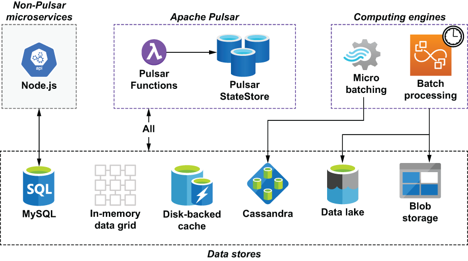
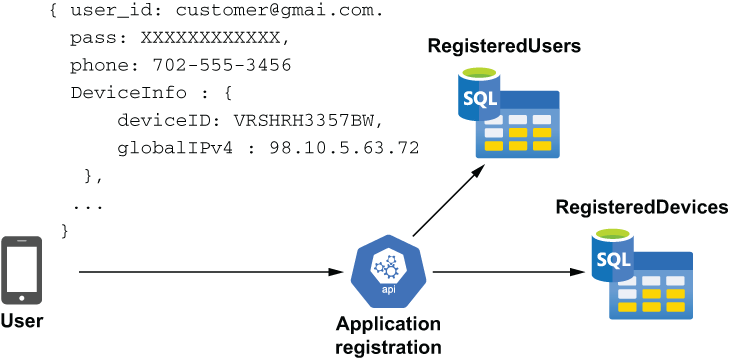
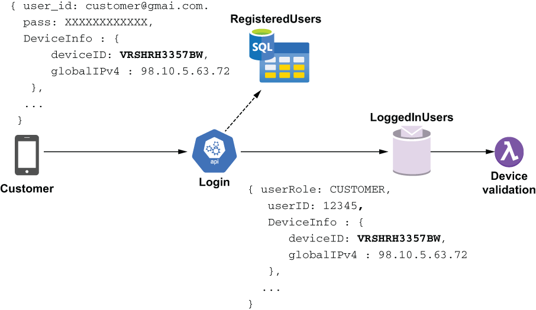
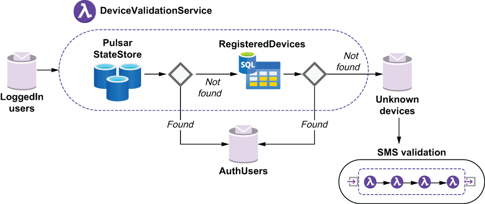
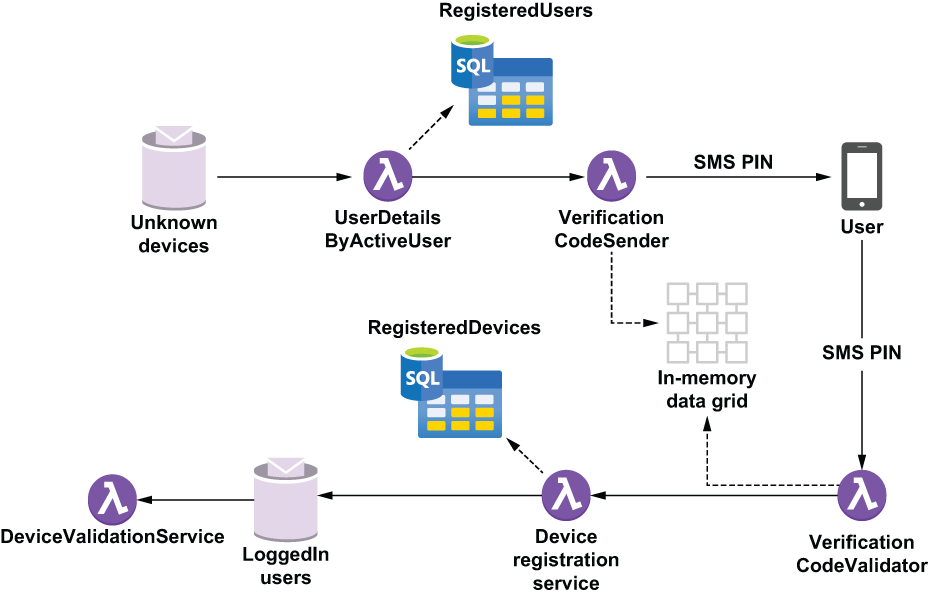
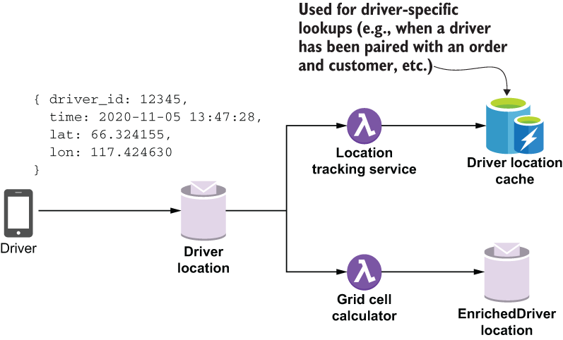
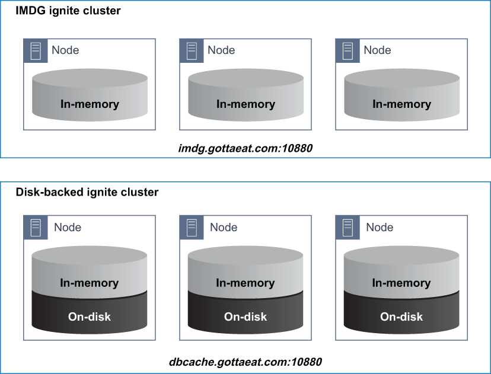
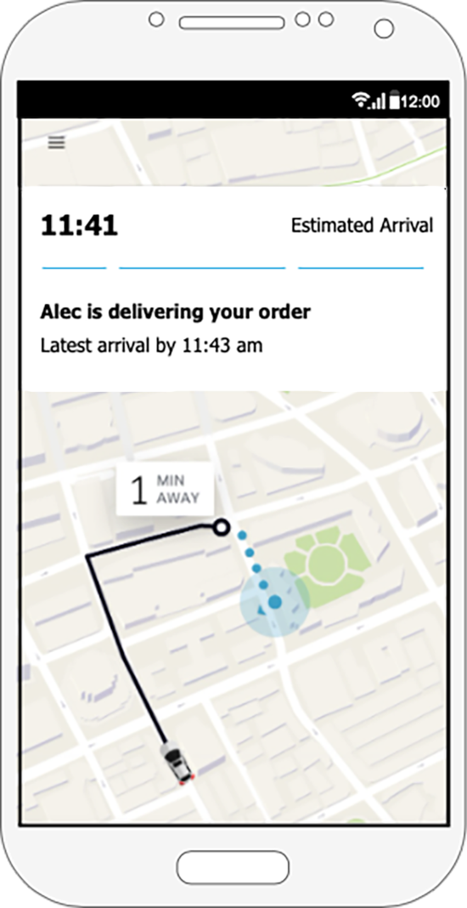
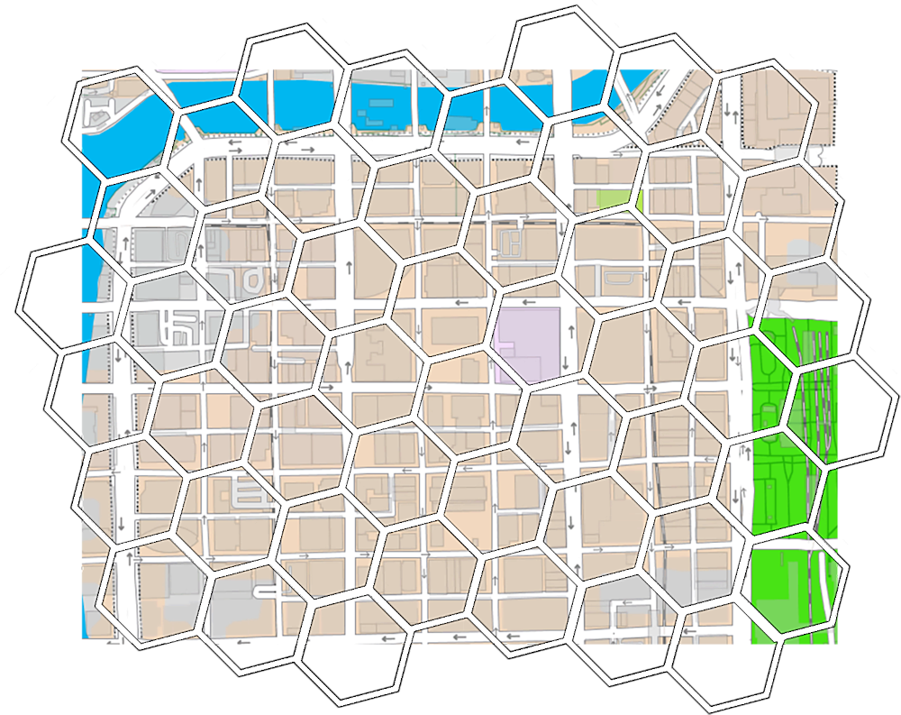
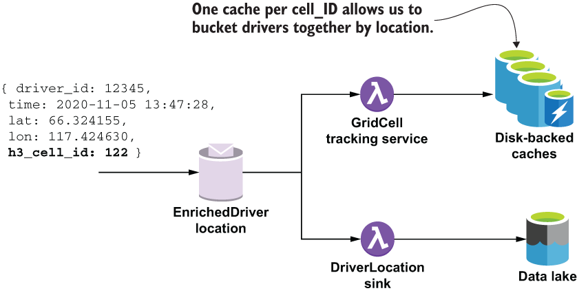

# 数据访问
本章涵盖

- 使用 Pulsar Functions 存储和检索数据
- 使用 Pulsar 的内部状态机制进行数据存储和检索
- 使用 Pulsar Functions 从外部系统访问数据

到目前为止，我们的 Pulsar 函数使用的所有信息都已在传入消息中提供。虽然这是一种有效的信息交换方式，但这并不是 Pulsar Functions 相互交换信息的最有效或最理想的方式。这种方法的最大缺点是它依赖于消息源来为你的 Pulsar 函数提供完成其工作所需的信息。这违反了面向对象设计的封装原则，即函数的内部逻辑不应暴露给外界。目前，对一个函数内部逻辑的任何更改都可能需要对提供传入消息的上游函数进行更改。

考虑一个用例，你正在编写一个需要客户联系信息（包括他们的手机号码）的函数。与其传递包含所有这些信息的消息，不如只传递客户 ID 不是更容易，然后我们的函数可以使用它来查询数据库并检索我们需要的信息吗？事实上，如果函数所需的信息存在于外部数据源（例如数据库）中，则这是一种常见的访问模式。这种方法强制封装并通过依赖每个函数来收集它需要的信息而不是在传入消息中提供它来防止一个函数的更改直接影响其他函数。

在本章中，我将介绍几个需要从外部系统存储和/或检索数据的用例，并演示如何使用 Pulsar Functions 执行此操作。在此过程中，我将介绍各种不同的数据存储，并描述用于选择一种技术而非另一种技术的各种标准。

## 10.1 数据来源

迄今为止，我们一直在开发的 GottaEat 应用程序托管在一个更大的企业架构的上下文中，该架构由多种技术和数据存储平台组成，如图 10.1 所示。这些数据存储平台被 GottaEat 组织内的多个应用程序和计算引擎使用，并充当整个企业的单一事实来源。

如你所见，Pulsar Functions 可以访问来自各种数据源的数据，从低延迟内存数据网格和磁盘支持的缓存到高延迟数据湖和 Blob 存储。这些数据存储允许我们访问由其他应用程序和计算引擎提供的信息。例如，我们一直在开发的 GottaEat 应用程序有一个专用的 MySQL 数据库，它用于存储客户和驱动程序信息，例如他们的登录凭据、联系信息和家庭住址。这些信息是由图 10.1 所示的一些提供非流式服务的非 Pulsar 微服务收集的，例如用户登录、帐户更新等。



图 10.1 GottaEat 组织的企业架构将由各种计算引擎和数据存储技术组成。因此，我们可以从 Pulsar 函数访问这些不同的数据存储库至关重要。

在 GottaEat 企业架构中，有分布式计算引擎，例如 Apache Spark 和 Apache Hive，它们对存储在数据湖中的超大数据集执行批处理。一个这样的数据集是司机位置数据，它包含登录到我们应用程序的每个司机的纬度和经度坐标。 GottaEat 移动应用程序每 30 秒自动记录一次驾驶员的位置，并将其转发给 Pulsar 以存储在数据湖中。然后将该数据集用于公司机器学习模型的开发和培训。给定足够的信息，这些模型可以准确预测各种关键业务指标，例如下订单的预计交货时间或下一小时内最有可能获得最多食品订单的城市区域，因此我们可以相应地定位司机。这些计算引擎计划定期运行，以计算机器学习模型所需的各种数据点，并将它们存储在 Cassandra 数据库中，以便托管 ML 模型的 Pulsar 函数访问它们以提供实时预测。

## 10.2 数据访问用例

在本节中，我将演示如何使用 Pulsar 函数访问来自各种数据存储的数据。在我直接进入用例之前，我想讨论如何决定哪个数据存储最适合给定的用例。从 Pulsar Functions 的角度来看，使用哪种数据存储取决于许多因素，包括数据的可用性和分配给特定 Pulsar 函数的最大处理时间。我们的一些功能，例如交货时间估计，将直接与客户和司机互动，需要近乎实时地提供响应。对于这些类型的功能，所有数据访问都应限制在低延迟数据源，以确保可预测的响应时间。

GottaEat 架构中有四个数据存储，由于它们能够提供亚秒级数据访问时间，因此可以归类为低延迟。其中包括 Apache BookKeeper 支持的 Pulsar 状态存储、Apache Ignite 提供的内存数据网格 (IMDG)、磁盘支持的缓存以及 Apache Cassandra 提供的分布式列存储。内存数据将所有数据保留在内存中，从而提供最快的访问时间。但是，它的存储容量受到托管 Pulsar 功能的机器上可用 RAM 量的限制。它用于在未通过主题直接连接的 Pulsar 函数之间传递信息，例如设备验证用例中的双因素身份验证。

### 10.2.1 设备验证

当客户第一次从 App Store 下载 GottaEat 移动应用程序并将其安装在他们的手机上时，客户需要创建一个帐户。客户选择用于登录凭据的电子邮件/密码，并将它们与用于唯一标识设备的手机号码和设备 ID 一起提交。从图 10.2 中可以看出，此信息随后存储在 MySQL 数据库中，以用于在用户将来登录时对用户进行身份验证。



图 10.2 一个非 Pulsar 微服务处理应用程序注册用例并将提供的用户凭据和设备信息存储在 MySQL 数据库中。

当用户登录 GottaEat 应用程序时，我们将使用存储在数据库中的信息来验证提供的凭据并验证他们用于连接的设备。由于我们在用户第一次注册时记录了设备 ID，因此我们可以将用户登录时提供的设备 ID 与记录中的设备 ID 进行比较。这就像 cookie 对网络浏览器的作用一样，允许我们确认用户正在使用受信任的设备。如图 10.3 所示，在我们根据 RegisteredUsers 表中存储的值验证用户凭据后，我们将用户记录放在 LoggedInUsers 主题中，以便 DeviceValidation 函数进一步处理，以确保用户使用的是可信设备。



图10.3 客户登录移动应用时提供的设备ID；然后，我们将它与我们之前与用户关联的已知设备进行交叉引用。

这提供了额外的安全级别，并防止身份窃贼使用被盗的客户凭据下欺诈订单，因为它还要求潜在欺诈者提供正确的设备 ID 才能下订单。你可能会问自己：如果客户只是使用新的或不同的设备会怎样？这是一个完全有效的场景，我们需要处理他们购买新手机或从不同设备登录他们的帐户的情况。在这种情况下，我们将使用基于 SMS 的双因素身份验证，其中我们将随机生成的 5 位数 PIN 码发送到客户在注册时提供的手机号码，并等待他们回复该代码。这是一种非常常用的技术，用于验证移动应用程序的用户。



图 10.4 在 DeviceValidationService 内部，我们将给定的设备 ID 与客户最近使用的设备进行比较，如果相同，则对用户进行授权。否则，我们会检查它是否在用户的已知设备列表中，并在必要时启动双因素身份验证。

如图 10.4 所示，设备验证过程首先尝试从 Pulsar 的内部状态存储中检索客户最近使用的设备 ID，正如你在第 4 章中所回忆的那样，它是一个键值存储，可供用户使用有状态的 Pulsar 功能用于保留有状态的信息。 Pulsar 状态存储使用 Apache BookKeeper 进行存储，以确保写入其中的任何信息都将持久保存到磁盘并进行复制。这确保数据将比任何正在读取数据的相关 Pulsar 函数实例存活时间更长。

然而，这种对 BookKeeper 存储的依赖是以性能为代价的，因为数据必须写入磁盘。因此，尽管状态存储提供与其他数据存储（例如 IMDG）相同的键值语义，但它的延迟率要高得多。因此，不建议将状态存储用于将频繁读取和写入的数据。它更适合不频繁的读/写用例，例如设备 ID，每个用户会话只调用一次。

清单 10.1 显示了 DeviceValidationService 的逻辑流程，它试图从两个不同的数据源中定位设备 ID。基类包含与连接到 MySQL 数据库相关的所有源代码，如果 SMS 身份验证成功，DeviceRegistrationService 也会使用它来更新数据库。

清单 10.1 DeviceValidationService

```java
public class DeviceValidationService extends DeviceServiceBase implements 
➥ Function<ActiveUser, ActiveUser> {
 
  ...
    
  @Override
  public ActiveUser process(ActiveUser u, Context ctx) throws Exception {
    boolean mustRegister = false;
        
    if (StringUtils.isBlank(u.getDevice().getDeviceId())) {                ❶
      mustRegister = true;
    } 
        
    String prev = getPreviousDeviceId(
         u.getUser().getRegisteredUserId(), ctx);                          ❷
        
    if (StringUtils.equals(prev, EMPTY_STRING)) {
      mustRegister = true;                                                 ❸
    } else if (StringUtils.equals(prev, u.getDevice().getDeviceId())) {
      return u;                                                            ❹
    } else if (isRegisteredDevice(u.getUser().getRegisteredUserId(), 
           u.getDevice().getDeviceId().toString())) {                      ❺
      ByteBuffer value = ByteBuffer.allocate(
             u.getDevice().getDeviceId().length());
      value.put(u.getDevice().getDeviceId().toString().getBytes());
      ctx.putState("UserDevice-" + u.getDevice().getDeviceId(), value);    ❻
    }
        
    if (mustRegister) {
     ctx.newOutputMessage(registrationTopic, Schema.AVRO(ActiveUser.class))
        .value(u)
        .sendAsync();                                                      ❼
       return null;
    } else {
       return u;
    }
  }
 
  private String getPreviousDeviceId(long registeredUserId, Context ctx) {
    ByteBuffer buf = ctx.getState("UserDevice-" + registeredUserId);       ❽
    return (buf == null) ? EMPTY_STRING : 
         new String(buf.asReadOnlyBuffer().array());
    }
    
  private boolean isRegisteredDevice(long userId, String deviceId) {
    try (Connection con = getDbConnection();
          PreparedStatement ps = con.prepareStatement( "select count(*) "
           + "from RegisteredDevice where user_id = ? "
          + " AND device_id = ?")) {
      ps.setLong(1, userId); 
      ps.setNString(2, deviceId); 
      ResultSet rs = ps.executeQuery(); 
      if (rs != null && rs.next()) { 
        return (rs.getInt(1) > 0);                                         ❾
      } 
    } catch (ClassNotFoundException | SQLException e) { 
      // Ignore these 
    } 
    return false;  
  }
...
}
```

❶ 如果用户根本没有提供设备 ID
❷ 从状态存储中获取该用户之前的设备 ID。
❸ 该用户没有以前的设备 ID。
❹ 提供的设备 ID 与状态存储中的值相匹配。
❺ 查看设备 id 是否在用户的已知设备列表中。
❻ 这是一个已知设备，因此使用提供的设备 ID 更新状态存储。
❼ 这是一个未知设备，因此发布一条消息以执行短信验证。
❽ 使用用户 ID 在状态存储中查找设备 ID。
❾ 如果提供的设备 ID 与用户关联，则返回 true。
如果设备无法与当前用户关联，则会向用于提供 SMS 验证过程的 UnknownDevices 主题发布一条消息。正如你在图 10.4 中可能已经注意到的那样，SMS 验证过程由一系列 Pulsar 函数组成，这些函数必须相互协调以执行双因素身份验证。



图 10.5 SMS 验证过程由一组 Pulsar Functions 执行，这些函数向用户注册的手机号码发送 5 位代码并验证用户发回的代码。

SMS 验证过程中的第一个 Pulsar 函数从 UnknownDevices 主题读取消息，并使用注册的用户 ID 检索我们将向其发送 SMS 验证代码的手机号码。这是一种非常简单的数据访问模式，我们使用主键从关系数据库中检索信息并将其转发给另一个函数。虽然这种方法通常被认为是一种反模式，因为它违反了我之前提到的封装原则，但出于两个原因，我决定将其分解为自己的功能。第一个是代码本身的可重用性，因为在多个用例中我们需要检索有关特定用户的所有信息，我希望将该逻辑包含在单个类中，而不是分布在多个函数中，因此易于维护。第二个原因是我们稍后将在 DeviceRegistration 服务中需要一些此类信息，因此我决定传递所有信息而不是执行相同的数据库查询两次以减少处理延迟。

从下一个清单中可以看出，UserDetailsByActiveUser 函数将注册的用户 ID 提供给 UserDetailsLookup 类，该类执行数据库查询以检索数据并返回 UserDetails 对象。

清单 10.2 UserDetailsByActiveUser 函数

```java
public class UserDetailsByActiveUser implements 
   Function<ActiveUser, UserDetails> {
 
  private UserDetailsLookup lookupService = new UserDetailsLookup();   ❶
    
  @Override
  public UserDetails process(ActiveUser input, Context ctx) throws Exception{
    return lookupService.process(
      input.getUser().getRegisteredUserId(),                           ❷
      ctx);                                                            ❸
  }
}
```

❶ 创建一个执行数据库查找的类的实例。
❷ 传入查找中使用的主键字段。
❸ 传入上下文对象，以便查找类可以访问数据库凭据等。
这种仅从传入消息中提取主键并将其传递给执行查找的不同类的模式可以在任何用例中重用，并且在 GottaEat 应用程序的情况下，它被不同的 Pulsar 函数流用于检索给定食品订单的用户信息，如下面的清单所示。

清单 10.3 UserDetailsByFoodOrder 函数

```java
public class UserDetailsByFoodOrder implements 
  Function<FoodOrder, UserDetails> {
 
  private UserDetailsLookup lookupService = new UserDetailsLookup();   ❶
    
  @Override
  public UserDetails process(FoodOrder order, Context ctx) throws Exception {
    return lookupService.process(
     order.getMeta().getCustomerId(),                                  ❷
     ctx);                                                             ❸
  }
}
```

❶ 创建一个执行数据库查找的类的实例。
❷ 传入查找中使用的主键字段。
❸ 传入上下文对象，以便查找类可以访问数据库凭据等。
用于提供信息的底层查找类如清单 10.4 所示，它封装了查询数据库表以检索所有信息所需的逻辑。这种数据访问模式可用于从你需要从 Pulsar 函数访问的任何关系数据库表中检索数据。

清单 10.4 UserDetailsLookup 函数

```java
public class UserDetailsLookup implements Function<Long, UserDetails> {
    
  . . .
  private Connection con;
  private PreparedStatement stmt;
  private String dbUrl, dbUser, dbPass, dbDriverClass;
 
  @Override
  public UserDetails process(Long customerId, Context ctx) throws Exception {
        
    if (!isInitalized()) {                                               ❶
      dbUrl = (String) ctx.getUserConfigValue(DB_URL_KEY);
      dbDriverClass = (String) ctx.getUserConfigValue(DB_DRIVER_KEY);
      dbUser = (String) ctx.getSecret(DB_USER_KEY);
      dbPass = (String) ctx.getSecret(DB_PASS_KEY);
    }
 
    return getUserDetails(customerId);
  }  
 
  private UserDetails getUserDetails(Long customerId) {
    UserDetails details = null;
 
    try (Connection con = getDbConnection();
         PreparedStatement ps = con.prepareStatement("select ru.user_id, 
          + " ru.first_name, ru.last_name, ru.email, "
          + "a.address, a.postal_code, a.phone, a.district,"
          + "c.city, c2.country from GottaEat.RegisteredUser ru "
          + "join GottaEat.Address a on a.address_id = c.address_id "
          + "join GottaEat.City c on a.city_id = c.city_id "
          + "join GottaEat.Country c2 on c.country_id = c2.country_id "
          + "where ru.user_id = ?");) {                                  ❷
 
    ps.setLong(1, customerId);                                           ❸
    
    try (ResultSet rs = ps.executeQuery()) {
      if (rs != null && rs.next()) { 
         details = UserDetails.newBuilder()                            
     .setEmail(rs.getString("ru.email"))
     .setFirstName(rs.getString("ru.first_name"))
     .setLastName(rs.getString("ru.last_name"))
     .setPhoneNumber(rs.getString("a.phone"))                    
     .setUserId(rs.getInt("ru.user_id"))
     .build();                                                           ❹
      }
    } catch (Exception ex) {
      // Ignore
    }        
  } catch (Exception ex) {
    // Ignore
  }
 
  return details;
  }
 
  . . .
 
}
```

❶ 确保我们拥有来自用户上下文对象的所有必需属性。
❷ 执行查找给定的用户 ID。
❸ 在准备好的语句的第一个参数中使用用户ID。
❹ 将关系数据映射到 UserDetails 对象。
UserDetailsByActiveUser 函数将 UserDetails 传递给 VerificationCodeSender 函数，后者又将验证码发送给客户，并在 IMDG 中记录关联的交易 ID。 VerificationCodeValidator 函数需要此交易 ID 来验证用户发回的 PIN；但是，从图 10.5 中可以看出，VerificationCodeSender 函数和 VerificationCodeValidator 之间没有中间 Pulsar 主题，因此我们无法在消息中传递此信息。相反，我们必须依靠这个外部数据存储来传递这些信息。

IMDG 非常适合此任务，因为信息是短暂的，并且不需要保留超过代码有效时间。如果用户发回的 PIN 有效，下一个函数会将新验证的设备添加到 RegisterdDevices 表以供将来参考。最后，用户将被发送回 LoggedInUser 主题，以便可以在状态存储中更新设备 ID。

由于 VerificationCodeSender 和 VerificationCodeValidator 函数使用 IMDG 相互通信，因此我决定让它们共享一个公共基类，该基类提供与共享缓存的连接，如下面的清单所示。

清单 10.5 VerificationCodeBase

```java
public class VerificationCodeBase {
 
  protected static final String API_HOST = "sms-verify-api.com";    ❶
    
  protected IgniteClient client;                                    ❷
  protected ClientCache<Long, String> cache;                        ❸
  protected String apiKey;    
  protected String datagridUrl; 
  protected String cacheName;                                       ❹
    
  protected boolean isInitalized() {
    return StringUtils.isNotBlank(apiKey);
  }
    
  protected ClientCache<Long, String> getCache() {
    if (cache == null) {
     cache = getClient().getOrCreateCache(cacheName);
   }
    return cache;
  }
    
  protected IgniteClient getClient() {
    if (client == null) {
     ClientConfiguration cfg = 
     new ClientConfiguration().setAddresses(datagridUrl);
     client = Ignition.startClient(cfg);                            ❺
    }
    return client;
  }
}
```

❶ 用于执行短信验证的第三方服务的主机名
❷ Apache Ignite 瘦客户端
❸ Apache Ignite 缓存用于存储数据
❹ 两个服务将访问的缓存名称
❺ 将瘦客户端连接到内存数据网格。
VerificationCodeSender 使用 UserDetailsByActiveUser 函数提供的 UserDetails 对象中的手机号码来调用第三方短信验证服务，如下面的清单所示。

清单 10.6 VerificationCodeSender 函数

```java
public class VerificationCodeSender extends VerificationCodeBase 
  implements Function<ActiveUser, Void> {
 
private static final String BASE_URL = "https://" + RAPID_API_HOST + 
  ➥ "/send-verification-code";                                           ❶
  private static final String REQUEST_ID_HEADER = "x-amzn-requestid";
 
  @Override
  public Void process(ActiveUser input, Context ctx) throws Exception {
    if (!isInitalized()) {                                               ❷
     apiKey = (String) ctx.getUserConfigValue(API_KEY);
     datagridUrl = ctx.getUserConfigValue(DATAGRID_KEY).toString();
     cacheName = ctx.getUserConfigValue(CACHENAME_KEY).toString();
    }
 
    OkHttpClient client = new OkHttpClient();
    Request request = new Request.Builder()
      .url(BASE_URL + "?phoneNumber=" + toE164FormattedNumber(
           input.getDetails().getPhoneNumber().toString()) 
           + "&brand=GottaEat")
      .post(EMPTY_BODY)
      .addHeader("x-rapidapi-key", apiKey)
      .addHeader("x-rapidapi-host", RAPID_API_HOST)
      .build();                                                          ❸
        
    Response response = client.newCall(request).execute();               ❹
    if (response.isSuccessful()) {                                       ❺
      String msg = response.message();  
      String requestID = response.header(REQUEST_ID_HEADER);             ❻
      if (StringUtils.isNotBlank(requestID)) {                           ❼
        getCache().put(input.getUser().getRegisteredUserId(), requestID);
      }
    }
    return null;
  }
}
```

❶ 用于发送短信验证码的第三方服务的 URL
❷ 确保我们拥有来自用户上下文对象的所有必需属性。
❸ 为第三方服务构建HTTP请求对象。
❹ 将请求对象发送给第三方服务。
❺ 请求是否成功
❻ 从响应对象中检索请求 ID。
❼如果我们有一个请求ID，把它存储在IMDG中。
如果 HTTP 调用成功，第三方服务会在其响应消息中提供唯一的请求 ID 值，VerificationCodeValidator 函数可以使用该值来验证用户发回的响应。正如你在清单 10.6 中看到的，我们使用用户 ID 作为密钥将这个请求 ID 存储在 IMDG 中。稍后，当用户以 PIN 值响应时，我们可以使用该值来验证用户，如下面的清单所示。

清单 10.7 VerificationCodeValidator 函数

```java
public class VerificationCodeValidator extends VerificationCodeBase 
  implements Function<SMSVerificationResponse, Void> {                   ❶
 
  public static final String VALIDATED_TOPIC_KEY = "";
  private static final String BASE_URL = "https://" + RAPID_API_HOST 
     + "/check-verification-code";                                       ❷
  private String valDeviceTopic;                                         ❸
    
  @Override
  public Void process(SMSVerificationResponse input, Context ctx) 
    throws Exception {
 
    if (!isInitalized()) {
     apiKey = (String) ctx.getUserConfigValue(API_KEY).orElse(null);
     valDeviceTopic = ctx.getUserConfigValue(VALIDATED_TOPIC_KEY).toString();
   }
    
   String requestID = getCache().get(input.getRegisteredUserId());       ❹
  
   if (requestID == null) {
      return null;                                                       ❺
    }
 
   OkHttpClient client = new OkHttpClient();
   Request request = new Request.Builder()
      .url(BASE_URL + "?request_id=" + requestID + "&code=" 
           + input.getResponseCode())
      .post(EMPTY_BODY)
      .addHeader("x-rapidapi-key", apiKey)
      .addHeader("x-rapidapi-host", RAPID_API_HOST)
      .build();                                                          ❻
        
      Response response = client.newCall(request).execute();
      if (response.isSuccessful()) {                                     ❼
        ctx.newOutputMessage(valDeviceTopic,
               Schema.AVRO(SMSVerificationResponse.class))
         .value(input)
         .sendAsync();                                                   ❽
        
      }
   return null;
  }    
}
```

❶ 接收短信验证响应对象
❷ 用于执行短信验证的第三方服务的 URL
❸ 将经过验证的设备信息发布到 Pulsar 主题
❹ 从 IMDG 获取请求 ID。
❺ 如果没有找到用户的请求 ID，那么我们就完成了。
❻ 构造对第三方服务的 HTTP 请求。
❼ 如果用户以正确的 PIN 响应，则设备已通过验证。
❽ 向经过验证的设备主题发布新消息。
SMS 验证过程中涉及的两个函数之间的这个流程演示了如何在没有中间主题连接的 Pulsar 函数之间交换信息。但是，这种方法的最大限制是数据网格本身的内存中可以保留的数据量。对于需要跨 Pulsar 函数共享的较大数据集，磁盘支持的缓存是更好的解决方案。

### 10.2.2 司机位置数据

每 30 秒，一条位置消息从驾驶员的移动应用程序发送到 Pulsar 主题。该司机位置数据是 GottaEat 最通用和最关键的数据集之一。这些信息不仅需要存储在数据湖中以训练机器学习模型，而且对于几个实时用例也很有用，例如到上车或下车地点的途中旅行时间估计，提供行车路线，或允许客户在订单到达他们的路线时跟踪他们的位置，仅举几例。

GottaEat 移动应用程序使用手机操作系统提供的定位服务来确定驾驶员当前位置的纬度和经度。在将这些信息发布到 DriverLocation 主题之前，会使用当前时间戳和驱动程序的 ID 来丰富此信息。驾驶员位置信息将以多种方式使用，这反过来又决定了数据应如何存储、丰富和排序。当我们想要查找给定驱动程序的最新位置时，访问位置数据的方法之一是直接通过驱动程序 ID。

如图 10.6 所示，LocationTrackingService 使用这些消息并使用它们来更新驱动程序位置缓存，这是一个全局缓存，将所有位置更新存储为键/值对，其中键是驱动程序 ID，而value 是位置数据。我决定将此信息存储在磁盘支持的缓存中，以便任何需要它的 Pulsar 函数都可以访问它。与 IMDG 不同，磁盘支持的缓存会将其无法保存在内存中的任何数据溢出到本地磁盘进行存储，而 IMDG 将默默地丢弃数据。考虑到我们在公司启动并运行后预计将拥有的驾驶员位置数据量，磁盘支持的缓存是存储这些时间关键信息的最佳选择，同时确保不会丢失任何信息。



图 10.6 每个驱动程序定期将其位置信息发送到 DriverLocation 主题。 该信息随后由多个 Pulsar 函数处理，然后被持久化到数据存储中。

为简单起见，我们决定使用相同的底层技术 (Apache Ignite) 为 GottaEat 提供 IMDG 和磁盘支持的缓存。 这一决定不仅减少了我们的开发人员需要学习和使用的 API 数量，而且还简化了 DevOps 团队的生活，因为他们只需要部署和监控运行相同软件的两个不同集群，如图所示 10.7. 两个集群之间的唯一区别是名为persistenceEnabled 的单个布尔配置设置的值，该设置允许将缓存数据存储到磁盘，从而允许它存储更多数据。



图 10.7 GottaEat 企业架构内部有两个不同的集群运行 Apache Ignite——一个被配置为将缓存数据持久化到磁盘，另一个不是。

正如你在清单 10.8 的代码中所见，IMDG 和磁盘支持缓存的数据访问使用相同的 API（即，你使用单个键读取和写入值）。不同之处在于检索数据时的预期数据查找时间。对于 IMDG，所有数据都保证在内存中，因此将提供始终如一的快速查找时间。但是，权衡是当你尝试读取数据时，不能保证数据可用。

相比之下，磁盘支持的缓存将仅保留内存中的最新数据，并随着数据量的增长将其大部分数据存储在磁盘上。鉴于大量数据驻留在磁盘上，磁盘支持缓存的整体查找时间将慢几个数量级。因此，当数据可用性比查找时间更重要时，最好使用这种类型的数据存储。

清单 10.8 LocationTrackingService

```java
public class LocationTrackingService implements 
   Function<ActiveUser, ActiveUser> {
 
  private IgniteClient client;
  private ClientCache<Long, LatLon> cache;
 
  private String datagridUrl;
  private String locationCacheName;
 
  @Override
  public ActiveUser process(ActiveUser input, Context ctx) throws Exception {
 
    if (!initalized()) {
      datagridUrl = ctx.getUserConfigValue(DATAGRID_KEY).toString();
      locationCacheName = ctx.getUserConfigValue(CACHENAME_KEY).toString();
    }
  
    getCache().put(
      input.getUser().getRegisteredUserId(),                     ❶
      input.getLocation());                                      ❷
  
    return input;
  }
    
  private ClientCache<Long, LatLon> getCache() {
    if (cache == null) {
      cache = getClient().getOrCreateCache(locationCacheName);   ❸
    }
    return cache;
  }
    
  private IgniteClient getClient() {                             ❹
    if (client == null) {
      ClientConfiguration cfg = 
         new ClientConfiguration().setAddresses(datagridUrl);
      client = Ignition.startClient(cfg);
    }
    return client;
  }
}
```

❶ 使用用户 ID 作为密钥。
❷ 将该位置添加到磁盘支持的缓存中。
❸ 创建位置缓存
❹ 使用 Apache Ignite 客户端
存储在磁盘缓存中的位置信息然后可用于确定分配给客户订单的特定驱动程序的当前位置，然后发送到客户手机上的地图软件，以便他们可以跟踪订单状态 视觉上，如图 10.8 所示。 司机位置数据的另一个用途是确定哪些司机最适合被分配订单。 做出此决定的因素之一是司机与完成订单的客户和/或餐厅的距离。 虽然理论上是可能的，但每次下订单时计算每个司机和送货地点之间的距离太费时了。



图 10.8 司机位置数据用于更新客户手机上的地图显示，以便他们可以看到司机的当前位置以及预计的交货时间。

因此，我们需要一种方法来立即近乎实时地识别接近订单的司机。一种方法是将地图划分为更小的逻辑六边形区域，称为单元格，如图 10.9 所示，然后根据驱动程序当前位于这些单元格中的哪个单元格将它们分组在一起。进来，我们需要做的就是确定订单在哪个单元格中，然后首先查找当前在该单元格中的驱动程序。如果没有找到驱动程序，我们可以将搜索扩展到相邻的单元格。通过以这种方式对驱动程序进行预排序，我们能够执行更有效的搜索。



图 10.9 我们使用覆盖在二维地图上的六边形区域的全球网格系统。每个纬度/经度对都映射到网格上的一个单元格。然后根据驱动程序当前所在的六边形将驱动程序组合在一起。

图 10.6 中的另一个 Pulsar 函数是 GridCellCalculator，它使用 Uber 开发的 H3 开源项目（https://github.com/uber/h3-java）来确定驱动程序当前位于哪个单元格并附加相应的在将位置数据发布到 EnrichedDriverLocation 主题以供进一步处理之前，将其添加到位置数据的单元 ID。我在本章中省略了该函数的代码，但如果你想了解更多详细信息，可以在与本书相关的 GitHub 存储库中找到它。

从图 10.10 中可以看出，有一个磁盘支持的缓存（每个单元 ID 一个）的全局集合，用于保留给定单元 ID 内驱动程序的位置数据。以这种方式对驱动程序进行预排序允许我们将搜索范围缩小到我们感兴趣的少数几个单元格，而忽略所有其他单元格。除了加速司机分配决策之外，通过单元 ID 将司机组合在一起，使我们能够分析地理信息以设置动态价格并在全市范围内做出其他决策，例如激增定价和激励我们的司机在没有足够的驱动程序来容纳订单量等。



图 10.10 EnrichedDriverLocation 主题中的消息已使用 H3 单元 ID 进行了丰富，然后用于将驱动程序分组在一起。

从清单 10.9 中的代码可以看出，GridCellTrackingService 使用每个传入消息中的单元 ID 来确定将位置数据发布到哪个缓存中。磁盘支持的缓存使用以下命名约定：“drivers-cell-XXX”，其中 XXX 是 H3 单元 ID。因此，当我们收到一个单元 ID 为 122 的消息时，我们将其放入drivers-cell-122 缓存中。

清单 10.9 GridCellTrackingService

```java
import com.gottaeat.domain.driver.DriverGridLocation;
import com.gottaeat.domain.geography.LatLon;
 
public class GridTrackingService 
   implements Function<DriverGridLocation, Void> {
 
  static final String DATAGRID_KEY = "datagridUrl";
  
  private IgniteClient client;
  private String datagridUrl;
 
  @Override
  public Void process(DriverGridLocation in, Context ctx) throws Exception {
    if (!initalized()) {
      datagridUrl = ctx.getUserConfigValue(DATAGRID_KEY).toString();
     }
 
     getCache(input.getCellId())                                      ❶
       .put(input.getDriverLocation().getDriverId(),                  ❷
        input.getDriverLocation().getLocation());                     ❸
      return null;
  }
 
  private ClientCache<Long, LatLon> getCache(int cellID) {
    return getClient().getOrCreateCache("drivers-cell-" + cellID);    ❹
  }
 
  private IgniteClient getClient() {
     if (client == null) {
        ClientConfiguration cfg = 
            new ClientConfiguration().setAddresses(datagridUrl);
        client = Ignition.startClient(cfg);
      }
    return client;
  }
 
  private boolean initalized() {
    return StringUtils.isNotBlank(datagridUrl);
  }
}
```

❶ 获取我们计算出的给定单元 ID 的缓存。
❷ 使用userID 作为key。
❸ 将该位置添加到磁盘支持的缓存中。
❹ 返回或创建指定单元 ID 的缓存。
丰富的位置消息的另一个消费者是一个名为 DriverLocationSink 的 Pulsar IO 连接器，它对消息进行批处理并将它们写入数据湖。在这种特殊情况下，接收器的最终目的地是 HDFS 文件系统，它允许组织内的其他团队使用各种计算引擎（例如 Hive、Storm 或 Spark）对数据执行分析。

由于传入数据对我们的交付时间估计数据模型具有更高的价值，因此可以将接收器配置为将数据写入 HDFS 内的特殊目录。这允许我们预先过滤最新的数据并将其组合在一起，以便通过使用此数据预先计算 Cassandra 数据库中交付时间特征向量的数据的过程进行更快的处理。

## 概括

- Pulsar 的内部状态存储为存储不常访问的数据提供了方便的位置，而无需依赖外部系统。
- 你可以从 Pulsar 函数内部访问各种外部数据源，包括内存数据网格、磁盘支持的缓存、关系数据库等。
- 在确定要使用的数据存储系统时，请考虑延迟和数据存储功能。低延迟系统通常更适合流处理系统。