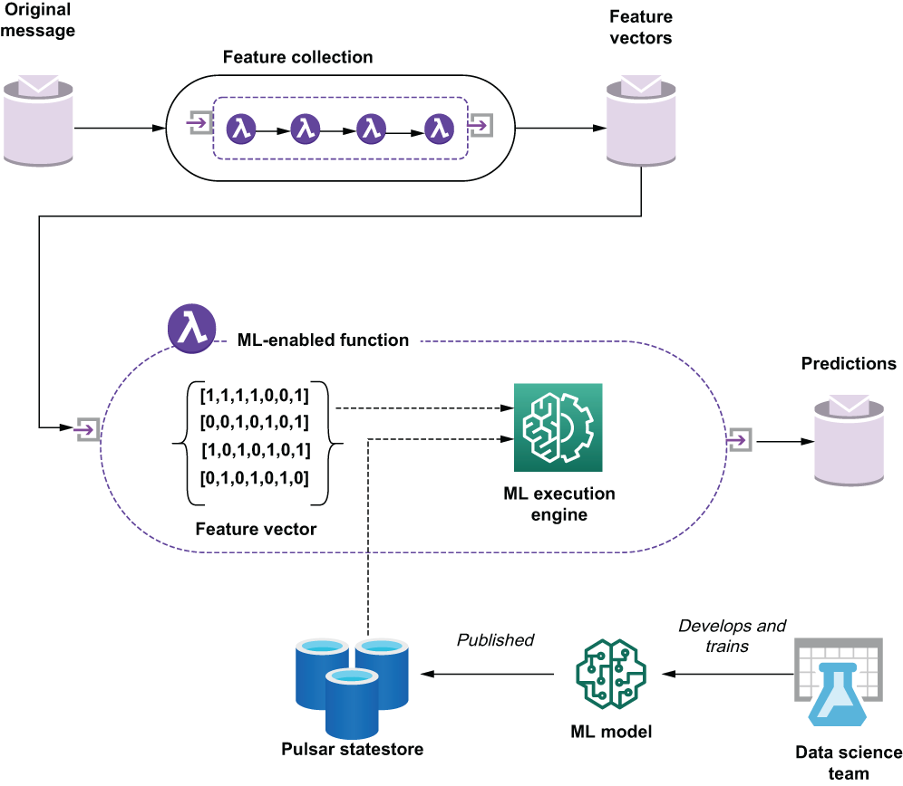
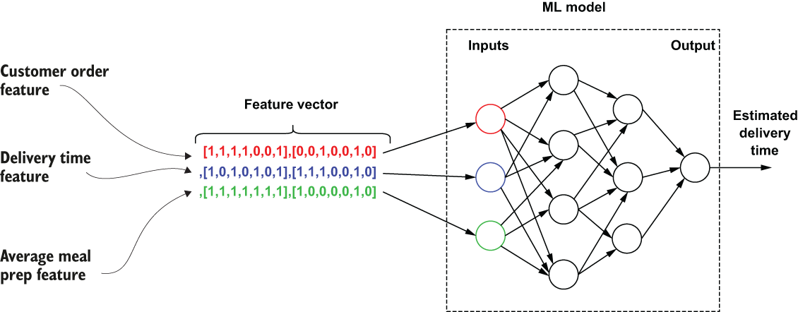
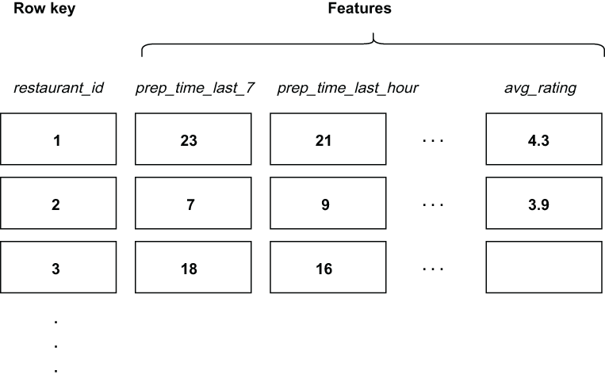
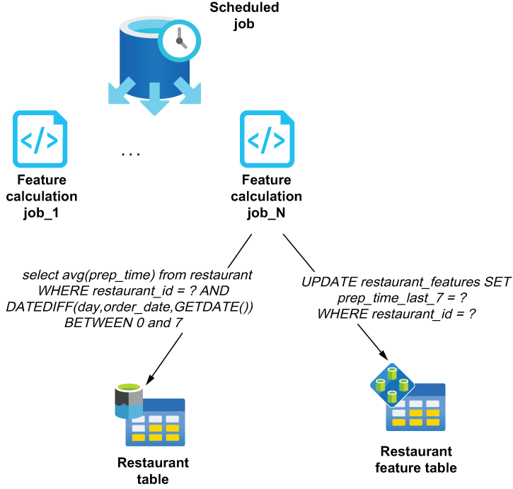
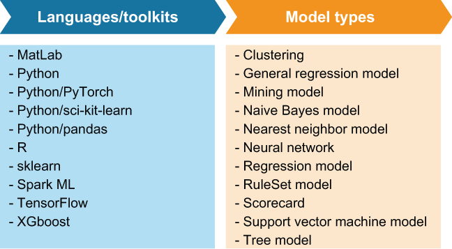
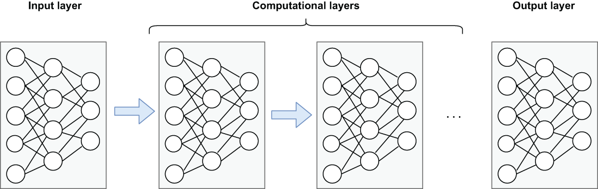
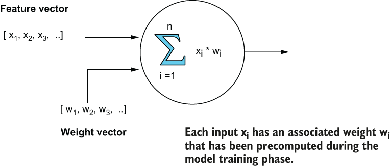

# Pulsar 中的机器学习

本章涵盖

- 探索如何使用 Pulsar 函数来提供近乎实时的机器学习
- 开发和维护机器学习模型所需的输入集合以提供预测
- 在 Pulsar 函数中执行任何支持 PMML 的模型
- 在 Pulsar 函数中执行非 PMML 模型

机器学习的主要目标之一是从原始数据中提取可操作的见解。拥有可操作的洞察力意味着你可以使用它们来制定战略性的、数据驱动的决策，从而为你的业务和客户带来积极的结果。例如，每次客户在 GottaEat 应用程序上下订单时，我们都希望能够为客户提供准确的预计交货时间。为了实现这一点，我们需要开发一个机器学习模型，该模型可以根据多种因素来预测任何给定订单的交货时间，从而使我们能够做出更准确的决策。

通常，这些可操作的见解是由机器学习 (ML) 模型生成的，这些模型经过开发和训练以接收一组预定义的输入（称为特征向量），并使用该信息进行预测，例如订单何时到达在客户的位置。数据科学团队有责任开发和训练这些模型，包括特征向量定义。由于这是一本关于 Apache Pulsar 而不是数据科学的书，我将主要关注在 Pulsar Functions 框架内部署这些 ML 模型，而不是模型本身的开发和训练。

## 11.1 部署机器学习模型

ML 模型是用各种语言和工具包开发的，每种语言和工具包都有自己的优点和缺点。不管这些 ML 模型是如何开发和训练的，它们最终都必须部署到生产环境中才能提供真正的商业价值。在较高级别上，部署到生产的 ML 模型有两种执行模式：批处理模式和近实时处理模式。

### 11.1.1 批处理

顾名思义，以批处理模式执行模型是指将大量数据输入模型以同时生成多个预测的过程，而不是逐案生成。然后可以根据需要缓存和重用这些批次的预测。

一个这样的例子是来自电子商务网站的营销电子邮件，该网站根据你与零售商的购买历史以及类似客户的购买情况提供产品推荐列表。由于这些建议基于历史和缓慢变化的数据集（即你的购买历史），因此可以随时生成。通常，这些营销电子邮件每天生成一次，并根据客户的本地时区发送给客户。由于这些建议是为所有尚未选择退出的客户生成的，因此这是使用 ML 模型进行批处理的绝佳候选者。但是，如果你的推荐需要考虑用户最近的活动，例如他们购物车的当前内容，那么你不能以批处理模式执行 ML 模型，因为该数据将不可用。在这种情况下，你将希望以近乎实时的处理模式部署你的 ML 模型。

### 11.1.2 近实时
利用 ML 模型使用仅在传入有效载荷中可用的数据逐案生成预测通常称为近实时处理。这种类型的处理比批处理复杂得多，主要是由于需要为预测提供服务的系统存在延迟限制。

近实时部署的一个完美候选者是 GottaEat 食品配送服务的预计配送时间组件，它为每个新下的食品订单提供食品配送时间的估计。这个 ML 模型的特征向量不仅依赖于作为订单的一部分提供的数据（即送货地址），而且还需要在几百毫秒内生成估计。简而言之，在决定为你的 ML 模型使用这些执行模式中的哪一种时，你应该考虑以下因素：

模型特征向量中所需的所有数据的可用性以及该数据的存储位置。执行模型所需的所有数据是否在系统中随时可用，或者是否在请求本身中提供了其中的一些数据。
随着时间的推移，建议的准确性下降的速度有多快。你可以预先计算建议并在特定时间段内重复使用吗？
检索特征向量中使用的所有数据的速度有多快。是存储在内存中还是非实时系统上，比如HDFS、传统数据库等。
正如你可能已经猜到的那样，出于多种原因，Pulsar 函数非常适合以近实时模式部署 ML 模型。首先也是最重要的，它们在请求进入时立即执行，并可以直接访问作为请求的一部分提供的数据，从而消除了任何处理和数据查找延迟。其次，正如我们在前一章中看到的，你可以从各种外部数据源检索数据，以使用存在于请求本身之外的任何必要数据填充特征向量。最后，也是最重要的是，Pulsar Functions 在部署选项方面提供的灵活性。使用 Java、Python 或 Go 编写函数的能力允许你的数据科学团队使用他们选择的语言/框架开发模型，并且仍然使用与函数捆绑的第三方库将其部署在 Pulsar 函数中在运行时执行模型。

## 11.2 近实时模型部署

由于 ML 框架太多，而且一切都发展得如此之快，我决定提出一个通用解决方案，该解决方案提供在 Pulsar Function 中部署 ML 模型所需的所有基本元素。 Pulsar Function 广泛的编程语言支持使你能够从各种框架部署 ML 模型，前提是有第三方库支持这些模型的执行。例如，TensorFlow 的 Java 库允许你部署和执行使用 TensorFlow 工具包开发的任何 ML 模型。同样，如果你的 ML 模型依赖于用 Python 编写的 pandas 库，则你可以轻松编写包含 pandas 库的基于 Python 的 Pulsar 函数。无论选择哪种语言，在 Pulsar 函数中部署近实时模型都遵循相同的高级模式。

从图 11.1 可以看出，有一个或多个 Pulsar 函数的序列，负责根据原始消息从外部数据源收集模型的特征向量所需的数据。这充当了一种数据丰富管道，可使用 ML 模型所需的附加数据元素来扩充来自消息的传入数据。在交货时间估算示例中，我们可能只获得准备订单的餐厅的 ID。然后，该管道将负责检索该餐厅的地理位置，以便将其提供给模型。



图 11.1 需要进行预测的原始消息通过一系列辅助 Pulsar 函数进行丰富，以生成适合 ML 模型的特征向量。然后，启用 ML 的功能可以使用来自其他低延迟数据源的数据进一步填充特征向量，然后将其与从 Pulsar 的内部状态存储检索到的 ML 模型一起发送到 ML 执行引擎进行处理。

一旦收集到这些数据，它就会被输入到 Pulsar 函数中，该函数将使用第三方库调用 ML 模型，以使用适当的框架（例如 TensorFlow 等）执行模型。值得注意的是，ML 模型本身是从 Pulsar 函数上下文对象中检索的，这允许我们独立于函数本身部署模型。模型与打包和部署的 Pulsar 函数的这种解耦为我们提供了动态调整模型的机会，更重要的是，允许我们根据外部因素和条件更改模型。

例如，对于午餐和晚餐等大批量时段，我们可能需要一个与非高峰时段完全不同的交货时间估计模型。然后将使用外部过程在当前时间的适当模型中旋转。事实上，数据科学团队可以使用特定时间的数据集训练相同的模型，以根据一天中的时间或一周中的某天生成不同的模型。例如，仅使用下午 4-5 点的数据训练时间估计模型。可以为该特定时间范围生成模型。

然后，支持 ML 的函数将完整的特征向量以及它从 Pulsar 的内部状态存储中检索到的 ML 模型的正确版本发送到 ML 执行引擎（例如，第三方库），该引擎生成预测和预测的相关置信水平。例如，引擎可能会以 84% 的置信度预测 7 分钟的预计到达时间。然后，该信息可用于向下订单的客户提供预计到达时间。

虽然你的 Pulsar 函数可能因你使用的 ML 框架而异，但总体轮廓保持不变。首先，从 Pulsar 的状态存储中获取 ML 模型，并在内存中保留一个副本。接下来，从传入消息中获取传入的预计算特征，并将它们映射到特征向量的预期输入字段。计算和/或检索任何尚未预先计算的附加特征，然后调用你的编程语言的 ML 库以使用给定的数据集执行模型并发布结果。

## 11.3 特征向量

在 ML 中，术语特征是指代表对象独特方面的单个数字或符号属性。这些特征通常被组合成数值特征的 n 维向量或特征向量，然后用作预测模型的输入。



图 11.2 交货时间估计模型需要一个由来自多个来源的特征组成的特征向量。每个特征都是一个介于 0 和 1 之间的数值数组。

特征向量中的每个特征都代表用于生成预测的单个数据。考虑 GottaEat 食品配送服务的预计配送时间特性。每次用户从餐厅订购食物时，ML 模型都会估计食物何时送达。该模型的特征包括来自请求的信息（例如，一天中的时间或交付地点）、历史特征（例如，过去 7 天的平均膳食准备时间）和近实时计算的特征（例如，平均最后一小时的膳食准备时间）。然后将这些特征输入 ML 模型以产生预测，如图 11.2 所示。 ML 中的许多算法需要特征的数值表示，因为这种表示有助于处理和统计分析，例如线性回归。因此，每个特征都表示为一个数值是很常见的，因为这使得它们在各种 ML 算法中都很有用。

### 11.3.1 特色商店

旨在以近实时模式部署的模型具有严格的延迟要求，并且不能可靠地计算需要以高性能方式访问传统数据存储的功能。使用传统关系数据库无法始终如一地实现亚秒级查询响应时间。

因此，有必要建立辅助过程来预先计算和索引这些必要的模型特征。计算后，这些特征应该存储在一个低延迟的数据存储中，称为特征存储，在那里可以在预测时快速访问它们，如图 11.3 所示。



图 11.3 餐厅特征商店使用唯一的 restaurant_id 字段作为行键，每行包含每个餐厅的多个特征。某些功能特定于交货时间估计模型，而其他功能则不是。

正如我之前提到的，我们的特征存储保存在一个以列为中心的低延迟数据库中，例如 Apache Cassandra，该数据库旨在允许每行有大量列，而不会在数据检索过程中产生性能损失。这允许我们将各种 ML 模型所需的特征存储在同一个表中（例如，交付时间估计字段，例如平均准备时间，可以与餐厅推荐模型使用的特征一起存储，例如平均客户评分）。因此，我们不需要为要使用的每个模型（restaurant_time_delivery_features 等）维护单独的表。这不仅简化了特征存储数据库的管理，而且还促进了跨 ML 模型的特征的使用。

在大多数组织中，特征存储中表的设计完全由数据科学团队负责，因为他们是特征存储的主要消费者。因此，当你的公司准备将模型投入生产时，通常只会向你提供 ML 模型以及它所需的功能列表作为输入。

### 11.3.2 特征计算

通常，特征与实体类型（餐厅、司机、客户等）相关联，因为每个特征都代表与每个特定实体的“有（n）”关系——例如，一家餐厅的平均膳食准备时间为 23分钟，或者司机的平均客户评价为 4.3 星。然后通过一个辅助过程填充特征商店，该过程预先计算各种特征，例如每家餐厅过去 7 天的平均膳食准备时间或最后一个小时在城市的平均交货时间。

需要安排这些进程定期运行以将结果缓存在特征存储中，并确保在订单到达时可以在亚秒级响应时间内检索这些特征。面向批处理的处理引擎最适合执行特征的预计算，因为它可以有效地处理大量数据。例如，分布式查询引擎，如 Apache Hive 或 Spark，可以使用标准 SQL 语法对存储在 HDFS 上的大型数据集执行多个并发查询，如图 11.4 所示。这些作业可以异步计算特定时间段内所有餐厅的平均膳食准备时间，并且可以安排每小时运行以保持这些功能最新。

正如你在图 11.4 中看到的，一个预定的 Job 可以启动多个并发任务，以及时完成工作。例如，预定作业可以首先查询餐厅表本身以确定餐厅 ID 的确切数量，然后通过为餐厅特征计算作业的每个实例提供餐厅 ID 的子集来拆分工作。这种分而治之的策略将大大加快进程，让你及时完成工作。



图 11.4 特征计算作业需要定期运行，以根据最新数据使用新值更新特征。批处理引擎（例如 Apache Hive 或 Spark）允许你并行处理许多此类作业。

与适当的团队协调以开发、部署和监控这些特征计算作业也很重要，因为它们现在是需要持续工作的关键业务应用程序，否则你的 ML 模型所做的预测将如果特征数据没有及时更新，则降级。在 ML 模型中使用陈旧数据会导致预测不准确，从而导致业务成果不佳和客户不满。

## 11.4 交货时间估算

现在我们已经充分介绍了背景和理论，是时候看看如何部署由 GottaEat 的数据科学团队开发和训练的 ML 模型了。一个完美的候选者是我们在本章中一直在讨论的交付时间估计 ML 模型。与需要部署到生产环境中的任何 ML 模型一样，数据科学团队负责向我们提供要使用的经过训练的模型的副本。

### 11.4.1 ML 模型导出

就像大多数数据科学团队一样，GottaEat 的数据科学团队使用各种语言和框架来开发他们的 ML 模型。最大的挑战之一是找到一个单一的执行框架来支持用不同语言开发的模型。

幸运的是，有几个项目正在寻求标准化 ML 模型格式，以支持用于模型训练和部署的不同语言。预测模型标记语言 (PMML) 等项目允许数据科学家和工程师将从各种语言开发的 ML 模型导出为与语言无关的 XML 格式。



图 11.5 PMML 支持的编程语言、工具包和 ML 模型类型列表。用这些语言开发的任何受支持的模型都可以导出到 PMML 并在 Pulsar 函数中执行。

从图 11.5 中可以看出，PMML 格式可用于表示用各种 ML 语言开发的模型。因此，此方法可用于以受支持语言和/或框架之一开发的任何受支持模型类型。

在交货时间估计模型的情况下，数据科学团队使用 R 编程语言来开发和训练该模型。但是，由于 Pulsar Functions 中不直接支持运行 R 代码，因此数据科学团队必须首先将他们基于 R 的 ML 模型转换为 PMML 格式，这可以使用 r2pmml 工具包轻松完成，如下所示清单。

清单 11.1 将基于 R 的模型导出到 PMML

```R
// Model development code
 
dte <-(distance ~ ., data = df)                   ❶

library(r2pmml)                                   ❷
r2pmml(dte, "delivery-time-estimation.pmml");     ❸
```

❶ 完成机器学习模型的开发。
❷ 导入将 R 模型转换为 PMML 的库。
❸ 执行从 R 到 PMML 的转换。
r2pmml 库将基于 R 的模型对象直接转换为 PMML 格式，并将其保存到名为 delivery-time-estimation.pmml 的本地文件中。 PMML 文件格式指定用于模型的数据字段、要执行的计算类型（回归）以及模型的结构。在这种情况下，模型的结构是一组系数，其定义如下表所示。我们现在有一个模型规范，我们准备将其产品化并应用于我们的生产数据集以生成交货时间预测。

清单 11.2 PMML 格式的交货时间估算模型

```xml
<?xml version="1.0" encoding="UTF-8" standalone="yes"?>
<PMML version="4.2" xmlns="http://www.dmg.org/PMML-4_2">
    <Header description="deliver time estimation">
       <Application name="R" version="4.0.3"/>
       <Timestamp>2021-01-18T15:37:26</Timestamp>
    </Header>
    <DataDictionary numberOfFields="4">
       <DataField name="distance" optype="continuous" dataType="double"/>
       <DataField name="prep_last_hour" optype="continuous"  
         dataType="double"/>
       <DataField name="prep_last_7" optype="continuous" dataType="double"/>
            ...
    </DataDictionary>
    <RegressionModel functionName="regression">
      <MiningSchema>
        <MiningField name="distance"/>
            ...
      </MiningSchema>
      ...
      <NumericPredicitor name="travelTime" coefficient="7.6683E-4"/>
      <NumericPredicitor name="avgPreptime" coefficient="-2.0459"/>
      <NumericPredicitor name="avgDeliveryTime" coefficient="9.4778E-5"/>
            ..
  </RegressionModel>
</PMML>
```

将训练好的模型导出到 PMML 后，应将其副本发布到 Pulsar 状态存储，以便 Pulsar 函数可以在运行时访问它。这可以通过使用 pulsar-admin putstate 命令来完成，如清单 11.3 所示，它将给定的文件上传到 Pulsar 状态存储中的指定命名空间。命名空间与你将用于部署将使用模型的 Pulsar 函数的命名空间相同，以便它具有对 PMML 文件的读取访问权限，这一点至关重要。

清单 11.3 将机器学习模型上传到 Pulsar 的状态存储

```sh
./bin/pulsar-admin functions putstate \                                ❶
  --name MyMLEnabledFunction \ 
  --namespace MyNamespace \
  --tenant MyTenant \                                                  ❷
  --state "{\"key\":\"ML-Model\", 
       \"byteValue\": <contents of delivery-time-estimation.pmml >}"   ❸
```

❶ 使用 pulsar-admin CLI 工具上传 PMML 文件
❷ 你需要指定正确的租户、命名空间和函数名称。
❸ 上传生成的PMML文件的内容。
能够自动将模型更改推送到生产环境非常适合机器学习操作 (ML ops) 的新兴领域，该领域将持续集成、交付和部署的敏捷原则应用于 ML 流程，以加速和简化 ML 模型部署。在这种情况下，我们使用脚本或 CI/CD 管道工具从源代码管理中检出模型的最新版本，并使用简单的 shell 脚本将其上传到 Pulsar。此外，可以安排辅助作业以根据一天中的时间等因素自动轮换同一模型的不同版本。

### 11.4.2 特征向量映射

数据科学团队还必须向我们提供需要提供给 ML 模型的特征向量的完整定义，以及这些特征在特征存储中的位置的地图，以便我们可以在运行时检索这些值并将它们提供给模型。 GottaEat 的开发团队决定将特征向量映射信息存储在 protobuf 对象中会更容易，因为它内置了对协议中关联映射的支持。这允许我们以正确的格式存储数据，并轻松地将数据序列化/反序列化为与 Pulsar 状态存储兼容的格式（即字节数组）。 protobuf 协议也是语言中立的，因此它可以被 Pulsar Functions 支持的任何编程语言使用，包括 Java、Python 和 Go。用于存储特征映射信息的 protobuf 对象的定义如清单 11.4 所示，包含三个元素：特征存储中要查询的表的名称，存储在指定表中的所有特征的列表，这些特征需要ML 模型，以及定义特征存储中的特征与发送到模型的特征向量中的字段之间的映射的关联映射。

清单 11.4 特征向量映射协议

```protobuf
syntax = "proto3";
 
message FeatureVectorMapping {
  string featureStoreTable = 1;              ❶
  repeated string featureStoreFields = 2;    ❷
  map<string, string> fieldMapping = 3;      ❸
}
```

❶ 特征存储中包含指定字段的表的名称
❷ 我们需要从特征存储表中检索的所有字段的列表
❸ 每个字段名称到模型特征向量中对应的特征名称的映射
特征列表用于动态构建用于检索特征的 SQL 查询，通过仅返回我们实际需要的那些值而不是整行来使查询尽可能高效。该列表还用作地图数据结构中所有键的完整列表，它允许我们遍历列表并检索地图中包含的所有特征到向量的映射。

一旦在 Protobuf 对象中捕获了此信息，就应该使用 putstate 命令将其发布到 Pulsar 状态存储。但是，Pulsar 函数名称将是特征收集管道内的 Pulsar 函数的名称，该函数将为已部署的模型执行特征查找。在交货时间估计模型的情况下，特征提取管道包含一个名为 RestaurantFeaturesLookup 的 Pulsar 函数，该函数使用将为客户准备食物的餐厅的 ID 查询特征商店的餐厅表。

清单 11.5 餐厅特征查找函数

```java
public class RestaurantFeaturesLookup implements 
  Function<FoodOrder, RestaurantFeatures> {
 
    private CqlSession session;
    private InetAddress node;
    private InetSocketAddress address;
    private SimpleStatement queryStatement;
  
    @Override
    public RestaurantFeatures process(FoodOrder input, Context ctx) 
      throws Exception {
      if (!initalized()) {
      hostName = ctx.getUserConfigValue(HOSTNAME_KEY).toString();            ❶
      port = (int) ctx.getUserConfigValueOrDefault(PORT_KEY, 9042);          ❷
         dbUser = ctx.getSecret(DB_USER_KEY);    
         dbPass = ctx.getSecret(DB_PASS_KEY);                                ❸
         table = ctx.getUserConfigValue(TABLE_NAME_KEY);                     ❹
         fields = new String(ctx.getState(FIELDS_KEY));                      ❺
         sql = "select “ + fields + “ from “ + table + 
            “ where restaurant_id = ?”                                       ❻
      queryStatement = SimpleStatement.newInstance(sql);                     ❼
      }
      return getRestaurantFeatures(input.getMeta().getRestaurantId());
    }
    
    private RestaurantFeatures getRestaurantFeatures (Long id) {
      ResultSet rs = executeStatement(id);                                   ❽
        
       Row row = rs.one();                                                   ❾
       if (row != null) {
         return CustomerFeatures.newBuilder().setCustomerId(customerId)   ...❿
      .build();
   }
   return null;
  }
    
  private ResultSet executeStatement(Long customerId) {
    PreparedStatement pStmt = getSession().prepare(queryStatement);
    return getSession().execute(pStmt.bind(customerId));
  }
  private CqlSession getSession() {
    if (session == null || session.isClosed()) {
      CqlSessionBuilder builder = CqlSession.builder()
        .addContactPoint(getAddress())
        .withLocalDatacenter("datacenter1")
      .withKeyspace(CqlIdentifier.fromCql("featurestore"));
            
       session = builder.build();
    }
     return session;
  }
}
```

❶ 从配置中获取功能存储主机名。
❷ 从配置中获取特征存储端口。
❸ 获取特征存储的凭证。
❹ 获取要查询的特征库中的表名。
❺ 从特征存储中获取我们需要检索的所有特征。
❻ 使用指定的字段和表名构造 SQL 语句。
❼ 使用指定的字段构造一个准备好的语句。
❽ 为给定的 ID 执行准备好的语句。
❾ 任何给定的 ID 只有一个记录。
❿ 将字段映射到传出模式。
RestaurantFeaturesLookup 函数将连接到特征存储并仅从特征存储中检索数据科学团队在将它们发布到状态存储时指定的特征。接下来，它将这些值映射到传出模式类型，并将消息发布到 Pulsar 函数的传入主题，该函数将执行交付时间估计模型。

### 11.4.3 模型部署

在近实时模式下部署 ML 模型过程的最后一步是编写 Pulsar 函数本身。幸运的是，一旦将 ML 模型导出为 PMML 格式，就可以使用 Java 中提供的各种执行引擎将其部署到生产环境中。在我们的例子中，我们将使用一个名为 JPMML 的开源库，我们可以将它包含在我们的 Maven 依赖项中，如下一个清单所示。

清单 11.6 JPMML 库依赖项

```xml
<dependency>
    <groupId>org.jpmml</groupId>
    <artifactId>pmml-evaluator</artifactId>
    <version>1.5.15</version>
  </dependency>
```

这个库允许我们导入 PMML 模型并使用它们来生成预测。一旦 PMML 模型被加载到 JPMML 评估器类中，我们就准备好对传入的食品订单生成交货时间预测。因此，从清单 11.8 中可以看出，该过程的第一步是检索存储在 Pulsar 状态存储中的 PMML 模型，并使用它来初始化适当的模型评估器。在这种情况下，我们需要一个回归模型评估器，因为交货时间估计模型使用线性回归。

清单 11.7 交货时间估计函数

```java
import org.dmg.pmml.FieldName;
import org.dmg.pmml.regression.RegressionModel;
import org.jpmml.evaluator.ModelEvaluator;
import org.jpmml.evaluator.regression.RegressionModelEvaluator;         ❶
import org.jpmml.model.PMMLUtil;
 
import com.gottaeat.domain.geography.LatLon;
import com.gottaeat.domain.order.FoodOrderML;
 
public class DeliveryTimeEstimator implements 
  Function<FoodOrderML, FoodOrderML> {                                  ❷
 
    private IgniteClient client;
    private ClientCache<Long, LatLon> cache;                            ❸
    private String datagridUrl;
    private String locationCacheName;
    
    private byte[] mlModel = null;
    private ModelEvaluator<RegressionModel> evaluator;                  ❹
 
    
   @Override
    public FoodOrderML process(FoodOrderML order, Context ctx) 
      throws Exception {
        
      if (initalized()) {
        mlModel = ctx.getState(MODEL_KEY).array();                      ❺
        evaluator = new RegressionModelEvaluator(
         PMMLUtil.unmarshal(new ByteArrayInputStream(mlModel)));        ❻
      }
        
      HashMap<FieldName, Double> featureVector = new HashMap<>();
        
      featureVector.put(FieldName.create("avg_prep_last_hour"), 
        order.getRestaurantFeatures().getAvgMealPrepLastHour());
        
      featureVector.put(FieldName.create("avg_prep_last_7days"), 
        order.getRestaurantFeatures().getAvgMealPrepLast7Days());       ❼
    
      ...
    
      featureVector.put(FieldName.create("driver_lat"),
        getCache().get(order.getAssignedDriverId()).getLatitude());
        
      featureVector.put(FieldName.create("driver_long"),
        getCache().get(order.getAssignedDriverId()).getLongitude());    ❽
        
      Long travel = (Long)evaluator.evaluate(featureVector)
    .get(FieldName.create("travel_time"));                              ❾
        
      order.setEstimatedArrival(System.currentTimeMillis() + travel);   ❿
      return order;
   }
 
...
 
}
```

❶ 将 JPMML 回归评估器用于线性回归 ML 模型
❷ 传入消息包含订单详细信息和从特征存储中检索到的特征。
❸ 该模型需要来自内存数据网格的信息。
❹ JPMML 模型评估器
❺ 从 Pulsar 状态存储中检索模型。
❻ 将模型加载到回归评估器类中。
❼ 使用存储在传入消息中的值填充特征向量。
❽ 使用来自 IMDG 的驾驶员位置数据填充特征向量。
❾ 将特征向量传递给模型并检索预测。
❿ 通过将预测的旅行时间添加到当前时间来计算估计的到达时间。
一旦评估器被初始化，DeliveryTimeEstimator 就会构建一个特征向量，并用传入消息中包含的值以及来自其他低延迟数据源（例如内存数据网格）的一些值填充它。在这种情况下，模型需要驾驶员的当前位置（纬度/经度），这只能从 IMDG 中获得。

## 11.5 神经网络
虽然 PMML 格式非常灵活并且支持多种语言和 ML 模型，但在某些情况下，你需要部署 PMML 不支持的 ML 模型。可用于解决销售预测、数据验证或自然语言处理等多种业务问题的神经网络模型无法表示为 PMML，因此需要采用不同的方法将它们部署到近乎真实的环境中-时间模式。

神经网络以人脑为模型，由数千甚至数百万个相互连接的人工神经元（节点）组成。今天的大多数神经网络都被组织成多层节点，如图 11.6 所示。每个节点获得输入计算节点函数的加权输入数据，并将函数结果输出到网络中的后续层。数据通过网络前馈，直到产生单个值。



图 11.6 神经网络由输入层、输出层和任意数量的隐藏计算层组成。术语深度学习是指具有多个计算层的神经网络。

分层的基本概念是网络的每一个附加层都会增加模型本身的准确性。事实上，术语深度学习是指使用多层深度的神经网络。在本节中，我将演示使用流行的高级神经网络 API（称为 Keras）训练和部署神经网络的过程，该 API 是用 Python 编写的。

### 11.5.1 神经网络训练

神经网络旨在识别数据中的模式，它们通过分析大型训练数据集来学习做到这一点。训练神经网络的过程涉及使用训练数据集来确定网络中每个节点的适当模型权重。训练集通常是有标签的，所以预先知道预期的输出，然后调整权重，直到模型产生预期的结果。因此，重要的是要记住这些权重对模型的性能和准确性至关重要。

第一步是使用你的训练数据使用 Python 中的 Keras 库训练模型，如清单 11.8 所示。所示模型的输入是十个二元特征，它们描述了食品订单的各种特征，例如客户的平均订单价格、客户的家庭住址与订单的送货地址之间的距离，以及其他特征。输出是描述订单欺诈概率的单个变量。

清单 11.8 使用 Python 训练神经网络

```python
import keras
from keras import models, layers                         ❶
# Define the model structure
model = models.Sequential()                              ❷
model.add(layers.Dense(64, activation='relu', input_shape=(10,)))
...
model.add(layers.Dense(1, activation='sigmoid'))
model.compile(optimizer='rmsprop',loss='binary_crossentropy',
              metrics=[auc])
 
history = model.fit(x, y, epochs=100, batch_size=100,
                    validation_split = .2, verbose=0)    ❸
 
model.save("games.h5")                                   ❹
```

❶ 使用 Keras 库。
❷ 定义模型结构。
❸ 编译并拟合模型。
❹ 将模型保存为H5格式。
正如你在图 11.7 中看到的，神经网络中的每个节点都接受一个特征向量作为输入，以及与每个特征相关的一组权重。这些权重使我们能够在生成预测时为某些特征分配比其他特征更重要的重要性，例如订单的送货地址与客户家庭住址之间的距离。如果该特征是欺诈交易的良好指标，那么它应该具有更高的权重。训练和拟合模型的过程会为神经网络中的每个输入节点生成一组最佳权重。



图 11.7 神经网络中的每个节点都将一个特征向量作为输入以及与每个特征相关联的一组预先计算的权重。这些权重是在模型训练阶段计算的，对神经网络的准确性至关重要。

一旦模型经过正确训练（即，你已计算出每个输入节点的最佳权重）并准备好部署，你就可以将其保存为特定于 Keras 的专用格式，称为 H5。这种格式保留了完整的模型，包括架构、权重和训练配置，而导出为 JSON 格式的 Keras 模型仅包含模型架构，而不包含计算出的权重。因此，在导出基于 Keras 的神经网络时，请务必始终使用 H5 格式。

### 11.5.2 Java 中的神经网络部署

为了在 Java 运行时环境中执行 Keras 模型，我们将使用 Deeplearning4J (DL4J) 库。它为 Java 中的深度学习提供功能，并且可以加载和利用使用 Keras 训练的模型。使用 DL4J 时要熟悉的关键概念之一是张量。 Java 没有用于高效张量选项的内置库，这就是我在 Maven 依赖项中包含 NDJ4 库的原因，如下面的清单所示。

清单 11.9 Deeplearning4J 库依赖项

```xml
<dependency>      
    <groupId>org.deeplearning4j</groupId>      
    <artifactId>deeplearning4j-core</artifactId>
    <version>1.0.0-M1</version>    
  </dependency>         
  <dependency>      
    <groupId>org.deeplearning4j</groupId>      
    <artifactId>deeplearning4j-modelimport</artifactId>      
    <version>1.0.0-M1</version>    
  </dependency>                       
  <dependency>      
    <groupId>org.nd4j</groupId>      
    <artifactId>nd4j-native-platform</artifactId>
    <version>1.0.0-M1</version>    
  </dependency>
```

现在我们已经设置了 DL4J 库，我们可以通过将神经网络嵌入 Pulsar 函数中来开始以近实时模式使用神经网络，如下面的清单所示。

清单 11.10 在基于 Java 的 Pulsar 函数中部署神经网络

```java
import org.deeplearning4j.nn.modelimport.keras.KerasModelImport;
import org.deeplearning4j.nn.multilayer.MultiLayerNetwork;        ❶
import org.nd4j.linalg.api.ndarray.INDArray;
import org.nd4j.linalg.factory.Nd4j;
 
public class FraudDetectionFunction implements 
  Function<FraudFeatures, Double> {                               ❷
 
  public static final String MODEL_KEY = "key";
  private MultiLayerNetwork model;                                ❸
 
  public Double process(FraudFeatures input, Context ctx) 
    throws Exception {
    if (model == null) {
      InputStream modelHdf5Stream = new ByteArrayInputStream(
        ctx.getState(MODEL_KEY).array());                         ❹
      model = KerasModelImport.importKerasSequentialModelAndWeights(
        modelHdf5Stream);                                         ❺
  }
 
      INDArray features = Nd4j.zeros(10);                         ❻
      features.putScalar(0, input.getAverageSpend());
      features.putScalar(1, input.getDistanceFromMainAddress());
      features.putScalar(2, input.getCreditCardScore());          ❼
      . . .
 
     return model.output(features).getDouble(0);                  ❽
    }
  }
```

❶ 使用 DL4J 库
❷ 输入是用于欺诈检测的特征集合。
❸ 机器学习模型
❹ 从状态存储中检索训练好的模型。
❺ 用 HDF5 文件初始化模型。
❻ 为 10 个特征创建一个空的特征向量。
❼ 用值填充特征向量。
❽ 使用给定的特征向量执行模型，并返回预测的欺诈概率。
模型对象提供预测和输出方法。 predict 方法返回一个类别预测（欺诈或非欺诈），而输出方法返回一个表示确切概率的数值。在这种情况下，我们将返回数值，以便我们可以进一步评估它（例如，将其与用于定义欺诈阈值的可配置阈值进行比较）。

## 概括

- Pulsar Functions 可用于对流数据提供近乎实时的机器学习，以产生可操作的见解。
- 提供近乎实时的预测需要一个 ML 模型，该模型采用一组预定义的输入，称为特征集。
- 特征是对象各个方面的数字表示，例如餐厅的平均膳食准备时间。
- 特征向量中的大多数特征无法使用来自单个消息的数据进行计算，也无法及时计算。因此，辅助处理在后台计算这些值并将它们存储在低延迟数据存储中是很常见的。
- 预测模型标记语言 (PMML) 是一种标准格式，用于表示以多种语言开发的 ML 模型，有助于使 ML 模型具有可移植性。
- 有一个基于 Java 的开源项目支持评估 PMML 模型，这使我们可以轻松地在 Pulsar 函数中执行任何支持 PMML 的模型。
- 你也可以使用其他特定于语言的库在 Pulsar Functions 中执行非 PMML 模型。