# 边缘分析
本章涵盖

- 使用 Pulsar 进行边缘计算
- 使用 Pulsar 进行边缘分析
- 使用 Pulsar Functions 在边缘执行异常检测
- 使用 Pulsar Functions 在边缘执行统计分析

如果你和大多数人一样，当你听到物联网 (IoT) 一词时，你往往会想到智能恒温器、联网冰箱或个人数据助理，例如 Alexa。虽然这些面向消费者的物联网设备往往会受到很多关注，但物联网的一个子集被称为工业物联网 (IIoT)，它侧重于使用连接到交通、能源和能源领域中的机械和车辆的传感器。和工业部门。公司使用从物理嵌入工业设备中的传感器收集的信息来监控、自动化和预测各种工业过程和结果。

从这些 IIoT 传感器收集的数据具有多种实际应用，包括监控能源行业内数万英里的远程工业设备，以确保不会发生可能导致灾难性事件的迫在眉睫的故障，从而对环境造成重大影响。传感器数据也可以从非固定 IIoT 传感器收集，例如在用于分发疫苗的大型冷藏拖拉机拖车车队中，疫苗必须保持在特定温度以下才能在全球范围内保持有效。这些传感器使我们能够检测任何给定制冷装置内的逐渐升温，并将货物重新路由到附近的维护设施进行维修。

在这种情况下，我们必须尽快检测制冷装置内的温度变化，以便我们及时做出反应，保护热敏货物。如果等到货物到达预定目的地再测温，那就太晚了，疫苗也无用了。这种现象通常被称为数据的时间价值递减，因为从信息中获得的价值在事件发生后立即处于最高点，并且随着时间的推移迅速递减。在制冷装置出现故障的情况下，我们越早对该信息做出反应就越好。如果我们几个小时都没有意识到故障，货物很可能会变质，并且信息将不再具有可操作性，因为对此采取任何措施都为时已晚。如图 12.1 所示，对此类灾难性事件的响应时间越长，任何补救措施对系统的影响就越小。

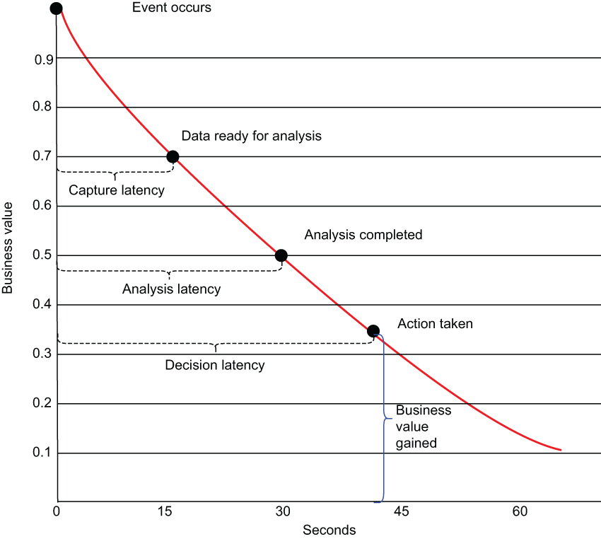

图 12.1 任何一条信息的价值都会随着时间的推移而迅速减少，边缘计算的目标是通过消除将数据从传感器传输到云端进行分析所产生的捕获延迟，从而减少整体决策延迟。

事件发生和采取相应行动响应之间的时间量称为决策延迟，由两个部分组成：捕获延迟，即将数据传输到分析软件所需的时间，以及分析延迟，即分析数据以确定要采取的操作所需的时间。

从技术角度来看，IIoT 提供与任何其他“智能”消费物联网设备相同的基本功能，这是指以前没有这些功能的物理设备的自动化仪表和报告功能。例如，“智能”恒温器的定义特征是它可以传达其当前读数并通过智能手机应用程序进行远程调整。话虽如此，典型的 IIoT 部署规模远大于让你可以通过手机调整恒温器的简单系统。

由于可能有数百万个传感器分布在一个工厂车间或一大群拖拉机拖车中，每一个每秒都在产生一个新的指标，人们可以很容易地看到这些 IIoT 数据集既是高容量又是高频率。处理这些数据集的一种常见方法是收集所有单独的数据元素，将它们传输到云端，并使用传统的基于 SQL 的数据分析工具，例如 Apache Hive，或更传统的数据仓库。这确保分析是在来自所有传感器的完整数据集上完成的，因此可以观察任何传感器间读数关系并将其用于分析（例如，温度传感器与来自不同传感器的整体植物湿度之间的相关性可以进行跟踪和分析）。

然而，这种方法有一些严重的缺点，例如重大的决策延迟（事件发生和处理之间的时间），与必须提供足够的网络带宽和计算资源来处理如此大的数据集相关的成本低效，以及保留所有这些信息的存储成本。

从实践的角度来看，将数据从大多数 IIoT 平台传输到云计算环境进行分析所需的时间量，几乎不可能对潜在的灾难性事件进行任何实时反应。虽然此类事件的一些最引人注目的例子包括在爆炸或坠毁之前检测发电厂或飞机的故障，但大多数 IIoT 应用中的数据分析速度也至关重要。

为了克服这一限制，IIoT 数据的一些数据处理和分析可以在物理上更靠近数据源的基础设施上执行。使计算更接近数据源可以减少捕获延迟，并允许应用程序响应数据，因为数据几乎是即时创建的，而不必等待信息通过互联网传输后再进行处理。这种在生成数据的网络边缘附近而不是在数据中心或云等集中数据收集点处理数据的做法通常被称为边缘计算。

在本章中，我将演示如何在边缘计算环境中部署 Pulsar Functions 以提供近乎实时的数据处理和分析，从而更快地对 IIoT 环境中的事件做出反应，并最大限度地减少高-价值事件被感知并做出适当的反应。

## 12.1 工业物联网架构

IIoT 平台充当工业设备物理世界与用于对其进行监控和反应的自动化控制系统计算世界之间的桥梁。因此，任何 IIoT 系统的主要目标之一是收集和处理分布在各种工业设备上的所有物理传感器生成的数据。虽然每个 IIoT 部署都不同，但它们都由三个逻辑架构层组成，如图 12.2 所示，它们在数据采集和分析过程中发挥着重要作用。

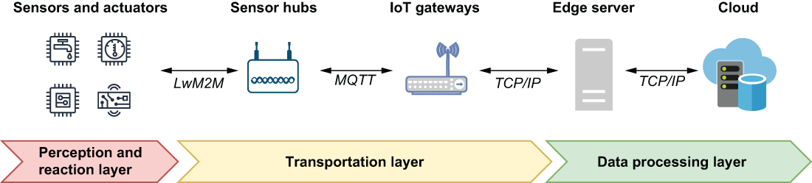

图 12.2 工业物联网架构的三个逻辑层摄取数据、分析数据，然后呈现信息，以便人类或自主系统实时做出上下文相关的决策。

在 IIoT 环境中，可能有数百万个传感器、控制器和执行器分布在单个工厂位置内的各种工业设备上。所有这些传感器和设备共同构成了通常所说的感知和反应层，因为它们使我们能够感知物理世界中正在发生的事情。

### 12.1.1 感知反应层

感知和反应层包含所有硬件组件（即物联网中的事物）。作为每个 IIoT 系统的基础，这些连接的设备负责感知工业设备和周围环境的物理条件，通过嵌入设备本身或作为独立对象实现的众多传感器进行感知。这些传感器通过轻量级机器对机器 (LwM2M) 协议（例如蓝牙、Zigbee 和 Z-Wave）或远程协议（例如 MQTT 或 LoRa）发出连续、实时的传感器读数流，如果他们有有线连接。

实际上，大多数 IIoT 环境需要多种网络协议来支持环境中的各种设备。例如，电池供电的传感器只能使用专为短距离使用而设计的轻量级协议进行短距离通信。通常，信号需要传播的距离越大，设备发送它所需的功率就越大。使用远程协议发送数据的电池供电设备并不实用。

感知和反应层的主要职责之一是通过传感器通过捕获读数并将它们中继到数据处理层来感知环境。该层的另一个关键职责是对处理层产生的可操作见解做出反应，并在我们检测到潜在危险情况时将其转化为立即的物理行动。如果你不能以有意义的方式对其做出响应，那么能够检测到潜在的危险情况并不能提供太大的商业价值。

在 IIoT 出现之前的几十年，大多数大型制造商在称为监督控制和数据采集 (SCADA) 系统的专用软件系统上投入了大量时间和精力，使他们能够监视和控制他们的工业设备。这些系统包含控制网络，允许机械或机电设备自动操作称为执行器，可以执行各种手动操作，例如打开一个设备上的压力阀或完全关闭给定的电源机器。

通过利用这些 SCADA 系统中的现有控制网络，我们能够通过简单地发送正确的命令来激活执行器，从而在我们的 IIoT 应用程序中以编程方式使用这些执行器。在传感器充当这一层的“眼睛”的地方，执行器扮演着与让我们对数据做出响应的“手”同样重要的角色。没有它们，我们对灾难性的传感器读数做出反应的能力将不存在。在感知和反应层收集的信息通过传输层发送，顾名思义，传输层负责将传感器数据安全传输到集中数据处理层。

### 12.1.2 传输层
在感知和反应层内生成并通过 LwM2M 协议传输的传感器读数由位于传输层最外边缘的中间设备（称为传感器集线器）检测。这些专用设备可以接收低功耗设备通过 LwM2M 协议广播的传感器读数。

传感器集线器的主要目的是在短程和长程通信技术之间架起一座桥梁。支持电池的物联网设备使用短距离无线传输模式（例如蓝牙 LE、Zigbee 和 Z-Wave）与传感器集线器通信。收到消息后，传感器集线器会立即通过更远距离的协议（例如 CoAP、MQTT 或 LoRa）将消息中继到称为 IoT 网关的设备。在这些远程协议中，消息队列遥测传输 (MQTT) 专门用于低带宽、高延迟环境，这使其成为 IIoT 空间中最常用的协议之一。

物联网网关是一种物理设备，用作云和传感器集线器之间的连接点。这些设备提供了 MQTT 协议和 Pulsar 消息传递协议之间的通信桥梁，并负责聚合通过轻量级二进制 MQTT 协议发送的所有传入传感器读数，并在使用 Pulsar 的消息传递协议将它们转发到数据处理层之前进行聚合。

### 12.1.3 数据处理层

如图 12.2 所示，处理层跨越两个物理层：靠近工业设备的边缘服务器和企业数据中心或云基础设施。边缘服务器用于从大型 IIoT 部署通常生成的海量数据中聚合、过滤和优先处理数据，以最大限度地减少需要转发到云的信息量。这种数据预处理有助于降低传输成本和响应时间。从硬件的角度来看，边缘处理层由一台或多台传统计算机或服务器组成，这些计算机或服务器位于工业场所本身（例如，工厂内部）。尽管由于给定位置的物理空间限制，该层的计算能力可能会受到限制，但这些设备始终具有互联网连接，允许它们将收集到的数据转发到公司的数据中心和/或云提供商以进行进一步分析和存档。

## 12.2 基于 Pulsar 的处理层

现在我们对 IIoT 架构有了基本的了解，我想演示如何使用 Apache Pulsar 来增强架构的处理能力，与传统的 IIoT 设置相比，将数据处理层扩展到更靠近传感器和执行器的位置.首先，让我们回顾一下 IIoT 平台内每个硬件设备上可用的计算资源。如你所见，图 12.3 显示可用计算资源与其与工业设备的接近程度之间存在反比关系。位于感知和反应层中的传感器、执行器和其他智能设备是基于微控制器的，内存和处理能力有限。它们主要由电池供电，因此不适合执行任何类型的计算。虽然这些无线设备可以通过将环境能量转换为电能的能量收集设备进行增强，但它们的功率最好保留用于与传感器集线器的无线通信，而不是用于计算。

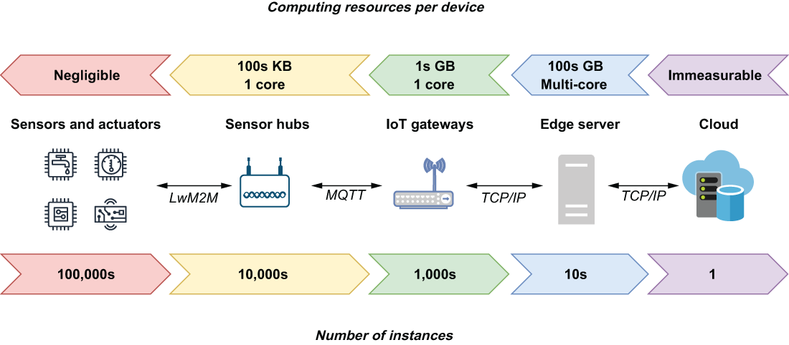

图 12.3 每一层部署的设备数量与每台设备内发现的计算资源之间存在反比关系。

传感器集线器通常托管在稍大的设备上，称为片上系统 (SoC)，可以具有传统计算机的部分或全部组件，包括 CPU、RAM 和外部存储，但规模较小.但考虑到这些设备的绝对数量，它们的规格被保持在最低限度，以便在经济上可行大量部署。由于这些设备主要用于接收和传输数据，因此在通过不同的协议重新传输消息之前，它们只需要有限数量的内存来缓冲消息。

物联网网关也托管在 SoC 硬件上，这些设备最流行的平台之一是 Raspberry Pi，它可以拥有高达 8 GB 的 RAM、一个四核 CPU 和一个最多 1 TB 的 MicroSD 卡插槽（ 1 TB) 的存储空间。这些设备还可以运行传统的操作系统软件，如 Linux，这使它们成为运行复杂软件应用程序（如 Pulsar）的理想选择。

最后一个物理硬件是边缘服务器，这是 IIoT 架构中的一个可选功能。根据工业环境的性质，这些设备的大小范围可以从多台具有 TB 级 RAM、多个内核和 TB 级磁盘存储的服务器（驻留在工厂车间的服务器机柜内）到远程钻孔上的单个台式计算机地点。就像物联网网关一样，这一层的设备运行更传统的操作系统，类似于大多数人在使用术语计算机时的想法。

从计算的角度来看，任何拥有足够计算资源（8 GB RAM 和多核 x86 CPU）来运行传统操作系统和互联网连接的设备都是托管 Pulsar 代理的潜在硬件平台。在 IIoT 架构中，这不仅包括边缘服务器和 IoT 网关设备，还包括在配备齐全的 SoC 设备上运行的任何传感器集线器。

在这些设备上安装 Pulsar broker 使我们能够直接在这些设备上部署 Pulsar 功能，以便在更接近数据源的地方执行分析。这样做有效地将数据处理层扩展到更接近传感器数据的来源，如图 12.4 所示。我们正在有效地将边缘扩展到更靠近工业设备的地方，这样做会创建一个大型分布式计算框架，其中 Pulsar 功能可以跨架构的两层部署，以对数据执行并行计算。

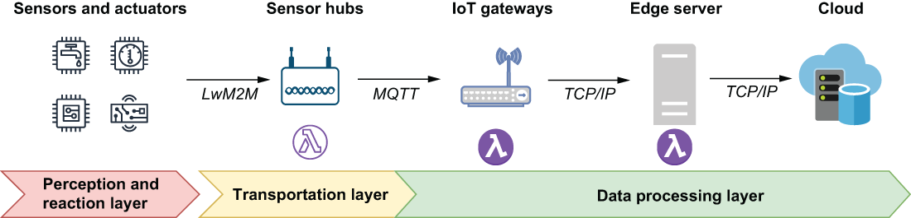

图 12.4 通过在物联网网关和边缘服务器上安装 Pulsar broker，我们可以将数据处理层扩展到更接近数据源本身，这将使我们能够更快地对其做出反应。

从中得出的关键结论是，我们可以在 IIoT 环境中的任何能够托管 Pulsar 代理的设备上部署我们的 Pulsar 功能，并让它们在边缘执行复杂的数据分析，而不仅仅是收集事件和转发上游进行处理，就像在更传统的 IIoT 环境中所做的那样。

公平地说，一些 IIoT 供应商确实提供了可用于处理 IoT 网关设备上的数据的软件包，但这些功能通常仅限于更基本的功能，例如过滤和聚合。此外，这些软件包是闭源的，不允许你扩展框架以添加你自己的数据处理功能。但是，借助 Pulsar Functions，你可以轻松创建和使用自己的函数来执行更复杂的数据分析。

还值得注意的是，Apache Pulsar 通过插件提供对 MQTT 协议的支持，该插件允许使用 MQTT 协议的设备（例如传感器集线器）直接向 Pulsar 代理上的主题发布消息。这使我们可以将 Pulsar 用作物联网网关设备，而无需其他软件充当 MQTT 消息代理，直接在网关本身上使用和处理传感器数据，如图 12.5 所示。基于 Pulsar 的物联网网关支持通过 MQTT 协议进行双向通信，这允许 Pulsar 功能向执行器发送消息以响应它们检测到的潜在灾难性事件。

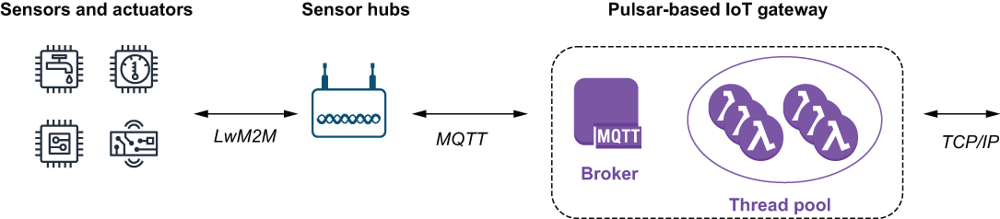

图 12.5 物联网网关的完整功能可以使用启用了 MQTT 插件的 Pulsar 代理来执行，这允许它从传感器集线器接收消息，而 Pulsar 功能可以通过 TCP/IP 连接进行管理。

TCP/IP 连接不仅使用户能够直接在 IoT 网关设备上部署、更新和管理 Pulsar Functions，而且还允许 Pulsar broker 与托管在远程位置的基于 Apache BookKeeper 的存储层进行通信。最后，同样重要的是，TCP/IP 连接允许我们与 IIoT 架构中的其他 Pulsar 集群进行通信——尤其是那些已部署在边缘服务器上的集群。这使我们能够将所有 IoT 网关上生成的数据转发到一个集中位置，以进行额外的边缘处理，然后最终将其发送到云端进行存档。

## 12.3 边缘分析

在传统数据中心或云计算环境之外的基础设施上执行部分或全部数据分析的做法通常被称为边缘分析，与传统分析在其他一些关键方面有所不同，当你在设计你的整体分析策略。首先，必须对流数据集进行分析，其中每条信息只会提供给你的 Pulsar 函数一次。由于边缘环境中的物理磁盘空间非常有限，因此不会保留这些传感器值，因此无法在未来的某个时间点重新读取。例如，如果你想确定一个传感器在云环境中前一小时的平均读数，你可以简单地执行 SQL 查询，从历史数据中为你计算出来。这不是边缘分析的选项。另一个很大的区别是，处理越靠近传感器，数据集中的信息就越少，这使得检测不在同一物联网网关范围内共同定位的传感器之间的模式变得不可能。

### 12.3.1 遥测数据
为了更好地理解术语边缘分析以及我们通过在边缘执行一些数据分析来尝试实现的目标，最好首先了解我们在 IIoT 中处理的数据类型环境。任何 IIoT 系统的首要功能是收集传感器数据，因此可用于监控和管理公司的工业基础设施。一旦收集到数据，就可以分析它是否有可能需要解决的任何潜在的感兴趣的事件。

这些传感器不断地发出通过对同一变量随时间重复测量而获得的一系列观察结果，例如每秒发送特定设备温度读数的传感器。这些按时间顺序以固定间隔获取的数字数据点序列称为时间序列数据。以测量或统计数据的形式收集时间序列信息并将其转发到远程系统的整个过程通常称为遥测。与几乎所有时间序列数据集一样，这种遥测数据通常具有以下一个或多个特征：

- 趋势——当提到时间序列数据的趋势时，我们指的是数据在指定的时间范围内在一个方向（向上或向下）具有明显的轨迹。趋势的一个很好的例子是网络流量的长期稳定增长。
- 周期——数据中的重复和可预测的波动不是固定的频率，因此不能与任何特定的时间段或间隔相关联。
- 季节性——如果数据中存在与日历相关的规律和可预测的周期（例如，每天、每周等），则数据具有季节性特征。这与趋势不同，因为周期会在短时间内波动，并且通常受外部因素驱动，例如网络星期一期间流行电子商务网站的网络流量激增。
- 噪声——这是指数据点的随机性，无法与任何解释的趋势相关联。噪声是非系统性的和短期的，需要过滤掉以尽量减少其对我们预测的不利影响。考虑一个温度传感器，它在过去一小时内始终报告 200 华氏度的值。任何与我们收到的先前值显着不同的传感器读数很可能只是噪声，应该被忽略。例如，25 华氏度的单个传感器读数很可能不是一个准确的读数，应该被忽略。

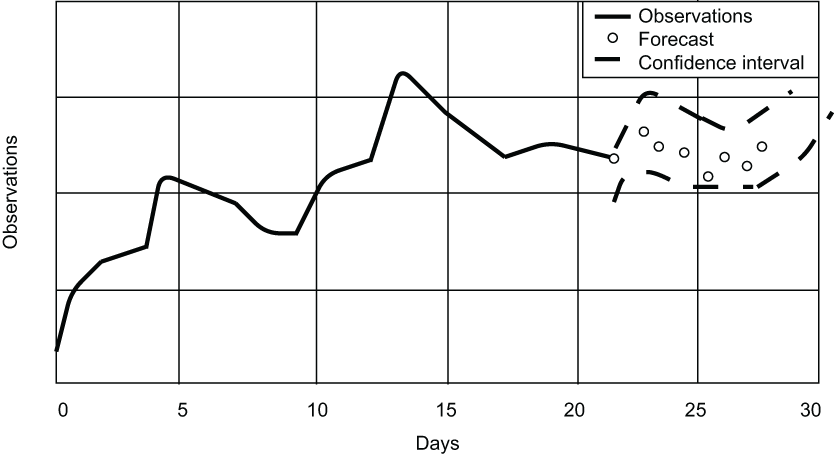

图 12.6 时间序列预测是使用时间序列数据根据先前观察到的值预测未来值。

在 IIoT 的背景下，边缘分析用于检测数据的这些特征，然后它们可用于根据先前观察到的值预测未来值，如图 12.6 所示。然后可以将实际观察值与预测值进行比较，以确定是否需要采取某种行动。例如，如果压力读数呈下降趋势，这可能表明管路中存在压力损失，应派遣维护团队进行调查。

### 12.3.2 单变量和多变量

遥测数据集的另一个方面是其中正在跟踪的变量数量。最常见的情况是数据包含一组对单个变量的观察（例如，来自完全相同传感器的读数）。这种类型的数据集更正式的术语是单变量，出于我们的目的，我们将假设在 IoT 网关层收集的所有数据集都是单变量的。你可能已经猜到，任何跟踪多个变量的数据集都称为多元数据集，它允许我们跟踪同一时间范围内多个传感器读数之间的关系。这些数据集包含多个值，而不是在给定时间点包含单个值。在支持 Pulsar 的 IIoT 架构中，通过将多个单变量数据集组合在一起，使用 Pulsar Functions 生成多变量数据集，如图 12.7 所示，其中来自每个传感器的同时获取的值组合成三个值的元组。

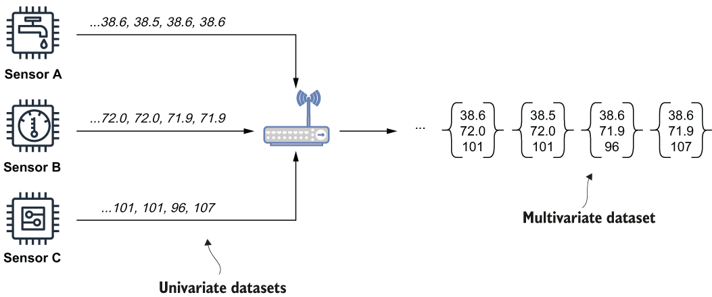

图 12.7 每个传感器以预定间隔发出一系列读数。在 IoT 网关上收到后，这些单变量数据集将组合成一个多变量数据集，其中包含给定时间点所有三个传感器的值。这使我们能够检测这些传感器值之间的模式和相关性。

多变量数据集可用于执行更复杂、更准确的分析，方法是包含来自多个强相关源的数据。由于这些数据集中可以包含的变量数量没有限制，因此可以根据需要组合任意数量的读数。事实上，这些数据集非常适合用作你希望在边缘部署的任何 ML 模型的特征存储。你可能还记得第 11 章，特征存储包含一组 ML 模型所需的预先计算的值。这些特征集由依赖历史数据来计算值的外部进程填充。在支持 Pulsar 的 IIoT 环境中，这些多变量数据集是从边缘收集的单变量数据集填充的，这可确保你的 ML 模型使用最新数据进行预测。

## 12.4 单变量分析

从同一个传感器获取的无穷无尽的读数是边缘分析的基础。这些单变量数据集代表用于对 IIoT 数据进行整体分析的原始数据。因此，最好首先介绍可以对这些单变量数据集执行的分析类型。图 12.8 描述了通常执行的各种类型的分析处理的摘要。

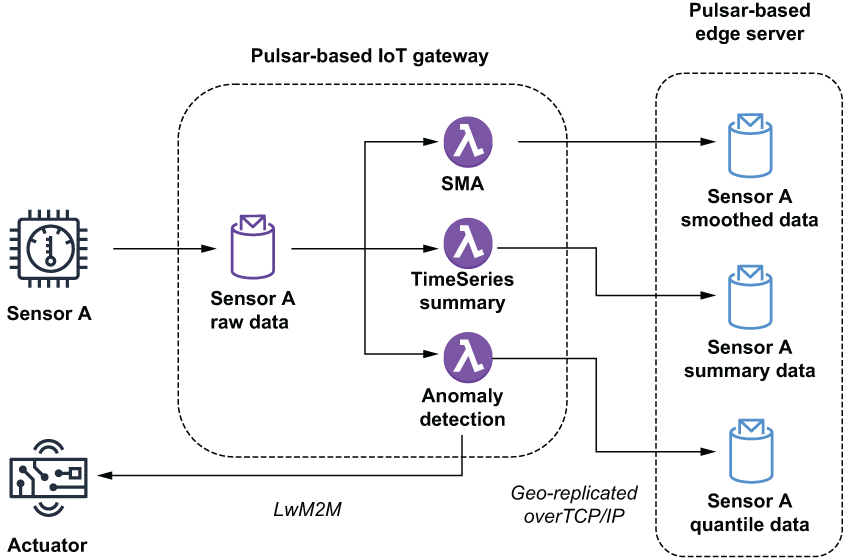

图 12.8 传感器将其读数发布到 Sensor A Raw Data 主题，该主题用作三个 Pulsar 函数的输入。其中两个函数 SMA 和 TimeSeriesSummary 使用这些值从原始数据计算统计值，然后再将这些统计信息发布到本地主题，这些主题配置为地理复制到运行在边缘服务器上的 Pulsar 集群。第三个函数确定传感器值是否异常，是否应激活执行器以响应它检测到的任何潜在灾难性事件。

此处理是使用部署在最靠近数据源的 IoT 网关上的 Pulsar 功能完成的。因此，重要的是这些函数最大限度地减少执行分析所需的内存和 CPU 量。

### 12.4.1 降噪

我之前提到过传感器数据中可能存在噪声（即随机性）。为了更好地预测未来的数据值，一个重要的预处理步骤是减少这些单变量数据集中的噪声。用于消除这些数据波动的常用技术是简单地计算预定义时间窗口内数据点的数学平均值以产生一个值。然后保留这个计算出的移动平均值而不是原始值。这样做可以最大限度地减少任何单个传感器读数对报告值的影响（例如，如果你有 99 个传感器读数，其值为 70，一个值为 100，则使用计算平均值 70.3 将有效地消除数据并提供一个更能说明该时间间隔内传感器读数的值）。

虽然有许多不同的移动平均线模型，但为了简洁起见，我将在本章中只介绍简单的移动平均线。通过保留时间序列数据的最新子集（例如最近 100 个传感器读数）来计算简单的移动平均值。当新读数到达时，它用于替换集合中最旧的值。添加最新值后，将计算并返回这些剩余值的数学平均值。

清单 12.1 计算简单移动平均线的 Pulsar 函数

```java
public class SimpleMovingAverageFunction implements Function<Double, Void> {
 
    private CircularFifoQueue<Double> values;           ❶
    private PulsarClient client;                        ❷
    private String remotePulsarUrl, topicName;
    private boolean initalized;
    private Producer<Double> producer;
    
    @Override
     public Void process(Double input, Context ctx) throws Exception {    
      if (!initalized) {
        initalize(ctx);
      }
        
      values.add(input);                                ❸
      double average = values.stream()
        .mapToDouble(i->i).average().getAsDouble();     ❹
      publish(average);                                 ❺
      return null;
   }
 
    private void publish(double average) {
      try {
        getProducer().send(average);
      } catch (PulsarClientException e) {
        e.printStackTrace();
      }
    }
 
    private PulsarClient getEdgePulsarClient() throws PulsarClientException {
      if (client == null) {
        client = PulsarClient.builder().serviceUrl(remotePulsarUrl).build();
      }
      return client;
    }
        
    private Producer<Double> getProducer() throws PulsarClientException {
      if (producer == null) {
             producer = getEdgePulsarClient()
                       .newProducer(Schema.DOUBLE)
               .topic(topicName).create();
      }
      return producer;
    }
    
    private void initalize(Context ctx) {
      initalized = true;
      Integer size = (Integer) ctx.getUserConfigValueOrDefault("size", 100);
      values = new CircularFifoQueue<Double> (size);
      remotePulsarUrl = ctx.getUserConfigValue("pulsarUrl").get().toString();
      topicName = ctx.getUserConfigValue("topicName").get().toString();
    }
}
```

❶ 自动删除最旧项的值的循环缓冲区
❷ 运行在边缘服务器上的 Pulsar 集群的 Pulsar 客户端
❸ 将传感器读数添加到值列表中。
❹ 计算简单移动平均线。
❺ 将计算值发布到边缘服务器上的主题。
幸运的是，使用 Pulsar Functions 实现移动平均线的计算相对简单。从清单 12.1 中可以看出，关键是使用循环缓冲区来保留计算移动平均所需的最后 n 个值。然后，你可以使用此 Pulsar 函数预处理单个传感器读数并发布计算出的 SMA 而不是原始值本身。这确保了所有下游分析都是在噪声较小的数据上执行的。

### 12.4.2 统计分析

移动平均线并不是唯一可以从单变量数据集计算出的有意义的统计数据。事实上，使用 Pulsar 函数计算统计分析中常用的任何统计数据都非常容易。以下一个清单中显示的函数代码为例，它在单个函数中计算以下统计量：几何平均值、总体方差、峰态、均方根偏差、偏度和标准偏差。

清单 12.2 计算多个统计数据的 Pulsar 函数

```java
import org.apache.commons.math3.stat.descriptive.DescriptiveStatistics;
import org.apache.commons.math3.stat.descriptive.SummaryStatistics;
import org.apache.commons.math3.stat.regression.*;                        ❶
import org.apache.pulsar.functions.api.Context;
import org.apache.pulsar.functions.api.Function;
 
public class TimeSeriesSummaryFunction implements 
  Function<Collection<Double>, SensorSummary>  {
 
   @Override
    public SensorSummary process(Collection<Double> input, Context context) 
      throws Exception {                                                  ❷
 
      double[][] data = convertToDoubleArray(input);                      ❸
     SimpleRegression reg = calcSimpleRegression(data);
     SummaryStatistics stats = calcSummaryStatistics(data);
     DescriptiveStatistics dstats = calcDescriptiveStatistics(data);
      double rmse = calculateRSME(data, reg.getSlope(), reg.getIntercept());
        
    SensorSummary summary = 
      SensorSummary.newBuilder()
        .setStats(TimeSeriesSummary.newBuilder()
          .setGeometricMean(stats.getGeometricMean())                     ❹
             .setKurtosis(dstats.getKurtosis())
             .setMax(stats.getMax())
             .setMean(stats.getMean())
             .setMin(stats.getMin())
             .setPopulationVariance(stats.getPopulationVariance())
             .setRmse(rmse)
             .setSkewness(dstats.getSkewness())
             .setStandardDeviation(dstats.getStandardDeviation())
             .setVariance(dstats.getVariance())
             .build())
      .build();
        
      return summary;
    }
    
    private SimpleRegression calcSimpleRegression(double[][] input) {
      SimpleRegression reg = new SimpleRegression();
      reg.addData(input);
      return reg;
    }
    
    private SummaryStatistics calcSummaryStatistics(double[][] input) {
      SummaryStatistics stats = new SummaryStatistics();
      for(int i = 0; i < input.length; i++) {
        stats.addValue(input[i][1]);            
      }
      return stats;
    }
    
    private DescriptiveStatistics calcDescriptiveStatistics(double[][] in)
 {
      DescriptiveStatistics dstats = new DescriptiveStatistics();
      for(int i = 0; i < in.length; i++) {
         dstats.addValue(in[i][1]);            
      }
      return dstats;
    }
    
    private double calculateRSME(double[][] input, double slope, double intercept) {
      double sumError = 0.0;
      for (int i = 0; i < input.length; i++) {
        double actual = input[i][1];
        double indep = input[i][0];
        double predicted = slope*indep + intercept;
                sumError += Math.pow((predicted - actual),2.0);
                }
            return Math.sqrt(sumError/input.length);
    }
 
        private double[][] convertToDoubleArray(Collection<Double> in) 
          throws Exception {
            double[][] newIn = new double[in.size()][2];
            int i = 0; 
            for (Double d : in) {
                newIn[i][0] = i;
                newIn[i][1] = d;
                i++;
            }
            return newIn;
        }    
    }
```

❶ 此函数依赖于外部库来执行统计计算。
❷ 输入集合包含指定窗口内的所有传感器读数。
❸ 将数据从集合转换为二维数组。
❹ 使用各种计算的统计数据来填充结果。
显然，这些统计数据不能从时间序列数据中的单个数据点计算，而是需要从更大的数据元素集合中计算。试图计算单个数字的几何平均值是没有意义的。因此，我们需要指定一种策略，将无尽的度量数据流拆分为有限的数据集，称为窗口，我们将使用它来计算这些统计数据。那么我们如何定义数据窗口的边界呢？在 Pulsar Functions 中，有两种策略用于控制窗口边界：

- 触发策略——控制我们的函数代码何时被执行。这些是 Apache Pulsar Functions 框架用来通知我们的代码该处理窗口中收集的所有数据的时间的规则。
- 驱逐策略—控制保留在窗口中的数据量。这些是用于决定是否应保留或从窗口中驱逐数据元素的规则。

这两种策略都由时间或窗口中的数据量驱动，并且可以根据时间或长度（数据元素的数量）来定义。让我们探讨这两种政策之间的区别以及它们如何协同工作。虽然有多种窗口技术，但最突出的是翻滚和滑动窗口。

翻转窗口是连续的、不重叠的窗口，它们具有固定大小（例如 100 个元素）或以固定间隔（例如每五分钟）获取。滚动窗口的驱逐策略始终处于禁用状态，以允许窗口完全填满。因此，你只需将要使用的触发策略指定为基于计数或基于时间。图 12.9 展示了基于长度的触发策略设置为 10 的滚动窗口的行为，这意味着在窗口中有 10 个项目的时间点，将执行 Pulsar 函数代码，并且窗口将被清除。这种行为与时间无关；窗口计数达到 10 个项目需要 5 秒还是 5 小时并不重要——重要的是计数何时达到指定的长度。因此，第一个窗口大约需要 15 秒才能填满，而最后一个窗口需要 25 秒才能填满。

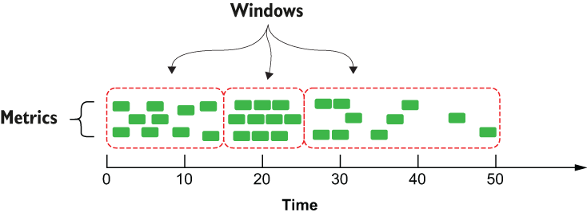

图 12.9 使用基于计数的触发器时，每个滚动窗口将包含完全相同数量的指标，但可能跨越不同的持续时间。

另一方面，滑动窗口技术结合了定义滑动间隔的触发策略和限制保留在窗口内进行处理的数据量的驱逐策略。图 12.10 显示了驱逐策略配置为 20 秒的滑动窗口的行为，这意味着任何早于 20 秒的数据将不会被保留或用于计算。触发策略也配置为 20 秒，这意味着每 20 秒将执行相关的 Pulsar 函数代码，我们将可以访问整个窗口长度内的所有数据来执行我们的计算。

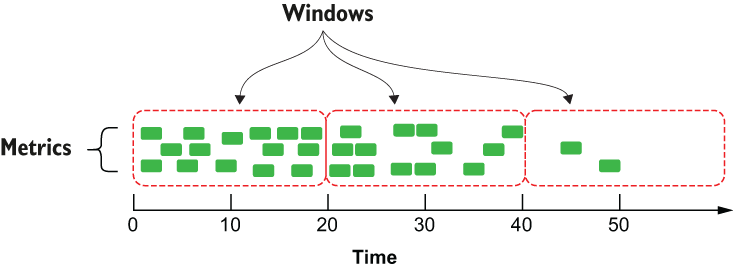

图 12.10 当使用基于时间的滑动窗口时，每个窗口将跨越完全相同的时间量，并且很可能包含不同数量的指标。

因此，在图 12.10 所示的场景中，第一个窗口包含 15 个事件，而最后一个窗口仅包含两个。在这个例子中，驱逐和触发策略都是根据时间定义的；然而，也可以用长度来定义其中之一或两者。此外，窗口长度和滑动间隔不必是完全相同的值。例如，如果你想使用这种技术执行 SMA，你可以通过将窗口长度设置为 100 并将滑动间隔设置为 1 来实现。

一旦计算出这些统计摘要，就可以将它们向上发送到边缘服务器，与工业基础设施内类似设备计算的统计数据进行比较，以检测潜在问题，或者可以将它们转发到云中的数据库更长时间——术语存储和未来分析。在将数据存储到数据库之前执行计算将使我们不必在分析阶段重新计算这些值，这可能是一项昂贵的操作。 Pulsar Functions 提供了表 12.1 中显示的四种不同的窗口配置参数，当以适当的组合使用时，它使你能够实现本节中讨论的窗口的所有四种变体。

表 12.1 为 Pulsar 函数配置窗口

|                              |                                                              |
| ---------------------------- | ------------------------------------------------------------ |
| Time-based tumbling window   | —windowLengthDurationMS==xxx                                 |
| Length-based tumbling window | —windowLengthCount==xxx                                      |
| Time-based sliding window    | —windowLengthDurationMS==xxx<br/>—slidingIntervalDurationMs=xxx |
| Length-based sliding window  | —windowLengthCount==xxx<br/>—slidingIntervalCount=xxx        |

在 Pulsar Functions 中实现这些类型的窗口函数中的任何一种都很简单，只需要你指定 java.util.Collection 作为输入类型。因此，如果我们想运行清单 12.2 中所示的 Pulsar 函数来对数据的滑动窗口执行统计计算，那么我们所要做的就是使用以下清单中所示的命令提交它，以及 Pulsar Functions框架将为我们处理剩下的事情。

清单 12.3 对数据的滑动窗口进行统计计算

```sh
$ bin/pulsar-admin functions create \
    --jar edge-analytics-functions-1.0.0.nar \
    --classname com.manning.pulsar.iiot.analytics.TimeSeriesSummaryFunction \
    --windowLengthDurationMS==20000 \         ❶
    --slidingIntervalDurationMs=20000.        ❷
```

❶ 定义一个 20 秒的驱逐策略
❷ 定义20秒触发策略
这使得使用这些窗口技术中的任何一种都变得容易，而无需编写执行单个事件的收集和保留所需的大量样板代码。相反，它允许你编写干净的代码，只关注你尝试实现的业务逻辑。

### 12.4.3 近似

在分析流数据时，某些类型的查询无法在边缘计算，因为它们需要大量的计算资源和时间来生成准确的结果。示例包括非重复计数、分位数、最常用项、连接、矩阵计算和图形分析。因此，这些类型的计算通常根本不在这些流数据集上执行。然而，如果一个近似的答案就足够了，那么当事件流太大而无法存储在内存中或数据移动太快以过程。

这些流算法利用称为草图的小型数据结构来存储信息，其大小通常只有几千字节。基于草图的算法执行一键式处理，这意味着它们只需要读取流中的每个元素一次。这两个特性使这些算法成为部署在边缘设备上的理想候选者。草图算法有四个系列，每个系列都专注于解决不同类型的问题：

- 基数草图 - 提供流中每个不同值的近似计数，例如在给定时间范围内跨多个不同网页的页面浏览量。
- 频繁项目草图 - 提供流中最常见值的列表，例如在给定时间范围内查看的前 10 个网页。
- 采样草图 - 使用水库采样从可用于分析的河流中提供统一的随机数据样本。
- 分位数草图 - 提供频率直方图，其中包含有关可用于异常检测的数据流值分布的信息。

有一个名为 Apache DataSketches 的开源库，其中包含这些算法在 Java 中的实现，这使得它们在 Pulsar 函数中很容易使用，例如清单 12.4 中所示的那个，它使用分位数草图来检测传感器数据中的异常.

#### 分位数
分位数这个词来源于词的数量，简单地指的是相同大小的某物的分组——通常是概率分布或一系列观察值。你已经熟悉一些更常见的分位数，这些分位数以其更常用的名称表示，例如一半、三分位数、四分之一等。在统计学和概率中，分位数更正式地定义为将概率分布划分为的切点具有相同数量元素的连续相邻间隔。

例如，在图 12.11 中，有三个值——Q1、Q2 和 Q3——它们将数据集分成等权重的部分。图中每个点之间的区域是分位数，在本例中为三分之一，其中包含相同数量的数据点。

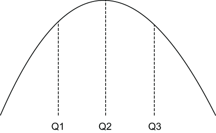

图 12.11 一个数据集被分成三个大小相等的部分，称为分位数。小于或等于 Q1 的值被视为第一个分位数的一部分； Q1 和 Q2 之间的值是第二个分位数的一部分；那些大于或等于 Q3 的是第三个分位数的一部分。

对于我们的用例，我们将处理无尽的度量数据值流，并使用它们来动态构建分位数。这使我们能够在通过将某个值与同一指标的先前值进行比较来确定某个值是否异常时，仅根据实际观察到的值做出决定。当一个新的度量读数进入我们的 Pulsar 函数时，我们将首先将其添加到分位数以更新分布模型，然后我们将计算度量读数的等级。秩最好被描述为给定值大于或等于分布中的值的比例。例如，如果指标读数高于先前观察值的 79%，则其排名为 79。对值进行排名有助于我们确定给定指标读数是否常见，我们已决定使用可配置值定义我们认为异常的阈值。

清单 12.4 用于异常检测的 Pulsar 函数

```java
import org.apache.datasketches.quantiles.DoublesSketch;
import org.apache.datasketches.quantiles.
[CA]UpdateDoublesSketch;                                  ❶
. . .
public class AnomalyDetector implements Function<Double, Void> {
 
    private UpdateDoublesSketch sketch;
    private double alertThreshold;
    private boolean initalized = false;
 
    @Override
    public Void process(Double input, Context ctx) throws Exception {
      if (!initalized) {
        init(ctx);
      }
      sketch.update(input);                               ❷
 
      if (sketch.getRank(input) >= alertThreshold) {      ❸
        react();                                          ❹
      }
      return null;
    }
 
    protected void init(Context ctx) {
      sketch = DoublesSketch.builder().build();
      alertThreshold = (double) ctx.getUserConfigValue ("threshold");
      initalized = true;
    }
 
    protected void react() {
      // Implementation specific                          ❺
    }
}
```

❶ 此函数依赖于 DataSketches 库来执行统计计算。
❷ 将公制读数添加到草图中。
❸ 获取指标读数的排名值，并将其与警报阈值进行比较。
❹ 如果指标高于配置的阈值，则做出反应。
❺ 这将根据执行器使用的 LwM2M 协议而有所不同。
该函数的逻辑相当简单。首先，我们通过向其中添加数据元素来更新分位数草图。然后，我们请求该值在整体分布中的相对排名。接下来，我们通过将指标读数的排名与预配置的警报阈值进行比较来确定该值是否为异常值。如果检测到异常值，则我们使用 LwM2M 客户端向感知和反应层中的执行器发送消息，以执行某种预防措施，例如关闭机器或打开压力阀。清单 12.4 中显示的反应函数的逻辑将根据所使用的 LwM2M 协议和我们需要发送以响应事件的命令而有所不同。

## 12.5 多变量分析
到目前为止，我们已经对来自单个传感器的数据实施了各种分析技术。虽然这种单变量分析确实使我们能够对单个传感器执行异常检测和趋势分析，但一旦我们将来自多个传感器的数据组合在一起，就可以执行更有趣的分析，如图 12.7 所示。在本节中，我将概述合并从不同 IoT 网关收集的数据、分析数据并响应这些新见解所需的步骤。

### 12.5.1 创建双向消息传递网格

创建可用于将消息从 IoT 网关向上传输到边缘服务器的消息传递框架涉及初始配置阶段，以将所有 Pulsar 集群添加到同一个 Pulsar 实例。你可能还记得第 2 章中的内容，一个 Pulsar 实例可以包含多个 Pulsar 集群。成为同一个 Pulsar 实例的一部分也是在 Pulsar 集群之间启用数据异地复制的先决条件，如图 12.8 所示，这是将计算的统计传感器数据从 IoT 网关转发到边缘服务器的首选机制.

此配置的第一阶段是将每个基于 IoT 网关的 Pulsar 集群添加到与运行在边缘服务器上的 Pulsar 集群相同的 Pulsar 实例。这可以使用 pulsar-admin 命令行界面或 REST API 轻松实现，如下面的清单所示，其中显示了用于将单个 IoT 网关集群添加到 Pulsar 实例的命令。

清单 12.5 向 Pulsar 实例添加物联网网关集群

```sh
$ pulsar-admin clusters create iot-gateway-1 \     ❶
    --broker-url http://<IoT-Gateway-IP>:6650 \    ❷
    --url http://<IoT-Gateway-IP>:8080             ❸
 
$ pulsar-admin clusters list                       ❹
```

❶ 每个名称必须是唯一的。
❷ 网关上 TCP 代理的 URL 地址
❸ 网关的服务 URL
❹ 确认集群已添加到列表中。
对于 IIoT 环境中的每个基于 IoT 网关的 Pulsar 集群，此命令只需运行一次。一旦集群被添加到 Pulsar 实例，它就可以通过 Pulsar 的异地复制机制将消息异步传递给它，而不必编写额外的代码来执行数据复制。

在 IoT 网关和边缘服务器之间建立地理复制的下一步是定义可用于双向通信的租户。这可以使用 pulsar-admin 命令行界面或 REST API 轻松实现，如下面的清单所示，其中显示了创建新 Pulsar 租户的命令，该租户可以被所有 IoT 网关集群以及 Pulsar 访问集群运行在边缘服务器上。

清单 12.6 创建异地复制租户

```sh
$ pulsar-admin tenants create iiot-analytics-tenant \
    --allowed-clusters  iot-gateway-1, iot-gateway-2, ...  \   ❶
    --admin-roles analytics-role                               ❷
```

❶ 提供你创建的所有 IoT 网关集群的完整列表。
❷ 指定这个命名空间的管理员角色
配置过程的最后一步是创建一个命名空间，专门用于物联网网关和边缘服务器之间的数据异地复制。这可以使用 pulsar-admin 命令行界面或 REST API 轻松实现，如清单 12.7 所示，其中显示了创建新 Pulsar 命名空间的命令，该命名空间可由所有 IoT 网关集群以及 Pulsar 集群访问在边缘服务器上运行。请注意，这个复制的命名空间必须在我们之前创建的租户中。 （有关在 Pulsar 集群之间配置异地复制的详细信息，请参阅附录 B。）

清单 12.7 创建一个地理复制的命名空间

```sh
$ pulsar-admin namespaces create \
  iiot-analytics-tenant/analytics-namespace \
  --clusters iot-gateway-1, iot-gateway-2, ...     ❶
```

❶ 提供你创建的所有物联网网关集群的完整列表。
创建地理复制命名空间后，生产者或消费者在该命名空间内创建的任何主题都会自动复制到所有集群中。因此，发布到 IoT 网关上地理复制命名空间内的主题的任何消息都将自动异步发送到边缘服务器。不幸的是，这也会导致消息被复制到 IIoT 基础设施内的所有其他 IoT 网关，这根本不是我们想要的。这种网关间复制不仅会浪费宝贵的网络带宽，还会浪费网关本身的磁盘空间，因为它们必须存储收到的消息。由于这些消息永远不会在其他网关上使用，因此存储它们只会浪费磁盘空间。

因此，我们需要启用选择性复制，以确保仅打算由边缘服务器使用的出站消息仅复制到边缘服务器，而不是跨所有物联网网关。这可以通过编写一个简单的 Pulsar 函数来实现，该函数从网关上的本地非地理复制主题消费并将其发布到地理复制主题，但将复制限制为仅边缘服务器，如左侧所示图 12.12。

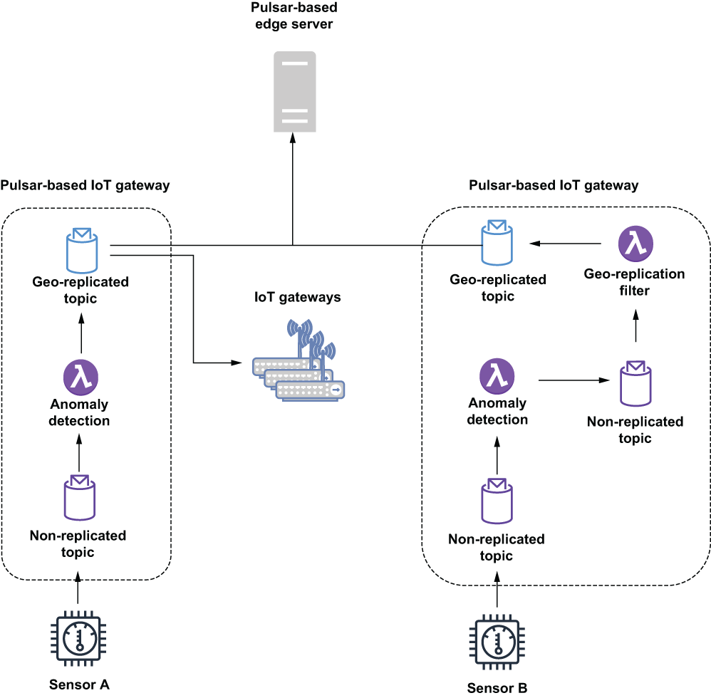

图 12.12 在不使用地理复制过滤器的情况下，传感器 A 的数据会自动复制到边缘服务器之外的所有物联网网关集群，而传感器 B 的数据仅复制到运行在边缘的 Pulsar 集群服务器。

如清单 12.8 所示，用于转发这些消息的 Pulsar 函数将使用现有的生产者 Java API 将消息的复制限制为仅边缘集群，从而产生如图 12.12 右侧所示的消息流，消息在转发到地理复制主题之前首先转到本地主题，但仅转发到边缘服务器而不是所有集群。

清单 12.8 异地复制消息过滤函数

```java
public class GeoReplicationFilterFunction implements Function<byte[],Void> {
 
  private boolean initialized = false;
  private List<String> restrictReplicationTo;
        
  private Producer<byte[]> producer; 
  private PulsarClient client;
  private String serviceUrl;
  private String topicName;
 
  @Override
  public Void process(byte[] input, Context ctx) throws Exception {
    if (!initialized) {
      init(ctx);
    }
    getProducer().newMessage()
          .value(input)                                                     ❶
          .replicationClusters(restrictReplicationTo)                       ❷
          .send();
 
    return null;
  }
 
  private void init(Context ctx) {
    serviceUrl = "pulsar://localhost:6650";                                 ❸
    topicName = ctx.getUserConfigValue("replicated-topic").get().toString();❹
    restrictReplicationTo = Arrays.asList(
       ctx.getUserConfigValue("edge").get().toString());                    ❺
    initalized = true;
  }
 
  private Producer<byte[]> getProducer() throws PulsarClientException {
    if (producer == null) {
        producer = getClient().newProducer()
                .topic(topicName)
                .create();
    }
    return producer;
  }
 
  private PulsarClient getClient() throws PulsarClientException {
    if (client == null) {
      client = PulsarClient.builder().serviceUrl(serviceUrl).build();
    }
    return client;
  }
}
```

❶ 使用输入字节创建一条新消息。
❷ 限制消息将被复制到的集群。
❸ 我们正在发布到本地地理复制主题。
❹ 目标主题应该在复制的命名空间中。
❺ 这应该是在边缘服务器上运行的 Pulsar 集群的名称。
Pulsar 函数正在写入本地机器上的异地复制主题，以允许 Pulsar 异地复制机制来处理消息的转发，而不是将其直接发送到边缘服务器，以避免通过网络对每条消息进行同步调用.既然我们已经介绍了消息传递网格的向上方向，让我们关注双向网格的向下方向，它的重点是通过分析来自多个传感器的数据返回到 Pulsar 函数，将在边缘服务器上发现的洞察力传递出去在物联网网关上运行。实际上，这个过程相当简单，因为边缘服务器所需要的只是发布到一个地理复制的主题，并让感兴趣的各方订阅该主题以传递消息。即使主题是地理复制的，消息也不会发送到物联网网关，除非网关节点上有主题的活动消费者。

### 12.5.2 多元数据集构建

考虑一下你有多个温度传感器测量整个数据中心环境温度的场景。与其将给定单个传感器的当前读数与其之前的读数进行比较，不如查看它与数据中心中部署的所有其他温度传感器的先前读数的比较情况。显然，这将提供更有意义的比较，特别是在传感器读数逐渐升高或降低而不是突然升高或降低的情况下，例如如果你的一个设备逐渐过热，并且温度读数从保险箱缓慢上升范围达到更危险的水平。在这种情况下，可能没有任何单个读数大到足以被视为异常，但与其他类似传感器相比，所有读数都将被视为高。

要对更广泛的数据集进行比较，需要组合来自数百个不同传感器的数据。因此，我们必须首先将所有数据收集到一个位置，以计算整个传感器组的统计数据，而不是单独计算。幸运的是，在 AnomalyDetector 函数中使用的数据草图可以很容易地合并在一起以提供这些类型的统计数据。从单个传感器的一系列读数生成的数据草图可用于确定任何给定传感器读数相对于迄今为止记录在草图中的所有读数的排名。但是，如果你组合 100 个草图，那么你可以使用生成的草图来确定任何给定传感器读数相对于 100 个传感器的所有读数的排名。这是一个更有意义的值，可以解决我们试图解决的问题，因为我们正在将每个传感器读数与整个工厂的所有其他读数进行比较。

为了实现这一点，我们必须首先修改现有的 AnomalyDetector 函数，如下面的清单所示，定期将其草图的副本发送到边缘服务器，以便它可以与运行在不同平台上的所有其他 BiDirectionalAnomalyDetector 函数实例的草图合并物联网网关。

清单 12.9 更新 AnomalyDetection 函数

```java
public class BiDirectionalAnomalyDetector 
➥ implements Function<Double, Void> {
 
  private boolean initialized = false;
  private long publishInterval;                                           ❶
  private String reportingTopic;                                          ❷
  private String alertThresholdTopic;                                     ❸
  private double alertThreshold;                                          ❹
  private String remotePulsarUrl;                                         ❺
 
  private PulsarClient client;
  private Producer<byte[]> producer;                                      ❻
  private Consumer<Double> consumer;                                      ❼
  private ExecutorService service = Executors.newFixedThreadPool(1);      ❽
  private ScheduledExecutorService executor =
    Executors.newScheduledThreadPool(1);                                  ❾
  private UpdateDoublesSketch sketch;   
 
  @Override
  public Void process(Double input, Context ctx) throws Exception {
    if (!initialized) {
      init(ctx);
      launchReportingThread();                                            ❿
      launchFeedbackConsumer();                                           ⓫
    }
 
     synchronized(sketch) {                                               ⓬
      getSketch().update(input);
                
      if (getSketch().getRank(input) >= alertThreshold) {
         react();  
       }
     }
    return null;
  }
 
  private void launchReportingThread() {
    Runnable task = () -> {
      synchronized(sketch) {                                              ⓭
        try {
          if (getSketch() != null) {
            getProducer().newMessage().value(getSketch().toByteArray()).send();
            sketch.reset();                                               ⓮
          }
        } catch(final PulsarClientException ex) { /* Handle */}
       }
    };
    executor.scheduleAtFixedRate(task, 
      publishInterval, publishInterval, TimeUnit.MINUTES);                ⓯
  }
    
  private void launchFeedbackConsumer() {
     Runnable task = () -> {
       Message<Double> msg;
       try {
        while ((msg = getConsumer().receive()) != null) {                 ⓰
         alertThreshold = msg.getValue();                                 ⓱
         getConsumer().acknowledge(msg);
        }
       } catch (PulsarClientException ex) {*/ Handle */ }
     };
     service.execute(task);                                               ⓲
  }
    
  private UpdateDoublesSketch getSketch() {
    if (sketch == null) {
      sketch = DoublesSketch.builder().build();
     }
     return sketch;
  }
        
  private Producer<byte[]> getProducer() throws PulsarClientException {
     if (producer == null) {
       producer = getEdgePulsarClient().newProducer(Schema.BYTES)
         .topic(reportingTopic).create();
     }
     return producer;
  }
        
  private Consumer<Double> getConsumer() throws PulsarClientException {
    if (consumer == null) {
      consumer = getEdgePulsarClient().newConsumer(Schema.DOUBLE)
        .topic(alertThresholdTopic).subscribe();
    }
    return consumer;
  }
        
  private void react() {
    // Implementation specific
  }
    
  private PulsarClient getEdgePulsarClient() throws PulsarClientException {
     ...
  }
    
  protected void init(Context ctx) {
     ...
  }
}
```

❶ 定义本地数据草图发布频率的属性（以分钟为单位）
❷ 定义用于将本地数据草图发送到边缘服务器的主题名称的属性
❸ 定义主题名称的属性，用于从边缘服务器接收更新的警报阈值
❹ 计算边缘服务器提供的告警阈值
❺ 在边缘服务器上运行的 Pulsar broker 的 URL
❻ Producer 用于将草图数据发送到边缘服务器
❼ 消费者从边缘服务器接收更新的警报阈值
❽ 本地线程池，消费者线程可以在后台运行
❾ 本地线程池，以固定时间间隔（例如，每五分钟）调用发布线程
❿ 只需启动一次数据草图发布线程。
⓫ 只启动一次警报阈值消耗线程。
⓬ 写入数据时在数据草图上创建排他锁。
⓭ 发布数据时在数据草图上创建排他锁。
⓮ 清除草图中的所有数据。
⓯ 安排发布任务以配置属性指定的固定间隔运行。
⓰ 等待传入的警报阈值消息。
⓱ 使用提供的值更新警报阈值。
⓲ 在后台启动警报阈值消耗线程。
BiDirectionalAnomalyDetector 函数仍会侦听传入的传感器读数并将它们添加到本地数据草图对象，然后再将传感器读数与异常阈值进行比较以确定是否必须立即采取行动。但是，它还创建了两个额外的后台线程来与运行在边缘服务器上的 SketchConsolidator 函数进行通信。该函数依赖于 Java ScheduledThreadExecutor 来确保以定期间隔（例如，每五分钟）发布本地数据草图，而另一个线程用于持续监视反馈主题以获取警报阈值的任何更新。接下来，我们必须创建一个新的 Pulsar 函数，如清单 12.10 所示，它将在边缘服务器上运行并接收这些入站草图并将它们合并在一起以生成一个更大、更准确的草图，其中包含来自所有给定传感器系列中的传感器。

清单 12.10 数据草图合并函数

```java
import org.apache.datasketches.memory.Memory;
import org.apache.datasketches.quantiles.DoublesSketch;
import org.apache.datasketches.quantiles.DoublesUnion;
import org.apache.pulsar.functions.api.Context;
import org.apache.pulsar.functions.api.Function;
 
public class SketchConsolidator implements Function<byte[], Double> {
 
  private DoublesSketch consolidated;                         ❶
 
  @Override
  public Double process(byte[] bytes, Context ctx) throws Exception {
    DoublesSketch iotGatewaySketch = 
      DoublesSketch.wrap(Memory.wrap(bytes));                 ❷
 
    DoublesUnion union = DoublesUnion.builder().build();      ❸
    union.update(iotGatewaySketch);                           ❹
    union.update(consolidated);                               ❺
    consolidated = union.getResult();                         ❻
    return consolidated.getQuantile(0.99);                    ❼
  }
}
```

❶ 包含所有传感器数据的数据草图
❷ 将传入的字节转换为数据草图。
❸ 构建一个用于合并多个数据草图的新对象。
❹ 将传入的数据草图添加到联合对象中。
❺ 将现有的合并数据草图添加到联合对象。
❻ 更新合并的数据草图，使其等于合并的结果。
❼ 发布新计算的第 99 个百分位的阈值。
这两个 Pulsar 函数之间的交互如图 12.13 所示，其中显示了用于将数据从运行在所有 IoT 网关上的 BiDirectionalAnomalyDetector 函数发送到运行在边缘服务器上的 SketchConsolidator 函数的两个通信通道，以及使用的通道将新计算的阈值从 SketchConsolidator 函数发送回在物联网网关上运行的 BiDirectionalAnomalyDetector 函数实例。

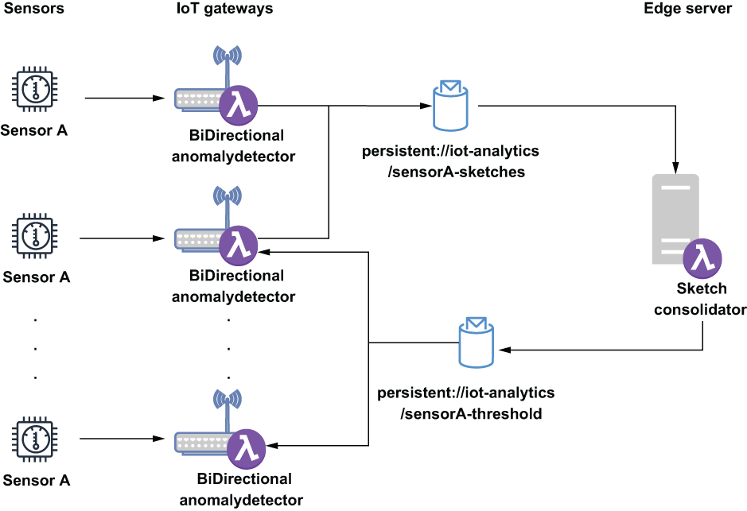

图 12.13 BiDirectionalAnomalyDetector 函数的副本将在每个 IoT 网关上运行，并将其本地计算的数据草图发布到相同的地理复制主题。 SketchConsolidator 功能将使用这些草图并将它们合并在一起，然后再将第 99 个百分位值的截止值发布到不同的地理复制主题。 BiDirectionalAnomalyDetector 函数将使用来自该主题的消息，并将发布的值用作传感器读数的新异常阈值。

SketchConsolidator 函数应配置为侦听地理复制主题，其中所有 BiDirectionalAnomalyDetector 函数将发布各自的草图。从清单 12.10 中的代码可以看出，一旦数据草图被合并，我们就使用新创建的对象来确定代表所有传感器读数的第 99 个百分位数阈值的确切值。然后我们将该值发送回 BiDirectionalAnomalyDetector 函数而不是整个草图（以节省空间和带宽），以便他们可以使用这个新计算的值作为警报阈值而不是本地计算的阈值。

## 12.6 书外

在我结束本书的最后一章时，我希望你喜欢阅读它，并发现它内容丰富、有启发性和发人深省。很高兴在整个 MEAP 过程中通过在线讨论论坛与你们中的许多人互动，我感谢你们提供的所有反馈。很高兴不仅知道你们中有这么多人发现这本书有用，而且更重要的是，你们打算如何使用 Apache Pulsar 在组织内利用流数据的力量。

与所有技术一样，Apache Pulsar 将继续快速发展，这要归功于其不断发展和充满活力的开发人员和用户社区。事实上，自从我开始写这本书以来，已经添加了几个新特性，比如对事务的支持。这证明了 Pulsar 的技术实力，它被各种公司和行业广泛采用。但是，随着时间的推移，这种演变不可避免地会使本书的内容变得越来越陈旧，因此你应该参考以下资源以获取最新信息和新功能：

- Apache Pulsar 项目页面 (https://pulsar.apache.org/) 和文档 (https://pulsar.apache.org/docs/en/standalone/)。
- Apache Pulsar slack 频道 apache-pulsar.slack.com，我和几个项目提交者每天都会对其进行监控。频繁使用的频道为初学者和每天积极使用 Apache Pulsar 的开发人员集中社区提供了丰富的信息。
- 许多博客文章，包括 StreamNative 网站 (https://streamnative.io/en/blog/) 上的文章，由 Apache Pulsar 项目的许多提交者撰写。

对于那些希望将流计算引入你的组织或考虑在未来的应用程序中使用基于消息的微服务架构以利用新兴的云计算范式的人，让我提供以下关于如何说服你的公司的建议考虑采用 Apache Pulsar：关注使用 Pulsar 的好处，例如它是一种云原生技术，旨在独立扩展计算和存储层，从而更有效地利用昂贵的云资源。另一个优点是它可以在单个系统中作为基于队列的消息传递系统（如 RabbitMQ）和流式消息传递平台（如 Kafka）。

另一种方法是将 Apache Pulsar 作为底层技术引入组织内的全新计划，例如微服务。你可以使用 Apache Pulsar Functions 作为底层技术开始你的组织的微服务应用程序开发。你的开发团队将受益于 Pulsar Functions 提供的简单编程模型，而无需使用专有 API。如果你的公司正在使用一种云供应商无服务器计算技术，例如 AWS Lambda，你可以强调一个事实，即 Pulsar Functions 以很少的成本提供相同的功能，并且没有供应商锁定。此外，所有应用程序开发和测试可以在本地免费完成，而不是在昂贵的 AWS 计算资源上完成。

如果你的组织已经拥有现有技术，例如 Apache Kafka，那么你最好听取马克吐温的建议，他说：“愚弄人们比说服他们被愚弄更容易。”这种情绪简洁地反映了人们不愿接受可能做出了错误选择的事实。因此，与其将对话定为现有技术与 Pulsar 之间的竞争，你必须让你的组织相信他们做出了错误的决定，而应关注 Pulsar 为你的组织带来的其他技术不能带来的积极影响。通过这种方式，Pulsar 可以被视为一种可以在组织内共存的支持技术，而不是需要在整个组织中进行大量变革的替代技术。这种批发替代策略将遭到那些决定现有技术的人和投入大量时间和精力开发基于现有技术的解决方案的人的大量阻力。与现有技术的弱点相比，通过关注 Pulsar 的优势（在第 1 章中介绍），你将有更大的成功机会。

再次感谢你对 Apache Pulsar 的关注。我希望这本书能激励你开始在你的一些项目中使用 Apache Pulsar，我期待在 Pulsar 开源社区的众多论坛中与你互动！

## 概括

- 事件发生与你对其作出响应之间的时间量称为数据的时间值。此时间值会随着时间的推移迅速减少，因此能够快速响应非常重要。
- Pulsar Functions 可用于在主要由资源受限设备（例如物联网网关）组成的边缘计算环境中对物联网数据提供近乎实时的分析。
- 在这些物联网网关上运行 Pulsar Functions 可以最大化数据的时间价值。
- Pulsar 的异地复制机制可用于在物联网网关上运行的 Pulsar 集群和边缘服务器上运行的 Pulsar 集群之间创建双向通信网络。