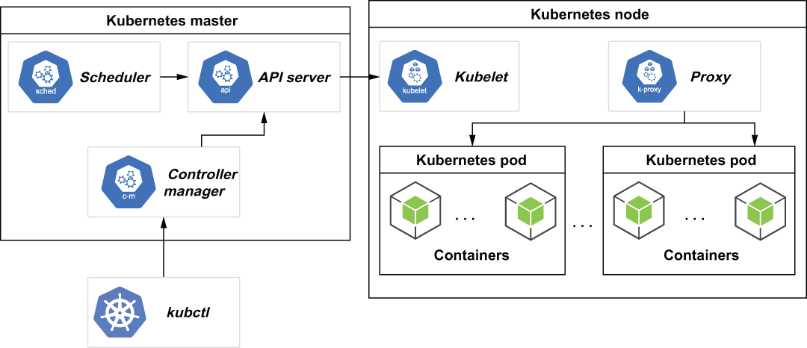

# 附录 A. 在 Kubernetes 上运行 Pulsar
Kubernetes 是一个流行的开源平台，用于大规模部署和运行容器化应用程序。它起源于谷歌内部，作为管理其广泛基础设施的解决方案，通过自动化许多涉及跨多个主机部署、管理和扩展其应用程序的手动流程。有关 Kubernetes 的更多信息，我强烈推荐 Marko Lukša 撰写的 Kubernetes in Action（Manning，2017 年）。

Kubernetes 的主要目的是根据可用的计算资源和每个容器的资源需求，调度容器在物理或虚拟机集群上运行。容器只是一个随时可以运行的软件包，其中包含运行应用程序所需的一切。正如我们在第 3 章中看到的，Docker 是最流行的容器技术之一。因此，自然而然地，Kubernetes 可用于调度和运行 Docker 容器，包括由 Apache Pulsar 项目生成的容器。这允许你完全在 Kubernetes 集群上运行整个 Pulsar 集群及其所有组件，例如 Zookeeper、BookKeeper 和 Pulsar 代理。本附录将引导你完成执行此操作的过程。

## A.1 创建 Kubernetes 集群

集群是运行容器化应用程序的基础。在Kubernetes中，一个集群由至少一个集群master和多台worker机器组成，称为节点，如图A.1所示。集群主机托管 Kubernetes 控制平面，它执行集群的所有管理功能，而节点是自己托管容器的机器。



图 A.1 Kubernetes 主节点用于控制节点池中的所有 Kubernetes 节点。每个 Kubernetes 节点可以托管多个 Pod，而这些 Pod 又可以托管一个或多个应用程序容器。

所有节点的计算资源都注册到集群master上，形成一个资源池，所有的容器都从中汲取。例如，如果你的特定容器正在托管一个数据库应用程序，并且它需要 8 GB 的 RAM 和四个 CPU 内核，则集群主节点必须找到一个具有足够可用资源的节点来满足此请求并在其上运行容器。然后，这些声明的资源也将从资源池中减去，以表明它们已经提交给容器。一旦集群资源池耗尽，就不能再托管更多的容器，直到有更多的资源可用。

使用 Kubernetes，可以通过向集群添加更多节点来轻松添加资源。这有效地允许你根据需要以无缝方式扩展集群。此功能非常吸引人，几乎所有云供应商都提供某种 Kubernetes 选项来托管你的应用程序。此外，还有一个大型的 Kubernetes 开源实现，称为 OpenShift，它允许你在自己的物理硬件上托管 Kubernetes 集群。虽然这两个选项对于生产应用程序都是不错的选择，但它们确实对本地开发设置了相当高的障碍。大多数人不想仅仅为了开发或测试目的而支付托管大型 Kubernetes 集群的成本，这就是为什么 minikube 是开发人员的流行选择。 Pulsar 专为在容器化环境（例如 Kubernetes）中运行而设计，你可以在其中根据需求轻松增加或减少 Pulsar 代理容器和/或 BookKeeper 博彩公司的数量。

### A.1.1 安装先决条件

作为使用 Kubernetes 的先决条件，你需要安装名为 kubectl 的 Kubernetes 命令行工具，它允许你针对 Kubernetes 集群运行命令。你将需要此工具来部署应用程序、检查和管理集群资源以及查看日志。如果你还没有安装 kubectl，你应该下载它 (https://kubernetes.io/docs/tasks/tools/#before-you-begin) 并按照你的操作系统的说明进行操作。

清单 A.1 在 MacBook 上安装 kubectl

```sh
brew install kubectl                                       ❶
. . .
==> Downloading https://homebrew.bintray.com/bottles/
    ➥ kubernetes-cli-1.19.1.catalina.bottle.tar.gz        ❷
==> Pouring kubernetes-cli-1.19.1.catalina.bottle.tar.gz
==> Caveats
Bash completion has been installed to:
  /usr/local/etc/bash_completion.d
 
zsh completions have been installed to:
  /usr/local/share/zsh/site-functions
==> Summary
    /usr/local/Cellar/kubernetes-cli/1.19.1: 231 files, 49MB
```

❶ 使用 Homebrew 安装 kubectl
❷ 1.19.1版本下载安装
如果你有 Mac，你可以使用 Homebrew 包管理器使用一行来安装它，如清单 A.1 所示。如果你使用不同的操作系统，请查阅在线文档以获取特定于你的操作系统的安装说明。你必须使用与集群的一个次要版本差异之内的 kubectl 版本。因此，最好使用最新版本的 kubectl 以避免任何兼容性问题。

### A.1.2 Minikube

安装 kubectl 后，下一步是创建一个 Kubernetes 集群来托管 Pulsar 集群。虽然所有主要的云供应商都提供非常适合生产使用的 Kubernetes 环境，但在本附录中，我将使用称为 minikube 的更具成本效益的替代方案，它允许我在我的开发机器上运行 Kubernetes 集群。

minikube 是一种在你的个人计算机上运行单节点 Kubernetes 集群的工具。它非常适合需要访问容器化应用程序（例如 Pulsar）的日常开发任务。如果你想在 Kubernetes 环境中开发和测试你的应用程序以熟悉 Kubernetes API，这是一个不错的选择。

清单 A.2 在 MacBook 上安装 minikube

```sh
brew install minikube                                                 ❶
. . .
==> Downloading https://homebrew.bintray.com/bottles/minikube-
    ➥ 1.13.0.catalina.bottle.tar.gz                                  ❷
Already downloaded: /Users/david/Library/Caches/Homebrew/downloads/
➥ b4e7b1579cd54deea3070d595b60b315ff7244ada9358412c87ecfd061819d9b--
➥ minikube-1.13.0.catalina.bottle.tar.gz
==> Pouring minikube-1.13.0.catalina.bottle.tar.gz
==> Caveats
Bash completion has been installed to:
  /usr/local/etc/bash_completion.d
 
zsh completions have been installed to:
  /usr/local/share/zsh/site-functions
==> Summary
  /usr/local/Cellar/minikube/1.13.0: 8 files, 62.2MB
```

❶ 使用 Homebrew 安装 minikube
❷ 1.13.0版本下载安装
如果你还没有安装 minikube，你应该下载它 (https://minikube.sigs.k8s.io/docs/start/) 并按照你的操作系统的说明进行操作。如果你有 Mac，你可以使用 Homebrew 包管理器使用一行来安装它，如清单 A.2 所示。如果你使用不同的操作系统，请查阅在线文档以获取特定于你的操作系统的安装说明。安装 minikube 后，下一步是使用以下清单中显示的命令创建 Kubernetes 集群。第一个命令创建集群本身并指定它将从我的笔记本电脑中为其资源池声明的资源。

清单 A.3 使用 minikube 创建 Kubernetes 集群

```sh
minikube start \
  --memory=8192 \                        ❶
  --cpus=4 \                             ❷
  --kubernetes-version=v1.19.0           ❸
 
kubectl config use-context minikube      ❹
```

❶ 为集群预留 8 GB 的 RAM。
❷ 为集群预留四个核心。
❸ 指定我们将使用的 Kubernetes 版本。
❹ 将 kubectl 设置为使用 minikube。
为了让 kubectl 工具找到并访问 Kubernetes 集群，必须首先将其配置为指向你希望与之交互的 Kubernetes 集群。此关联由 kubeconfig 文件控制，该文件在你部署 minikube 集群时自动创建，位于 ~/.kube/config。你可以使用 kubectl config use-context <cluster-name> 命令，如清单 A.3 所示，将 kubectl 工具配置为指向新创建的 minikube 集群。你可以通过运行 kubectl cluster-info 命令来确认 kubectl 是否正确配置，该命令将返回有关 Kubernetes 集群的基本信息。

## A.2 Pulsar Helm 图表

现在我们已经启动并运行了一个 Kubernetes 集群，我们可以在它上面部署容器化应用程序。这可以通过部署配置文件来完成，该文件包含创建应用程序所需的所有容器所需的所有信息。这些部署配置文件是符合特定结构的简单 YAML 文件，如下面的清单所示，它显示了一个基于 Ngnix 的 Web 服务器的配置，该服务器在端口 80 上侦听传入请求。

清单 A.4 Kubernetes 部署配置文件

```ini
apiVersion: apps/v1              ❶
kind: Deployment                 ❷
metadata:
  name: mysite                   ❸
  labels:
    name: mysite
spec:
  replicas: 1                    ❹
  template:
    metadata:
      labels:
        app: mysite
    spec:
      containers:                ❺
        - name: mysite
          image: ngnix           ❻
          resources:             ❼
            limits: 
              memory: “128Mi”
              cpu: “500m”
          ports:
            - containerPort: 80  ❽
```

❶ 指定配置文件的API版本
❷ 指定配置文件中定义的资源类型
❸ 应用名称
❹ 要创建的 Pod 数量
❺ 指定每个 Pod 内的所有容器
❻ 要使用的 Docker 镜像名称
❼ nginx容器所需的资源
❽ 容器的暴露端口
创建此文件后，你可以使用 kubectl apply -f filename 命令将其部署到你的 Kubernetes 集群。虽然这种方法相对简单，但手动创建和编辑所有这些冗长的文件有点乏味。如你所见，一个简单的单容器应用程序的部署文件需要 22 行 YAML。对于像 Pulsar 这样复杂的应用程序，你可以想象部署文件的大小和复杂程度，它需要多个容器（代理、bookies、ZooKeeper 等）的多个实例。

Kubernetes 编排的容器应用程序部署起来可能很复杂。开发人员可能会使用错误的配置文件输入，或者不具备从 YAML 模板推出这些应用程序的专业知识。因此，创建了一个名为 Helm 的部署工具来简化容器化应用程序到 Kubernetes 的部署。

### A.2.1 什么是Heml？

Helm 是 Kubernetes 的包管理器，它允许开发人员轻松地将应用程序和服务打包、配置和部署到 Kubernetes 集群上。它类似于 Linux 包管理器，例如 YUM 或 APT，因为它们都允许你使用简单的命令部署软件包及其所有依赖项。

我们将使用 Helm 来安装我们的 Pulsar 集群，所以如果你还没有安装 Helm，你应该现在安装它。如果你有 Mac，则可以使用 Homebrew 包管理器通过一行来安装它，如下面的清单所示。如果你使用不同的操作系统，请查阅在线文档 (https://helm.sh/docs/intro/install/) 以获取特定于你的操作系统的安装说明。

清单 A.5 在 MacBook 上安装 Helm

```sh
brew install helm                                        ❶
. . .
==> Downloading https://homebrew.bintray.com/bottles/
    ➥ helm-3.3.1.catalina.bottle.tar.gz                 ❷
Already downloaded: /Users/david/Library/Caches/Homebrew/downloads/
➥ 77e13146a8989356ceaba3a19f6ee6a342427d88975394c91a263ae1c35a3eb6--helm-
➥ 3.3.1.catalina.bottle.tar.gz
==> Pouring helm-3.3.1.catalina.bottle.tar.gz
==> Caveats
Bash completion has been installed to:
  /usr/local/etc/bash_completion.d
 
zsh completions have been installed to:
  /usr/local/share/zsh/site-functions
==> Summary
  /usr/local/Cellar/helm/3.3.1: 56 files, 40.3MB
```

❶ 使用 Homebrew 安装 Helm
❷ 下载安装3.3.1版本
Helm 允许我们将 Kubernetes 应用程序打包成预配置的 Kubernetes 资源包，称为图表。 Helm charts 提供应用程序的按钮部署和删除功能，使几乎没有或没有容器或微服务经验的人可以更轻松地开发和部署 Kubernetes 应用程序。

#### Helm图剖析

Helm 图表基本上是目录中文件的集合。目录名称用作图表的名称。在此目录中，Helm 图表目录包含一个名为 chart.yaml 的自描述文件、一个 values.yaml 文件以及一个或多个存储在图表模板文件夹中的清单文件，如下面的清单所示。

清单 A.6 Helm 图表目录布局

```sh
package-name/
   charts/
   templates/          ❶
   Chart.yaml          ❷
   values.yaml         ❸
   requirements.yaml   ❹
```

❶ 清单文件的文件夹
❷ 自述文件
❸ 模板中使用的默认值
❹ 可选的依赖列表
Helm 图表使用 YAML 模板进行应用程序配置，并使用单独的 value.yaml 文件存储所有值，这些值在安装时注入到模板 YAML 中。本质上，Helm 图表可以被认为是可以参数化的 Kubernetes 文件。

当你的图表准备好部署时，你可以使用 helm package <chartname> 命令创建一个包含所有文件的 tar-gzipped 文件。一旦所有这些都打包到 Helm 图表中，任何人都可以使用它，使用 helm install 命令并通过外部值文件为配置提供自定义值或作为 helm install 命令的参数，这些值在创建通过运行 helm install <chartname> 命令来安装 Kubernetes 应用程序。

### A.2.2 Pulsar Helm Chart

我已经介绍了 Helm charts 是什么以及如何使用它们来部署整个应用程序。你会很高兴知道开源发行版中包含 Apache Pulsar 的 Helm 图表，你可以通过使用 git 克隆存储库来轻松访问该图表，如下面的清单所示。

清单 A.7 下载 Pulsar Helm 图表

```sh
git clone https://github.com/apache/pulsar-helm-chart    ❶
 
cd pulsar-helm-chart                                     ❷
```

❶ 克隆 Helm 图表存储库。
❷ 切换到存储库克隆到的文件夹。
克隆存储库后，你可以检查图表子文件夹中 Helm 图表的内容，如下面的清单所示。正如预期的那样，目录结构符合我们之前在清单 A.6 中看到的 Helm 目录结构，其中包含基本级别的 Chart.yaml 和 values.yaml 文件以及模板文件目录。

清单 A.8 Pulsar Helm 图表目录布局

```sh
ls  ./charts/pulsar/                                    ❶
Chart.yaml    templates    values.yaml
 
ls ./charts/pulsar/templates/*.yaml                     ❷
./charts/pulsar/templates/autorecovery-configmap.yaml
./charts/pulsar/templates/autorecovery-service.yaml
./charts/pulsar/templates/autorecovery-statefulset.yaml
./charts/pulsar/templates/bookkeeper-cluster-initialize.yaml
./charts/pulsar/templates/bookkeeper-configmap.yaml
./charts/pulsar/templates/bookkeeper-pdb.yaml
./charts/pulsar/templates/bookkeeper-podmonitor.yaml
./charts/pulsar/templates/bookkeeper-service.yaml
./charts/pulsar/templates/bookkeeper-statefulset.yaml
./charts/pulsar/templates/bookkeeper-storageclass.yaml
./charts/pulsar/templates/broker-cluster-role-binding.yaml
./charts/pulsar/templates/broker-configmap.yaml
./charts/pulsar/templates/broker-pdb.yaml
./charts/pulsar/templates/broker-podmonitor.yaml
./charts/pulsar/templates/broker-rbac.yaml
./charts/pulsar/templates/broker-service-account.yaml
./charts/pulsar/templates/broker-service.yaml
./charts/pulsar/templates/broker-statefulset.yaml
./charts/pulsar/templates/dashboard-deployment.yaml
./charts/pulsar/templates/dashboard-ingress.yaml
./charts/pulsar/templates/dashboard-service.yaml
./charts/pulsar/templates/function-worker-configmap.yaml
./charts/pulsar/templates/grafana-admin-secret.yaml
./charts/pulsar/templates/grafana-configmap.yaml
./charts/pulsar/templates/grafana-deployment.yaml
./charts/pulsar/templates/grafana-ingress.yaml
./charts/pulsar/templates/grafana-service.yaml
./charts/pulsar/templates/keytool.yaml
./charts/pulsar/templates/namespace.yaml
./charts/pulsar/templates/prometheus-configmap.yaml
./charts/pulsar/templates/prometheus-deployment.yaml
./charts/pulsar/templates/prometheus-pvc.yaml
./charts/pulsar/templates/prometheus-rbac.yaml
./charts/pulsar/templates/prometheus-service.yaml
./charts/pulsar/templates/prometheus-storageclass.yaml
./charts/pulsar/templates/proxy-configmap.yaml
./charts/pulsar/templates/proxy-ingress.yaml
./charts/pulsar/templates/proxy-pdb.yaml
./charts/pulsar/templates/proxy-podmonitor.yaml
./charts/pulsar/templates/proxy-service.yaml
./charts/pulsar/templates/proxy-statefulset.yaml
./charts/pulsar/templates/pulsar-cluster-initialize.yaml
./charts/pulsar/templates/pulsar-manager-admin-secret.yaml
./charts/pulsar/templates/pulsar-manager-configmap.yaml
./charts/pulsar/templates/pulsar-manager-deployment.yaml
./charts/pulsar/templates/pulsar-manager-ingress.yaml
./charts/pulsar/templates/pulsar-manager-service.yaml
./charts/pulsar/templates/tls-cert-internal-issuer.yaml
./charts/pulsar/templates/tls-certs-internal.yaml
./charts/pulsar/templates/toolset-configmap.yaml
./charts/pulsar/templates/toolset-service.yaml
./charts/pulsar/templates/toolset-statefulset.yaml
./charts/pulsar/templates/zookeeper-configmap.yaml
./charts/pulsar/templates/zookeeper-pdb.yaml
./charts/pulsar/templates/zookeeper-podmonitor.yaml
./charts/pulsar/templates/zookeeper-service.yaml
./charts/pulsar/templates/zookeeper-statefulset.yaml
./charts/pulsar/templates/zookeeper-storageclass.yaml
```

❶ 检查生成的 Pulsar Helm 图表目录的结构。
❷ 列出所有生成的模板。
正如我们从清单 A.8 中看到的，有相当多的模板封装了大部分图表逻辑。让我们检查与 Pulsar broker 相关的模板，以更好地了解这些模板包含的详细信息。

清单 A.9 Pulsar broker 部署配置文件

```yaml
cat ./charts/pulsar/templates/broker-service.yaml                  ❶
...
 
{{- if .Values.components.broker }}
apiVersion: v1
kind: Service
metadata:
  name: "{{ template "pulsar.fullname" . }}-{{ .Values.broker.component }}"
  namespace: {{ .Values.namespace }}
  labels:
    {{- include "pulsar.standardLabels" . | nindent 4 }}
    component: {{ .Values.broker.component }}
  annotations:
{{ toYaml .Values.broker.service.annotations | indent 4 }}
spec:
  ports:
  # prometheus needs to access /metrics endpoint
  - name: http
    port: {{ .Values.broker.ports.http }}                          ❷
  {{- if or (not .Values.tls.enabled) (not .Values.tls.broker.enabled) }}
  - name: pulsar
    port: {{ .Values.broker.ports.pulsar }}                        ❸
  {{- end }}
  {{- if and .Values.tls.enabled .Values.tls.broker.enabled }}     ❹
  - name: https
    port: {{ .Values.broker.ports.https }}                         ❺
  - name: pulsarssl
    port: {{ .Values.broker.ports.pulsarssl }}                     ❻
  {{- end }}
  clusterIP: None
  selector:
    app: {{ template "pulsar.name" . }}
    release: {{ .Release.Name }}
    component: {{ .Values.broker.component }}
{{- end }}
```

❶ 包含 Pulsar Broker 服务定义的文件
❷ 要使用的 HTTP 端口
❸ 要使用的数据端口
❹ Broker 是否应该使用 TLS
❺ 要使用的安全 HTTPS 端口
❻ 要使用的安全数据端口
正如你在清单 A.9 中看到的，Pulsar 代理定义文件依赖于配置的参数化值。你可能会怀疑，这些值在我们运行脚本以生成 Pulsar Helm 图表时为我们生成的 values.yaml 文件中提供。以下清单显示了 values.yaml 文件的相应部分，其中包含 Pulsar 代理的定义。

清单 A.10 values.yaml 中与 Pulsar broker 相关的值

```yaml
## Pulsar: Broker cluster
## templates/broker-statefulset.yaml
##
broker:
  # use a component name that matches your grafana configuration
  # so the metrics are correctly rendered in grafana dashboard
  component: broker
  replicaCount: 3                                                   ❶
  # If using Prometheus-Operator enable this PodMonitor to discover broker scrape targets
  # Prometheus-Operator does not add scrape targets based on k8s annotations
  podMonitor:
    enabled: false
    interval: 10s
    scrapeTimeout: 10s
  ports:                                                            ❷
    http: 8080
    https: 8443
    pulsar: 6650
    pulsarssl: 6651
  # nodeSelector:
    # cloud.google.com/gke-nodepool: default-pool
  ...
    resources:                                                      ❸
    requests:
      memory: 512Mi
      cpu: 0.2
  ## Broker configmap
  ## templates/broker-configmap.yaml                                ❹
  ##
  configData:
    PULSAR_MEM: >
      -Xms128m -Xmx256m -XX:MaxDirectMemorySize=256m                ❺
    PULSAR_GC: >
      -XX:+UseG1GC
      -XX:MaxGCPauseMillis=10
      -Dio.netty.leakDetectionLevel=disabled
      -Dio.netty.recycler.linkCapacity=1024
      -XX:+ParallelRefProcEnabled
      -XX:+UnlockExperimentalVMOptions
      -XX:+DoEscapeAnalysis
      -XX:ParallelGCThreads=4
      -XX:ConcGCThreads=4
      -XX:G1NewSizePercent=50
      -XX:+DisableExplicitGC
      -XX:-ResizePLAB
      -XX:+ExitOnOutOfMemoryError
      -XX:+PerfDisableSharedMem                                    ❻
    managedLedgerDefaultEnsembleSize: "2"                          ❼
    managedLedgerDefaultWriteQuorum: "2"                           ❽
    managedLedgerDefaultAckQuorum: "2"                             ❾
```

❶ 指定一共三个broker实例
❷ 指定各种端口值的部分
❸ 指定pod资源的部分
❹ 关联的broker配置图
❺ 代理 Pod 的 JVM 内存设置
❻ 代理 Pod 的 JVM 垃圾收集设置
❼ Pulsar 账本的集合大小
❽ Pulsar 账本的写入法定人数
❾ Pulsar 账本的 ack quorum
正如你从清单 A.10 中看到的，这些设置在资源方面的作用很小。这是因为默认的 Pulsar Helm 图表是专门为基于 minikube 的部署而设计的。你可以修改这些值以满足你自己的需要。

## A.3 使用 Pulsar Helm 图表

现在我们已经下载并检查了 Pulsar Helm 图表，下一步是使用它来提供我们的 Pulsar 集群。此过程的第一步是将 Pulsar Helm 图表添加到你的本地 Helm 存储库并对其进行初始化，如下面的清单所示。这将允许你的本地 Helm 客户端定位和下载 Pulsar Helm 图表。

清单 A.11 将 Pulsar Helm 图表添加到你的 Helm 存储库

```sh
helm repo add apache https://pulsar.apache.org/charts                   ❶
 
./scripts/pulsar/prepare_helm_release.sh \
 --create-namespace \                                                   ❷
 --namepsace pulsar \                                                   ❸
 --release pulsar-mini                                                  ❹
 
namespace/pulsar created
generate the token keys for the pulsar cluster                          ❺
The private key and public key are generated to /var/folders/zw/
➥ x39hv0dd7133w9v9cgnt1lvr0000gn/T/tmp.QT3EjywR and 
➥ /var/folders/zw/x39hv0dd7133w9v9cgnt1lvr0000gn/T/tmp.YkhhbAyG 
➥ successfully.
secret/pulsar-mini-token-asymmetric-key created
generate the tokens for the super-users: proxy-admin,broker-admin,admin
generate the token for proxy-admin
secret/pulsar-mini-token-proxy-admin created
generate the token for broker-admin
secret/pulsar-mini-token-broker-admin created
generate the token for admin
secret/pulsar-mini-token-admin created                                  ❻
-------------------------------------
 
The jwt token secret keys are generated under:                          ❼
    - 'pulsar-mini-token-asymmetric-key'
 
The jwt tokens for superusers are generated and stored as below:        ❽
    - 'proxy-admin':secret('pulsar-mini-token-proxy-admin')
    - 'broker-admin':secret('pulsar-mini-token-broker-admin')
    - 'admin':secret('pulsar-mini-token-admin')
```

❶ 将 Pulsar Helm 存储库添加到你的本地 Helm 存储库。
❷ 指示 Helm 创建 Kubernetes 命名空间。
❸ 要创建的 Kubernetes 命名空间的名称
❹ Pulsar 版本名称
❺ 生成公共和私有令牌文件
❻ 为不同的管理员用户生成令牌
❼ 生成 JWT 秘密
❽ 生成 JWT 访问令牌
该过程的最后一步是使用 Helm 安装 Pulsar 集群，如下面的清单所示。首次安装 Pulsar 版本时指定 initialize=true 很重要，因为这将确保 BookKeeper 和 Pulsar 的集群元数据正确初始化。

清单 A.12 使用 Helm chart 安装 Pulsar

```sh
helm install \
--set initialize=true \                     ❶
--values examples/values-minikube.yaml \    ❷
pulsar-mini \                               ❸
apache/pulsar                               ❹
 
kubectl get pods -n pulsar -o name          ❺
pod/pulsar-mini-bookie-0
pod/pulsar-mini-bookie-init-94r5z
pod/pulsar-mini-broker-0
pod/pulsar-mini-grafana-6746b4bf69-bjtff
pod/pulsar-mini-prometheus-5556dbb8b8-m8287
pod/pulsar-mini-proxy-0
pod/pulsar-mini-pulsar-init-dmztl
pod/pulsar-mini-pulsar-manager-6c6889dff-q9t5q
pod/pulsar-mini-toolset-0
pod/pulsar-mini-zookeeper-0
```

❶ 请求初始化集群元数据。
❷ 要使用的值文件
❸ 该集群的唯一名称
❹ 要使用的 Helm 图表
❺ 列出为 Pulsar 集群创建的所有 Pod。
Helm 完成安装过程后，你可以使用 kubectl 工具列出为 Pulsar 集群创建的所有 pod，并验证必要的服务是否已启动并运行，获取 IP 地址等。

### A.3.1 在 Kubernetes 上管理 Pulsar

将 Pulsar 集群部署到 Kubernetes 环境后，你首先要考虑的问题之一就是决定如何管理 pulsar 集群。幸运的是，Pulsar Helm 图表创建了一个名为 pulsar-mini-toolset-0 的 pod，其中包含 pulsar-admin CLI 工具，该工具已经配置为与部署的 Pulsar 集群交互。因此，管理集群所需的只是使用 kubectl exec 命令访问 pod 并直接针对集群执行命令，如下面的清单所示。

清单 A.13 在 Kubernetes 上管理 Pulsar

```sh
kubectl exec -it -n pulsar pulsar-mini-toolset-0 /bin/bash
 
bin/pulsar-admin tenants create manning  
 
bin/pulsar-admin tenants list   
  
"manning"
"public"
"pulsar"
```

由于 pulsar-admin CLI 工具对于 Kubernetes 集群和 Docker 独立容器都是相同的，如果你选择使用 Kubernetes 而不是 Docker 来遵循示例，那么 docker exec 和 kubectl exec 命令可以在本书中互换使用。有关 pulsar-admin CLI 的更多详细信息，请参阅文档。

### A.3.2 配置客户端

在 K8s 环境中连接到 Pulsar 集群的主要挑战是找到集群正在侦听的端口。默认的二进制端口 6650 和 HTTP 管理端口 8080 不会暴露在 K8s 环境之外。因此，你首先需要确定这些节点端口映射到何处。

默认情况下，Pulsar Helm 图表通过 Kubernetes 负载均衡器公开 Pulsar 集群。在 minikube 中，你可以使用清单 A.14 中所示的命令来检查代理服务。该命令的输出将告诉我们 Pulsar 集群的二进制端口和 HTTP 端口映射到哪些节点端口。 80:之后的端口是HTTP端口，6650:之后的端口是二进制端口。

清单 A.14 确定 Pulsar 客户端端口

```sh
$kubectl get services -n pulsar | grep pulsar-mini-proxy                  ❶
 
pulsar-mini-proxy            LoadBalancer   10.110.67.72     <pending>     
➥ 80:30210/TCP,6650:32208/TCP   4h16m                                    ❷
 
$minikube service pulsar-mini-proxy -n pulsar --url                       ❸
http://192.168.64.3:30210                                                 ❹
http://192.168.64.3:32208                                                 ❺
```

❶ 确定端口映射的命令
❷ 输出告诉我们端口 80 映射到端口 30210，端口 6650 映射到端口 32208。
❸ 查找 minikube 内部暴露端口的 IP 地址的命令
❹代理的HTTP URL
❺ 代理的二进制 URL
此时，你拥有将客户端连接到在 minikube 内运行的 Pulsar 集群所需的服务 URL，你可以使用它们以及我们之前在配置 Pulsar 客户端以与集群交互时生成的必需安全令牌。