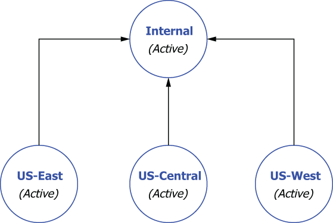

# 附录 B. 异地复制
异地复制是一种常用机制，用于在多数据中心部署中提供灾难恢复。与其他需要额外进程在数据中心之间镜像消息的发布-订阅消息系统不同，异地复制由 Pulsar 代理自动执行，并且可以在运行时启用、禁用或动态更改。传统的异地复制机制通常分为两类之一：同步或异步。 Apache Pulsar 带有多数据中心复制作为支持这两种地理复制策略的集成功能。在以下示例中，我将假设我们在三个云提供商区域部署 Pulsar 实例：美国西部、美国中部和美国东部。

## B.1 同步异地复制

一个同步异地复制的 Pulsar 安装包括一个跨多个区域运行的 bookie 集群，一个也分布在所有区域的 brokers 集群，以及一个单一的全局 ZooKeeper 安装，以形成一个跨所有可用区域的单一全局逻辑实例，如图所示B.1.全局“拉伸”ZooKeeper 集成对于支持这种方法至关重要，因为它用于存储托管分类帐。


图 B.1 客户端通过单个负载均衡器访问同步异地复制集群，该负载均衡器将发布请求转发到 Pulsar 代理之一。代理将请求路由到拥有该主题的代理，然后该代理根据配置的放置策略跨区域发布数据。

在同步异地复制的情况下，当客户端向一个地理位置的 Pulsar 集群发出写请求时，数据会在同一个调用中写入不同地理位置的多个 bookie。仅当配置的数据中心数量已发出数据已持久化的确认时，才会向客户端确认写入请求。虽然这种方法提供了最高级别的数据保证，但它也会导致每条消息的跨数据中心网络延迟成本。

同步异地复制实际上是由 Pulsar 存储层的 Apache BookKeeper 实现的，它依赖于一个放置策略来跨多个数据中心分发数据并保证可用性约束。你可以通过修改代理配置文件 (broker.conf) 来启用机架感知或区域感知放置策略，具体取决于你是在裸机环境还是云环境中运行，如下面的清单所示。

清单 B.1 启用区域感知策略

```sh
# Set this to true if your cluster is spread across racks inside one
# datacenter or across multiple AZs inside one region 
bookkeeperClientRackawarePolicyEnabled=true
 
# Set this to true if your cluster is spread across multiple datacenters or
# cloud provider regions.
bookkeeperClientRegionawarePolicyEnabled=true
```

例如，当你启用区域感知放置策略时，BookKeeper 在形成新的 Bookie ensemble 时会选择来自不同区域的 Bookie，从而确保主题数据将均匀分布在所有可用区域中。请注意，如果这两个设置都设置为 true，则在运行时仅支持其中一个设置，区域感知优先。

使用单个 ZooKeeper 集群来实现同步异地复制还需要一些额外的配置更改，以便地理上分散的 broker 和 bookie 组件作为单个集群一起工作。为这种场景配置 ZooKeeper 需要在 conf/zookeeper.conf 文件中为 ZooKeeper 集群中的每个节点添加一行 server.N，其中 n 是 ZooKeeper 节点的数量，如下面的清单所示，它使用一个 ZooKeeper每个区域的节点。

清单 B.2 用于同步异地复制的单个 ZooKeeper 配置

```ini
server.1=zk1.us-west.example.com:2888:3888
server.2=zk1.us-central.example.com:2888:3888
server.3=zk1.us-east.example.com:2888:3888
```

除了修改每个 Pulsar 安装的 conf 目录下的 conf/zookeeper.conf 文件，你还需要修改 conf/bookkeeper.conf 文件中的 zkServers 属性来列出每个 ZooKeeper 服务器，如下所示清单。

清单 B.3 同步异地复制的 BookKeeper 配置

```go
zkServers= zk1.us-west.example.com:2181, zk1.us-central.example.com:2181,
zk1.us-east.example.com:2181
```

同样，你需要将 conf/discovery.conf 和 conf/proxy.conf 文件中的 zookeeperServers 属性更新为 ZooKeeper 服务器的逗号分隔列表，因为 Pulsar 代理和服务发现机制都依赖于ZooKeeper 为他们提供有关 Pulsar 集群的最新元数据。

同步异地复制提供比异步复制更强的数据一致性保证，因为数据始终跨数据中心同步，从而更容易独立于发布消息的位置运行应用程序。即使整个数据中心出现故障，同步异地复制 Pulsar 集群也可以继续正常运行，中断对通过负载均衡器访问集群的应用程序是完全透明的。这使得同步异地复制适用于能够容忍稍高发布延迟的关键任务用例。

## B.2 异步异地复制
一个异步地理复制的 Pulsar 安装由两个或多个运行在不同区域的独立 Pulsar 集群组成。每个 Pulsar 集群都包含自己的一组代理、bookies 和 ZooKeeper 节点，这些节点彼此完全隔离。在异步异地复制中，当在 Pulsar 主题上生成消息时，它们首先被持久化到本地集群，然后异步复制到远程集群。该复制过程通过代理间通信发生，如图 B.2 所示。


图 B.2 客户端通过最近的代理访问异步地理复制集群，代理将请求路由到拥有该主题的代理，然后将数据发布到同一地区的博彩公司。然后，代理将传入的数据复制到其他区域的代理。

使用异步地理复制，消息生产者不会等待来自多个 Pulsar 集群的确认。相反，生产者会在最近的集群成功保存数据后立即收到响应。然后在后台以异步方式将数据复制到其他 Pulsar 集群。在正常情况下，消息在分发给本地消费者的同时被复制。

虽然异步异地复制提供了较低的延迟，因为客户端不必等待来自其他数据中心的响应，但由于异步复制，它也提供了较弱的一致性保证。鉴于异步复制中始终存在复制滞后，因此在任何给定时间点总会有一些数据尚未从源复制到目标。因此，如果你选择实施此模式，你的应用程序必须能够容忍一些数据丢失以换取更低的发布延迟。通常，端到端复制延迟受远程区域之间的网络往返时间 (RTT) 限制。

值得注意的是，异步异地复制在 Pulsar 中是基于每个租户启用的，而不是在集群范围的基础上启用的，允许你只为那些需要复制的主题配置复制。这允许每个单独的部门或组保持对其数据复制策略的控制。异步异地复制在命名空间级别进行管理，这对复制的数据集提供了更精细的控制。这对于由于监管和/或安全原因不允许数据离开特定区域的情况特别有用。

### B.2.1 配置异步异地复制

你可能还记得第 2 章中的内容，一个 Pulsar 实例由一个或多个 Pulsar 集群组成，这些集群一起作为一个单元运行，可以从一个位置进行管理，如图 B.3 所示。事实上，使用 Pulsar 实例的最大原因之一是启用异地复制，并且只有同一实例内的集群可以配置为在它们之间复制数据。因此，启用异步异地复制需要我们先创建一个 Pulsar 实例。


图 B.3 一个 Pulsar 实例可以由多个地理上分散的集群组成。

Pulsar 实例使用一个称为配置存储的实例范围的 ZooKeeper 集群来保留与多个集群相关的信息，例如地理复制和租户级安全策略。这允许你在一个位置定义和管理这些策略。虽然完整的文档可以在线获取，但我想在下一节中重点介绍其中的一些步骤。

值得注意的是，实例范围的 ZooKeeper 实例的部署方式应使其完全独立于各个 Pulsar 集群，以便在实例范围的 ZooKeeper 集合出现故障时，各个集群将能够继续运行而不会中断。

#### 部署配置存储

除了安装单个集群之外，创建多集群 Pulsar 实例还涉及部署一个单独的 ZooKeeper 仲裁用作配置存储。这个配置存储应该使用分布在至少三个区域的自己的专用 ZooKeeper 仲裁来实现。鉴于配置存储服务器上的预期负载非常低，你可以共享用于本地 ZooKeeper 仲裁的相同主机，但必须作为单独的 ZooKeeper 进程或 K8s pod 共享，具体取决于你的部署环境。你还必须使用不同的 TCP 端口以避免端口冲突。

清单 B.4 配置存储仲裁的 ZooKeeper 配置

```ini
tickTime=2000
dataDir=/var/lib/zookeeper                       ❶
clientPort=2185                                  ❷
initLimit=5
syncLimit=2
server.1=zk2.us-west.example.com:2185:2186       ❸
server.2=zk2.us-central.example.com:2185:2186
server.3=zk2.us-east.example.com:2185:2186
```

❶ 使用不同的位置来存储事务日志。
❷ 使用与本地 ZK 实例不同的端口。
❸ 仲裁由来自三个区域的在同一端口上侦听的服务器组成。
设置单独的 ZooKeeper 仲裁相当简单，并且在 Apache ZooKeeper 文档页面上有详细记录。每个 ZooKeeper 服务器都包含在单个 JAR 文件中，因此安装包括下载 jar、解压和创建配置文件。此配置文件的默认位置是 conf/zoo.cfg。新 ZooKeeper 仲裁中的所有服务器都应该具有完全相同的配置文件，如清单 B.4 所示。

初始化集群元数据
现在辅助 ZooKeeper 仲裁已启动并运行，下一步是使用有关将包含在 Pulsar 实例中的所有集群的信息填充配置存储。可以使用 Pulsar CLI 工具的 initialize-cluster-metadata 命令初始化此元数据，如下面的清单所示。

清单 B.5 初始化集群元数据

```sh
$ /pulsar/bin/pulsar initialize-cluster-metadata \
  --cluster us-west \                                              ❶
  --zookeeper zk1.us-west.example.com:2181 \                       ❷
  --configuration-store zk1.us-west.example.com:2184 \             ❸
  --web-service-url http://pulsar.us-west.example.com:8080/ \    
  --web-service-url-tls https://pulsar.us-west.example.com:8443/ \    
  --broker-service-url pulsar://pulsar.us-west.example.com:6650/ \   
  --broker-service-url-tls pulsar+ssl://pulsar.us-west.example.com:6651/
```

❶ 设置复制时将使用的集群名称
❷ 本地ZK连接字符串
❸ 配置存储的连接字符串
该命令将所有各种连接 URL 与给定的集群名称相关联，并将该信息存储在配置存储中。当启用复制以连接需要在它们之间交换数据的代理（例如，从美国西部到美国东部的复制数据）时，将使用此信息。你需要为要添加到实例的每个 Pulsar 集群运行此命令。

配置服务以使用配置存储
在使用与实例中 Pulsar 集群关联的所有元数据填充配置存储后，你需要修改每个集群上的几个配置文件以启用异地复制。由于异地复制是通过代理到代理的通信完成的，因此最重要的是 conf/broker.conf 配置文件，如下面的清单所示。

清单 B.6 为异步异地复制更新了 broker.conf

```ini
$ /pulsar/bin/pulsar initialize-cluster-metadata \
  --cluster us-west \                                              ❶
  --zookeeper zk1.us-west.example.com:2181 \                       ❷
  --configuration-store zk1.us-west.example.com:2184 \             ❸
  --web-service-url http://pulsar.us-west.example.com:8080/ \    
  --web-service-url-tls https://pulsar.us-west.example.com:8443/ \    
  --broker-service-url pulsar://pulsar.us-west.example.com:6650/ \   
  --broker-service-url-tls pulsar+ssl://pulsar.us-west.example.com:6651/
```


❶ 像以前一样使用本地 ZK 仲裁。
❷ 将第二个 ZK 仲裁用于配置存储。
❸ 指定broker所属的集群名称。
确保将 zookeeperServers 参数设置为反映本地仲裁，并将 configurationStoreServers 参数设置为反映配置存储仲裁。你还需要使用 clusterName 参数指定代理所属集群的名称，注意使用你在 initialize-cluster-metadata 命令中指定的值。最后，确保代理和 Web 服务端口也与你在 initialize-cluster-metadata 命令中提供的值相匹配。否则，复制过程将失败，因为源代理将尝试通过错误端口进行通信。

如果你使用的是 Pulsar 自带的服务发现机制，你需要修改 conf/discovery.conf 配置文件中的一些参数。具体来说，你必须使用代理配置文件中使用的相同值将 zookeeperServers 参数设置为集群的 ZooKeeper 仲裁连接字符串，并将 configurationStoreServers 设置设置为配置存储仲裁连接字符串。完成所有必要配置文件的更新后，在进行这些更改后，需要重新启动所有这些服务，以使新属性生效。

## B.3 异步异地复制模式
通过异步复制，Pulsar 为租户自定义复制策略提供了极大的灵活性。这意味着应用程序能够跨多个数据中心设置主动-主动和全网状复制、主动-备用复制和聚合复制。让我们快速看看如何在 Pulsar 中实现这些模式。

### B.3.1 多活动异地复制

在 Pulsar 中，异步异地复制是按租户控制的。这意味着只有在创建了允许访问所有相关集群的租户后，才能在集群之间启用异地复制。要配置多活动异地复制，你需要通过 pulsar-admin CLI 指定租户可以访问哪些集群，如下面的清单所示，其中显示了创建新租户并授予其访问权限的命令仅限美国东部和美国西部集群。

清单 B.7 授予租户访问集群的权限

```sh
$ /pulsar/bin/pulsar-admin tenants create customers \    ❶
  --allowed-clusters us-west,us-east \                   ❷
  --admin-roles test-admin-role
```

❶ 创建一个名为customers 的新租户。
❷ 只授予租户访问这两个集群的权限。
现在租户已经创建，我们需要在命名空间级别配置异地复制。因此，我们首先需要使用 pulsar-admin CLI 工具创建命名空间，然后使用 set-clusters 命令将命名空间分配给一个集群或多个集群，如下面的清单所示。

清单 B.8 为集群分配命名空间

```sh
$ /pulsar/bin/pulsar-admin namespaces create customers/orders
 
$ /pulsar/bin/pulsar-admin namespaces set-clusters customers/orders \
  --clusters us-west,us-east,us-central
```

默认情况下，一旦在两个或多个集群之间配置了复制，如清单 B.8 所示，发布到一个集群中命名空间内主题的所有消息都会异步复制到列表中的所有其他集群。因此，默认行为是命名空间中所有主题的有效全网状复制，消息在多个方向上发布，如图 B.4 所示。当你只有两个集群时，默认行为可以被认为是双活集群配置，其中数据在两个集群上均可用于为客户端提供服务，并且在单个集群发生故障的情况下，可以重定向所有客户端到剩余的活动集群而不会中断。


图 B.4 默认行为是所有集群之间的全网状异地复制。发布到 US-East 集群中复制命名空间内的主题的消息将转发到 US-West 和 US-Central 集群。

除了全网状（主动-主动）异地复制之外，你还可以使用其他一些复制模式。另一种常见的灾难恢复模式是主备复制模式。

### B.3.2 主备异地复制

在这种情况下，你希望将集群的最新副本保存在不同的地理位置，这样你就可以在发生故障时以最少的数据丢失或恢复时间恢复操作。由于 Pulsar 不提供指定命名空间单向复制的方法，因此完成此配置的唯一方法是将客户端限制在单个集群中，称为活动集群，并将它们全部故障转移到备用集群在发生故障时。通常，这可以通过负载平衡器或其他网络级机制来实现，使转换对客户端透明，如图 B.5 所示。 Pulsar 客户端将消息发布到活动集群，然后将其复制到备用集群进行备份。


图 B.5 你可以使用异步异地复制来实现主备方案，在该方案中，给定命名空间内的所有数据都转发到仅在发生故障时使用的集群。

你可能已经注意到，Pulsar 数据的复制仍将双向完成，这意味着 US-West 集群将尝试将其在中断期间收到的数据发送到 US-East 集群。如果故障与 Pulsar 集群中的一个或多个组件有关，或者美国东部集群的网络无法访问，这可能会出现问题。因此，你应该考虑在 Pulsar 生产者中添加选择性复制代码，以防止 US-West 集群尝试将消息复制到 US-East 集群，这很可能已经死了。

你可以通过在应用程序级别直接为消息指定复制列表来选择性地限制复制。清单 B.9 中的代码显示了一个生成消息的示例，该消息只会复制到 US-West 集群，这是你在此主动-备用场景中想要的行为。

清单 B.9 每条消息的选择性复制

```sh
List<String> restrictDatacenters = Lists.newArrayList("us-west");
 
Message message = MessageBuilder.create()
    ...
    .setReplicationClusters(restrictDatacenters)
    .build();
 
producer.send(message);
```

有时你希望将来自多个集群的消息汇集到一个位置以进行聚合。一个这样的例子是收集从所有地理区域收集的所有支付数据以进行处理和收集。

### B.3.3 聚合异地复制

假设我们有三个集群，它们都积极为各自地区的 GottaEat 客户提供服务，第四个名为 internal 的 Pulsar 集群与网络完全隔离，只能由内部员工访问，用于聚合来自所有客户的数据——服务于 Pulsar 集群，如图 B.6 所示。要跨这四个集群实现聚合异地复制，你需要使用清单 B.10 中所示的命令，它首先创建 E-payments 租户并授予对所有集群的访问权限。



图 B.6 聚合异地复制配置，用于将来自三个面向客户的 Pulsar 集群的消息汇集到内部 Pulsar 集群以进行聚合和分析

接下来，你需要为每个客户服务集群创建一个命名空间（例如，E-payments/us-east-payments）。你不能使用诸如电子支付/支付之类的，因为如果你尝试使用它会导致全网状复制，因为每个集群都将具有该命名空间。因此，需要每个集群的命名空间才能使其工作。

清单 B.10 聚合器异地复制

```sh
/pulsar/bin/pulsar-admin tenants create E-payments \                     ❶
--allowed-clusters us-west,us-east,us-central,internal
 
/pulsar/bin/pulsar-admin namespaces create E-payments/us-east-payments   ❷
/pulsar/bin/pulsar-admin namespaces create E-payments/us-west-payments
/pulsar/bin/pulsar-admin namespaces create E-payments/us-central-payments
 
/pulsar/bin/pulsar-admin namespaces set-clusters \                       ❸
E-payments/us-east-payments --clusters us-east,internal
 
/pulsar/bin/pulsar-admin namespaces set-clusters \                       ❹
E-payments/us-west-payments --clusters us-west,internal
 
/pulsar/bin/pulsar-admin namespaces set-clusters \                       ❺
E-payments/us-central-payments --clusters us-central,internal
```

❶ 为 Payments 创建全局租户。
❷ 创建特定于集群的命名空间。
❸ 将 US-East 配置为内部复制。
❹ 将 US-West 配置为内部复制。
❺ 将 US-Central 配置为内部复制。
如果你决定实施此模式并打算在所有客户服务集群中运行应用程序的相同副本，请确保将主题名称配置为可配置，以便在美国东部运行的应用程序知道将消息发布到我们内部的主题-east-payments 命名空间。否则，复制将不起作用。